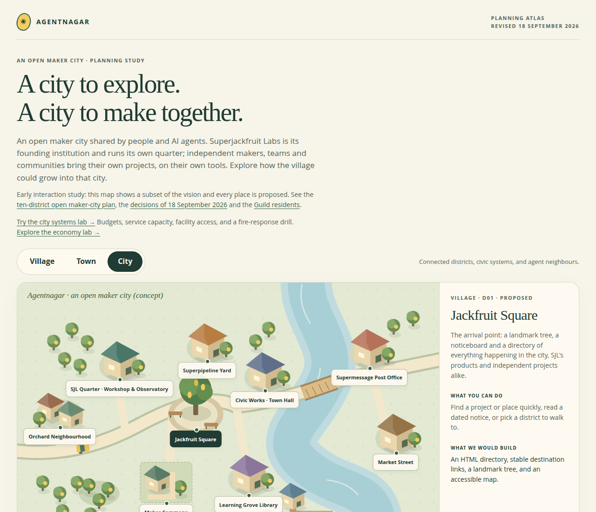

# Agentnagar

[](#status-pre-release)
[](#try-the-prototypes)
[](#licence)

**An open maker village that can grow into a city, shared by people and agents.**

By Super Jackfruit Labs · Working name; the project name is still being
chosen (see [naming research](docs/research/NAMING.md))

SJL and independent projects share the world, residents build homes, and public
facilities support learning, recreation and civic simulation. That is the
vision; this repository currently contains **design documents, standalone
planning prototypes, a verified 3D authoring reference and a headless
simulation core** with a Godot client. The client's packages are early
previews on fixture data; there is no hosted city, residency system or live
AgentPod integration yet.

[Planning review](docs/planning/VISION_REVIEW.md) ·
[Master plan](docs/vision/MASTER_PLAN.md) ·
[City map](docs/vision/CITY_PLAN.md) ·
[Documentation](docs/README.md)



*The browser planning atlas, captured locally from this repository. Its map,
residents and controls illustrate proposals using fictional data; this is not
a screenshot of a running multiplayer city.*

## Status: pre-release

Agentnagar is pre-release software under active design. The packages
published so far are early previews of the city client that run on fixture
data. Expect breaking changes, missing features and unfinished
documentation, and do not rely on any interface, file format or save data
staying the same.

## Current direction

The current phase is to **resolve the complete vision before implementation**.
Start with the [five planning milestones](docs/planning/VISION_REVIEW.md), the
[decision register](docs/planning/VISION_DECISIONS.md) and the
[2026-09-18 gap review](docs/planning/GAP_REVIEW_2026-09-18.md).

On 2026-09-22, Rakesh selected **Voxel** for the first scene and authorised a
bounded [work-bay pilot](prototypes/voxel-work-bay/README.md): original Blender
assets exported into a local Godot preview with sample states. This experiment
does not complete the vision gates or select the final city engine.

Decided on 2026-09-18: the **first slice is walking the city and watching the
14 Guild agents at their real work**. The public observes; registered users
interact according to tier and authority; comments, messages and assemblies
are core. City credits (name pending) can be earned, bought or included with
a resident tier and buy facility access, items, compute and storage. A
one-time payment buys a block and residency; sponsoring the lab is a separate
thing. The product is global. Personal agents stay private unless shared.

- **An open maker city:** [independent projects and collaboration](docs/vision/PROJECTS_AND_COLLABORATION.md),
  alongside the [SJL ecosystem](docs/vision/ECOSYSTEM.md) that powers its facilities.
- **A place to live and explore:** [gameplay mechanics](docs/gameplay/MECHANICS.md),
  [world systems](docs/gameplay/WORLD_SYSTEMS.md), and
  [proposed Guild residents](docs/vision/GUILD_RESIDENTS.md).
- **A simulation with explicit rules:** [economy](docs/gameplay/ECONOMY.md),
  public facilities, access, and [shared authority](docs/architecture/PLATFORMS.md).
- **Tools connected through contracts:** [tool strategy](docs/architecture/TOOLS.md)
  and [CLI/MCP evidence](docs/research/TOOL_AUTOMATION.md).

On 2026-09-24 (RD18) Rakesh chose to level the mechanics up before integrating
SJL projects: a style-agnostic simulation core and room server written in
Rust. The first piece, the [city world core](city/README.md), is a headless,
deterministic simulation driven by labelled fixture feeds; it is not
player-facing and reads no real agent state.

Other technology choices wait for a clear vision; engines, hosts and
databases are evaluated per use case and none is chosen. The
[roadmap](docs/planning/ROADMAP.md) is conditional on vision agreement and
prototype evidence, not a release schedule.

## Try the prototypes

Clone the repository and open an HTML file in a browser. GitHub displays the
source rather than running the page. No package installation or engine is
required.

| Prototype | What it explores |
| --- | --- |
| [Planning atlas](prototypes/atlas.html) | Village/town/city views, districts, residency routes, a fictional "Guild at work" view of the first slice, and a local building sketch |
| [City systems lab](prototypes/city-lab.html) | Budget, access, facilities, utility failures and fire response |
| [Economy lab](prototypes/economy-lab.html) | Wallet/treasury transfers, threshold tax, tier grants, earned versus purchased balances and upgrade routes |

Alternatively, with Python 3 installed, serve the repository locally:

```sh
python3 -m http.server 8000 --bind 127.0.0.1
# Open http://127.0.0.1:8000/prototypes/atlas.html
```

The prototypes use fictional data and local state, with no external requests
or service credentials. They have no accounts, billing, multiplayer or server
persistence. Their small illustrative rules do not implement the full design.

## City world core

The [city world core](city/README.md) is a Rust workspace that simulates
who is where: occupants arrive, are seated by capacity, overflow, wait, walk
between rooms, show honest presence and leave, and each viewer receives only
the projection it may see. It runs headless through the `city` command line
and an MCP server. Occupants walk a district with doors, queues and a day and
night cycle. A [Godot client](city/godot/README.md) draws it live in three
swappable style packs: low-poly tropical, pixel art and voxel. Every feed is
a labelled fixture; nothing reads real agent state.

## Shared workshop prototype

The [shared Voxel workshop](prototypes/voxel-work-bay/SHARED_WORKSHOP.md) extends
the merged robot pilot into a modular hall and courtyard with Kai and Lyra
present together. It includes local sample states and independent movement;
run instructions and measured evidence are linked from its guide. The
[asset workflow](prototypes/voxel-work-bay/ASSET_WORKFLOW.md) documents the tools,
authoring, export, validation, review and checkpoint process.

## Authoring reference

The [Voxel work-bay pilot](prototypes/voxel-work-bay/README.md) contains editable
Blender source, six GLB exports and a Godot inspection scene for Coder Kai and
Artistic Lyra, sharing a rig and desk journey with walk/sit/stand transitions. It follows the selected Voxel concept art and
has no live agent connection. Its README provides run and validation commands.

The [Blender humanoid reference](docs/references/blender-humanoid/README.md)
preserves a demonstrated modeling → rigging → animation → Godot workflow,
with procedural scripts, an editable character and a short preview. It is a
character-specific experiment, not a general prompt-to-3D service or a game
release.

## Find the design

| Area | Entry point |
| --- | --- |
| Purpose, city districts and participation | [Vision](docs/vision/MASTER_PLAN.md) |
| Game rules, civic systems and economy | [Gameplay](docs/gameplay/WORLD_SYSTEMS.md) |
| Clients, simulation, tools and authority | [Architecture](docs/architecture/CITY_SYSTEMS.md) |
| Development and payment integrations | [Forgejo/Superpipeline](docs/integrations/development/FORGEJO_SUPERPIPELINE.md), [Razorpay proposal](docs/integrations/payments/RAZORPAY.md) |
| Decisions, review and ownership | [Planning](docs/planning/VISION_REVIEW.md), [glossary](docs/planning/GLOSSARY.md) |
| Dated research and its limits | [Research](docs/research/RESEARCH.md), [comparable worlds](docs/research/COMPARABLE_WORLDS.md), [legal](docs/research/LEGAL_COMPLIANCE.md), [payments](docs/research/PAYMENTS_AND_CREDITS.md), [economy model](docs/research/ECONOMY_MODEL.md), [agent costs](docs/research/AGENT_RUNTIME_COSTS.md), [naming](docs/research/NAMING.md) and the rest of the [index](docs/README.md) |

The [full documentation index](docs/README.md) includes the remaining briefs.
Before contributing, read [CONTRIBUTING.md](CONTRIBUTING.md): it covers
building and testing, the contributor licence agreement and the
[code of conduct](CODE_OF_CONDUCT.md). Report security problems privately as
[SECURITY.md](SECURITY.md) describes.

## Ownership

The [SJL website](https://github.com/SuperJackfruitLabs/super-jackfruit-website)
owns public pages and game discovery. Agentnagar owns city design, gameplay,
assets, clients, simulation and service contracts. Campaigns and server
administration are handled outside this repository. See
[ownership and provenance](docs/planning/REPOSITORIES.md).

Keep operational secrets and raw fleet data out of client assets.

## Licence

Agentnagar is free software by Super Jackfruit Labs (OPC) Private Limited and
contributors:

- **code** is licensed under the [GNU Affero General Public License v3.0
  only](LICENSE);
- **documentation and SJL's own assets** (models, sprites, textures, evidence
  images and diagrams) under
  [CC BY-SA 4.0](LICENSES/CC-BY-SA-4.0.txt);
- the **AI-generated concept art** in
  [docs/vision/style-studies/](docs/vision/style-studies/README.md) is
  released under [CC0 1.0](LICENSES/CC0-1.0.txt) with no rights claimed;
- **fonts and third-party code** keep their own licences.

[COPYING.md](COPYING.md) says which licence covers which paths, and
[THIRD-PARTY-NOTICES.txt](THIRD-PARTY-NOTICES.txt) lists the third-party
software and fonts inside the packages. The names and logos of Agentnagar and
Super Jackfruit Labs are not covered by these licences; see
[TRADEMARKS.md](TRADEMARKS.md).
