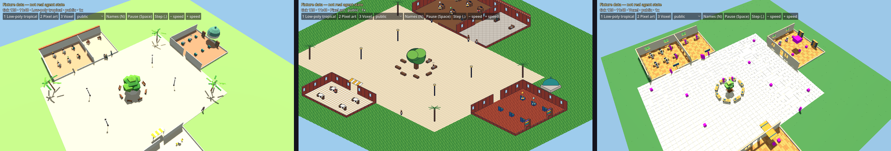

# City world core

The headless, deterministic simulation of who is where in Agentnagar. Occupants
arrive, are admitted to rooms by capacity, take seats, overflow, wait, walk
through doors, show honest presence and leave. Every client receives only a
**projection** built for its viewer. A private personal agent is never in a
projection its viewer may not see. Because hidden occupants take no shared
capacity or seats, it cannot be inferred from what looks full or taken either.
Property tests check both.

This is sub-project 1 of the "next level" set out in
[RD18](../docs/planning/VISION_DECISIONS.md) and specified in the
[world-core design](../docs/superpowers/specs/2026-09-24-city-world-core-design.md).
**It is not a player-facing feature, and nothing here has been accepted.** It
renders nothing, opens no socket and reads no clock.

**Fixture honesty.** Every feed declares in its header whether it is a fixture,
every entry repeats the flag, and every event carries it. The feeds in this
directory are scripted fixtures. **No real agent state is read**, and nothing
here makes a claim about any real agent, human or service.

## Crates

| Crate | Responsibility |
| --- | --- |
| `city-contracts` | Versioned data types: manifest, feed, commands, events, snapshots, projections and reports, each with JSON Schema |
| `city-core` | The rules. No file, network, clock, thread or environment use; builds for `wasm32-unknown-unknown` |
| `city-cli` | The `city` binary, plus the operations library it shares with MCP |
| `city-mcp` | An MCP server over stdio exposing the same operations as tools |
| `city-godot` | A Godot extension (`CityWorld`) exposing the world to the Godot client as JSON projections |

`city-mcp` calls the `city-cli` library, so the command line and MCP run the
same code for every operation, including file handling, and cannot disagree.

## Commands

Run these from `city/`. Every command prints JSON and exits with one of these
codes:

| Exit code | Meaning |
| --- | --- |
| 0 | Success |
| 1 | Domain failure: invalid, not found or refused |
| 2 | Bad input: unreadable file, unparsable JSON or bad arguments |

```sh
cargo run -p city-cli -- validate fixtures/two-room/manifest.json

cargo run -p city-cli -- run --manifest fixtures/two-room/manifest.json \
  --feed fixtures/two-room/feed.jsonl --seed 7 --ticks 40 \
  --snapshot-every 10 --out target/gate
# writes target/gate/{events.jsonl, snapshots/tick-*.json, final.json, summary.json}

cargo run -p city-cli -- inspect target/gate/snapshots/tick-000010.json                      # public
cargo run -p city-cli -- inspect target/gate/snapshots/tick-000010.json --viewer person:asha # Asha
cargo run -p city-cli -- inspect target/gate/snapshots/tick-000010.json --viewer operator --operator
cargo run -p city-cli -- inspect target/gate/final.json --room room:workshop
cargo run -p city-cli -- inspect target/gate/final.json --occupant agent:kai
# One vehicle, with the riders aboard it this viewer may see (a tram snapshot):
cargo run -p city-cli -- inspect crates/city-cli/tests/fixtures/tram-snapshot.json \
  --vehicle vehicle:boulevard:west:1 --viewer person:owner

cargo run -p city-cli -- diff target/gate/snapshots/tick-000010.json target/gate/final.json --operator
cargo run -p city-cli -- schema --out target/schemas

# The walking district, with a generated crowd of 60 over one 600-tick day:
cargo run -p city-cli -- run --manifest fixtures/district/manifest.json \
  --feed fixtures/district/feed.jsonl --crowd 60 --seed 7 --ticks 600 \
  --snapshot-every 60 --out target/district

cargo run -p city-cli -- catalogue                        # every kind's ID, name, class, snap and height
cargo run -p city-cli -- catalogue --kind street-lamp      # one kind's full JSON

cargo run -p city-cli -- grid fixtures/district/manifest.json
# {"blocked_by_kind": {"bench": 548, ...}, "cells": 263200, "walkable": 164168}
cargo run -p city-cli -- grid fixtures/district/manifest.json --png target/district-grid.png
# 1 px per cell: walkable white, a blocked room cell tinted, a placement's
# footprint red, a door span green, a seat's own cell blue.

cargo run -p city-cli -- place fixtures/district/manifest.json \
  --kind street-lamp --at 4200,1600
# Validates through apply_placement on a manifest loaded into a world, as an
# operator, and prints PlacementChanged's changed cells or Rejected's reason,
# with the exit code the reason implies. --facing, --size (a sized kind) and
# --id (default placement:<kind>-<x>-<z>) are optional. --write, once the
# placement is accepted, rewrites the manifest with it added, re-serialised
# from the Manifest type in canonical form: fields in contract order, and
# defaults omitted or filled exactly as the contract already serialises
# every manifest elsewhere. A hand-edited manifest will therefore show a
# reformatting diff alongside the placement. This is deliberate: manifests
# here are generated (fixtures/district/generate.py is the source of truth),
# and serde_json's preserve_order feature stays off, since turning it on
# would reorder every serde_json::Value in the CLI's build graph and risk
# the byte-identical event logs.
```

`run` writes only inside `--out`. Snapshots and the event log are
operator-level diagnostics: they hold full state. For that reason `diff` needs
`--operator`, like the operator view of `inspect`. Projections are what a
client may be given.

`inspect` takes at most one of `--room`, `--occupant` and `--vehicle`.
`--vehicle` prints a `VehicleDetail`: the vehicle's view and the riders aboard
it this viewer may see, in slot order. It never includes a rider count.

`grid` and `place` load the manifest they are given into a world of their own,
so they answer from the same rules `run` and the client do; `grid` reports the
cells a catalogue kind's placements block (its footprint or a seat's
furniture, grown by the body clearance), whether or not the manifest already
carries one.

## MCP

Build with `cargo build --release -p city-mcp` and register
`target/release/city-mcp` as a stdio MCP server, for example:

```json
{ "mcpServers": { "agentnagar-city": { "command": "/path/to/city/target/release/city-mcp" } } }
```

It exposes the tools `validate`, `run`, `inspect`, `diff`, `schema`,
`catalogue` and `check_placement`. Their arguments mirror the command line and
take paths; `inspect` takes `room`, `occupant` or `vehicle`, as the command
line does, through the same library function. `inspect` refuses the
operator viewer, and `diff` refuses to run, unless called with `operator: true`.
`catalogue` lists every kind, or, with `kind`, one kind's JSON.
`check_placement` validates a proposed placement (`manifest_path`,
`placement`) the way `city-cli place` does, without writing it: agents can
therefore reason about layout the way the CLI does. The server fetches
nothing: it reads only the files it is given.

## Rules in brief

**Ticks.** Time is an integer tick count. Tick 1 is the first tick processed,
and a feed entry `at` tick *n* is ingested at the first processed tick at or
after *n*. Each tick applies, in order:

1. Ingest
2. Expire
3. Admit
4. Allocate
5. Transition
6. Vehicles
7. Depart
8. Emit

**Capacity.** A room never holds more occupants than its capacity. Only
occupants every viewer can see count toward capacity and take seats.
Private personal agents and anonymous observers are present in a room as
overlays: they stand, and never overflow or wait. Capacity is held for absent
reserved-seat owners, so strangers can never lock an owner out.

**Seats.** A reserved seat goes only to its named occupant and otherwise stays
empty. Hot seats follow the named `department-first` policy: prefer the
occupant's department pod, then the pod with the most free seats, then the
lowest seat ID.

**Overflow and waiting.** A full room sends arrivals along its overflow chain,
which may not form a cycle. When the whole chain is full, the arrival joins the
original room's first-in, first-out waitlist.

- The head of a waitlist takes the first room in the chain that opens.
- A newcomer never overtakes a waitlist, except the owner of a reserved seat in that room.
- A steered entry tries only the room it walks into. A `Steer` into a room that is full, or that others queue for, is refused with `RoomFull` on the step from outside, onto its door span or over an open-air room's edge, and the player stays at the threshold, neither queued nor overflowed. `Go` queues and overflows as above.

**Doors.** A move goes through a door and takes a seeded number of ticks within
the door's range, which may be 1 to 1,000,000 ticks. The occupant is shown in
transit throughout. On the arrival tick they are admitted like any arrival,
so no one is ever between places when a tick ends.

**Vehicles.** A line's vehicles enter at their portals on its timetable, run
`speed` cells a tick along their track, stand centred on each stop with their
doors open for `dwell` ticks, and leave past the far portal. They move after
the walkers, in vehicle-ID order, and never onto a cell a public walker holds:
blocked, a vehicle is held until the way clears. Held five ticks in a row, it
has the walkers in its way stepped aside to the nearest good place to stand
off the track (`SteppedAside`), so no one, a player with its menu open say,
holds a line for long. Walkers treat the cells a vehicle covers as taken, and
no one settles or queues on a track.

**Transit.** A manifest's `lines` are what the core runs. The district has
one line, the boulevard tram (`line:boulevard`).

- **The line.** It has a centreline west to east, whose ends are its
  portals, and two tracks 150 cm either side. The eastbound track is on
  the north side.
- **Stops.** Each stop stands at a distance along the line, with a
  platform room for each direction. The district's stops are the Square
  (`stop:square`), where `room:tram-stop` is the eastbound platform, and
  the Avenue (`stop:avenue`, the transit facility `facility:avenue-stop`).
- **The timetable.** A tram enters each way every 30 ticks, eastbound at
  ticks 1, 31, 61 and so on, and westbound at 16, 46 and so on, so a
  player joining at launch rides in at once and steps off at the Square on
  tick 6. It runs 28 cells (7 m) a tick and stands at each stop with its
  doors open for 12 ticks.
- **The trams.** Each carries 40, is 20.5 m long and has three doors a
  side. Vehicle IDs are `vehicle:boulevard:<east|west>:<n>`, numbered from
  1 each way. A tram whose portal is still occupied waits there and keeps
  its number.
- **Boarding and stepping off.** These happen only while a tram stands
  with its doors open.
  - Riders bound for the stop step off first, in slot order, onto free
    platform cells off the track within 2 m of a door. The platform's
    capacity never keeps them aboard: they are there in person once off,
    so a platform may briefly hold more than its capacity. A rider stays
    aboard, and rides on to the next stop, only when no free cell lies
    within reach of its door. At the last stop, the doors stay open for at
    most one dwell more (for public riders; hidden ones never hold them);
    then any rider still aboard steps off wherever there is room.
  - Then the platform's waiters board, first come, first served, up to
    capacity. The rest are left behind (`LeftBehind`).
  - Riders take slots two across, the lowest free slot first. Rows by a
    door are standing room, and the rest are seats. A player takes the
    free seat nearest the tram's middle instead, since the first and last
    rows lie in the cabs' walled noses.
  - Waiters stand on the platform and count toward its capacity.
  - Hidden occupants ride without a slot and never fill a tram.
- **Arrivals and departures by tram.** These apply when `city.arrivals`
  is `"tram"`. With `"direct"`, the default, or without a line, everything
  is as above.
  - **Arrivals.** An `Arrive` queues the occupant at a portal. Public
    and hidden arrivals each alternate east and west. The next tram in
    takes them aboard to the stop whose platform is the shortest walk
    from their room. They step off there and walk to the room as after a
    `Go`.
  - **Joining players.** A player's arrival (`Arrive` with `player`)
    takes the tram that reaches its stop soonest. Joining for a platform,
    the player stays there; carried past it (every cell there taken), it
    stays where it stepped off rather than walking back.
  - **Departures.** A public `Depart` on the ground walks to a platform of
    the nearest stop (the one where the first catchable tram stands),
    waits, boards and rides out. It is logged as `Departed` with
    `via: <vehicle>`.
  - **Riding out.** A `Depart` while waiting or aboard rides out.
  - **Hidden occupants** still depart at once.
  - **A player leaving** (`Depart` with `player`, from its session's
    `leave`, as Quit to title does) departs at once from wherever it is:
    the one exception to departures riding out. Players never ride out,
    and the next visit need not wait for this one to walk away.
- **Players' commands.** Under the authority rule, a session commands only
  its own occupant.
  - **`Board`.** On a platform, it boards the tram standing there with
    its doors open, or waits for the next one on that side. The core
    refuses it:
    - with `NotOnPlatform` off a platform or while riding;
    - with `NotYourDirection` where no stop lies ahead on that side.

    On a full tram standing there it waits for the next one, and the full
    one leaves it behind (`LeftBehind`) as its doors close.
  - **`Alight`.** It steps off a tram standing with its doors open. The
    core refuses it with `NotStanding` or `NotAboard`.
  - **`Use`.** It uses a capability at one of a placement's or seat's
    anchors (`city-core/src/interact.rs`). `sit` and `use` are on the
    anchor's cell; `read` is on the display's stand anchor or on a
    neighbour in front of its surface. An anchor's facing is its user's,
    but a display's is its surface's outward normal. A room seat keeps its
    seat rules, and a perch holds no room capacity. A workstation's `use`
    anchor is its chair's own point, so using it takes the seat under the
    same rules. A new `Use` first ends the use under way, a seat included;
    switching between sitting at a workstation and using it keeps the
    seat. `board` is
    `Board`, and `enter` on a room is `Go` to it. The core refuses it with
    `UnknownTarget`, `NoSuchCapability` (`inspect` included, which the
    client handles), `NotAtAnchor` or `AnchorTaken`, first in command
    order winning. While it lasts the occupant's projection carries
    `using`, and a seat taken by `Go` or the policy shows there too, once
    sat in. Moving, a `Go`, boarding, leaving or `StopUsing` ends it
    (`StoppedUsing`).

  A player never rides out. Aboard, it rides to the last stop ahead, and
  steps off there.
- **Events.** The trams log `VehicleEntered`, `VehicleHeld`,
  `DoorsOpened`, `DoorsClosed` and `VehicleLeft`. Riders log `Boarded`,
  `Alighted` and `LeftBehind`, and a walker moved off the rails for a held
  tram `SteppedAside`.
- **Inspecting.** `inspect --vehicle <id>` shows a tram and the riders
  this viewer may see. It never shows a rider count.

`validate` checks each line and names what fails:

- at least two points, and no zero-length segment;
- stops within the line, at least a tram's length apart;
- outdoor platforms within 150 cm of their track along the tram's length,
  but at least the tram's half width and the body clearance (135 cm) from
  it;
- no track crossing an indoor room;
- tracks at least a tram's width and 50 cm apart (the tram kind is 250 cm
  wide, so 300 cm), and every door within the tram's length;
- positive numbers, `dwell × 2 < headway`, and a capacity of at least one.

The rules are specified in the
[tram design](../docs/superpowers/specs/2026-09-27-city-tram-design.md),
whose amendments record what the build decided.

**Departure.** Leaving releases the seat and clears presence. A later arrival
is a new presence.

**Walking** applies when a manifest has a layout. A manifest either has layout
everywhere or nowhere; without one, the door timers above apply.

- **Layout** is rooms as rectangles in integer centimetres. It also gives:
  - seat positions and facings;
  - door points on shared edges;
  - placements of the catalogue's kinds, such as desks, the tree and the
    city's blocks: everything solid;
  - entrances on outdoor rooms;
  - an optional clock and scenery (streets, water, a bridge and fences),
    which rules never read.

  `validate` checks that it is complete and consistent. The manifest is
  schema 2 and names the catalogue it was written against; a schema 1
  manifest, whose rooms carried obstacles and props, is refused with a
  message naming `fixtures/district/generate.py`. A schema 2 manifest that
  still carries one of schema 1's fields (a facility's `exterior`, a room's
  `obstacles` or `props`, `tree-row` or `block` scenery) is refused with
  `removed-field`, naming the field and pointing at placements; facilities
  and rooms refuse any field they do not know.
- **Grid.** The layout rasterises into 25 cm cells (see
  [Placements and the grid](#placements-and-the-grid)). Walks cross between
  rooms only through a door's opening, 2 m for a building's outside door and
  1 m inside, and never cut a corner. Outdoor rooms (open ground) join along
  any shared edge, so a city tiled with them is walkable street to street,
  out to its edge. A placement blocks the cells within 10 cm of its
  footprint. Water is kept off every floor; it is crossed only on a bridge.
- **Paths** use integer costs: 10 straight, 14 diagonal. Each room has a
  distance field to its threshold, so walks descend it; there is also one to
  the entrances.
- **Arrival.** An arrival appears at the entrance nearest its target and walks
  to the room's door. Admission is decided **at the door**:
  - placed in the target room;
  - placed in a room further along its overflow chain;
  - or queued outside the room's main door, in order, when the whole chain is
    full.

  Placed occupants walk to their seat. Without one, they walk to a standing
  spot, chosen by a per-occupant hash.
- **Moves and departures.** A move walks through doors and is admitted at the
  new room's door. A departure gives up the seat or queue place at once,
  walks to the nearest entrance, and `Departed` fires on arrival there.
- **Walking pace.** A walker crosses up to 5 cells (1.25 m) a tick.
- **Avoidance.** Walkers take turns in city-ID order, and a cell holds one
  public occupant. A blocked walker waits, and after 3 blocked ticks plans a
  way around, with a bounded search.
- **Hidden occupants are overlays.** Private agents and anonymous observers:
  - take no capacity, seat, queue place or cell;
  - never draw on shared random state.

  So nothing a public viewer sees can bend around them.
- **Projections** carry, for each occupant:
  - position and facing;
  - `moving`;
  - the next tick's path (`path_ahead`), for smooth drawing;
  - queue places.

  Each projection also carries `time_of_day`, in minutes, from the manifest's
  clock.
- **Vehicles and riders in projections.**
  - Every viewer sees every vehicle, in vehicle order. Each has:
    - `pos`, its front's centre on its track, carried straight on past a
      portal. A standing vehicle is centred on its stop's `at`, so its
      front is half its length past it.
    - `heading`, in whole degrees clockwise from north, from integer
      arithmetic.
    - `trail`: its `along` at the start of the last tick and now, when it
      moved.
    - `status` (`running`, `standing` or `held`), `doors_open` and `stop`.
  - Riders are listed in `aboard`, following the usual visibility rules.
    They are ordered by vehicle, then slot, with hidden riders last in
    boarding order. Each carries its `vehicle` and `slot`.
    - A rider's `pos` is its slot's point: the middle of its row behind the
      front, half a metre to the left of the way the vehicle runs for an
      even slot, or to the right for an odd one.
    - A hidden rider has no slot and is drawn at the vehicle's centre.
  - A platform waiter is listed among its platform room's occupants and
    marked `waiting_for` (its stop and direction).
  - An arrival still queued at a portal is not shown to anyone until it is
    aboard.
- **The crowd.** `city_core::crowd`, or `run --crowd N`, adds a generated
  fixture crowd to any layout. Its kinds are:
  - twelve in twenty simulated citizens;
  - registered people and residents;
  - an observer;
  - a private agent.

  Crowd members choose rooms by the hour: the café at lunch, the reading room
  in the afternoon.

**Presence.** There are three independent dimensions: connection, process and
task. An observation at or past its `expires_at` shows `Stale`, never its last
value. A running process with no task observation shows `Unknown`, never
`Working`. An older observation never replaces a newer one.

**Viewers.**

| Viewer | Sees |
| --- | --- |
| Public | Everyone except personal agents and anonymous observers |
| Person | As public, plus their own personal agents and those shared with them |
| Operator | Everything; diagnostics only, and only with the explicit flag |

- Observers are hidden from everyone but themselves. This is the RD03 default until that decision is made.
- Sharing grants presence only, not task summaries. This is the minimal RD12 grant.
- Task summaries are shown only when marked public, to a personal agent's owner, or to the operator. They are never shown once stale.
- Projections carry no occupancy counts, no rider counts and no seat holders, and list waiting occupants in queue order.

**Determinism.**
- One seeded ChaCha RNG, used only for transit timing.
- Every store is ordered.
- No floating point in the rules.
- No ECS.

The same manifest, feed and seed produce a byte-identical event log.

## Placements and the grid

Everything solid in the city is a **placement** of a catalogue **kind**, and
the core derives the walkable grid from the rooms and the placements. The
core, the tools and every style pack read the same numbers, so what is drawn
and where people can walk cannot disagree. The
[placement-grid design](../docs/superpowers/specs/2026-09-27-city-placement-grid-design.md)
specifies it, and its amendments record what the build decided.

**The catalogue.** `catalogue/catalogue.json` (version 1) is embedded at build
time (`Catalogue::builtin`). A manifest names the version it was written
against (`"catalogue": 1`), and validation refuses one the core does not
carry. Each of its 33 kinds has:

- a class: `seat`, `furniture`, `fixture`, `planting`, `block`, `building` or
  `vehicle`;
- a footprint, the ground it takes in the walking band (0.25–1.9 m above
  the ground stood on), as rects and discs in integer centimetres in its own
  frame;
- a snap: 200 cm for blocks, 100 for buildings, 25 for furniture, fixtures
  and planting, and 1 for seats;
- typed anchors (`enter`, `sit`, `use`, `display`, `stand`), named
  capabilities and declared state. Each capability names the anchor type
  it happens at; only `inspect`, which every kind offers last, may name
  none. `Catalogue::issues` checks this. The core keeps `sit`, `read`,
  `use` and `board` (see `Use`), while `inspect` and `watch` are the
  client's alone.

A display (the noticeboard, plaque, kiosk and bookshelf) has a `display`
anchor facing out of its surface and a `stand` anchor in front of it. The
perches (`steps`, `low-wall`, a 3 m module, and `fountain-rim`) have `sit`
anchors just outside their solid part, facing out. A `workstation` is a
desk-sized seat with a `sit` and a `use` anchor at the chair, a `display`
on the desk's far edge, and a `stand` anchor behind the chair for `watch`. A `tram-shelter`'s bench
is a perch too: three `sit` anchors along its front, facing the platform.

Blocks and meadows are sized by their placement. A block's size is its
solid lot. A meadow has soft shapes and no footprint, so its size is soft
ground that blocks nothing. Buildings give a wall thickness (25 cm)
and an outside door width (200 cm), and the tram a width (250 cm).

**Placements.** A placement is `{id, kind, at, facing, level, size?, state?,
binding?}`, with IDs `placement:<slug>` (any other form is refused as
`bad-placement-id`), points in integer centimetres and
facings in whole degrees. District content (planting, lamps, poles,
shelters, blocks and furniture) lives in `district.placements`. Each seat is
a placement of its own furniture, a desk or a bench say, at the seat's point
and facing. An enclosed facility's `kind` names its building (the guild hall
and the library). Every level other than 0 is refused: levels above the
ground arrive with rooftops.

**The grid.** A cell is walkable when its centre lies inside a room and more
than 10 cm (the body clearance) outside every footprint. Building shells are
footprints too: the rooms' rects grown outward by the wall, with openings at
each door's width. Footprints are exact integer geometry, turned by a fixed
table of whole-degree sines and cosines scaled to 65,536. Three kinds of cell
are kept:

- **Seat cells** stay walkable, but walks enter one only as its last cell,
  and a Steer onto one is refused (`Seat`).
- **Door spans** are never blocked by their own shell.
- **Track cells** are blocked tick by tick under each tram, 125 cm either
  side of its track.

**Validation** names each issue with its placement:

- an unknown kind, a level above 0, a point off the snap, or a missing or
  unwanted size;
- a footprint over a seat, a door, a track or another placement's anchor;
- an anchor the entrances cannot reach;
- a room a footprint shrank to fewer walkable cells than its seats and
  capacity;
- bad state or binding.

`city validate` reports them. So does loading a manifest, since every authored
placement goes through the same function as a change at runtime.

**Changes.** `Place`, `MovePlacement` and `RemovePlacement` are commands from
an operator, or from a tool such as `city-cli place`. A player's session is
refused with `NotOperator`. A change is also refused when it:

- fails validation;
- covers someone;
- cuts a walk between rooms and entrances, or to a seat, an anchor or anyone
  on their way.

An accepted change is logged and replays byte for byte. The grid updates
only round the change, and walkers whose path it crosses re-plan. Projections
carry the changed cells as `grid_changes`.

**Sample panels.** A display placement's `binding` names what it shows.
Only the `sample` source is served so far: `{"source": "sample", "ref":
"panels/<name>.json"}`, a file next to the manifest that maps placement IDs
to panels (`Notices`, `Shelf` or `Plaque`), each marked `sample`. The
district's are generated with it. The bridge's `panel_json(target)` returns
a placement's panel, read from the folder given to `set_fixture_dir`. It
returns an error for an unbound placement or a seat, for any other source,
and for any other ref.

**Viewers and tools.** The bridge's `layout_json` carries the grid, which the
client's `NavQuery` loads rather than rasterising its own. `catalogue_json`
carries the catalogue. The CLI's `catalogue`, `grid` and `place` and the MCP
tools `catalogue` and `check_placement` (see [Commands](#commands) and
[MCP](#mcp)) answer from the same code. Every style pack draws each kind
inside the cells its footprint blocks. Above 1.9 m and below 0.25 m the
packs are free.

## Tests

`scripts/check.sh` runs every check: formatting, clippy with `-D warnings`, all
tests, the wasm32 build of `city-core`, and the packaging script's tests.

**Before merging.** There is no test CI, so run the whole list from `city/`
and see each pass:

```sh
cargo fmt --all --check
cargo clippy --workspace --all-targets -- -D warnings
cargo test --workspace
cargo build -p city-core --target wasm32-unknown-unknown
cargo test --release -p city-core -- --ignored scale_district
python3 fixtures/district/generate.py --check
python3 scripts/third_party_notices.py --check
for t in tools/styles/*/test_*.py; do python3 -m unittest "$t"; done
scripts/test_package.sh
scripts/build-godot.sh
(cd godot && godot --headless --path . --import --quit)
(cd godot && godot --headless --path . --script res://tests/run_all.gd)
```

`scripts/check.sh` runs all of these, then the packaging and bench scripts'
tests and the frame-rate benchmark. Of the Rust tests, `scale_district` is
the only one plain `cargo test` skips; `ordinary_moves_settle_locally` keeps its split between
local and whole-grid changes in the default run.

**Property tests.** Generated manifests and feeds check seven invariants after
every tick:

1. Capacity is never exceeded.
2. Reserved seats go only to their owners.
3. Personal agents stay private, both directly and by inference: nothing hidden holds a seat or waits in a queue.
4. Stale observations are never shown as current.
5. A running process with no task is never shown as `Working`.
6. The event log is byte-identical for the same inputs.
7. Every departure releases exactly the seat it held.

A consistency check also confirms that seats, rooms and locations agree.

With a layout, four more hold on every tick:

8. No two public occupants share a cell.
9. Every position is walkable.
10. No step exceeds five cells.
11. No capacity sits idle while a queue could use it.

A second property test generates walking layouts to check them. Disabling
avoidance makes invariant 8 fail.

**Mutation checks.** Breaking the capacity rule, the visibility rule or seat
release each makes the property test fail.

**Scenarios and the gate.** Named scenarios cover overflow and drain, waitlist
order, reserved seats, stale feeds and personal-agent privacy. The gate
(`gate_two_room_story`) runs the two-room fixture for 40 ticks. Agents and
humans arrive and are seated by capacity. They overflow and wait, go idle and
stale, walk through a door and leave. No hidden occupant appears in any public
view. Every invariant holds on every tick, and
the run is deterministic from its seed.

The district gate (`district_gate`) runs the district fixture
(`fixtures/district/`, generated by `generate.py`, whose output a test checks)
with a crowd of 60 for one 600-tick day. It checks the following:

- arrivals, overflow, a queue of two or more outside the workshop, seats, walks
  between buildings, staleness and departures;
- the comings and goings riding the boulevard tram (`city.arrivals` is
  `"tram"`): every public arrival steps off a tram before it is admitted
  anywhere, every public departure rides out on one, and no public occupant
  comes onto the ground or leaves it but by stepping off or boarding;
- time passing noon and evening;
- every invariant, on every tick;
- a byte-identical log on a second run.

**Placements.** `tests/placement_props.rs` applies random runs of
`Place`, `MovePlacement` and `RemovePlacement` while agents walk. After
every command, the grid, the queue places and every walking field must
equal ones built afresh, and a refused change must leave nothing changed.
`ordinary_moves_settle_locally` there makes 300 moves, each turned any
way, in a 100 × 100 m ground of 300 placements. Every accepted one must
settle by the local proof within the local budget, except a few tram
shelters, whose count is held where it is. `scale_district` is ignored by
default, because it needs a release build:

```sh
cargo test --release -p city-core -- --ignored scale_district
```

It builds a 400 × 400 m district (2.56 million cells) with 5,000
placements, then moves and places some. Each change is timed by the path it
took, and the test asserts the design's budgets:

- the build takes 200 ms or less;
- a move the local proof settles takes 1 ms or less;
- a change that needs the whole grid compared takes 200 ms or less.

On 2026-09-28, at 775f161, the scene loaded in 86–91 ms. Of the 100 moves,
98 settled locally, the slowest in 0.49 ms. The two moves compared against
the whole grid took 121–127 ms, and the five changes built to need it
119–123 ms. The details are in
[`godot/evidence/placement-notes.md`](godot/evidence/placement-notes.md).

**The client against the grid.** Two tests in the Godot suite hold the
styles to the grid. Run them from `godot/`:

```sh
godot --headless --path . --script res://tests/run_all.gd -- test_collision_audit
godot --headless --path . --script res://tests/run_all.gd -- test_door_entry
```

- **`test_collision_audit.gd`** runs the collision audit
  (`tools/collision_audit/`) in all six styles. Each style is measured
  over a recorded 600-tick day with a crowd of 60, and gated on six counts:
  - cells whose centre lies inside a solid drawn in the walking band;
  - cells within 10 cm of one;
  - walker and player pass-throughs;
  - walkers inside a drawn tram but outside the core's;
  - blocked cells that look open.

  Every count is held to `godot/evidence/placement-budget.json`, which is
  zero in every style. Above the budget, it fails and names each offender
  by kind and cell. Below it, it fails and asks for the budget to come
  down. `godot --headless --path . --script res://tools/collision_audit.gd`
  runs the audit by hand, writing each style's report and overlay (see
  its header for the options).
- **`test_door_entry.gd`** boots every style and tries every building door
  with real input:
  - straight in, starting anywhere across the opening;
  - by stick from −80° to +80°, in 5° steps;
  - in pixel art, with each movement key;
  - in first person, with "Go in".

  Each family must get in 100% of the time.

## Scale

`cargo run -p city-cli --release --example scale` times a synthetic city with
no layout, over 100 ticks. `... --example scale -- --district` times the
walking district with a generated crowd, over one 600-tick day. Every feed is
a fixture. These figures establish where the core stands; they are **not**
capacity promises.

Measured 2026-09-24 on x86_64, 12th Gen Intel Core i9-12900H, release build,
one thread.

**Synthetic city, no walking:**

| Occupants | Events | Mean tick | p95 tick | Max tick |
| --- | --- | --- | --- | --- |
| 100 | 998 | 15 µs | 54 µs | 64 µs |
| 1,000 | 9,807 | 248 µs | 878 µs | 1.1 ms |
| 10,000 | 98,028 | 3.8 ms | 11.4 ms | 13.7 ms |

**Walking district, crowd over one day.** The district has 30 seats and holds
62 people at once, 40 of them in the plaza.

| Crowd | Events | Mean tick | p95 tick | Max tick |
| --- | --- | --- | --- | --- |
| 60 | 493 | 0.09 ms | 0.45 ms | 4.4 ms |
| 300 | 1,660 | 4.2 ms | 15.4 ms | 31.9 ms |
| 1,000 | 4,534 | 75 ms | 158 ms | 262 ms |

Crowds of 300 and 1,000 are far beyond what the district holds. Most of the
crowd queues, and walkers re-plan and swap past one another, which is the cost
these rows measure. Liveness is tested too:

| Crowd | Longest a walker may wait |
| --- | --- |
| 60 (the gate) | 60 ticks |
| 300 | 120 ticks |

## Godot client

[`godot/`](godot/README.md) renders the walking district live in Godot 4.6
through six swappable style packs: cel-shaded anime, solarpunk, neon noir,
pixel art, low-poly tropical and voxel. It loads this core as a native
extension (`city-godot`) and draws only the viewer's projection. You walk the
city yourself, out to its fenced edge and over the bridge, as a registered
person everyone sees or as an observer only you see: click to walk, steer
with WASD or a game controller, queue, sit, and look around in first person
in the 3D styles. The core checks every step (`Go` and `Steer` commands) and
records live input, so a session replays byte for byte. Build and run:

```sh
scripts/build-godot.sh && godot --path godot
```

It opens on a live title screen: Explore asks how you enter (Visitor,
Observer or Just watch) and your look, then flies down into play. In play
the HUD is quiet: the clock and weather, the fixture notice, fading hints
and what the act button does.

**The tram.** Trams run to the core's timetable in every style, with their
doors, lit interiors and riders. A player arrives by tram at the Square
stop.

- **Riding.** On a platform, A (or Space) waits for the tram, and you
  board as its doors open. With the doors already open, A boards at once.
  At a stop, A gets off. From the Square to the Avenue takes at most
  three presses.
- **The prompt.** It says what is happening: "Wait for the tram",
  "Waiting — tram in 12 s", "Board", or "Get off here".
- **The views.** Overhead, the view follows the tram. First person sits
  you at your place, looking out on the platform side.
- **The map.** It draws the route, and a stop's card says when the next
  tram comes each way.
- **Evidence.** `godot/evidence/tram-vs-sheets.png` sets the ride, the
  stop, the lit tram at night and the overhead view beside each style's
  TRANSIT panel. `godot/evidence/tram-notes.md` records what matches,
  what differs, and the tram scene's frame rates.

| Action | Keyboard and mouse | Controller |
| --- | --- | --- |
| Walk | Click, or WASD | Left stick |
| Act: sit, read, go in, inspect, stand up, or in first person act on the crosshair; on a tram platform wait for the tram or board it; aboard, get off at a stop | Space | A |
| The next thing to do with what is ahead (Inspect is last) | E | Y |
| Stop walking | Backspace | B |
| Game menu | Esc | Start |
| Map | M | Left-stick press |
| First person (3D styles) | F | View |
| Name tags | N | X |

**Interactions.** Any placement whose catalogue kind offers a capability can
be acted on, in every style, with keyboard, controller or touch, through one
prompt and one core command (`Use`); `main.gd` special-cases none of it. The
[interactions design](../docs/superpowers/specs/2026-09-27-city-interactions-design.md)
specifies it, and its amendments record what the build decided.

- **What you can use.** Sit on any room seat (desks, benches, café tables,
  library reading chairs) and on the perches — plaza steps, the
  fountain's rim, low walls, the tram shelters' benches — which are open
  to anyone, hold no room capacity, and the seat policy never assigns an
  agent to. With a tram's doors open at your platform, Board comes before
  a perch or a display, and boarding ends the sit. Read the Square's
  noticeboard, the Guild hall's plaque, the library's three bookshelves,
  and browse the reading room's kiosk. The workshop's desks and two desks
  in the reading room are workstations: "Use computer" takes the seat, and
  behind the chair of one someone sits at, the prompt offers "Look at
  screen" (see Station computer, below). Board a tram
  and go in a door, as before, now through the same path.
- **The controls.** The act button (Space, or A) does the target's first
  action; E (Y on a controller) steps to the next one offered, with
  Inspect always last. Something in use adds its own first alternative:
  "Stand up" or "Stop reading", each ending it. Out of
  reach, the act button sends a walk to the target first and acts once
  you arrive. A soft reticle marks the target overhead and in pixel art;
  in first person it is whatever the crosshair rests on; a tap targets
  directly.
- **Sample panels.** A display's content comes from
  `fixtures/district/panels/` (`square-notices.json`,
  `library-shelves.json`, `guild-hall.json`), keyed by placement ID and
  marked "Sample" everywhere it shows — in the overlay, on the surface,
  and in the map's List tab. Later sources plug into the same overlay and
  surface drawing unchanged.
- **The collision audit** (above, under Tests) gained a perch's own protected square:
  the same 25 cm half-side square a room seat's furniture keeps, but
  centred on each `sit` anchor rather than on a seat's point, where a
  perch sitter's seat stone may stand without counting as a collision.
  Soft ground (a meadow) is walked through outright: nothing a style draws
  inside its lot counts as solid.
- **Sway.** Every meadow's grass and flowers part when a player, resident
  or agent walks through them, in every style, and spring back within a
  second. It costs 0.166 ms median and 0.19 ms p90 a frame on the bench
  scene, well under the 0.3 ms budget, at a full crowd standing in grass.
  `godot/evidence/interact-notes.md` has the evidence and the figures in
  full.

**Station computer.** Using a workstation, or looking over an occupied
one's shoulder ("Look at screen"), opens a full-screen station computer
skinned in the current style's monitor bezel: a badge, the station's name,
a dock of seven apps (Terminal, Chat, Files, Logs, Health, Changes, Work)
and Stand up. The
[interactions design](../docs/superpowers/specs/2026-09-27-city-interactions-design.md)
specifies it in §4–§5, and its §10 amendments record what the build
decided. Evidence, the measured numbers and the known limits are in
[`godot/evidence/workstation-notes.md`](godot/evidence/workstation-notes.md).

- **Sample mode** needs no account and is what every desk opens by
  default. It plays a recorded station — a build and test run in the
  terminal, an ACP chat transcript with a permission request, a file
  tree, a log tail, a health series, a diff, and one board with a pending
  gate and question — bundled with the client under
  `godot/sample_station/`. It is synthetic and holds no real data from
  any station; every screen carries the "Sample" label.
- **Live mode** opens the player's own AgentPod stations instead. It is
  **off by default** (the `live` setting) and **desktop only**: a
  loopback listener is not available to the web and mobile exports, so
  there "Connect your AgentPod" says sign-in needs the desktop app, and
  the computer stays on Sample station. It signs in the way `apn fleet
  login` does: the authorization-code flow with PKCE, through a loopback
  listener and the system browser, minting a 90-day device credential
  that is then exchanged for five-minute tokens as each request needs
  one. The credential sits in the client's own user data with owner-only
  file permissions; the tokens stay in memory. A live session shows a
  "Live" badge and the station's name on the bezel, and the first
  terminal opened in a session says once that it is a real shell. Stop,
  Restart, Start, a gate's "reject" or "request changes", and a chat
  mode switch to `full-auto` each ask for confirmation, naming the
  station or board.
- **The settings** are on the game menu's Settings screen, under its
  Station computer page: Live mode (the toggle), the AgentPod hub
  address, the Superpipeline address, the AgentPod console address
  (where Disconnect's "Open console" and a station's console link go),
  and the client ID (`agentnagar` by default; see the hub configuration
  below).
- **Disconnect** is offered on the computer and in Settings whenever a
  credential is held, live mode on or off. It forgets the credential
  locally at once, then revokes the device on the hub — not with the
  device's own token, which the hub refuses on that route, but with a
  fresh human token from its own browser sign-in — and reports
  "Revoked", or, on cancel, failure, timeout or a 404 (a different
  account signing in for the revoke, since the hub scopes it by
  account), "Not revoked: revoke '\<name\>' in the AgentPod console"
  with a button that opens it. Revoking a device always needs that one
  extra browser round trip; there is no way to revoke it silently.
- **What leaves the machine.** Live mode's HTTP and WebSocket calls go
  only to the configured AgentPod hub and Superpipeline addresses (and
  the loopback listener during sign-in); nothing else is contacted.
  **What never does:** station content — terminal bytes, chat, file
  names and contents, logs, diffs, board data — and credentials or
  tokens never reach the city core, the bridge, projections, the input
  log, replays, the client's own log file, or anything addressed to a
  city server. `city/godot/core/station/` never calls the world except
  to start or stop using a workstation, and never logs a response body.
  `godot/evidence/workstation-notes.md` records the planted-marker test
  that proves it, run against a live session through every app.
- **The hub configuration live mode needs.** The hub knows OAuth clients
  only from its own configuration. Live mode needs the operator to add a
  `HUB_OAUTH_CLIENTS` entry for `agentnagar`, with a loopback redirect
  and audiences naming both the hub itself and Superpipeline. Without
  the hub named as its own audience, every call to the hub fails —
  signing in, every station route and socket, and Disconnect's revoke
  alike — because the hub checks each token's audience against its own
  address. This is a real operation on a real hub, not product work, and
  it is separate from the internal SJL decision (spec §5.6) that gates turning `live` on
  at all.
- **Addresses must be `https://`.** The hub and Superpipeline addresses
  carry the device secret and its tokens, so each must be `https://`;
  plain `http://` is taken only for this computer (`127.0.0.1`, `[::1]`
  or `localhost`). Settings refuses any other address with a one-line
  reason, and the client never sends a secret to one held from before.
- **One chat session, kept.** A hub keeps several console sessions a
  station, each its own agent process. Opening Chat attaches to the
  player's newest open session; a new one starts only when none is open,
  or when the player chooses New session.
- **Tested against a fake that mirrors the hub.** The automated tests
  run against a fake hub and Superpipeline on `127.0.0.1`
  (`godot/tests/fake_hub/`). The fake mirrors the named handlers of
  AgentPod at `9bc1997` and Superpipeline at `d53992f` (the routes
  changed in the final fix wave name the handler they mirror; the older
  ones do not yet) rather than being generated from any
  contract package; where the two differ, the real handler is right.
- **Crash reports.** The city has no crash reporter. The interactions
  design's sixth success criterion lists "crash reports" among the
  channels station content may never reach; today that channel does not
  exist, so nothing here can send anything there.

**Reading and inspecting.** Read (Browse at a kiosk) stands the player at
the display and opens its overlay once the core has it reading; Inspect
opens the overlay at once and sends nothing. The overlay is skinned by the
style: Inspect shows what the thing is, what it is for and, for a bound
display, where its content comes from; Read shows the panel (dated
notices, a shelf's spines, a plaque's text), or "Nothing to read here yet".
Sample content says "Sample" everywhere it appears. The arrows, the d-pad
or either stick scroll it, and B or Esc leave it (reading goes on until the
player stops or steps away, and the overlay closes when it ends). In the
world each display draws its panel on its surface: far away only its chip,
within 8 m its first three headlines. The map's List tab lists each
place's displays as text under it; Enter or A reads one.

**The map.** M in play, Map in the game menu, or Map & read on the title
opens the district as a flat map, north up, drawn in the current style:
the style's own picture from straight above, a pin for each workshop,
library, tram stop and park (the four colours and icons are the same in
every style), a label plate for every place, a legend that filters, a
compass and "you are here". Its List tab holds the same places as rows
with a search field, each followed by the displays in it to read. Selecting a place shows its card: its rooms and how
many people are inside, with Go. A player walks there by the core's rules
(doors, capacity and queues), and a spectator's view glides there. From
the street view, opening the map, selecting the Workshop and starting the
walk takes five key presses, or five controller presses. The arrows or
the d-pad move the selection, Enter or A goes, Tab or Y switches tabs,
1–4 or X filter, and Esc, B, the left-stick press or (on the Map tab,
where typing does not search) M close it. Closing it in first person
takes the mouse back. `--map` opens the map at start, and
`--place=<facility or room ID>` opens it with that place selected (the
shareable destination); an unknown ID opens it with nothing selected and
a notice.

The game menu reaches Map, Visual style (a live style picker), Settings,
Quit to title and Quit. Settings persist in `user://settings.cfg` over five
pages: Graphics (display, vsync, frame cap, quality), Controls
(sensitivities, invert look, rebinding for keys and buttons), Interface
(name tags, text size, how to join, your look), Accessibility (calm mode)
and Developer. Every screen works with the keyboard alone, the mouse or a
controller, and is skinned by the current style: on a controller, A
chooses and B goes back in every menu.

The harness controls (styles by number, viewers, pause, step, speed,
camera presets, Open all, Roofs) live in a developer panel, off by default:
turn on Settings → Developer, or launch with `--dev`, then press F3.
`--title` shows the title even with play arguments (which otherwise go
straight to play), and `--open-menu` opens the game menu once play has
booted, for captures; see the [client's README](godot/README.md#run-it) for
every option.



## Packaging

`scripts/package.sh` builds the client into a package for each operating
system, as specified in the
[packaging design](../docs/superpowers/specs/2026-09-25-city-packaging-design.md).
Packages go to `dist/`, which is not committed.

```sh
scripts/package.sh                               # every target this machine can build
scripts/package.sh linux-x86_64 android-arm64    # just these
scripts/package.sh --dry-run                     # the plan, and what each skipped target needs
```

For each target the script:

1. builds `city-godot` in release and copies the library to the path
   `godot/city.gdextension` lists (`godot/bin/libcity_godot.<platform>.<arch>`);
2. stages the district fixture as `godot/fixtures/`, because an exported
   build cannot read `city/fixtures` (`core/paths.gd` reads `res://fixtures`
   there);
3. stages the licence (`LICENSE`) and the third-party notices
   (`THIRD-PARTY-NOTICES.txt`) from the repository root as
   `godot/licenses/`, so every pack carries them at `res://licenses/` for the
   About screen;
4. exports with the target's preset in `godot/export_presets.cfg`;
5. puts `LICENSE.txt` and `THIRD-PARTY-NOTICES.txt` beside the executable
   (beside the `.app` in the macOS zip; an APK has only the pack's copy);
6. packs the result, then smoke-tests it with `scripts/smoke_package.sh`,
   which also checks that the licence files are there.

**Third-party notices.** `THIRD-PARTY-NOTICES.txt` lists everything
third-party inside a package: the Godot engine (its licence and
`COPYRIGHT.txt`, pinned in `packaging/licenses/godot/` at the release CI
installs), godot-rust (MPL-2.0, with where its source is), the Rust
standard library and every Rust crate built into the extension, with the
licence files each publishes, the bundled fonts, and the Emscripten runtime
of the web build (its licence pinned in `packaging/licenses/emscripten/`).
`scripts/third_party_notices.py` writes it from `Cargo.lock` and the fonts;
run it after changing dependencies, fonts, the Rust, Emscripten or Godot
release. `--check` fails when it is out of date, and `scripts/check.sh` runs
that.

It installs nothing. With no target named, it builds what it can and names
what each other target needs; a target named on the command line whose tools
are missing is an error that lists them.

| Target | Extension build | Package | Smoke test |
| --- | --- | --- | --- |
| `linux-x86_64` | cargo-zigbuild, against glibc 2.28 (native cargo when zig is missing) | `.tar.gz` of the binary, `.pck` and library; also an AppImage when `appimagetool` is on `PATH` | Run headless for 120 frames: the extension must load, a style pack must build, and nothing may log an error |
| `linux-arm64` | cargo-zigbuild, against glibc 2.28 | `.tar.gz` | Contents and architecture; run as above on an arm64 Linux host |
| `windows-x86_64` | cargo-zigbuild (`x86_64-pc-windows-gnu`); MSVC with a static C runtime on Windows | `.zip` of the `.exe`, `.pck` and `.dll` | Contents, architecture, and that the DLL imports only Windows' own libraries; run on Windows, or under Wine |
| `macos-universal` | cargo-zigbuild `universal2-apple-darwin`; on a Mac, both darwin targets and `lipo` | `.zip` of the `.app`, signed ad hoc | Both architectures, every slice signed; on a Mac, `codesign --verify` and a headless run |
| `android-arm64` | cargo with the NDK's clang, API 24 | `.apk` | `apksigner verify`, `aapt2 dump badging` (the old `aapt` cannot read current manifests), and both libraries in `lib/arm64-v8a` |
| `web` | nightly cargo with `-Zbuild-std` and `panic=abort`, and emscripten 4.0.20 (the templates') | `.zip` of the site | Contents, and that the extension imports no WebAssembly exception handling (the engine lacks it, and such a module never loads); serve it with cross-origin isolation headers to run it in a browser |
| `ios` | cargo, on a Mac only | `.zip` of the Xcode project | `xcodebuild -list` |

**What it needs.**

- Godot 4.6, with the export templates for its exact version. Set `GODOT`
  when the editor is not the `godot` command.
- Rust, and the target of each build (`rustup target add ...`).
- For the cross builds: zig 0.15 and `cargo install cargo-zigbuild`. With
  zig 0.16, cargo-zigbuild 0.23 cannot link for macOS.
- For Android: the SDK (`ANDROID_HOME`, default `~/Android/Sdk`) with an NDK
  and build-tools, and a JDK. Godot's editor settings must name the SDK and
  JDK (Export > Android). The APK is signed with a local debug key
  (`target/android/debug.keystore`) unless `GODOT_ANDROID_KEYSTORE_RELEASE_PATH`,
  `_USER` and `_PASSWORD` name a release key.
- For the web: nightly Rust with `rust-src`, and emscripten on `PATH`.

**Notes.**

- Every preset leaves out `tests/`, `tools/` and `evidence/`, and every
  runtime asset under `styles/` ships. The style source kits live outside the
  project (`tools/styles/`), and their source formats (`*.blend`, `*.py`,
  `*.md`) are excluded should one be copied in.
- Both Linux libraries are linked against glibc 2.28, so the packages load
  on distributions from 2018 on. Without zig, the Linux x86_64 library is
  built natively and then needs the build machine's glibc or newer.
- Windows and macOS builds are not signed with a paid certificate locally.
  The macOS `.app` is signed ad hoc, so Gatekeeper blocks it until it is
  signed and notarised.
- The web build is experimental, because gdext's WebAssembly support is. It
  runs Godot's Compatibility renderer (WebGL 2) rather than Forward+, and a
  panic in the core aborts the page instead of being caught. It needs
  `Cross-Origin-Opener-Policy: same-origin` and
  `Cross-Origin-Embedder-Policy: require-corp` for its threads.

`scripts/test_package.sh` checks the script's argument parsing, target
choice, library layout and preset names with stub tools, and needs no
toolchain. `scripts/check.sh` runs it.

**CI.** `.github/workflows/package.yml` runs when a version tag (`v*`) is
pushed and by hand, not on branch pushes or pull requests. It has these
jobs:

- Linux and Android, on Ubuntu;
- Windows, on Windows with MSVC;
- macOS, on a Mac;
- iOS, which produces the Xcode project on a Mac;
- web, which may fail without failing the run.

Each job builds the extension on its runner, downloads Godot 4.6.3 and the
export templates it needs, and runs `package.sh`, smoke tests included, so
the Windows and macOS packages are run headless there. It uploads the
packages as workflow artifacts, kept for three days. On a version tag, a last job publishes them
as that tag's GitHub release, with their SHA-256 sums and the notes in
`.github/release-notes.md`. Signing uses secrets when they exist:

- the Android release key;
- a Developer ID certificate, to sign the `.app`;
- an Apple ID, to notarise it;
- the Apple team, for the iOS project.

Without them, the job signs with a debug key or ad hoc.

**Where it stands (2026-09-25).** On one Linux x86_64 machine, the Linux
x86_64, Linux arm64, Windows, macOS, Android and web packages were built.

- The Linux package was run headless, and also run on screen, where it drew
  the voxel style by day and the pixel style by night.
- The web package was run in Chrome: it simulated the district in the
  low-poly style and switched live to the pixel style.
- The other packages were checked as the table says. None was run on its
  own system: there was no arm64 Linux host, Wine, Mac or Android device.
- The CI workflow's Godot installer and its Linux and Android job were
  rehearsed locally, with the official editor and fresh editor settings.
  The workflow itself has not run yet, and nothing was built for iOS.

## What comes next

Movement, the style packs at sheet quality, and the player (avatar,
controls, prediction and first person) are in place, as specified in the
[style-pack design](../docs/superpowers/specs/2026-09-24-city-style-packs-and-movement-design.md)
and the [walk-in-style design](../docs/superpowers/specs/2026-09-24-city-walk-in-style-design.md).
Later sub-projects:

1. Multi-room city: `city-server`, WebSocket rooms, portals and streaming;
   the `Go` and `Steer` commands are what a client sends it.
2. Observer visibility rules beyond the overlay, which needs RD03.
3. Platforms: audio, touch controls for the Android and iOS packages, and a
   web build that is no longer experimental.

After that level comes SJL integration: a real presence feed.
