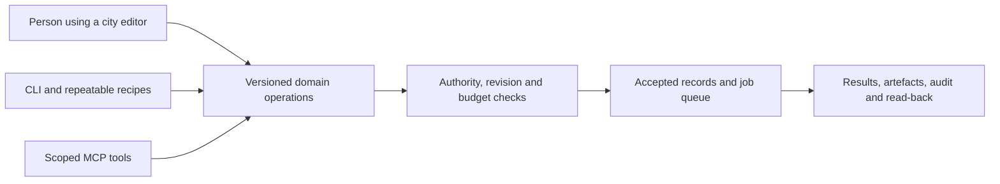

# Building and operating the city through agents

Tooling contract and proposed workflows · 2026-09-16 · decisions applied
2026-09-18 · [Tools](TOOLS.md)

**Status, 2026-09-18.** The admission rule below stands. Three decisions
change the surrounding text: the public observes agents' work state only and
registered users interact by tier and authority (RD03, RD04); personal agents
are private to their owner unless shared (RD12); and no tool, engine or host
is chosen, so every candidate named here stays under evaluation (RD15).
Forgejo will run on the lab server (RD13).

Rakesh requires MCP and CLI access when evaluating tools because agents will
perform much of the implementation and operation. Treat both as adoption
prerequisites for the workflows we depend on. Record each interface separately;
an MCP launcher invoked from a terminal is not a task-oriented CLI, and a
documentation-search MCP server is not an operational integration.

This is a design requirement, not authorisation to begin building. The
[evidence catalogue](../research/TOOL_AUTOMATION.md) identifies existing
interfaces, community candidates, coverage limits and missing adapters. No
candidate in that catalogue has passed an end-to-end city acceptance test yet.

## The admission rule

Before selecting a product for a required workflow, identify:

1. Its non-interactive CLI path, arguments, exit status and machine-readable
   results, including how to inspect the output independently.
2. Its MCP tools and schemas for the relevant operations, with read and write
   capabilities distinguished from documentation retrieval.
3. The required identity and resource scope for each operation. A human CLI
   and an agent MCP server can intentionally have different permissions.
4. Whether execution needs a browser, desktop session, licensed service,
   network connection, GPU or particular operating system.
5. A reproducible input, output, failure and recovery path; the workflow must
   continue to make sense without someone clicking through a hidden dialog.

An official implementation is preferable where it fits. A reviewed community
implementation or an SJL-owned adapter can satisfy the requirement, but a
proposed adapter does not make a tool ready today. UI-only candidates stay in
research until the missing path exists or a user-approved exception is recorded.

Code libraries are evaluated through the containing project's build, test,
inspection and authoring workflow. They do not each need an unrelated server
process. Their row must name that shared CLI/MCP path and its gaps; saying
“agents can write code” does not demonstrate the complete workflow. Similarly,
asset catalogues need a repeatable discovery/import/provenance path, rather
than a fictitious vendor CLI.

## One operation contract, several interfaces

For city-owned tools, make the service or local library own validation and
permissions. CLI, MCP and visual editors call the same domain operations.
Neither interface bypasses the authorising service or writes around its rules.

There is no requirement to centralise every product behind one privileged
server. Prefer direct, scoped product integrations. A small city adapter can
coordinate approved commands and map external IDs without becoming the owner
of every repository, board, chat room or fleet.

For long-running work, submission returns a job ID. Inspection, cancellation,
timeout, bounded retries and result retrieval are explicit operations. Input
and output manifests carry source revision, tool version, configuration, seed
where relevant, file hashes, licence/provenance and measured resource use.
Generative outputs may vary; reproducibility means retaining the actual
inputs and outputs, not promising identical model output from a seed alone.

## City tools to design

These are proposed product surfaces, not installed applications. Names below
describe responsibilities; the example operations are design vocabulary,
not commands or MCP tools that can be called today.

| Tool | Human purpose | Required CLI and MCP operations | Authority and review |
| --- | --- | --- | --- |
| City Studio | Lay out districts, roads, plots, utility networks and landmarks | Inspect a district; validate an authored manifest; preview a placement diff; export/import a version; submit a revision | Spatial and civic authorities validate topology, ownership and placement; publication is a separate action |
| Facility Designer | Define a library, school, park, stadium, emergency station or workshop | Validate service offers, opening hours, staffing, capacity, accessibility routes, upkeep and dependencies; simulate closure | Facility owner supplies operating commitments; a building mesh cannot create staffed capacity |
| Activity and Scenario Editor | Create games, quests, lessons, festivals and civic incidents | Compile narrative/data; check prerequisites and rewards; run a seeded scenario; inspect outcomes; package content | Activity publication and reward budgets are reviewed; authoring does not issue live rewards |
| Character Studio | Assemble avatars, NPC routines, personality profiles and resident voices | Validate rig/parts; render previews; compile schedules; synthesise approved voice samples; export a character recipe | Consent and permitted voice/asset usage travel with the recipe; real agents retain separate identities |
| Creator Portal | Present an independent or SJL project and invite participation | Create a draft listing; link an owned repository/board; validate exhibit metadata; submit/update/withdraw an exhibit; export project records | Project maintainers own membership and work acceptance; curators own public exhibit admission |
| Economy Lab | Explore earnings, taxes, service subsidies, businesses and progression | Load a fictional scenario; run seeded simulations; compare distributions; test conservation and reservations; export assumptions/results | Isolated simulation balances; a lab result never changes a real wallet or payment |
| City Control Room | Inspect service health, capacity, queues, incidents and recovery | Read service state; estimate impact; propose an intervention; inspect a job; execute an authorised runbook; verify recovery | Operator grants, environment separation, named changes and accountable review |
| Community Desk | Handle reports, disputes, appeals and civic proposals | Create/inspect an authorised case; attach permitted evidence; route review; record a decision; export an audit | Sensitive evidence is scoped; real moderation and fictional police remain distinct |
| Resident Dashboard | Understand a home, allowances, progression, bookings and transaction history | Self-scoped read/export; quote a booking or upgrade; reserve/cancel an authorised service | Explicit user intent for purchases; residency gives no project or fleet administration powers |
| Asset Workshop | Turn source art into approved distributable content | Import a permitted source; validate; optimise; render contact sheets; report budgets; submit a content-hashed package | Source attribution and review required; importing is not publishing |
| Build and Release Desk | Turn accepted source into tested web/native releases | Inspect revisions; build/test; produce previews and manifests; compare releases; request promotion and rollback | Repository and release owners decide; agents receive task-scoped workspaces and credentials |
| Knowledge Publisher | Make approved handbooks, books, trails and lessons accessible | Validate Markdown and links; build accessible pages; search approved material; submit/revoke a publication | Source permissions and audience checked on publication and retrieval |

The first nine preserve the tools discussed for building and operating the city.
The last three make shared asset, release and knowledge workflows explicit.
Their visual shells can be simple initially; the underlying operations need to
be usable by both people and agents.

## Reusable workflow shapes

### Build a district or facility

Superpipeline task and acceptance criteria → authorised workspace → authored map,
facility and asset changes → CLI validation and headless build in whichever
engine the evaluation selects (RD15) → MCP inspection and visual evidence →
repository review in Forgejo (RD13) or the project's own forge → approved
content version → separately authorised city publication. Keep a playable
inspection path: successful export
alone says nothing about navigation, readable signage or a convincing scene.

### Improve a real project

Registered account with the required tier and authority (RD04) → selected
task authority → scoped AgentPod execution, metered against credits (RD08) →
Git branch and patch → Forgejo (RD13) or GitHub pull request → CI and
maintainer review → work acceptance → separate contribution recognition →
optional consented city exhibit. An anonymous visitor can watch the agent's
work state (RD03) and cannot start this flow. A merged
patch, accepted task, JC grant and public story are distinct records. See the
[Forgejo/Superpipeline proposal](../integrations/development/FORGEJO_SUPERPIPELINE.md).

### Show the Guild at work (RD01, RD03)

Approved work-state fields per agent → exporter inside AgentPod, because the
hub's API refuses non-human tokens and its fleet contract has no current-task
field (see the [known gaps](CITY_SYSTEMS.md#known-integration-gaps-verified-2026-09-18))
→ redaction of private repositories and operator data → city projection with
freshness and expiry → readable and in-world views for anyone. No visitor
action reaches the agent. Which fields are public and how "idle" is shown are
open under RD01.

### Operate a public service

Service health and capacity evidence → proposed action with affected resources
and expected cost → required operator approval → bounded execution → read-back
and user-visible status. A library can still offer its published books when its
live tutoring service is unavailable; the status must explain that difference.

### Review an economic change

Fictional input population and policy version → deterministic batch simulations
→ conservation, access, scarcity and fairness checks → reviewable report →
accepted policy decision → scheduled and reversible configuration rollout.
Live provider records and JC balances are never manipulated by a simulation.

## Agent roles and credentials

| Role | Typical access | Deliberate boundary |
| --- | --- | --- |
| Research/design agent | Approved docs, draft content, design tools | No payment, production publication or fleet administration |
| Asset/game builder | Its workspace, editor bridge, build tools, preview artefacts | No arbitrary participant uploads executed with host privileges |
| Project contributor | Assigned work, permitted repositories, PR creation, test results | Maintainers retain merge and release decisions |
| Operations assistant | Scoped health, logs, inventory and permitted runbooks | Destructive recovery and live changes follow the relevant operator grant |
| Economy/payment assistant | Fictional scenarios or explicitly permitted reconciliation views | JC changes through city commands; live payment mutations need their own authority |
| In-world guide or resident agent | Curated knowledge and self/project-scoped actions | No inheritance of the builder's or operator's tool profile |
| Personal agent added by a resident | Whatever its owner grants, inside the owner's own scope | Private to its owner (RD12): invisible to other people, directories and public status feeds unless the owner shares it; what "share" grants is undefined |

Builders and city characters are different principals in this brief's
model. The fact that an agent can implement a payment integration does not
authorise it to issue refunds in production.

**Open decision, recorded 2026-09-18.** The sentence above conflicts with
an internal SJL decision ("an agent is a principal"), which models an agent as
one principal with one identity per system and grants that name one principal.
Under that decision, "builder" and "character" would be two grants
or two identities of one principal, not two principals; under this brief they
are two principals so that neither can inherit the other's reach. Which model
the city adopts, and whether SJL needs a cross-product decision that mentions the city,
is for Rakesh. Nothing here resolves it; see the
[system map](CITY_SYSTEMS.md#shared-records-and-permission-checks). MCP resources, repository text, chat and asset metadata are data;
none may expand tool permissions. Importers keep files inside approved roots.

Use short-lived or revocable credentials where supported, explicit project and
environment scopes, and bounded network/filesystem access. Desktop editor
bridges stay local or behind an authenticated operator connection. A raw Docker
socket, shell or unrestricted database connection is not a resident service.
Source reviews must examine actual authentication and permission enforcement,
not just an MCP tool's read-only description.

## Evidence required before adoption

Every candidate receives a small, representative workflow evaluation after
implementation is authorised. Record the exact versions and evidence:

- Discover capabilities from CLI help and MCP tool schemas, using the intended
  principal; confirm that unsupported actions are refused.
- Perform a representative operation through each interface and inspect its
  durable output independently. Test the required workflow, not just startup.
- Confirm machine-readable failure, cancellation and bounded output. Test a
  repeated request or interrupted job where duplication would matter.
- Check browser/desktop/headless and target-machine requirements. Capture
  images/audio/gameplay evidence for creative outputs, not just exit codes.
- Review maintained upstream, licence, release provenance and dependency costs;
  pin the evaluated version. Community-server availability is not an audit.
- Confirm resource limits, export/recovery and ownership. Record who maintains
  a custom adapter and what happens if the upstream service changes.

For finance, repositories and operational systems, test in a disposable or
provider test environment. Both transport availability and workflow suitability
must pass; a gap remains visible until it is closed. These are future selection
checks, not checks claimed to have run during this documentation task.

## Tool gaps to resolve in planning

1. Decide the Forgejo/Superpipeline ownership model without duplicating project
   records. Forgejo's presence on the lab server is decided (RD13); task ownership
   is not. Preserve external projects' existing tools.
2. Specify which city actions need automation, using the surfaces above.
   Avoid expanding an agent's authority merely to obtain interface parity.
3. Choose where a missing CLI/MCP path merits a small owned adapter, and where
   a different product would reduce total maintenance.
4. Keep evaluating engine/asset workflows, including visual inspection and
   web/native output, until the vision is clear (RD15). MCP availability
   alone does not choose the engine, and no trial is the next step.
5. Define the operator, contributor, in-world-agent and personal-agent
   profiles before exposing servers, including what sharing a private
   personal agent grants (RD12). Human review remains part of making and
   running the city.
6. Resolve the one-principal-or-two question above as an internal SJL decision.

Finishing these decisions does not start installation, implementation, a
repository migration, a live charge or a deployment.
