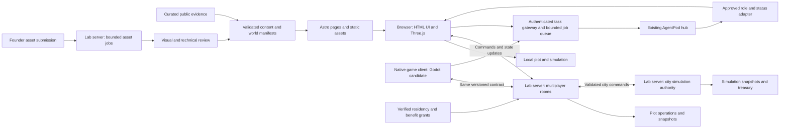

# Technical architecture

Proposed architecture with candidate technologies · 2026-09-15 · updated
2026-09-18 · [Plan index](../README.md)

**Status, 2026-09-18 (RD15):** technology choices wait for a clear vision. No
engine, room server, database, identity provider or host is chosen, and no
engine trial is the next step. Astro, Three.js, Godot, Bevy, Colyseus, headless
Godot and PostgreSQL appear below as candidates under continuing evaluation.
The [evaluation stance](PLATFORMS.md#evaluation-stance) lists each candidate's
use case and the evidence still needed. The contracts, budgets and boundaries
in this brief are written to survive whichever candidates are chosen.

Astro already serves documents and the working Three.js village, and both stay
while evaluation continues. The September 15 draft proposed prototyping a Godot
district on native desktop and web before deciding the long-term game client;
that is now one candidate path, not a scheduled step. The durable idea is to
extract structured world state and a command layer, so that placement and city
rules can serve whichever clients and authoritative service are eventually
selected.
Here, world state means explicit game records. The separate
[AI world-model proposal](../research/WORLD_MODELS.md) explores generated assets
and learned predictions, which feed reviewed authoring or isolated experiments.
They do not become the authority for plots, services, permissions or money.

The target now includes a [civic simulation](../gameplay/CIVIC_SIMULATION.md) and
[AgentPod integration, avatars and voices](../gameplay/AGENT_CITY.md). The first plot is
one increment; it is not the limit of the eventual simulation.

[Web and native clients](PLATFORMS.md) compares Godot and Bevy, reuse strategies,
performance constraints, and protocol compatibility. The [repository plan](../planning/REPOSITORIES.md)
records the approved split and migration. No engine is chosen (RD15).

The [economy](../gameplay/ECONOMY.md) defines city-owned wallets and balanced transactions;
[Razorpay integration](../integrations/payments/RAZORPAY.md) owns real-payment verification.
The [storage plan](STORAGE.md) separates active SSD data from HDD archives and
backups. None of these services has been deployed.

See [City systems](CITY_SYSTEMS.md) for the full logical responsibility map,
including projects, bookings, creator publication, community cases and economy.
It connects these earlier engine/server proposals to the open maker-city
operating model. All implementation remains behind the VISION gate.

The first slice is now "walk the city and watch the Guild at work" (RD01), and
the city prefers to run on SJL products in active development (RD02). How the
city reaches those products is still moving (RD14); the verified gaps are in
[City systems](CITY_SYSTEMS.md#known-integration-gaps-verified-2026-09-18).

## Open maker-city integration

The [ecosystem map](../vision/ECOSYSTEM.md) proposes how real project work connects
AgentPod, Superpipeline, Supermessage, SuperMD and external tools. The city needs
project/place identities, explicit membership mappings and approved publication
flows in addition to game state. Existing product permissions remain authoritative;
residency and fictional professions do not grant them. These are new design
requirements, not implemented services.

## Hosting decision still required

The lab server is a candidate, not an allocated production host for city services.
The [storage plan](STORAGE.md#hosting-role) records the
conflict with its existing lab role. One thing is decided: Forgejo
will run on the lab server, as the agents' dedicated git system (RD13). Its capacity,
isolation, backup and the lab/production boundary remain open, and RD13 does
not place any other city service there. The diagram below shows a proposed
placement; a protected production role or a separate host must be agreed
before durable accounts, payments or public service commitments depend on it.

## System boundaries



Rendering remains on the player's device, in the browser or native client.
Moving simulation or asset preparation to the lab server does not remove the device's
cost of drawing the scene. Remote video streaming is outside this baseline
client architecture. Optional neural destinations in the
[world-model research](../research/WORLD_MODELS.md) are separately budgeted
experiments with their own latency, GPU and bandwidth requirements. They
cannot replace shared city state or imply that streaming has been selected.

The diagram describes shared responsibilities, not a settled transport,
engine SDK or host. Its "Three.js", "Godot candidate" and "Lab server" labels
name candidates (RD15). The role/status adapter it draws from the AgentPod hub
does not exist: the fleet contract has no current-task field and the hub's
API refuses non-human tokens by design, so a public work-state feed (RD01,
RD03) would have to be built inside AgentPod. See the
[known gaps](CITY_SYSTEMS.md#known-integration-gaps-verified-2026-09-18). Online clients share accounts, plots, economy and accepted state.
Validate the browser/native join, command and reconnect contract before binding
it to Colyseus or Godot multiplayer APIs. Native offline sandboxes use separate
saves; they cannot replace shared treasury or residency state on reconnect.

## Content and state contracts

Use validated JSON/Markdown records, not a cast of arbitrary JSON to a
TypeScript interface. [Astro content collections](https://docs.astro.build/en/guides/content-collections/)
are an option. The website checkout inspected on September 15 declared Astro 4;
current documentation contains newer APIs. Choose a schema compatible with the installed version,
or upgrade Astro in a separate, tested change.

| Record | Required information | Authority |
| --- | --- | --- |
| Product | Stable ID, name, specific problem, bounded description, evidence date, source/release URLs, availability and limitations | Editor, checked against public evidence |
| Place | Stable ID, district, product/exhibit references, position, bounds, entrance, map label, landmark asset | Authored world manifest |
| Exhibit | ID, learning objective, scenario version, input limits, explanation, readable equivalent, product-evidence references | Authored teaching content |
| Asset | ID, source/license, author/attribution, hash, dimensions, pivot, material/triangle/texture budgets, collider, LODs | Reviewed asset manifest |
| World | Schema version, world version, seed, districts, routes, placement kit, compatible scenario versions | Published release |
| Local save | Schema/world versions, plot pieces, preferences, explicit export format | Visitor's browser |
| Shared plot | ID, owner/edit roles, durable revision, pieces, accepted operations, snapshot version | Room service and durable store |
| Resident | Stable account ID, verified identity links, plot claim, visibility preferences | Private account service |
| Benefit grant | Evidence reference, rule version, earned unlock or timed allowance, effective dates and corrections | Private support/contribution ledger |
| Public update | Date, title, approved public source, related place, correction/history | Human editor |
| Civic facility | Dependencies, opening/access rules, capacity units, operating costs, content/activity/agent references | World manifest + city authority |
| City state | Tick, graph/rule version, service allocations, incidents, household cohorts, treasury revision | One authoritative simulation and durable ledger |
| Avatar profile | Validated kit parts, personality preference, optional voice ID and visibility | Person's local preferences or authenticated profile |
| Agent projection | Opaque city identity, approved role/status, source basis, freshness and expiry | Server adapter; distinct from raw fleet response |
| Task/booking | Audience, scoped authorisation, reserved allowance, status, expiry and idempotency key | Activity/task service |

**Place IDs have no owner yet (verified 2026-09-18).** The website renamed
the place slug `kaambaan` to `superpipeline` and migrates saved visits with a
one-line shim, while this repository's atlas kept `kaambaan` as its stable
key. Both follow the rule below in spirit, but they now disagree, and nobody
owns the ID registry. Record an owner before either side ships more IDs; see
the [known gaps](CITY_SYSTEMS.md#known-integration-gaps-verified-2026-09-18).

Do not derive building IDs from array positions. Adding a product must not move
every saved destination or silently reassign a visitor's building. Rename IDs
with an explicit migration or redirect. Product availability, repository
maintenance, exhibit readiness, and multiplayer service health are separate
fields; one colour cannot safely stand for all four.

Illustrative domain types, not implementation-ready SDK code:

```ts
type PlotCommand = {
  commandId: string;
  plotId: string;
  expectedRevision: number;
  operation:
    | { kind: "place"; assetId: string; cell: [number, number]; rotation: 0 | 1 | 2 | 3 }
    | { kind: "remove"; pieceId: string }
    | { kind: "undo"; acceptedCommandId: string };
};

type PlotSnapshot = {
  schemaVersion: number;
  worldVersion: string;
  plotId: string;
  revision: number;
  pieces: Array<{
    id: string;
    assetId: string;
    cell: [number, number];
    rotation: 0 | 1 | 2 | 3;
  }>;
};
```

Identity and permission come from the authenticated session, not a client-sent
owner field. See [multiplayer command semantics](MULTIPLAYER.md).

Residency adds a private verification/benefit layer described in
[RESIDENCY.md](../gameplay/RESIDENCY.md). Keep local practice plots separate from hosted
resident homes. Check effective grants and edit roles on the server; never
include payment amounts or provider credentials in room state, public home
manifests, or static builds. Financial support, earned lifestyle, and current
service allowances are distinct records.

## Website integration

The [website implementation plan](https://github.com/SuperJackfruitLabs/super-jackfruit-website/blob/master/docs/VILLAGE_WEBSITE_PLAN.md) owns routes, public
content, catalogue repair and loading recovery. This repository owns shared
world contracts, simulation, clients and game services.

## World runtime

Separate the current composition code into responsibilities as features arrive:

```text
world/       manifests, stable IDs, spatial queries, district loading
simulation/  pure state transitions, seeded scenarios, placement rules
render/      scene graph, asset cache, instancing, lighting, animation
input/       driving, map, building, keyboard, touch, gamepad modes
ui/          HTML panels, focus, captions, map, connection/save feedback
network/     session adapter, snapshots, commands, reconnect
storage/     versioned local saves and migrations
```

Start with small modules and explicit ownership. No ECS rewrite is necessary
for a few districts. Introduce an entity framework only if profiling and
entity complexity justify it.

- Render at the device's suitable cadence; run toy simulation at a fixed
  5–10 Hz initially and interpolate visuals. Cap catch-up after a hidden tab.
- In solo mode, keep a small simulation on the main thread until measured
  work justifies a Web Worker. In co-op, the server owns the shared scenario.
- Trees, birds, clouds, and decorative crowds can be local seeded scenery.
  They do not need a network message on every frame.
- Keep DOM interaction and driving mutually exclusive: typing into a field
  must not accelerate the car. Escape closes a panel and restores focus.
- Shared-room driving starts with non-colliding visitors. Authoritative
  vehicle combat or precise racing physics would be a different project.

The full civic engine uses its own fixed clock, topology, household/service
allocation and fiscal settlement, as specified in [Civic simulation](../gameplay/CIVIC_SIMULATION.md).
Run it independently of the render loop and asynchronous agent work. A single
city authority owns its treasury/topology at first; social and game rooms
reference it through commands. Never duplicate fiscal settlement per room.
Library reading and lessons remain usable when the 3D simulation is unavailable.

A proposed AgentPod adapter would publish only opted-in roles and approved
fields with expiry. The public sees agents' current work state and cannot
interact with them (RD03); registered users interact according to tier and
authority (RD04). Personal agents are private to the person who added them
unless that person shares them (RD12), so they never appear in a public
projection by default. Participant task grants, human voice sessions, and
synthetic voice jobs
have distinct access and cost policies. No AgentPod credential, real financial
ledger or private transcript is sent through public room snapshots.

## Loading, assets, and memory

The September 15 website inspection found instancing and Meshopt. The
`compress-assets.mjs` and caching checks below belong to that website repo,
not this planning-only city repo. Recheck its revision before implementation.
Extend those choices where the selected client supports them:

1. Load the entrance and first district before distant workshops. Keep a
   neighbour warm only when memory and bandwidth allow.
2. Use a spatial grid for nearby interactions and entities. Avoid scanning
   an entire future city each frame.
3. Use distance tiers for geometry and NPC updates. Limit shadow-casting
   lights, transparent layers, and expensive postprocessing.
4. Maintain shared asset reference counts. Leaving a district disposes its
   unique geometry, materials, textures, listeners, and workers; it must not
   dispose a texture still used by another district.
5. Stage loader feedback and provide timeout, retry, and “Open map & read”.
   Treat WebGL/context loss and malformed assets as recoverable failures.
6. Version assets by content hash when the deployment contract supports it.
   Preserve the repository's known HTML-fallback/cache regression checks.
   Do not restore year-long immutable caching merely because a path is hashed.

The existing `compress-assets.mjs` deduplicates, prunes, quantizes, and applies
Meshopt. It does **not** simplify geometry or resize textures. Generated and
scanned assets need those steps before compression. Preserve the chosen
16-bit normals until visual comparison shows a safe alternative.

## Initial performance budgets

These are proposed budgets for measurement, not existing scores or guarantees.

| Area | Starting target | How to evaluate |
| --- | --- | --- |
| Readable entrance | Useful HTML before world initialization; initial HTML/CSS/JS transfer around 250 KB or less, excluding optional 3D and fonts | Cold network trace; adjust budget from the measured baseline |
| First 3D district | Around 2 MB or less transferred for its models/textures and 3D code; audio deferred | Per-resource compressed transfer, not repository size |
| Frames | Aim for 60 fps desktop and stable 30 fps on the chosen modest phone | Real devices, five-minute play, frame-time distribution and thermal behaviour |
| Assets | Repeated props roughly 0.5–2k triangles; hero buildings roughly 5–10k; usually 1–2 materials | Per-asset and whole-scene draw-call/GPU measurements; art-driven exceptions documented |
| Textures | Prefer palette/vertex colour; start at 512 px for small props, 1024 px for landmarks | Visual comparison, decoded GPU memory, not just download bytes |
| Memory | No continuing growth after repeated district entry/exit | Repeat travel and inspect retained resources |
| Room updates | Begin with 10 Hz presence; avoid full-world snapshots per tick | Measure payload, buffered messages, round-trip latency, server event-loop delay |

For document pages, target LCP ≤2.5 s, INP ≤200 ms, and CLS ≤0.1 at the 75th
percentile, segmented by device. These are the published
[Core Web Vitals thresholds](https://web.dev/articles/vitals).
Canvas readiness needs its own metric: time until the visitor can meaningfully
drive, select a destination, or place a piece. Passing LCP does not establish
that the world is playable.

The existing quality monitor receives a clamped frame delta. Measure raw frame
time separately before trusting automatic downgrades. Changing scenery density
currently needs a reload; either make it live or explain that behaviour.

## Accessibility and verification

HTML carries essential information and controls. Provide keyboard-selectable
destinations, labelled build cells or a coordinate-based placement form,
visible focus, captions, sufficiently large touch targets, and status messages
for save/connection changes. Colour and sound are supplementary cues.

Test no JavaScript, WebGL unavailable, blocked storage, asset failure, reduced
motion, keyboard-only navigation, touch, and a screen reader. Automated
[Playwright accessibility checks](https://playwright.dev/docs/accessibility-testing)
can catch some issues; they do not replace those manual paths. A text-only
fallback that is itself hidden until JavaScript runs is insufficient.

Meaningful automated checks include schema/link validity, old-save migration,
placement rules, duplicate/conflicting commands, loader recovery, resource
disposal, and missing-asset response status/MIME/cache behaviour. Use real
two-client and restart tests for shared-room persistence.
