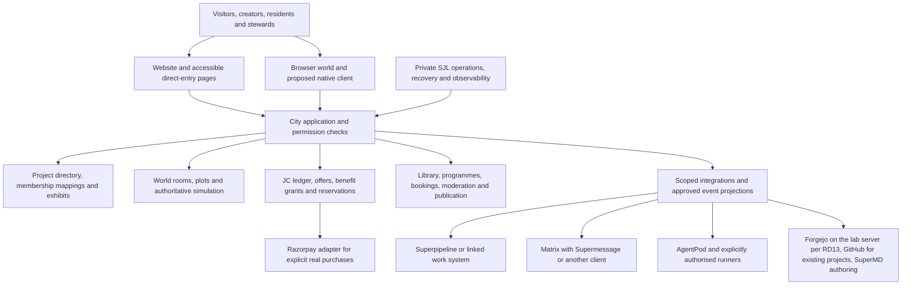

# The complete city system map

Planning milestone 5 · logical responsibilities, not implementation ·
2026-09-16 · decisions applied 2026-09-18

**Status, 2026-09-18.** The [decisions of 2026-09-18](../planning/VISION_DECISIONS.md#decisions-recorded-on-2026-09-18)
change how this map should be read. The city prefers to run on SJL products in
active development (RD02); the public observes agents' work state only, and
interaction starts at a registered account (RD03, RD04); comments, messages
and assemblies are core (RD05); credits are purchasable and buy real compute
and storage (RD07, RD08); personal agents are private unless shared (RD12);
Forgejo will run on the lab server (RD13); integration points are still moving and
the verified gaps are recorded below as facts (RD14); and no technology is
chosen (RD15). Each is applied in place; nothing else in the map has been
re-derived.

This design connects the [master plan](../vision/MASTER_PLAN.md),
[facility catalogue](../vision/CITY_PLAN.md) and
[SJL product evidence](../vision/ECOSYSTEM.md). It proposes logical modules and
contracts. It does not require a separate deployed service for every box, select
an engine, or claim that the integration already runs.

The [tool strategy](TOOLS.md) and [agent tooling contract](AGENT_TOOLING.md)
describe how people and agents would author and operate these systems through
CLI, MCP and visual interfaces. The [Forgejo/Superpipeline proposal](../integrations/development/FORGEJO_SUPERPIPELINE.md)
allocates work and software records without creating duplicate authoritative boards.

## People-facing surfaces and accountable systems

The browser/native world and readable pages are presentations of the same
accepted identities, projects, entitlements and world state. Walking into a
room is not an authentication event. Offline sketches are clearly local and
cannot overwrite a shared wallet, project grant or city decision on reconnect.

## Logical ownership map

| ID | Responsibility | Authoritative records | Existing capability to reuse / gap |
| --- | --- | --- | --- |
| SYS01 | City account and permission boundary | City account, public persona, external identity mappings, scoped role grants | New city capability; existing product permissions stay local; no assumed complete SJL account platform |
| SYS02 | Projects and teams | Project identity, owner, city membership, visibility, authoritative external links | New directory/mapping layer; project tools still enforce their own memberships |
| SYS03 | Exhibits and discovery | Submitted/reviewed exhibit revisions, placement, tags, affiliations, rotation | New workflow with website readable views; licences and curation required |
| SYS04 | Spatial rooms and plots | Accepted placements, presence, room access, plot snapshots and revisions | World authority to build later; presentation must not own durable money |
| SYS05 | Civic simulation | Utility/transport graphs, NPC cohorts, facility state, incidents and world clock | New deterministic simulation; GM01–GM13 compose on these rules |
| SYS06 | JC economy | Wallets, earned and purchased balances, reservations, balanced postings, tax rules, inventory custody, usage metering and quotas | New conventional city ledger; blockchain discarded; credits are purchasable (RD07) and buy compute and storage (RD08), so the ledger is coupled to metering and quota; external payment receipts are not JC balances |
| SYS07 | Purchases and benefit grants | Purchase intents, verified evidence, credit packs, residency blocks (RD09), tiers, sponsorship (RD10), period allowances, corrections | Razorpay selected; global coverage, credit-sale policy and tax handling unverified (RD11) |
| SYS08 | Task budget and dispatch | Task intent, permission scope, budget reservation, runner binding, metered usage, result references | Superpipeline and AgentPod preferred (RD02); today neither exposes a city-usable dispatch or status path, see the known gaps below |
| SYS09 | Facilities and programme bookings | Service offers, hosts, capacity, reservations, cancellation/refund policy | New city capability; no actual seats created by fictional demand |
| SYS10 | Knowledge and artefact publication | Versioned approved material, source/licence, audience, export references | SuperMD supports file-based authoring; publishing and private/public boundaries are new |
| SYS11 | Community cases and stewardship | Reports, evidence scope, decisions, appeals, civic proposals and voting records | New human workflow; fictional policing is not this authority |
| SYS12 | Integration adapters | Identity/resource mappings, inbound event IDs, freshness, sync checkpoints and errors | Superpipeline wire APIs, AgentPod verified routes, Matrix contracts; all cross-system paths need testing |
| SYS13 | News and notifications | Approved stories, consent, correction history, notification preferences | Existing SJL product evidence can inform stories; new consented city publication |
| SYS14 | Creator content and extensions | Asset manifests, version, licence, review state, compatibility and publication | Existing authoring tools can supply assets; city import/review/rollback contract is new |
| SYS15 | Operation and recovery | Service health, capacity, audit access, backups, restoration and incident records | SJL's private infrastructure operations own infrastructure practice; city-specific capacity and recovery remain to be established |

### Which SJL product could power each system (RD02)

Rakesh prefers that the city uses every SJL product in active development.
The middle column is a **proposal** per responsibility. The right column
records what that product exposes today, marked as a fact verified in the
sibling repository on 2026-09-18 or as "not verified". A product that could
power a system is not yet connected to it (RD14).

| ID | SJL product that could power it (proposal) | What the product exposes today |
| --- | --- | --- |
| SYS01 | The AgentPod hub as the suite's one issuer (an internal SJL decision, 2026-08-15), with the city verifying its tokens offline | Verified: Better Auth issuer with a published JWKS; human hub tokens live five minutes; public signup is disabled after the first user; one bootstrap tenant. Not verified: any way for a city account to be created |
| SYS02 | Superpipeline workspaces for project membership; Forgejo organisations for code (RD13) | Verified: one personal tenant per user, roles `viewer`/`member`/`admin`/`owner` per tenant, no per-board access control. Not verified: Forgejo, which is not installed |
| SYS03 | SuperMD for exhibit text; the website for readable exhibit pages | Verified: SuperMD has an `html-export` plugin and a static-site generator example; no headless CLI. Website pages exist for products, not exhibits |
| SYS04 | None. Room and world authority is city-owned; the room server is a candidate under evaluation (RD15) | Not applicable |
| SYS05 | None. The deterministic simulation is city-owned | Not applicable |
| SYS06 | None identified. No SJL product carries a ledger; the city owns it | Not verified beyond a source search |
| SYS07 | Razorpay (external, selected by Rakesh); no SJL product | See the [payment plan](../integrations/payments/RAZORPAY.md) |
| SYS08 | Superpipeline for cards, claims, leases and gates; AgentPod for runs, stations and nodes | Verified: eleven `superpipeline_*` MCP tools cover claim, heartbeat, activity, review and completion, none creates a card or reads a board; a card without a matching `mayDispatch` grant is parked; AgentPod `/api/*` refuses non-human hub tokens |
| SYS09 | None identified for bookings; Supermessage/Matrix rooms could host a programme's discussion | Not verified |
| SYS10 | SuperMD for authoring; its `html-export` plugin and the `build_docs.rs` example as a basis for the city's publishing job | Verified: plugin, example and a WIT plugin interface exist; no headless CLI, so a publishing job would drive the library or a plugin host itself |
| SYS11 | Supermessage/Matrix for discussion and assemblies (RD05); moderation records are city-owned | Verified: Supermessage is a client only, no web build; the 14 Guild agents have Matrix identities. Not verified: any moderation tooling |
| SYS12 | SJL's internal cross-product decisions for the shared agreements; Superpipeline push events and Matrix gate events as the inbound feeds | Verified: Superpipeline pushes only `work.available` and `gate.pending`, with no `Idempotency-Key` handling. Reported in the [product refresh](../research/SJL_PRODUCT_REFRESH_2026-09-16.md), not re-verified: `dev.superpipeline.gate.v1` Matrix events |
| SYS13 | Supermessage/Matrix for notifications; SJL's approved stories | Not verified |
| SYS14 | Forgejo on the lab server for source and releases (RD13); AgentPod runs for builds | Verified: AgentPod lists `forgejo` as a delivery-adapter enum value only. Not verified: any build or release path |
| SYS15 | SJL's private runbooks; the AgentPod fleet contract for node and process health | Verified: the fleet contract reports node online/offline and process running/stopped/error, with no current-task field; `apn fleet` shipped in v0.1.33 |

Where the column says "none", VD08 still holds: nobody else is required to use
SJL tools, and the city must not invent a product to fill a box.

These are responsibilities rather than assumed staffing positions. The city
repository owns city-specific rules and clients. Changes to product-owned APIs
belong in their repositories; shared agreements are recorded as internal SJL decisions when
multiple products must accept them. Operators retain private runbooks.

## SJL integration contracts to resolve

| Product/source | City asks for | City must supply | Boundary and honest fallback |
| --- | --- | --- | --- |
| AgentPod | Approved role/status, permitted workspace/task operations and result references | Explicit station/project mapping, verified grants, budget, task identity | No broad operator credential in clients; use a curated snapshot or disable task dispatch if scoped access cannot be provided |
| Superpipeline | Chosen board/card/run/gate projections and authorised work actions | Project/board membership mapping, contribution IDs, permitted decision identity | Use supported REST/MCP surfaces per current docs; linked board remains usable when integration is absent |
| Supermessage/Matrix | Project, district and assembly conversation (core under RD05) and supported structured agent/gate views | Room audience mapping, explicit Matrix-ID-to-principal-to-city-account links, consent and authenticated action routing | Supermessage is a client only with no web build; the homeserver and design are open, see "Comments, messages and assemblies" below |
| SuperMD and chosen file store | Authoring and import of approved document revisions | Source path/reference, licence, publication audience, version | The native editor is not a web collaboration backend; browser readers receive approved exported content |
| Forgejo on the lab server (RD13), GitHub for existing projects | Repository/artefact identity, contributions, PR/check and accepted release references | Owner-approved connection, scopes, event mapping and declared task authority | Source store owns merge/release; city approval never substitutes for it; Forgejo's presence is decided, its integration is a later discussion |
| Razorpay | Verified purchase/subscription/refund evidence under selected supported flows, including credit packs (RD07) | Server-created intent and immutable account/offer binding | Current payment plan owns details; global coverage and credit-sale policy unverified (RD11); unknown outcomes reconcile before fulfilment/retry |
| Website | Discoverable pages, project/activity deep links and account handoff | Stable public IDs and approved readable projection | Essential content works without loading the game |

The existing [ecosystem evidence record](../vision/ECOSYSTEM.md) pins the source
revisions supporting product roles. This planning pass does not refresh those
claims into deployment evidence or turn draft APIs into shipped capabilities.

## Shared records and permission checks

Stable IDs connect a person, project, place, activity, contribution, task,
artefact and benefit. Each reference declares its authority and audience.
External identifiers are mapped; changing a GitHub name must not transfer a
home or attach an account to a different project.

A protected action requires the relevant account state, project membership,
explicit action grant, resource scope and any budget/capacity reservation.
Services recheck these at execution and result retrieval. A role label, game
profession, sponsor tier, project card assignment or linked account alone is
not sufficient. If a downstream service cannot revoke/match the required scope,
that integration mode stays unavailable rather than assuming equivalent access.

Accounts, public personas, payment identities, simulation citizens and agent
principals are separate records. Imported documents, chat text and agent outputs
are untrusted content; they cannot grant access, spend money or publish themselves.

**Visibility of agents (RD03, RD04, RD12).** Guild agents' current work state
is public by decision, subject to the redaction rules RD01 leaves open. A
personal agent is private to the person who added it: it does not appear in
public projections, directories, rooms or status feeds unless its owner
shares it, and what "share" grants is still to be defined. Registered users
interact with agents according to tier and granted authority; the public
observes only.

**Open decision: one principal per agent, or two?** The
[tooling contract](AGENT_TOOLING.md#agent-roles-and-credentials) says builders
and city characters are different principals, so that an agent that builds
the city cannot inherit its in-world persona's reach or the reverse. An
internal SJL decision, "an agent is a principal", models an agent as one principal with one identity per system, and a grant
that names one principal. Either the city's "character" is a persona over the
same principal with a narrower grant, or it is a second principal. This map
records the conflict and does not resolve it.

## Event and side-effect rules

Within a city authority, accept a command once using its business identity,
validate the expected revision, reserve affected resources and commit its
result durably before acknowledging success. Derived events carry an event ID,
source revision, audience, occurred/observed timestamps and relevant expiry.
No event is called live when its observation has expired.

Across products, use durable intent/outbox and receipt/inbox records where
supported. Retries deduplicate the business operation, not merely one delivery.
External APIs may have different idempotency and read-back capabilities; an
unknown result enters reconciliation rather than being retried blindly. A replay
rebuilds projections only: it never charges, dispatches, merges or publishes again.

A task's accepted artefact, a contribution's review, a residency grant and a
public story are different events. Do not make one signal imply all the others.
Corrections append a reasoned compensation/history record; deleting an event
from a display is not reversal of the original operation.

## Five complete cross-system flows

1. **Project exhibition:** account → project draft → owner/licence/audience
   declaration → submitted exhibit revision → curator decision → directory/place
   allocation → optional event booking. Later edits create a new reviewable
   version; withdrawing one exhibit need not delete the project.
2. **SJL contribution:** approved request → agreed assignment → permitted external
   workspace → submitted artefact → maintainer acceptance → evidence-linked
   contribution record → independently verified recognition → optional publicity.
3. **Paid residency:** quoted named offer → purchase intent → verified captured
   payment/covered period → one qualifying grant → unique home claim → separately
   bounded service allowance. A duplicate event cannot duplicate a home.
4. **Agent work:** registered account with the required tier and authority
   (RD04) → authenticated project action → scope and budget reservation, with
   credits metering the compute used (RD08) → verified runner → metered run →
   human review where required → result retrieval under current permission →
   release unused reservation. Budget exhaustion and revocation have explicit
   terminal/paused states; purchased credits (RD07) top up a balance, never
   an in-flight reservation.
5. **Public facility:** proposal → JC construction and actual operating allocation
   → operator/host/content/dependency checks → scheduled capacity → bookings →
   accepted usage and maintenance → renewal, reduced service or orderly closure.
6. **Public observation (RD01, RD03):** an anonymous visitor walks the city →
   sees each Guild agent's approved current work state, freshness and idle
   presentation → follows links to readable project pages → cannot message,
   task or otherwise interact with an agent. The earlier idea of curated
   bounded demos for anonymous visitors is withdrawn (RD03). The work-state
   feed this needs does not exist yet; see the known gaps below.

## Comments, messages and assemblies: an open integration area (RD05)

Rakesh decided that comments, messages and assemblies are a critical part of
the experience. This map previously mentioned "project rooms" and an adapter
to "Matrix with Supermessage" without naming a homeserver or a design. That
is now recorded as an open integration area. **Nothing below is decided.**

Facts verified on 2026-09-18:

- Supermessage is a Matrix client, not a homeserver, targeting iOS, Android,
  Windows, macOS and Linux with one Rust core. It has no web or WebAssembly
  build, so a browser city cannot embed it today.
- The 14 Guild agents already have Matrix identities on the suite's
  homeserver; a script gave each one a cross-signed identity on 2026-09-15.
- An internal SJL decision requires that a Matrix ID is linked to a principal
  by an explicit link, never inferred from a localpart or a matching e-mail
  address.
  The city's account would be a third link in that chain.

Questions to design, in no order:

| Area | What has to be decided |
| --- | --- |
| Community accounts | Whether a city account implies a Matrix account, who creates it, and how a public visitor (RD03) is kept read-only |
| Rooms | One room per project and per district, assembly rooms, who may create and archive them, and how membership follows city membership |
| Browser chat | Which client serves the browser given Supermessage has no web build: a web client, an embedded widget, a city-owned UI over the Matrix API, or none |
| Moderation | Reporting, removal, retention, appeals and the legal duties of hosting user text for a global audience (RD11); staffed by a solo operator |
| Identity linking | Explicit Matrix ID → principal → city account links, never inferred; what an unlinked Matrix user in a city room can do |
| Agents in rooms | Which agents may be addressed by whom (RD04), and how a chat message stays distinct from a gate decision |
| Assemblies | Whether an assembly is a scheduled room event, a vote record in SYS11, or both |

Related research: [identity and moderation](../research/IDENTITY_AND_MODERATION.md).

## Known integration gaps (verified 2026-09-18)

Rakesh decided that integration points are still moving and will be discussed
later (RD14). The [gap review](../planning/GAP_REVIEW_2026-09-18.md#integration-gaps-verified-against-sibling-repositories)
holds the full table. The facts below were each checked in the sibling
repositories on 2026-09-18 (`origin/main` plus the checked-out branch) before
being written here. Paths in code style are relative to the workspace that
holds the sibling repositories. They are facts to design around, not
decisions.

1. **City accounts have no issuer or sign-in design.** SYS01 says "no assumed
   complete SJL account platform". An internal SJL decision mandates one issuer
   for the suite, the AgentPod hub's Better Auth with a published JWKS, with
   every other plane verifying offline. No internal cross-product decision
   mentions Agentnagar. Verified.
2. **AgentPod cannot feed a public status view today.** `/api/*` refuses any
   hub token whose principal is not human, by design, with the comment that
   routes opt in for agents one at a time
   (`apps/hub/src/auth/middleware.ts`). The hub has one bootstrap tenant and
   closes signup after the first user. The fleet contract reports node and
   process health and has no current-task field. A work-state exporter for
   RD01 would therefore be built inside AgentPod. Human hub tokens live five
   minutes; an internal SJL draft decision on a human at a terminal
   (2026-09-18, not accepted at the time) proposes a device credential exchanged for
   those tokens. Verified.
3. **Production Superpipeline parks an ungranted card.** With
   `ENFORCE_CONTROL_PAIR` set, which the production configuration does, a
   card whose queuer holds no matching `mayDispatch` grant for the agent is
   moved to `input-required` and reported, not dispatched
   (`apps/api/src/board/board-do.ts`). A city gateway cannot queue work for an
   agent unless the human behind it holds that grant. Verified.
4. **Superpipeline's tenancy and surfaces.** One personal tenant per user,
   roles per tenant (`viewer`, `member`, `admin`, `owner`), no per-board
   access control, no service credential found, only `work.available` and
   `gate.pending` pushed, no `Idempotency-Key` handling (the field is
   accepted and ignored), and an MCP server whose eleven tools cannot create
   a card or read a board (`docs/05-integration-surfaces.md`,
   `apps/api/src/db/catalog.ts`, `apps/api/src/db/members.ts`,
   `apps/api/src/mcp/tools.ts`). Verified.
5. **SuperMD has parts of a publishing path and no CLI.** An `html-export`
   plugin, a `build_docs.rs` static-site example and a WIT plugin interface
   exist; `main.rs` takes a file path argument and there is no headless
   export command. Verified.
6. **Place IDs have no owner.** The website renamed the slug `kaambaan` to
   `superpipeline` and maps saved visits with a one-line shim in
   `src/scripts/village/visits.mjs`, while this repository's atlas kept
   `kaambaan` as a "stable" key. The website plan also places `/home`,
   `/residents`, `/city`, `/agents` and `/profile` on the SJL site and
   predates a separate project domain (RD17). Verified.
7. **Forgejo is decided, unintegrated.** Superpipeline recognises GitHub
   references only; AgentPod lists `forgejo` as an enum value with no
   delivery implementation. Verified; details in the
   [Forgejo proposal](../integrations/development/FORGEJO_SUPERPIPELINE.md).
8. **Agent tokens.** The `spa_` prefix replaced `kbn_` on 2026-09-17 with no
   fallback. Verified; the dated
   [product refresh](../research/SJL_PRODUCT_REFRESH_2026-09-16.md) carries a
   superseding note.

## What remains available when something fails

| Failure | Stop or restrict | Preserve or explain |
| --- | --- | --- |
| Game renderer/device cannot run | 3D scene | Readable project pages, map, account and accessible actions |
| Room disconnected | New authoritative shared edits | Last acknowledged save, clear pending state, local export as a separate sketch |
| JC ledger unavailable | New purchases/rewards and dependent construction | Read-only verified balances; no optimistic spend that invents funds |
| Payment result unknown | New benefit fulfilment for that intent | Pending receipt/status; reconciliation without duplicate charge/grant |
| Agent runtime unavailable | New dispatch to that runner | Honest stale status, prior permitted results, ordinary project work |
| Board or chat unavailable | Actions whose owner cannot confirm them | Source links, dated cached public projections; no fake completed task |
| Membership revoked | Queued dispatch and further protected retrieval | Required audit and authorised team continuity; running-task isolation policy |
| Moderator/host unavailable | New unstaffed publication or events | Private drafts, existing approved material, accurate queue status |
| Sponsor/operating allocation ends | New unfunded costly capacity | Existing commitments or declared compensation; earned creations |
| Simulation utility/disaster failure | Affected fictional capacity/activity rules | Real account, reporting, artefacts and paid service obligations |

## Persistence, clocks and deployment boundaries

Use authoritative server state for the shared economy, project grants, bookings
and simulation. Browser/native clients cache permitted views and send intents;
local offline experiments have separate saves. Presence can be ephemeral; accepted
contributions, payments and world edits need durable records.

Human appointments and subscription periods use actual timestamps. Simulation
phases use a recorded world clock; local calm-mode lighting is cosmetic. After
an outage, reconcile committed work and explicitly advance permitted simulation
steps; do not infer weeks of personal bills or replay agent jobs to catch up.

The lab server is a candidate city/heavy-job host, not a chosen one (RD15); SSD
would hold active workloads and HDD suitable archives/backups under the
[storage plan](STORAGE.md). Forgejo will run there (RD13). The existing AgentPod
setup remains a separate system. No new capacity,
isolation or operational readiness is asserted here. Resource contention must
not let an asset/agent job, a CI runner or the forge starve accepted city
transactions.

Because credits buy compute and storage (RD08), metered usage records are
part of the durable set: they must be backed up and restored with the ledger
and grants, and reconciled with them before writes resume. See the
[storage consequence](STORAGE.md#credits-meter-real-storage-and-compute).

Plan for backups of world state, economic records, grants, project metadata and
artefact references with compatible versions. Restoration reconciles external
payment/task state before enabling writes. Recovery objectives and actual quotas
must be measured before service offers; funding and staffing must cover the
chosen objective. None of these host services is installed by this plan.

## Dependencies without losing the full scope

The dependency order is conceptual: agreed policies and IDs → authoritative
state/permissions → project and service lifecycles → verified integrations →
larger institutions and mechanics. Public readable material can remain useful
with few integrations. Complexity increases with actual supported activities,
not merely a larger map.

All GM01–GM13 systems remain mapped to these owners: careers/relationships to
profiles and reviewed evidence; public works to projects/inventory/ledger;
districts/NPCs/ecology to simulation; expeditions/research to authored activities;
automation/agents to grants and tasks; charters to civic decisions; news to
publication; travelling programmes to bookings/custody. The creative vision
therefore survives an engine or tool substitution.

After vision agreement, contract tests, threat review, restore exercises and
client measurements must validate the design. Their existence here is a plan,
not test evidence or permission to begin implementation.
