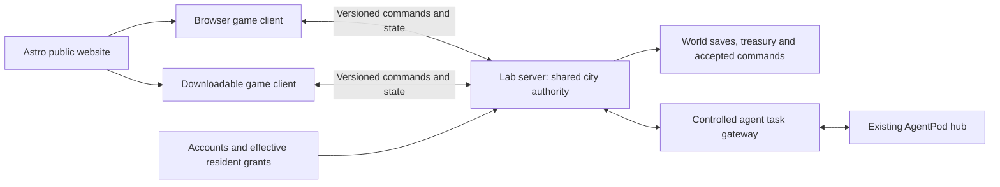

# Web and native clients for one city

Candidates under continuing evaluation · 2026-09-15 · updated 2026-09-18 ·
[Plan index](../README.md)

Rakesh proposed a downloadable game alongside the browser experience and asked
to add that direction to the plan. Godot, Bevy and the existing Three.js scene
are **candidates under continuing evaluation**. None is chosen, and no engine
trial is the next step (RD15). The engine, browser-client strategy and
supported platform matrix are not decisions or implemented capabilities.

The September 15 draft of this brief recommended Godot for a first native
prototype with a web export of the same district as an early comparison. That
assessment is kept below as research. Under RD15 it is one candidate's case,
not a plan of record.

This extends the earlier Astro/Three.js research. The working site stays as it
is; Astro remains the candidate for useful public pages. Any long-term game
client would be chosen from evidence, and only once the vision says what the
client has to do.

## Evaluation stance

Rakesh decided on 2026-09-18 that **technology choices wait for a clear
vision** ([RD15](../planning/VISION_DECISIONS.md#decisions-recorded-on-2026-09-18)).
The standing instruction is to keep evaluating the best available technology
for each use case. No engine, room server, database, identity provider or host
is chosen, and none is the "next step".

In this brief that means:

- Every named technology is a candidate for a stated use case. The table below
  lists the use case and the evidence still missing.
- The first slice (RD01: walk the city and watch the Guild at work) sets the
  use cases to evaluate against. It does not pick a renderer.
- Research stays current. Dated notes record what changed upstream, so an
  eventual choice is made on today's facts, not on September's.
- The comparison design further down is a method held ready. Running it needs
  a clear vision and explicit build authorisation.

| Candidate | Use case it is a candidate for | Evidence still needed |
| --- | --- | --- |
| Godot (native + web export) | One authored game project serving a desktop download and a lighter browser build | Web build size, load and memory on a modest phone; Safari WebGL 2 behaviour; large-simulation structure; authoring effort |
| Bevy | A custom Rust simulation with many entities, where ECS and tooling are central goals | Editor/tooling maturity, iteration time, web build cost, content-authoring effort for a solo founder |
| Three.js (existing village) | A tailored browser entrance; the readable, link-first way into the city | How far the current scene scales; whether the RD01 walk-and-observe slice fits it; cost of a second native implementation |
| Astro | Readable public pages, documents and direct-entry views | Little: already in use on the website; schema/version compatibility only |
| Colyseus, headless Godot and other room servers | One authoritative shared state for browser and native clients | See [multiplayer](MULTIPLAYER.md): client compatibility, persistence, reconnect and operating cost |

Other browser engines (Babylon.js, PlayCanvas) and libraries stay in the
[tool strategy](TOOLS.md#alternatives-and-their-tradeoffs) as alternatives.

## What makes the browser difficult

A stylised city can work in a browser. Its limits depend on the device, scene,
assets and implementation, so no supported population or map size is claimed.
Measure three costs separately:

| Cost | Browser considerations | Proposed response |
| --- | --- | --- |
| Rendering | Animated avatars, draw calls, shadows, transparency and GPU memory | Stream districts, instance repeated props, simplify distant entities, use bounded effects |
| Simulation | Routing, household demand, utilities, service allocation and fiscal settlement | Let the shared city service own these rules; aggregate distant populations |
| Delivery and lifecycle | Initial download, memory pressure, storage availability and background-tab suspension | Load the entrance first, version assets, persist accepted work on the server and reconnect explicitly |

A native client offers more control over graphics, threading, local files and
asset delivery. It still needs efficient rules and scene management. Moving
simulation to the lab server does not remove client rendering cost; downloading the
game does not remove network latency or increase the shared server's capacity.

## Godot and Bevy

| Consideration | Godot | Bevy |
| --- | --- | --- |
| Content authoring | Integrated editor, scenes, animation and GUI tools | Primarily a Rust code workflow; editor tooling is evolving |
| Simulation approach | Keep bulk city data separate from visual scene nodes; profile before moving hot loops into compiled extensions | ECS and parallel scheduling are attractive foundations for many simulated entities |
| Project fit | Strong candidate for delivering homes, interiors, activities and usable interfaces with a small team | Strong candidate when a custom Rust simulation and its tooling are central goals |
| Main cost to evaluate | Large-simulation structure, export limits and performance on chosen hardware | Tooling/integration work, iteration time and dependency compatibility |

Godot's integrated tools and platform exports are documented in its
[feature overview](https://godotengine.org/features/). Bevy's
[engine overview](https://bevy.org/) describes its Rust ECS and rendering
architecture. Its [August 2026 development report](https://bevy.org/news/bevys-sixth-birthday/)
describes the official editor as upcoming and Jackdaw as a community editor
prototype. The September 15 view that Godot would get SJL to a complete
playable district sooner is our assessment, not a comparative benchmark, and
it is not a selection (RD15).

Do not model every household, road segment or tax entry as a fully active
visual object. Separate simulation records from visible agents in either
engine. ECS alone does not supply our economy, pathfinding policy, persistence
or multiplayer correctness.

## Client options

Both options below remain open. Their order reflects the September 15
assessment, not a ranking Rakesh has accepted.

**Option A: one Godot game project with native and scaled web builds.**
This offers gameplay, scene and UI reuse. Astro supplies the readable website,
product pages, library documents and entry links around the game. A light web
build would need testing before any decision to replace the current
interactive village.

**Option B: Three.js for the web village, Godot for the native game.** This
keeps a tailored browser presentation, but requires two implementations of
rendering, input and parts of the UI. Share stable world IDs, content schemas,
source assets and network contracts. Existing Three.js gameplay code will need
deliberate adaptation; a shared GLB does not make shaders, physics or animation
behave identically in both engines.

If Godot is compared, GDScript suits gameplay that must export to both
targets. Current Godot 4 web documentation specifies WebAssembly,
WebGL 2 and the Compatibility renderer; C# projects cannot currently export to
web. Threaded exports need cross-origin isolation, and browser backgrounding
can interrupt a session. These are compatibility constraints to verify against
the pinned engine release. [Godot web export](https://docs.godotengine.org/en/stable/tutorials/export/exporting_for_web.html).

**Note, 2026-09-18 (web spot-check of the same page).** Godot has exported to
the web on a single thread by default since 4.3. Cross-origin isolation is
needed only when thread support is switched on, so it is no longer the main
hurdle. The page still records no WebGPU support, which keeps Forward+ and
Mobile rendering off the web, and no C# web export in Godot 4. It also warns
that Safari has WebGL 2 problems other browsers do not. The remaining risks to
measure are therefore Safari's WebGL 2 behaviour, WebAssembly memory limits on
phones and download size. The first is documented upstream; the last two are
our assessment, and nothing here has been measured.

Native rendering can use a different quality profile and renderer where
appropriate; a richer native look needs explicit testing against the web
version. [Godot renderer comparison](https://docs.godotengine.org/en/stable/tutorials/rendering/renderers.html).

## Shared authority, identity and saves

The "Lab server" and "AgentPod hub" labels show a proposed placement. No host,
room server or identity provider is chosen (RD15), and how the city reaches
AgentPod is an open integration area (RD14; see the
[known gaps](CITY_SYSTEMS.md#known-integration-gaps-verified-2026-09-18)).

Residency, avatar identity, plots and earned unlocks follow the account across
clients. Access follows the account and its tier and authority (RD03, RD04),
and is independent of whether someone downloads the game. A change accepted
from desktop should be visible to a browser player
in the same district, subject to the same roles and allowances.

Keep one authoritative copy of the shared simulation. Clients submit commands
and receive accepted revisions; speculative movement or placement previews
must reconcile to that authority. Browser tab suspension and desktop sleep
both require resumption from a compatible snapshot and accepted event history.

The earlier Colyseus proposal is a candidate, not a settled server contract for
Godot. Verify a maintained compatible client path and its protocol, or evaluate
a headless Godot service.

**Note, 2026-09-18.** The paragraph above predates an official Colyseus Godot
SDK. Colyseus now documents one as a GDExtension, labelled beta, covering
desktop, iOS, Android and web, built on a shared native SDK with breaking
changes still expected
([Colyseus Godot SDK](https://docs.colyseus.io/getting-started/godot)). That
removes "no maintained client path" as a reason to discount the pairing. It is
not evidence of stability, and it selects nothing (RD15).

Godot supports dedicated-server export, which makes
sharing game rules between a Godot client and server worth testing; it does not
provide our durable treasury, account system or backup policy automatically.
[Godot dedicated servers](https://docs.godotengine.org/en/stable/tutorials/export/exporting_for_dedicated_servers.html).

Use explicit message/schema versions and compatibility tests. A shared
WebSocket transport alone does not make Godot RPC, a Three.js client and
Colyseus state synchronization interoperable. Rehearse authentication, room
join, one accepted edit, retry, reconnect and a rejected unauthorised edit
before choosing the network stack. Native-only transports must not become a
requirement for entering the shared city from a browser.

Native offline play may support a personal sandbox with versioned local saves.
Keep it separate from the public economy. Importing a blueprint is a validated
operation; reconnecting must not upload an untrusted replacement for public
treasury, residency grants or shared-city history. If offline simulation is
added, reuse the tested rules package where possible rather than maintaining
two independently translated economies.

## A comparison design, held until the vision is clear

This section is a method, not a scheduled step. RD15 says no engine trial is
"the next step". When a comparison is authorised, its scene should follow the
agreed first slice (RD01: walking the city and watching the Guild's agents at
work). The September 15 design below predates that decision and is kept as a
proposal.

September 15 proposal: build a comparison scene with homes, a library, school,
avatar movement, a small building interaction and the seeded fire-response
scenario. Reuse a reviewed subset of our assets and the same scenario
coefficients.

| Question | Required evidence |
| --- | --- |
| Can the browser remain a useful entrance? | Cold/cached load and memory measurements; keyboard/touch controls; useful outcome on a physical phone |
| What does native improve? | Comparable optimised builds on the same desktop, recording frame-time distributions, memory and load time |
| Where does simulation become expensive? | Scale a labelled synthetic workload, for example 100 → 1,000 → 10,000 simulated citizens; record tick time separately from visible-avatar cost |
| Can both clients inhabit one world? | A browser player and native player see the same accepted construction, route closure and treasury revision |
| Is recovery correct? | Suspend/rejoin, server restart, duplicate command, stale client and incompatible-content-version cases |
| Is content practical to author? | Time and effort to add one building, activity panel and avatar animation in the candidate workflow |

The population ladder is a proposed benchmark, not supported capacity. Desktop
work would begin on the available Mac; Windows and Linux packaging need
validating before those downloads are promised. Mobile native releases are a
later platform
decision. Budget for signing, updates, crash reporting and release testing when
a distributable native build becomes a real offering.

A comparison, if run, ends with a recorded keep/change decision: Godot web +
native, Three.js web + Godot native, a justified Bevy experiment, or another
candidate that the continuing evaluation has surfaced by then. It must not
become an open-ended requirement to implement the whole city three times. No
engine installation, export benchmark or native build has been performed for
this brief.

The [repository ownership plan](../planning/REPOSITORIES.md) describes where this game work
would live. The [roadmap](../planning/ROADMAP.md) owns sequencing; under RD15
a platform evaluation follows a clear vision and does not lead it.
