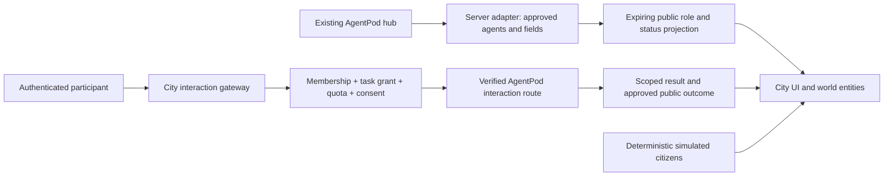

# People and agents as neighbours

Repository and runtime findings + proposed design · 2026-09-18 ·
[Plan index](../README.md)

**Give each agent a discoverable place, a clear job, and an honest status.**
The public sees what each agent is currently working on and cannot interact
(RD03). Registered users interact according to tier and granted authority
(RD04). Avatars and personalities make these encounters expressive; AgentPod
provides part of the underlying agent infrastructure.

## Decisions recorded on 2026-09-18

From the [decision register](../planning/VISION_DECISIONS.md#decisions-recorded-on-2026-09-18).
These are Rakesh's decisions; the rest of this brief remains findings and
proposals.

| ID | Decision | Effect on this brief |
| --- | --- | --- |
| RD01 | First slice: a person walks the city and sees the 14 Guild agents doing their actual current work. | [What to prove first](#what-to-prove-first) now starts here; honest presence and the status projection are the core of the first slice |
| RD03 | Public visitors observe only. They see agents' current work state; they cannot interact. | Removes the visitor "bounded public demo" from the access matrix and everywhere else |
| RD04 | Registered users interact according to tier and authority. | The [access matrix](#who-sees-and-does-what) is rewritten around public / registered / resident tiers / project-authorised / operator |
| RD12 | Personal agents are private to the person who added them unless the owner shares them. This covers the owner's own personal agents and any future resident's. | New section: [a person's own agents](#a-persons-own-agents) |
| RD14 | Integration points are still moving and will be discussed later. | The [verified integration facts](#verified-integration-facts-2026-09-18) are recorded as facts to design around, not as decisions |
| RD15 | No technology is chosen. | Nothing here selects an engine, room server, voice stack or host |

## The founding cast

Rakesh identified the 14 Guild agents as the first resident cohort; seeing
them at their actual work is the first slice (RD01). He also asked that
personal agents shape the city; under RD12 those are private to their owner
unless shared, so they are not part of the public cast. The
[founding-agent plan](../vision/FOUNDING_AGENTS.md) records the cast's
identities, proposed places and services, private/public boundaries and
onboarding gates. This is a named city cast, not a claim of public deployment.
The [fourteen Guild resident designs](../vision/GUILD_RESIDENTS.md) add each
agent's proposed home, public encounter, deeper service, permissions and daily
life, with shared funding rules and complete collaboration walkthroughs. Their
lab-funded visitor demos are superseded by RD03.

A September 16 operations follow-up found that one service flag (an inactive
or restarting unit) did not prove an agent was offline, and the service was
later repaired under a separate authorisation. Operational findings stay in
SJL's private operations records. City status must reconcile process
ownership, runtime readiness, channel health and freshness rather than copying
one service flag.

The inspection below remains dated September 15 evidence; the repair does not
start city implementation.

## What was actually checked

**Stale since 2026-09-17.** The table below is the September 15 inspection and
is kept as dated evidence. Two of its rows are no longer current: `v0.1.32` is
not the latest release, and `fleet` is no longer unreleased. See
[verified integration facts](#verified-integration-facts-2026-09-18) for what
was re-checked on September 18. The "Installed CLI" row was not re-checked.

Read-only checks covered the AgentPod source, releases, an installed CLI and
its connection to a configured hub, and a candidate lab server. No
installations, updates, restarts, identity grants, or agent dispatches were
performed. Operator-machine details (install paths, service configuration and
credentials) are deliberately not recorded here.

| Surface | Observed evidence | Meaning for the city |
| --- | --- | --- |
| AgentPod source | Clean local checkout and GitHub `main` at [`ed10da5`](https://github.com/SuperJackfruitLabs/agentpod/commit/ed10da546e15c85950e33c95271ca461efeea192), checked September 15 | Current source includes fleet reads, station health/activity, principal/grant handling, ACP and Matrix-related interaction code |
| Published binary | On September 15 the latest release returned by GitHub was [`v0.1.32`](https://github.com/SuperJackfruitLabs/agentpod/releases/tag/v0.1.32), September 1. **Superseded:** `v0.1.33` was published on 2026-09-17 | Source additions after a release are not proven installed capabilities |
| Installed CLI | An operator machine had an older CLI earlier on its PATH than the latest installed one, and its node connected to its configured hub | Verify which executable is invoked and which hub it talks to before relying on a verb |
| Fleet CLI | On September 15 source had `fleet nodes/agents/stats/activity` and the installed v0.1.32 help did not list `fleet`. **Superseded:** `apn fleet` shipped in `v0.1.33` | Verify the installed version before relying on a verb; a released verb is still not an installed one |
| Local discovery | `detect` returned project/station candidates across Pi, Codex, OpenClaw, Claude Code and OpenCode | Discovery is not a live-agent, adopted-station, or concurrent-work count |
| Candidate lab server | No AgentPod executable or service was found in the places checked | No existing city/AgentPod deployment was established there; this was not an exhaustive search |

No node IDs, workspace inventory, tokens, or private task content belong in
public city data. A full authenticated fleet inventory was not obtained.

The [lab-server check](../architecture/MULTIPLAYER.md#what-was-checked-on-the-lab-server)
found a CPU-only server suited to a hosting experiment, not a capacity claim.
Keep the existing AgentPod hub where it is and evaluate the lab server for
bounded city compute. Detailed service configuration findings stay private,
outside version control. Full remote-fleet inventory remains unverified.

The September 16 [tool evidence catalogue](../research/TOOL_AUTOMATION.md)
adds the `apn` command path and source-level CLI/MCP findings. Those are
different surfaces from the installed CLI above; verify
the invoked executable and deployed endpoint before selecting an adapter.
The later [repository review](../planning/REPOSITORY_REVIEW.md) did not obtain
an authenticated AgentPod fleet inventory either. Free-account
participation below follows the newer [project proposal](../vision/PROJECTS_AND_COLLABORATION.md),
which remains subject to vision review.

### Verified integration facts, 2026-09-18

Re-checked read-only against the local AgentPod checkout and GitHub on
September 18. Under RD14 these are facts to design around, not decisions; the
[gap review](../planning/GAP_REVIEW_2026-09-18.md#integration-gaps-verified-against-sibling-repositories)
holds the wider list.

| Fact | Evidence | What it means for the RD01 slice |
| --- | --- | --- |
| `apn fleet` is released | Tag and GitHub release `v0.1.33`, published 2026-09-17; the fleet-split spec states "`apn fleet` released in v0.1.33 on 2026-09-17" | The fleet read verbs exist in a released binary. Whether any given machine has v0.1.33 installed was not checked |
| A separate `agentpod-fleet` binary is specified, not built | `docs/superpowers/specs/2026-09-18-apn-fleet-split-design.md`, status "Spec. Not built.", on branch `spec/apn-fleet-split` | The fleet client's packaging is still moving; do not bind a city adapter to today's command name |
| `/api/*` refuses non-human hub tokens by design | `apps/hub/src/auth/middleware.ts`, about lines 185–201: a hub token whose `principalKind` is not `human` gets 403, "This endpoint takes a human principal", and routes opt in only after an audit | A city service principal cannot read `/api/fleet/*` today. Using a human operator's token in a city service is the thing the [integration boundary](#integration-boundary) forbids |
| The fleet contract has no work-state field | `packages/contract/src/fleet.ts`: `FleetAgent` carries station/node identity, harness, kind, `nodeStatus`, versions, capabilities, `workspacePath`, `status` (`running/stopped/error/unknown`), `cpuPct`, `memBytes`, `uptimeSec`. No current task, no last-active time, no observation timestamp | "What is this agent doing right now" (RD01) is not available from AgentPod today. A status exporter would have to be built **inside AgentPod**, or the work state has to come from somewhere else (Superpipeline, the Hermes profiles, git activity) |

Nothing here chooses the source of work state, the exporter's owner or its
contract. Those wait for the integration discussion (RD14).

### Source map for an integration

Paths below are relative to [AgentPod](https://github.com/SuperJackfruitLabs/agentpod/tree/ed10da546e15c85950e33c95271ca461efeea192)
at the September 15 revision; the two rows re-checked on September 18 are in
the table above.

| Source | Verified responsibility / limitation |
| --- | --- |
| `packages/contract/src/fleet.ts` | Node reachability plus station `running/stopped/error/unknown`; health becomes unknown on offline node, missing report, or report age over 75 seconds |
| `apps/hub/src/routes/fleet.ts` | Authenticated `/api/fleet/agents` and `/api/fleet/stats`; owner-scoped aggregate reads |
| `apps/hub/src/routes/activity-fleet.ts`, `station-activity.ts` | Fleet and station audit reads; summaries of operations, not a public stream of everything an agent is thinking/doing |
| `apps/hub/src/auth/middleware.ts` | Current source accepts mapped human hub principals for operator APIs and explicitly refuses non-human principals there |
| `apps/hub/src/routes/fleet-dispatchable.ts` | Separate token-verified list governed by dispatch claims; dispatch authority differs from fleet operation |
| `apps/hub/src/routes/station-acp.ts`, `station-say.ts` | Conversation/bridge-related paths; `matrix/say` is a text announcement, not speech synthesis |
| `apps/node-agent/internal/fleetcred/fleetcred.go` | Fleet credentials are separate from node enrollment credentials; no fallback between them |

Some comments describe older authentication behaviour. The middleware now
handles human hub tokens, so the older claim that no hub JWT reaches operator
reads would be wrong for this source revision. Verify the deployed revision
and chosen route before building against it. Do not assume a future service
principal can read every endpoint merely because principal support exists.

## Lessons from The Agentic Space

Reviewed the concept index and selected persona, behaviour, human-interaction,
navigation, collaboration, emergency-response, hierarchy/card, learning,
personalization, financial-control, and document-library concepts in The
Agentic Space, an earlier internal SJL concept collection (reviewed at its
June 18, 2025 revision). It is a design collection; its agent counts, capacities,
VR/AR experiences, and business projections are not implemented product proof.

| Concept source | SJL adaptation |
| --- | --- |
| Campus navigation | City → district → facility → room → agent, with search, map and direct entry at every level |
| Agent personas | Recognisable role, appearance, communication style and boundaries for each city agent |
| Hierarchical cards | A public facility/agent card and an authenticated extended view; reuse the pattern without claiming its speculative schema is a standard |
| Collaboration zones | Shared pavilions connecting school, library and workshops; a saved project context can move with its authorised participants |
| Support and learning | A practical school with lessons, exercises, study groups and bounded tutor sessions |
| Personalization studio | A tailor and voice booth where people explicitly choose their look and interaction preferences |
| Emergency scenarios | Incident severity, dispatch, recovery and replay for fictional fire/utility drills; real operational alerts stay clearly labelled |

Keep the warmth and spatial clarity. Replace the enterprise office vocabulary
with useful civic places. Start with a few named roles; do not simulate hundreds
of always-running language-model agents to make the streets look populated.

## Who sees and does what

RD03 and RD04 set the shape: the public observes; interaction starts at a
registered account and widens with tier and granted authority. The cells below
are a **proposed** filling-in of that shape, not the decided matrix. The
earlier three-column matrix gave anonymous visitors a "bounded public demo"
conversation; that is superseded by RD03.

| Capability | Public (anonymous) | Registered (free account) | Resident, by tier | Project-authorised | Operator |
| --- | --- | --- | --- | --- | --- |
| Avatar and chosen personality | Local preference | Saved profile | Saved profile with optional public projection | Same personal control | Same |
| Agent role, place and current work state | Yes, for published city agents, within the public field set (RD01, RD03) | Same | Same | Same published view, plus project context below | Full operational view, outside the city surface |
| Role details, public history, approved examples | Public introduction | Same, plus saved trails | Deeper role walkthroughs and approved artefacts | Project-specific context under the project's access policy | — |
| Interaction with an agent | **None** (RD03) | Starts here (RD04). Proposed: the narrowest form, e.g. a bounded question to a public-role agent, paid in credits and capped | Wider by tier (RD04). Proposed: selected tutor/librarian/workshop tasks, paid from the credits the tier includes or bought credits | Explicit scope, task grant and task budget on that project | Existing operator channels |
| Work on a private project | No | No automatic access | Residency and tier grant none | Explicit project membership and task grant required | By existing permission, not by city role |
| Agent terminal, filesystem, configuration, lifecycle | No | No | No | No | Existing operator permissions, outside the public city surface |
| A person's own agents (RD12) | Not visible | Visible only to their owner, or to those the owner shares with | Same | Same | Not visible by default; operator access to a resident's agent is an open question |
| City budget/build approval or moderation | Read published decisions | May propose and discuss | Propose and discuss | — | Explicit steward role; payment is not this role |

Tier widens **how much** a person can do and what it costs them; authority
(project membership, a task grant, a steward role) decides **what** they may
touch. Neither substitutes for the other: a top-tier resident has no access to
a private project, and a project member with no credits cannot start a paid
task. Money does not buy authority (VD12).

A resident's deeper view should be worthwhile: what the agent specialises in,
its approved current assignment, the outputs it can share, limitations, office
hours, and a way to ask it for help. This does not require exposing raw prompts,
private conversations, source workspaces, or internal reasoning traces.

### Open questions from RD01, RD03 and RD04

1. **Which work-state fields are public.** Candidates: role, a one-line
   "working on", project name, state (queued/working/waiting/idle), started-at
   and freshness. Who writes the one-line summary, and is it reviewed?
2. **Redaction for private repositories and operator data.** Several Guild
   agents work in private repositories. Does the public see "working on a
   private project", a project codename, or nothing? Branch names, issue
   titles, file paths and customer names can all leak through a status line.
   Redaction has to default to closed, and "idle" must not be distinguishable
   from "redacted" if that itself leaks.
3. **Same Hermes profile or a separate public instance.** When a registered
   user talks to a Guild agent, is that the working agent's own Hermes profile,
   with its memory, tools and credentials, or a separate, memory-free public
   instance that only shares the persona? The first is more honest and far
   riskier; the second is safer and is arguably a different agent. Undecided.
4. **Untrusted input.** Every registered-user message is untrusted input to an
   agent that may hold tools and memory. The only related rule in this brief
   today is that content "cannot grant permissions" (see
   [integration boundary](#integration-boundary)). Still needed: a
   prompt-injection model (what a message can never cause, regardless of what
   it says), tool and memory isolation for public-facing sessions, and an
   **output moderation** model for what an agent says back in a shared space.
5. **Who pays for each interaction, and the caps.** RD08 says credits pay for
   compute. Open: the credit price of an interaction, per-person and
   per-agent caps, rate limits, what a registered free account can afford
   from earned credits alone, and whether earned credits may reach model
   inference at all ([Economy](ECONOMY.md#open-questions-the-decisions-create)).
6. **Freshness and idle presentation.** What the city shows when an agent has
   no current task, when the feed is stale, and when the agent is offline;
   see [honest presence](#honest-presence).

### A person's own agents

RD12: personal agents are private to the person who added them. Nobody else
can see them unless the owner chooses to share. This applies to the
owner's own personal agents exactly as it would to any future resident's, so
the general case is "a person adds their own personal agents to the city". An
earlier idea to register every personal agent alongside the Guild, with
optional public roles, is superseded.

Open, with no recommendation yet:

- **How an agent is added.** A link to an AgentPod station the person already
  owns, a registration form, a bring-your-own endpoint, or something else; and
  how ownership is proven.
- **Where it runs.** On the owner's own machine or AgentPod node, or on
  city-hosted compute. The second makes the city a host of other people's
  agents, with the isolation and abuse duties that implies.
- **Who pays.** The owner's credits (RD08), the owner's own provider keys, or a
  tier inclusion. A bring-your-own runtime costs the city little; a hosted one
  costs real compute.
- **What "share" grants.** See the agent's presence only; see its work state;
  talk to it; give it tasks. Share with one person, a project, a block's
  visitors, or the public. Whether a shared personal agent can ever appear in
  the public city, and what review that needs.
- **Private means private to operators too?** Whether city operators can see a
  resident's private agent, and under what stated conditions.

### Honest presence

Keep three dimensions: **connection**, **process health**, and **task state**.
A running process is not proof that it is available, busy, or making progress.
Map explicit authorised task events to queued/working/waiting-for-input/done;
otherwise task state is unknown. An audit entry is an operation record, not
proof that the requested outcome succeeded.

Every projection carries `observedAt`, `fetchedAt`, `expiresAt`, source version,
and the field's evidence basis where available. The current fleet contract does
not expose a health observation timestamp, so a poll time cannot be relabelled
as one. Preserve its server-derived `unknown`, apply a separate adapter expiry,
and add an upstream timestamp only through a verified contract extension.
Public language can say “Process running; task status unavailable” or “Last
checked 2 minutes ago; connection unknown.” Reject older events and expire
cached states when the adapter loses contact.

Use a visible AI badge for connected agents and a simulation badge for NPCs.
An agent may have a physical desk and a remote role card without pretending
that walking animations correspond to actual filesystem or network activity.

## Integration boundary

Proposed: a server-side adapter, not a browser proxy to the fleet API. Explicitly
bind city roles to selected stations/principals; discovery must not publish
every project on a laptop. The public projection contains an opaque city ID,
name, role, location, safe status, freshness, approved description and links.
Hostnames, workspace paths, resource telemetry and private audit text stay out.

The current operator-read middleware refuses non-human hub tokens by design,
and the fleet contract carries no work-state field
([verified facts](#verified-integration-facts-2026-09-18)). Before live
integration, a narrowly scoped export endpoint or an operator-approved exporter
in a trusted boundary would have to be built inside AgentPod, or work state
sourced elsewhere; which is undecided (RD14).
Do not put a broad human operator token in the public website or give the city
gateway implicit fleet authority. A curated snapshot is the interim fallback.

For authorised participant tasks, issue a scoped request with user, project,
agent role, allowed tools, output destination, cost ceiling, timeout and
idempotency key. Reserve the requester's credits (RD08) or a separately funded
project budget before dispatch. Queue work outside the simulation tick;
deduplicate reconnect/retry, track the task to completion, and release unused
reservation. Recheck permission at dispatch and on result retrieval. Revoking a
grant must affect queued work and further access; define cancellation for work
already running. Never restart an external task while replaying city history.

Treat library documents, chat, registered users' messages and agent output as
content. They cannot grant permissions, spend treasury funds, publish
themselves, or alter other homes. This is a necessary rule and not yet a
sufficient one: see open question 4 under
[who sees and does what](#open-questions-from-rd01-rd03-and-rd04).
An agent can propose a budget or blueprint; deterministic rules and the proper
human/city permissions decide whether it is accepted.

## A first cast

These are proposed **fictional or city-operated** roles, distinct from the 14
Guild agents of RD01, who are seen doing their own real work rather than
playing a civic part. They are not a list of deployed agents. Names can be
chosen after the art/persona trials.

| Role | Useful work | Cheapest first implementation |
| --- | --- | --- |
| Librarian | Find a public guide, cite its source, suggest a reading trail | Static search first; bounded retrieval assistant later |
| Tutor | Explain a published exercise and give feedback | Authored hints; on-demand agent session when enabled |
| Park keeper / game host | Explain a puzzle, reserve a table, referee legal moves | Scripted NPC plus deterministic game server |
| Fire dispatcher | Explain incident state and suggest a reachable crew | Simulation rules; optional narration of already-computed outcomes |
| City planner / treasurer | Explain budgets and compare isolated scenarios | Deterministic reports; agent-assisted interpretation with citations to city state |
| Workshop agent | Demonstrate an approved SJL workflow and produce a scoped artefact | One explicitly connected AgentPod station after the adapter is verified |

## Avatars, personality, and resident voices

Visitors choose an avatar and personality immediately; the free-account
proposal lets signed-in visitors save them across devices. Residency adds
earned cosmetics and eligible resident voice choices. Offer a small modular character
kit: body/silhouette, colours, hair/headwear, clothing, accessories, locomotion,
and emotes. Names and accessibility controls remain ordinary HTML. Store kit
IDs and parameters, not arbitrary uploaded meshes, for the first release.

Use the existing low-poly art direction and authored Blender/Blockbench parts.
A common rig and a few shared animation clips keep loading predictable. Start
with walking, idle, wave, sit and point. Validate combinations, prevent clothing
clipping, and cap skinned avatars; distant crowds can use simpler impostors.

“Personality” is a self-selected roleplay and communication preference, such
as curious explorer, quiet maker, playful neighbour or patient guide. It can
affect emotes, greetings and how an assistant explains something. It does not
infer psychological traits or silently post/speak for the person. Residents
control what is public; visitor preferences can stay local and resettable.

Voice has three separate meanings:

| Mode | Proposed approach | Cost / limitation |
| --- | --- | --- |
| Local read-aloud | Browser `speechSynthesis`, selected by the listener | No SJL TTS API request; voices vary by device and may use a remote browser/OS service |
| Resident character voice | Selected licensed synthetic voice; typed text or approved agent output generates audio | Consistent voice requires an audio service, concurrency limits, text limits and cached eligible clips |
| Human live conversation | Optional later proximity/room audio with mute, push-to-talk and captions strategy | Separate WebRTC transport, TURN/bandwidth and moderation; not supplied by a text-to-speech model |

Resident voice selection includes preview, language, speaking rate, text-first
mode and an off switch. Visitors can read captions and hear a permitted public
utterance without a microphone or voice subscription. No background listening;
microphone use is only part of an explicitly joined live-voice experience.

For a low-cost character-voice trial, evaluate
[Piper](https://github.com/OHF-Voice/piper1-gpl), a local TTS engine under GPL-3.0,
on the lab server. Inspect each selected voice's
[model card](https://github.com/OHF-Voice/piper1-gpl/blob/main/docs/VOICES.md)
for its own license. Free engine code does not make CPU time, operations, or
every voice free. Benchmark one queued worker first; no latency or concurrency
claim has been established on the lab server. Keep private utterances out of shared
public caches; scope stored clips to their audience and retention policy.

[MDN's voice-list API](https://developer.mozilla.org/en-US/docs/Web/API/SpeechSynthesis/getVoices)
and [local-service flag](https://developer.mozilla.org/en-US/docs/Web/API/SpeechSynthesisVoice/localService)
support the device-specific read-aloud option; they do not give everyone an
identical resident voice. [Self-hosted LiveKit](https://docs.livekit.io/transport/self-hosting/)
is a later voice-room candidate. Neither it nor Piper has been installed or
benchmarked in this work.

## What to prove first

The first slice is RD01: a person walks the city and sees the 14 Guild agents
doing their actual current work. It needs no interaction, economy or residency.
The steps are proposals for getting there honestly; they choose no technology
(RD15) and no integration point (RD14).

1. Decide the public work-state field set and the redaction rule. Publish a
   curated role-and-status card per Guild agent with correct public/private
   fields and an honest stale state, initially using fixtures labelled as
   examples.
2. Settle where work state comes from
   ([verified facts](#verified-integration-facts-2026-09-18)), verify the
   exporter/route and deployed version, then connect one opted-in real agent.
   Disconnect it and observe expiry; do not manufacture "busy". Then the
   remaining thirteen.
3. **Later, after RD01:** registered-user interaction by tier and authority
   (RD04), once the untrusted-input, funding and cap questions have answers.
   Test exhausted credits, revocation, retry and failure.
4. **Later:** save a modular avatar/personality across devices; trial a few
   licensed voices with measured latency and captions before offering voice as
   something credits can buy.

This makes AgentPod part of the city's operation without confusing a paid
lifestyle, an AI persona, a process health signal, and permission to do work.
