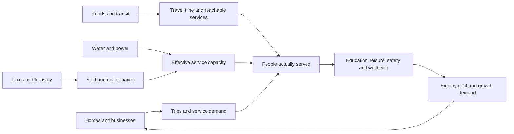

# A city that works

Proposed city design · 2026-09-18 · [Plan index](../README.md)

**Public buildings should do things, consume resources, and change life around
them.** A library is somewhere to read; it also serves a neighbourhood. A school
hosts real learning activities while the simulation models education, capacity,
and access. A fire station needs funding, water, a crew, and a route to a fire.

Rakesh has expanded the target to a proper city simulation inspired by
Cities: Skylines, with public facilities, taxes/funding, visitors, residents,
and agents. This supersedes the earlier target of connecting only small
teaching toys. We can deliver the larger simulation through complete, small
districts without making the whole city a prerequisite for a useful website.

**First slice (RD01):** a person walks the city and sees the 14 Guild agents
doing their actual current work. The civic simulation in this brief is not part
of that slice; it is the larger city the slice grows into. Decisions cited by
RD ID are in the [decision register](../planning/VISION_DECISIONS.md#decisions-recorded-on-2026-09-18);
everything else here is a proposal.

The [economy design](ECONOMY.md) owns player earnings, taxes, utility bills,
service purchases, business mechanics and the cash/JC payment matrix.
[Razorpay](../integrations/payments/RAZORPAY.md) is selected for real payments. This brief owns civic
services and their simulated consequences.

Try the [city systems lab](../../prototypes/city-lab.html) for an illustrative budget, access,
and road-response experiment. It is a local planning model, not the city engine.

The [city plan and facility catalogue](../vision/CITY_PLAN.md) now maps 23
facilities to districts, operators, actual activities, capacity units, funding
and closure. The [operating model](../vision/OPERATING_MODEL.md) and
[community charter](../vision/COMMUNITY_CHARTER.md) develop how fictional civic
systems coexist with actual service commitments and community authority.

## Three populations in one place

| Population | What is real | What the city controls |
| --- | --- | --- |
| Human visitors and residents | People exploring, learning, playing, and contributing | Movement rules, permissions, bookings, homes, and chosen appearance |
| Connected AI agents | Explicitly connected AgentPod agents with observed state and permitted work | Their public representation, location, approved role card, and interaction gateway |
| Simulated citizens and staff | Fictional households, shopkeepers, crews, and commuters | Needs, schedules, routes, wages, demand, and service consumption |

Keep these counts separate. Forty simulated households are not forty residents;
a decorative librarian is not a connected AI agent. Human residents can leave
without being punished for neglecting a daily chore. City demand can continue
through simulated households while personal homes and earned decorations stay
protected. The [agent and identity brief](AGENT_CITY.md) defines the distinctions.

## Facilities: activities and consequences

These are proposed access policies, not current paid offerings. Credits pay
for facility access (RD08), and a resident tier includes credits (RD07). Where
the table says “resident allowance” or “allowance”, read it as the credits a
tier includes, under the one-time/recurring rule proposed in
[Residency](RESIDENCY.md#what-a-tier-includes-and-for-how-long); the lifestyle
tier alone does not promise unlimited capacity. Facilities can receive public
funding, credit fees, optional activity fees, or named facility funding.

| Facility | What a person can do | Simulation dependencies and effects | Proposed access and funding |
| --- | --- | --- | --- |
| Jackfruit Park | Walk, picnic, play chess/carrom, join a scavenger trail, build a community garden | Path access, gardeners, water, maintenance; recreation, shade, attractiveness | Public paths and casual games free; civic budget or park sponsor |
| Recreation Centre | Board games, cooperative puzzles, building jams, club rooms | Seats, opening hours, staff, power; leisure capacity and social activity | Open tables free; reserved/private rooms use resident allowance or a disclosed fee |
| Stadium & Festival Ground | Watch matches, enter cart time trials, hold tournaments and maker festivals | Event bookings, transport surge, power, cleanup, crowd capacity, safety coverage | Public spectator events plus explicitly ticketed events; a funder can cover admission. Paid entry combined with a reward is not offered until reviewed ([Economy](ECONOMY.md#open-questions-the-decisions-create)) |
| SuperMD Library | Read public notes and licensed books, search a catalogue, join a reading circle, publish a reviewed collection | Reading seats, librarians, power, maintenance; knowledge access and education support | Public catalogue and reading free; free signed-in saved shelves; study rooms and bounded research help under their own offers |
| Jackfruit School | Take practical courses, complete exercises, attend a class, teach a workshop | Teachers, seats, water/power, travel access; simulated education improves over time | Open lessons free; tutor sessions and class bookings use allowances, scholarships, or an explicit fee |
| Police Station / Community Safety | Lost-and-found, city rules, traffic puzzles, fictional patrol/dispatch missions | Patrol coverage, travel time, staff and incident queues; simulated safety and traffic clearing | Civic funding; human reporting and basic safety available to everyone |
| Fire & Rescue Station | Cooperative fire drills, prevention challenges, response replays | Water, crews, equipment, reachable roads, response time; containment and recovery | Civic funding or station sponsorship; emergency response never checks a person's tier |
| Clinic & Wellness Garden | Rest spaces and a fictional health-service simulation | Capacity, sanitation, pollution, travel time; simulated household wellbeing | Public basic access; no real diagnosis or medical-service claim |
| Water, Power & Recycling Works | Inspect networks, balance supply, repair a cooperative outage scenario | Supply/demand, connectivity, storage, maintenance and waste accumulation | Virtual utility charges and civic budget; infrastructure sponsorship possible |
| Transit Depot & Harbour | Ride a tram/ferry, plan routes, run a logistics puzzle | Routes, frequency, vehicle capacity, operating cost; access, traffic and delivery time | Walk/teleport remain available; virtual fares and sponsored routes in simulation |
| Town Hall & Treasury | Inspect service coverage, compare budgets, propose improvements | Budget balance, reserve, maintenance backlog, development approvals | Public summaries; signed-in participant proposals; scoped steward decisions |
| Agent Observatory & Workshop | See the Guild agents' current work state (RD01), inspect a role; registered users interact by tier and authority (RD04) | An actual integration, freshness, task grants, queues and credits for compute | Public work-state view with no interaction (RD03); registered and resident interaction by tier; separately granted project collaboration |

The library starts with SJL's public writing, permitted community submissions,
and links to external works. Private notes and copyrighted books do not become
public merely because a librarian can access them. School progress can unlock
game cosmetics; simulation education scores and paid tiers are not evidence of
a person's real competence.

Games need their own rules and authority. Begin with turn-based board/puzzle
rooms: deterministic moves, turn timers, reconnect, spectating, and a finished
match record. Stadium racing comes later, with a separate movement/latency
budget. Match rewards may be decorations; a higher tier or a sponsorship should
not alter the rules or scores of a competitive match. A match that charges
entry and pays a credit reward is the highest-risk pattern once credits are
purchasable (RD07); see [Economy](ECONOMY.md#open-questions-the-decisions-create).

## How funding could work

**Proposed default: hybrid funding.** Rakesh requested real-money and game-credit
mechanics and selected Razorpay. Real purchases support delivered benefits and
operating costs; JC taxes and fees fund the simulated city. Credits can be
bought with real money (RD07) and buy facility access, compute and storage
(RD08), so the two ledgers below are no longer sealed from each other: a
purchased credit enters the city economy, and a credit spent on compute leaves
it as real cost. Prices and the real recurring civic-fee model remain open. See
the authoritative [payment matrix and tax rules](ECONOMY.md); no prices or
charges are activated.

| Ledger | Unit and entries | What it can affect |
| --- | --- | --- |
| Real support | Provider currency and integer minor units; verified receipts, fees, refunds, operating expenses, approved allocations | Residency/allowance grants and the actual budget available to operate a facility |
| City treasury | Integer game credits; virtual household/business taxes, virtual fees, explicit scenario grants, construction and upkeep | Simulated staffing, service capacity, maintenance, projects, and reserves |
| Contribution record | Reviewed work, evidence, reviewer, rule version, milestone and corrections | Earned unlocks, proposed residency qualification, eligible community projects |

There is no cash redemption of credits (proposal). Credit purchases are decided
(RD07); the earlier wording here, "direct credit-pack sales remain an open
alternative", is superseded. A sponsorship (RD10: funding the lab) does not
automatically mint credits.
If a real campaign funds a new park, a reviewed milestone can unlock its
construction or a labelled game grant. It must not silently mint currency each
time a payment webhook is retried. Public funding plaques disclose the agreed
allocation and period, with donor recognition only by choice. Exact accounting
and donor details stay in private records.

A subscription tier or sponsorship ending stops its recurring credit grant, as
described in [Residency](RESIDENCY.md). It should not abruptly delete a shared
park, seize an earned house, or strand public visitors. Give sponsored services
a reserve, a maintenance owner, and a published wind-down plan. No surprise
real-world municipal bill emerges from changing a game slider.

### The simulation economy

Start with households, businesses, and the treasury. Distinguish transfers from explicit currency issuance and retirement rather
than hiding an infinite subsidy. Taxes, domestic purchases and wages transfer
credits between accounts; they are not currency sinks. A starter grant is visible.
Businesses earn from simulated trade; households earn simulated wages; both
have expenses and can generate tax revenue. Real humans do not need to grind
for wages to keep their account or paid home.

At each fiscal boundary, using integer credits:

```text
tax revenue = sum(taxable household income × household rate)
            + sum(taxable business profit × business rate)
next reserve = current reserve + taxes + virtual fees + explicit grants
             - settled payroll - upkeep - imports - construction
```

Round per published rules and preserve the remainder deterministically. Income,
education, employment, prices, and demand evolve on different cadences. Show
the breakdown and explain why a household, business, or service is struggling.
Use a bounded early tax model; later introduce sectors, rent, supply chains,
tourism, and district policies. Prices and thresholds remain playtest variables.

**Open problem — NPC taxes mint human-spendable credits.** In the formula
above, household income and business profit are produced by the simulation, so
the tax on them is new money arriving in the treasury, whatever the ledger
calls it. That same treasury reserves the rewards paid to human players
([Economy](ECONOMY.md#a-residents-economic-loop)), and NPC fiscal boundaries
follow the simulation clock, which can be accelerated (below). Human bills are
protected from a speed-up; treasury income is not. Under RD08 those credits can
buy compute and storage, so the supply of something with a real cost would
depend on how fast the simulation runs. Options to weigh, none chosen: NPC tax
funds fictional services only; human-payable rewards come from a separately
budgeted issuance account capped per wall-clock period; treasury-funded
earnings cannot reach real compute. See
[Economy's open questions](ECONOMY.md#open-questions-the-decisions-create) and
the [economy model](../research/ECONOMY_MODEL.md).

Authorise construction against available funds and reserve them atomically.
When the treasury cannot afford everything, protect the chosen minimum utility
and emergency budgets, then reduce discretionary service hours/capacity by a
visible rule. Carry maintenance backlog forward. Low funding can produce a
shorter timetable or a queue; it is not a concealed account-level paywall.

## The causal simulation

The design borrows the idea of consequential service spending from the
[Economy 2.0 developer diary](https://www.paradoxinteractive.com/zh-CN/games/cities-skylines-ii/news/dev-diary-economy-part-one)
and network-based route costs from the
[Traffic AI developer diary](https://www.paradoxinteractive.com/games/cities-skylines-ii/features/traffic-ai).
Our rules and assets will be our own. These references establish inspiration,
not feature parity or measured browser capacity.



For each service, compute:

1. **Availability:** built, open, staffed, maintained, and connected to its
   required utilities. A powered facade alone does not establish availability.
2. **Reach:** routes through a road/path/transit graph. A circular coverage
   radius can be a preview, but disconnected homes do not receive service.
3. **Capacity:** seats/crews × staffing × condition × utility availability.
   Assign demand once, with distance and queue rules; two libraries cannot both
   count the same household as newly served.
4. **Outcome:** fulfilled visits, wait time, learning progress, incident
   response, and changes to simulated wellbeing. Effects have understandable
   delays rather than instant universal happiness.

Human room occupancy, AI task concurrency, and fictional service capacity are
three different counters. A stadium may draw 1,000 simulated fans without
supporting 1,000 simultaneous players or AI sessions.

Fire example: an incident appears at a simulated workshop; dispatch chooses an
available crew with a usable route; water and arrival time affect containment.
A bridge closure changes the route and may make another station preferable.
The incident ledger records detection, assignment, travel, containment, repair,
and the explanation. Use seeded drills first. Default public-city incidents
affect simulation condition and temporary availability, not the stored creative
contents of human homes. More destructive scenarios belong in opt-in worlds.

Police simulation handles fictional incidents and traffic. Actual harassment
reports go to a separate human moderation workflow. An NPC's suspicion score
never bans a real person. An AgentPod connection failure is displayed as a
service status issue, not invented evidence of a city fire or a lab emergency.

## Technical shape

Proposed: a headless simulation core that accepts ordered commands and emits
state changes. Browser and native clients render the result; the website also
offers usable HTML controls. The lab server could run the shared authority; it does
not draw the player's 3D scene. Agent models are not involved in per-tick
traffic, tax, or fire rules. No engine, room server, database or host is chosen
(RD15); [platform choices](../architecture/PLATFORMS.md) compares candidates
and describes a shared contract across clients.

| System | Proposed starting cadence / representation |
| --- | --- |
| Avatar and vehicle presence | Around 10 Hz room updates, interpolated by clients; independently benchmarked |
| Shared simulation | Fixed 1-second ticks; integer simulation clock and seeded random events |
| Service allocation and routes | Recompute on topology/capacity changes; bounded queue, cached routes by graph revision |
| NPC economy and household progression | Scheduled fiscal/education boundaries derived from simulation ticks, not render frames |
| Human JC accounting | Published UTC civic periods and accepted settlement events under OP05; independent of accelerated NPC time |
| Distant city districts | Aggregate cohorts, supply and demand; detailed entities only where useful |
| Agent work | Asynchronous events and jobs outside the tick; deterministic commands only after validation |

The proposed seven-day human accounting period belongs to
[OP05](../vision/OPERATING_MODEL.md#op05--a-predictable-fiscal-policy). Real
subscriptions use their provider billing periods. A fast NPC day or a prototype
“Advance one day” control changes neither human accounting nor real billing.

Clock speed is a world rule. Personal sandboxes can pause or accelerate; a
resident cannot accelerate the public city's taxes. A server restart restores
the snapshot and accepted event log. Bound catch-up after downtime and disclose
the pause; do not charge real money or execute agent tasks during replay.

### Open question: three clocks and the returning player

Three clocks run at once: the 1-second simulation tick (with faster NPC days),
the proposed seven-day human accounting period, and each provider's billing
period. The rules above say what each clock may **not** do to the others. They
do not yet say what a person experiences. Open:

- **Does the public city advance with nobody online?** If it does, services
  can run out of money and close while no one is there to respond (the
  [reading garden](scenarios/READING_GARDEN.md#known-limitation-no-source-of-new-money)
  closes after 35 periods). If it pauses, "persistent world" means less, and
  time zones decide who sees change. A middle option is to advance only
  aggregates, or only while at least one person is present in a district.
- **What does a returning player see?** A summary of what changed since their
  last visit, in which clock's units; whether anything they own or steward can
  have degraded; and whether any decision was taken in their absence that they
  would have had a say in.
- **Which clock does the treasury follow?** See the NPC-tax problem
  [above](#the-simulation-economy): if treasury income follows simulation time
  and human rewards follow wall time, the two drift apart.
- **What does a global audience (RD11) do to the "day"?** A UTC boundary is
  someone's 3 a.m.; events and fiscal closes favour some time zones.

Key records: `District`, `RoadEdge`, `UtilityConnection`, `HouseholdCohort`,
`Business`, `Facility`, `ServiceAllocation`, `BudgetPolicy`, `TreasuryEntry`,
`Incident`, `Booking`, and `SimulationSnapshot`. Include stable IDs, schema/rule
versions, simulation tick, and an owning authority. A facility definition also
has its readable route, opening policy, capacity units, access rule, operating
costs, dependencies, agent bindings, and reviewed content references.

Start with one city authority owning economy, topology, and service dispatch.
Activity rooms own match state and avatar presence. They request durable
reservations from the shared [booking authority](../architecture/CITY_SYSTEMS.md);
they own neither independent seat inventories nor copies of the treasury. Commands carry an ID and expected revision; accepted commands,
reservations, and new revisions commit together. Later district sharding needs
explicit resource reservations and handoff; merely creating one room per
district does not solve cross-district accounting.

## Unusual features worth experimenting with

- **The monsoon rehearsal:** residents redesign drains and bridges, then watch
  a seeded storm test the plan. A replay explains each failure and recovery.
- **Sponsor a service day:** a reviewed grant opens a normally reserved school
  session or tournament to everyone; its plaque shows the funded period.
- **The reading orchard:** a completed reading trail grows a personal tree;
  a reviewed public collection becomes a grove with source links.
- **Budget night:** residents compare two proposed budgets in isolated forks,
  walk through the predicted consequences, and submit one to a steward.
- **A fire brigade drill:** one player dispatches, another opens an alternate
  route, and another restores water. The result comes from the simulation.
- **A stadium of ideas:** teams build solutions to the same transport or energy
  challenge; deterministic replays explain scores, with spectators commenting.
- **A working night shift:** an opted-in agent has a visible desk lamp and role
  board. Published outcomes arrive at the library; state goes stale honestly
  when the feed fails. Decorative lights remain distinct from work status.
- **A city memory museum:** inspect a dated city snapshot and the decisions
  that changed it. Replaying history never repeats payments or agent actions.

## First complete district and acceptance evidence

**This is a later candidate, not the first slice.** RD01 defines the first
slice as observing the Guild at work. The seven-facility district below is one
of several candidates for what follows, alongside the
[economy loop](ECONOMY.md#more-mechanics-to-grow-into) and the
[reading garden](scenarios/READING_GARDEN.md); the order is undecided.

Build homes, one connected street network, park, library, school, water/power,
and a fire station. Include one real reading activity and the agent work-state
view from RD01. Use a treasury, limited capacity, and a seeded fire drill. Recreation,
police, stadium events, and deeper supply chains extend the same contracts.

Verify that a disconnected school loses reach; more funding cannot fix a
missing route; an unavailable pump affects fire response; overspending cannot
double-spend the reserve; insufficient capacity creates explainable queues;
replay restores the same simulation; and a visitor can understand all of this
through the map and HTML panels. Include two-client budget/booking races and
restart recovery. Performance targets remain targets until measured.

See [the roadmap](../planning/ROADMAP.md) for implementation tickets and release gates.
