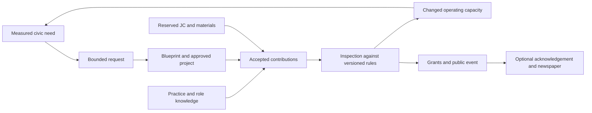

# Gameplay beyond earning and spending

Researched design proposal · 2026-09-18 · [Plan index](../README.md)

**Notice a need → choose a role → cooperate → change the place → see the result.**
The economic system supports this loop; earning credits is not the only reason
to play. The candidate entry point for this loop is a school reading garden
built through small, useful contributions, with an observable effect on civic
life. It is **not the first slice**: RD01 in the
[decision register](../planning/VISION_DECISIONS.md#decisions-recorded-on-2026-09-18)
makes that walking the city and seeing the 14 Guild agents at their actual
work. Comments, messages and assemblies are a critical part of the experience
(RD05) and are treated here as core, not deferred.

The [research record](../research/GAMEPLAY_MECHANICS.md) separates referenced
game features from our adaptations and records source dates/limits. The GM
identifiers below are design IDs, not implemented features. Economy, residency,
civic simulation and AgentPod permissions remain owned by their existing briefs.

All thirteen larger directions are also developed in [World systems](WORLD_SYSTEMS.md).
The first-test descriptions below are experimental entry points, not the full
scope or a decision to omit government, expeditions or other larger mechanics.

## Player sessions and progression

| Session | A complete activity | Persistent result |
| --- | --- | --- |
| A brief visit | Inspect a request, compare two layouts, or complete a practice task | A discovery or saved design; no account required for local practice |
| About ten minutes, as a design target | Contribute one accepted project milestone | Saved contribution, optional funded JC reward and visible work |
| A longer shared session | Design, supply and open a community facility | A completed project and changed service capacity |
| Return another day | Resume a handoff or see the consequences | Event summary and an intact home; no missed-login penalty |

Keep role proficiency, recipe knowledge, project contributions and paid
lifestyle entitlements separate. The same action can produce clearly named
outcomes, but no unlimited reward multiplier. Players can decline public
recognition. A simulated citizen's needs must not become a real person's
mandatory hunger, sleep or daily maintenance meter.

## GM01 — Professions and apprenticeships

**Play:** try gardener, designer, courier, repairer, librarian or event host.
Practice one real interaction—route a delivery, lay out seats, diagnose a pump—
then apply it on a shared project. Switch roles; one person can learn enough
roles to finish a small solo scenario. Inspiration: S01/S07 in the research.

**Rules:** accept authored outcome checks, not time spent or repeated clicks.
Proficiency unlocks recipes and expressive options first. NPC backup can fill
an unclaimed role through an explicit project choice; it does not pretend a
human or connected agent did the work. More sponsors do not mean more skill.

**Implementation:** `RoleDefinition`, versioned `PracticeChallenge`,
`ProficiencyGrant`, prerequisites and evidence IDs. Separate a practice success
from an accepted public contribution. Validate actions server-side online;
client practice grants cannot be imported into the shared ledger.

**Smallest test:** designer and gardener roles with one challenge each; verify
switching, duplicate completion and newcomer access. Observe whether choosing
a role feels useful rather than like a permanent commitment.

## GM02 — Cooperative construction and handoff

**Play:** choose a need, preview a blueprint, supply materials, assemble and
inspect it. Leave a useful checkpoint for someone else to continue. This
extends the shared placement prototype with a project, not another freeform
editor. Inspiration: S01/S08.

**Rules:** post requirements, reward pool, cancellation policy and eligible
contributors before work begins. Reserve inventory and funds. Give a worker
permission for the relevant milestone only; joining a public project does not
grant access to its owner's other plots. Accept a distinct result once.

**Implementation:** project state machine, milestone dependency graph, leased
claims, material escrow, accepted contributions, inspection result and atomic
reward references. Lease expiry releases an abandoned claim while preserving
accepted work. Stale commands cannot overwrite a newly approved blueprint.

**Open cases — griefing in shared public works.** The rules above handle
abandonment only. Still undesigned, and each needs a rule before a public
project opens to strangers:

- *Claim-squatting:* taking milestone claims with no intention of doing them,
  repeatedly, or across many free accounts, so a project never progresses.
  Lease expiry slows this; it does not stop a rotating squatter.
- *Hostile blueprint edits:* a contributor with edit rights degrades the
  design (removes the accessible path, moves seats into shade) between
  approval and build, or proposes a change order that quietly does so.
- *Sabotage during build or after opening:* misplacing materials, consuming
  the kit on a wrong placement, or "repairing" a working connection into a
  broken one. Consumed materials are not refundable by the current rule, so
  sabotage can cost the project real credits.
- *Reversal and attribution:* whether accepted work can be rolled back, who
  pays for the redo, and how a saboteur's contribution record and rewards are
  corrected without punishing honest mistakes.

**Smallest test:** the [reading garden](scenarios/READING_GARDEN.md), including
an owner offline, another worker resuming, duplicate submission and cancellation.
Use the [economy ledger](ECONOMY.md) for funded rewards and refunds.

## GM03 — Neighbourhood character

**Play:** place a noisy workshop near delivery roads, shade a walking route,
or keep an evening reading courtyard quiet. View separate overlays for access,
noise, shade and activities. Inspiration: S03/S04.

**Rules:** expose causes and tradeoffs instead of one universal desirability
score. A district can be lively or quiet without one being morally superior.
A paid architectural style is not automatically a more effective building.

**Implementation:** bounded spatial fields and route-cost queries, cached by
layout revision; authored schedules for venues. Compute gameplay shade with a
simple declared geometry model, independent of graphical shadow quality.

**Smallest test:** two garden layouts trade walking distance against afternoon
shade. Show both effects through text and overlays; test on low-quality render
settings so appearance cannot change simulation outcomes.

## GM04 — NPC needs, routines and requests

**Play:** follow a fictional teacher's request for usable afternoon reading
space. Inspect the demand, opening hours, route and available capacity; solve
the cause. Inspiration: S03.

**Rules:** generate a bounded request only while an evidenced need persists.
Use thresholds, cooldowns and one active request per need/location to avoid
quest spam. Merge duplicate needs, close solved requests and explain blocked
ones. NPCs do not have infinite purchasing power or reward budgets.

**Implementation:** `NeedSample`, schedule, request template, evidence window,
expiry and fulfillment predicate. Use cohort demand for most citizens and a
few named representatives. Recompute on meaningful state changes rather than
asking a language model to choose every citizen's action each tick.

**Smallest test:** one unmet reading need closes when funded, connected,
operating capacity is sufficient; adding a decorative bench alone fails.

## GM05 — Relationships and community memory

**Play:** a librarian recalls the garden you helped build; a friend sends an
invitation; a project plaque shows contributors who opted in. Inspiration: S05;
S10 is an optional research direction, not a requirement for this interaction.

**Rules:** store named shared events, not inferred psychological profiles.
Human friendship is consent-based; NPC familiarity can be a separate authored
state. No public reputation score decides a person's worth or access to safety.
Remembering an event does not require remembering every chat message.

**Implementation:** bounded event references, visibility/consent, NPC dialogue
conditions and correction/deletion policies. A private contribution can affect
entitlement without exposing its author. Generated wording cannot fabricate a
relationship, agreement or completed task.

**Smallest test:** two deterministic acknowledgement variants tied to accepted
project events; verify opt-out and correction. Do players remember the place?

**Comments, messages and assemblies are core (RD05).** The invitation and the
plaque above are the least of it: people comment on a blueprint, message a
collaborator about a handoff, and gather for an opening. Earlier planning
treated public chat as a separate later burden; RD05 supersedes that. What
this opens rather than settles: moderation capacity for a solo operator,
reporting and blocking, retention, the age scope of who may write in public,
and the legal duties of hosting user text in every market (RD11). Those are
owned by the [community charter](../vision/COMMUNITY_CHARTER.md); the mechanic
briefs assume text communication exists from the first shared session.

## GM06 — Ecology and resource cycles

**Play:** collect rain, route irrigation, compost garden waste and choose plants
for the available soil and shade. Later, district production affects pollution
and maintenance demand. Inspiration: S06.

**Rules:** a season changes the problem, not the resident's obligation to log
in. Start with bounded scenario weather and restorative failures. A drought
can reduce simulated garden use without deleting a resident's saved creations.
Paid cosmetics cannot bypass water requirements.

**Implementation:** integer/fixed-point water and material budgets, declared
inflow/outflow, bounded soil-moisture cells and seeded weather. Model runoff,
storage and evaporation explicitly. GPU water effects are presentation only.
Avoid full 3D fluids until the simpler model demonstrates a missing capability.

**Smallest test:** one tank, irrigation connection and dry spell; verify water
conservation, disconnected supply and explainable recovery.

## GM07 — Discovery and expeditions

**Play:** follow a signal to a disused tram shed, survey an orchard or retrieve
an old irrigation diagram. A clue teaches a tool or reveals a new design
option. Inspiration: S07.

**Rules:** knowledge and curiosity lead the trip. Avoid endless identical loot
runs and mandatory paid travel. Put risky or destructive expeditions in
explicit scenario instances; a lost session cannot erase someone's home.
Provide contextual hints and an accessible alternative to timing-based traversal.

**Implementation:** authored clue graph, discovered facts, checkpoints,
instance seed and reward-once identity. Returning to the city imports only
validated discoveries/rewards, never arbitrary offline inventory.

**Smallest test:** one short route with two optional observations and one
practical use for the recovered diagram. Measure confusion and hint use.

## GM08 — Research and invention

**Play:** compare two irrigation layouts or shade structures, run a controlled
trial, record the result and unlock a reusable design. Inspiration: S01/S08;
SJL's experiment mechanics are our own proposed adaptation.

**Rules:** define the question, changed variable, cost and success condition.
Results apply to the named simulation/rule version, not real-world scientific
claims. Shared research can unlock public knowledge without giving everyone
free copies of material goods.

**Implementation:** `ExperimentDefinition`, snapshot/seed, variants, metrics,
result and versioned recipe grants. Forked scenarios are isolated from the
public treasury; importing an accepted recipe does not import test balances.

**Smallest test:** compare two garden designs under the same dry spell and
publish a result with limitations. Re-running cannot mint new rewards.

## GM09 — Player-built automation

**Play:** assemble cards such as “tank below threshold → request water delivery
within this budget.” Inspect the current values and execution explanation.
Reusable templates make useful civic tools. Inspiration: S08/S09.

**Rules:** start with a small allowlisted rule language, scoped actions, spending
caps, cooldowns and a stop button. A rule that affects another plot needs its
own permission. Cycles and failed jobs must not produce infinite requests.
Do not let a recipe execute uploaded shell code or invoke arbitrary AgentPod tools.

**Implementation:** versioned rule graph, validation, trigger IDs, execution
budget, permission checks at action time and durable deduplication. Replays
rebuild traces without issuing external tasks. The runtime exposes blocked,
waiting, failed and completed states with reasons.

**Smallest test:** a simulated irrigation request, including repeated triggers,
revoked permission and exhausted budget. Real agents require GM11's gateway.

## GM10 — Neighbourhood charters

**Play:** propose pedestrian hours, garden space or workshop noise rules; compare
an isolated forecast and discuss a reviewable change. Inspiration: S02.

**Rules:** start with templates and steward approval (which approvals need a
person is an [open question](#open-question-which-approvals-need-a-person)).
A charter applies to a
specified district and prospective time window, not another player's private
plot by surprise. Separate civic proposal rights from moderation and operator
powers. Spending and sponsorship do not buy votes. Electoral identity, quorum,
terms and dispute handling remain unresolved until an actual election pilot.

**Implementation:** policy schema, eligible actors, proposal version, impact
preview, approval record, effective interval, conflict precedence and rollback.
Reject conflicting overlapping rules and preserve the policy used by a settled
transaction. Simulation laws cannot create real subscriptions.

**Smallest test:** one reviewed quiet-hours proposal with before/after venue
capacity and a reversible effective date; no elected government required.

## GM11 — An agent apprenticeship

**Play:** ask a workshop assistant to propose a small plan, inspect its evidence,
supply missing context, approve an allowed action and review the outcome.
Start with a labelled fixture; connect a real opted-in AgentPod role only when
its actual permission and status adapter is ready. Inspiration: S10/S11.

**Rules:** distinguish a scripted NPC, a simulated exercise and a real agent.
An approval applies to the exact task and resource scope. A change in scope
requires renewed approval. Anonymous visitors cannot do any of this (RD03);
interaction starts at a registered account and widens with tier and authority
(RD04), and credits pay for the compute it uses (RD08). Tier grants no
private-project or fleet control. A paid interaction is not proof of learning
or correctness.

**Implementation:** existing [AgentPod gateway boundaries](AGENT_CITY.md),
proposal/evidence IDs, narrow grants, quotas, expiry, cancellation and an
idempotent action ledger. State expiry produces unknown/stale, not fictional
activity. Private outputs cannot automatically become city news.

**Smallest test:** a fixture assistant proposes a garden layout, the user spots
a missing water connection, and the corrected proposal passes the same ordinary
rules as a human design. Later test one real read-only role interaction.

## GM12 — The city newspaper

**Play:** read a short account of accepted public changes, open its evidence,
and follow the route to the new facility. Inspiration: S03/S05.

**Rules:** report actual simulation events with units, observation window and
source snapshot. Prefer “added four usable reading seats” to unsupported
claims about real school attendance. Keep simulated activity, opted-in human
contributions and real lab releases visibly distinct. Public recognition is
optional; private task output is excluded.

**Implementation:** event projection, publication eligibility, template,
source references, correction/supersession and bounded feed retention. Dedup by
underlying event. Begin with deterministic templates; generated copy is a
reviewed presentation layer, never the authority on what happened.

**Smallest test:** one garden completion notice and one correction after a
layout changes. Replaying the journal must not publish duplicate stories.

## GM13 — Travelling community projects

**Play:** a mobile library, repair café or festival travels between districts.
Each host prepares a venue, contributes an activity and hands it onward.
Inspiration: visiting content in S05 and tool-led learning in S07; the mobile
project/handoff combination is an SJL proposal.

**Rules:** publish a route and capacity, allow asynchronous preparations and
provide a missed-stop fallback. A district's ordinary library remains available.
Avoid exclusive rewards requiring one real-world attendance window. Chargeable
bookings follow the existing payment matrix and cancellation policy.

**Implementation:** itinerary, host grant, venue readiness, reservation,
inventory manifest and atomic custody transfer. A disconnected host cannot
duplicate the vehicle's contents or strand all later stops.

**Smallest test:** a two-stop reading cart with one collection, a saved handoff
and an alternate host. Later attach an actual hosted programme.

## Shared technical model

The city authority owns accepted changes; clients render previews. Use stable
IDs and rule versions across browser/native clients. The project controller
owns milestones but calls the existing economic authority for money; it does
not maintain a second treasury. Inventory, quotas and rewards require atomic
reservation/settlement or an explicit recoverable state machine.

Keep deterministic rules for placement, needs, ecology and payment eligibility.
Dialogue, path animation, generated suggestions and remote agent work are
separate layers. Bound spatial queries, active requests and NPC schedules;
distant districts use aggregates. No new per-tick LLM workload is implied.
Nothing here chooses an engine, room server or database (RD15).

### Open question: which approvals need a person

Several core loops route through a human approval: a steward approves a
[blueprint](scenarios/READING_GARDEN.md#play-sequence), a steward approves a
[charter](#gm10--neighbourhood-charters), and contribution rewards are
[batched for review](RESIDENCY.md#contribution-review). With a solo operator,
each of these makes Rakesh the latency of the loop, and a loop that waits days
on one person is not a loop. Open, with no answer chosen:

- Which acceptances can be **deterministic**: the blueprint passes published
  bounds, budget and dependency checks; the charter uses an approved template
  within its allowed ranges; a contribution is an upstream merge by the
  project's own maintainer.
- Which can be **delegated**: to other maintainers, elected or appointed
  stewards, or a small reviewer pool with time limits.
- Which genuinely need the operator, and what the player sees while waiting.
- What an automated acceptance that pays credits does to farming risk once
  credits buy compute ([Economy](ECONOMY.md#open-questions-the-decisions-create)).

## Release order and evaluation

**First slice (RD01):** walk the city and see the 14 Guild agents doing their
actual current work. That slice uses none of the thirteen mechanics.

**A later candidate:** GM01/02/04 through the reading garden, with a small
GM03/06 consequence and deterministic GM05/12 acknowledgement, plus the text
communication RD05 makes core. One complete loop beats thirteen independent
menu screens. Avoid requiring all supporting systems at full scope. The
[economy loop](ECONOMY.md#more-mechanics-to-grow-into) and the
[first civic district](CIVIC_SIMULATION.md#first-complete-district-and-acceptance-evidence)
are the other candidates; the order after RD01 is undecided.

**Then:** a research comparison, one local automation rule and an authored
expedition. Add travelling projects and charter trials when venues, permission
boundaries and booking recovery exist. Real agent apprenticeships depend on
the verified integration, not merely on the fictional NPC demo.

Evaluate understanding, choice, cooperation, handoff and the wish to return.
Record whether someone can identify the problem and explain the outcome;
distinguish a prototype target from an observed result. Compare a reward-free
practice variant with funded public work to see whether the interaction itself
is enjoyable. No user study or outcome has been performed by writing this brief.

Prices, contributor residency and real-money offers are still governed by
[Economy](ECONOMY.md), [Residency](RESIDENCY.md) and the
[Razorpay plan](../integrations/payments/RAZORPAY.md); credits can be bought
(RD07) and buy real things (RD08), with the consequences open there. These
mechanics create no new live payments, hosted services or paid access
commitments.
