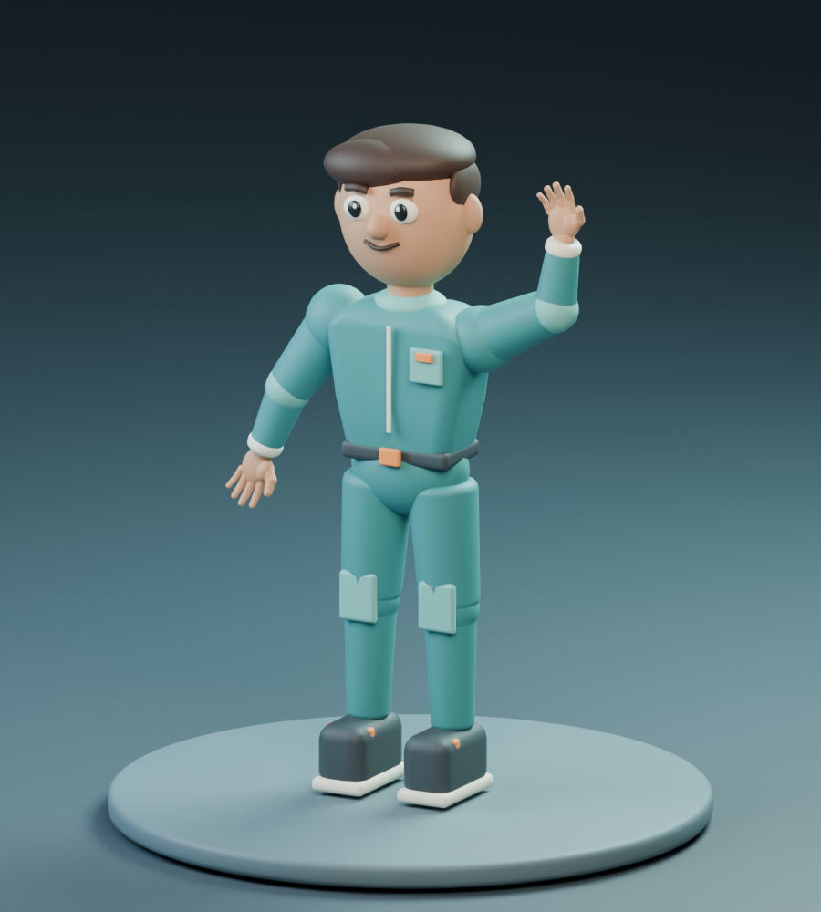

# Humanoid modeling and animation reference

Verified experiment · 2026-09-17 · Blender 5.2.2 LTS / Godot 4.6.3

An agent used Blender MCP to create a stylized maker, refine its hands, add a
40-bone FK rig, animate a four-second wave, and export an animated GLB. Godot
import and sampled animation playback were then checked programmatically.

This preserves that **agent-assisted reference workflow**. The agent translated
natural-language requests into procedural Blender Python and inspected renders
between revisions. These scripts reproduce that particular character; they
do not accept arbitrary prompts, automatically rig arbitrary meshes, or call
a text-to-3D model service. This is an asset study, not a playable city or an
engine-selection decision.



[Watch the four-second wave](assets/humanoid-wave.mp4) ·
[Download the editable Blender study](assets/humanoid-rigged.blend) ·
[Verification record](VERIFICATION.md)

## What is reusable

| File | Purpose and limits |
| --- | --- |
| [run_mcp.py](run_mcp.py) | Executes one reviewed step through an installed MCP stdio server. Server command and output directory are configurable. |
| [replay.py](replay.py) | Replays geometry, hand checks, rigging, animation and export in a fresh background Blender process. |
| [steps/create.py](steps/create.py) | Procedural character, materials, studio and camera; preserves the initial scene. |
| [steps/refine-hands.py](steps/refine-hands.py) | Connected palms/fingers built with voxel remeshing; archives the initial primitive hands. |
| [steps/finish-hands.py](steps/finish-hands.py) | Checks each hand is a single closed component; optionally renders a still. |
| [steps/rig.py](steps/rig.py) | Copies the study, creates body/finger bones, binds the meshes and checks normalized weights. Bone positions and mesh names are character-specific. |
| [steps/animate.py](steps/animate.py) | Keys `Wave_Hello` at 24 fps, frames 1–96; optionally renders a posed still. |
| [steps/export-wave.py](steps/export-wave.py) | Exports the active character scene, named animation and skins; saves a portable Blender study. |
| [steps/preview-wave.py](steps/preview-wave.py) | Renders 48 Workbench preview frames for a 12 fps movie. |
| [godot-check/check.gd](godot-check/check.gd) | Checks imported skeleton, meshes, named clip, raised hand, wrist motion and return pose. |

The Blender file contains `SJL Humanoid Study` and `SJL Humanoid | Rigged`.
The file is written as a library of those scenes and their dependencies,
excluding the running application's unrelated scenes and saved UI metadata.
Choose the rigged scene and press Space over the timeline to play the wave.
Blender may show a “Library file, loading empty scene” warning because no UI
layout was saved. The study scenes and their objects are present; the initial
scene is the unrigged study, and the scene selector switches to the rigged one.
The earlier hand geometry is retained in a hidden archive collection.

## Replay without an MCP connection

Requires Blender 5.2.2 on `PATH`. Run from this directory. This starts a
separate factory scene and does not operate on an open Blender session:

```sh
blender -noaudio --background --factory-startup --python-exit-code 1 \
  --python replay.py -- --output output
```

The destination must not exist. Pick a new directory for another run. The
default replay skips still-image rendering; add `--render` after `--` to
include the Cycles stills. No external Python packages are needed for replay.
The result includes `humanoid-rigged.blend` and `humanoid-wave.glb`.

## Run through Blender MCP

Use a fresh Blender file. These steps add and select scenes in the running
application; they are ordered and are not an idempotent setup command. Keep
the same Blender session and output directory throughout the sequence.

Prerequisites:

- Python with the [MCP client dependency](requirements.txt).
- A separately installed [community Blender MCP server and addon](https://github.com/ahujasid/mcp-for-blender).
  The original experiment used server revision
  `6f992ffbca3cb715d111fc640b737b808632273c`, version 2.0.0, protocol 7,
  with a local disabled-telemetry initialization repair. That repair is not
  bundled here. A clean installation of that revision is not claimed to work
  without it; use a server installation with working disabled-telemetry support.
- Blender running with the addon connected. The executable supplied with
  `--server` must launch the stdio server connected to that Blender instance.
  `blender-mcp` below is an example wrapper name, not an installed command
  provided by this repository. No external asset-service credentials are used.

```sh
python3 -m venv .venv
.venv/bin/python -m pip install -r requirements.txt

.venv/bin/python run_mcp.py create --server blender-mcp
.venv/bin/python run_mcp.py refine-hands --server blender-mcp
.venv/bin/python run_mcp.py finish-hands --server blender-mcp
.venv/bin/python run_mcp.py rig --server blender-mcp
.venv/bin/python run_mcp.py animate --server blender-mcp
.venv/bin/python run_mcp.py export-wave --server blender-mcp
```

Use `--output /path/to/new-output` on every call to change the default
`output/` directory. The client disables server telemetry with
`BLENDER_MCP_DISABLE_TELEMETRY=true`. It does not install the server, change
addon preferences or publish any assets. Review each step before running it.
An exception can leave a partly completed scene; restart in a fresh file
instead of blindly rerunning a step. Blender state is not transactional.

For an optional animation preview, with FFmpeg installed:

```sh
.venv/bin/python run_mcp.py preview-wave --server blender-mcp
ffmpeg -framerate 12 -i output/wave-frames/%03d.png \
  -c:v libx264 -crf 19 -pix_fmt yuv420p -movflags +faststart \
  output/humanoid-wave.mp4
```

The preview step skips existing frame files to resume an interrupted render.
Use a new output directory when the animation changes to avoid stale frames.

## Verify the Godot import

With Godot 4.6.3 available as `godot`, run from this directory after replay or
MCP export:

```sh
cp output/humanoid-wave.glb godot-check/humanoid-wave.glb
godot --headless --path godot-check --editor --import
godot --headless --path godot-check --script check.gd
```

The script exits nonzero on failure and prints a JSON `PASS` result when the
expected skeleton and motion are present. It samples bone transforms; it
does not replace visual inspection of mesh deformation in Blender or Godot.

## Known limits and asset storage

- FK only; no IK controls, facial animation, locomotion or retargeting.
- Segmented body meshes use rigid weights; hands use blended weights.
- The reference GLB has 395,308 triangles and 52 meshes. Reduce complexity
  and profile before using many residents or shipping to browsers/mobile.
- glTF validation reported zero errors and 52 non-root skinned-mesh warnings;
  details and measured motion are in the verification record.
- Rendering and voxel remeshing can vary across Blender versions. New
  characters need their own proportions, rig placement and visual checks.

The scripts and final editable `.blend` are the reference source. One still
and a small movie document the appearance. Generated GLBs, frame sequences,
temporary blends, local logs, Python environments and Godot caches stay out
of Git. There are no operational inventories or credentials in this
reference; the editable `.blend` records the local folder it was saved from,
as Blender files do. The scripts are licensed under the AGPL-3.0-only and the
`.blend`, still and movie under CC BY-SA 4.0, like the rest of the
repository; see [COPYING.md](../../../COPYING.md).
