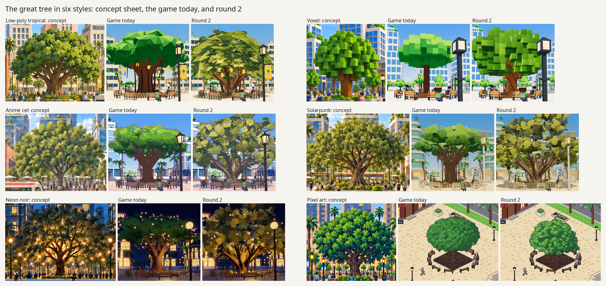
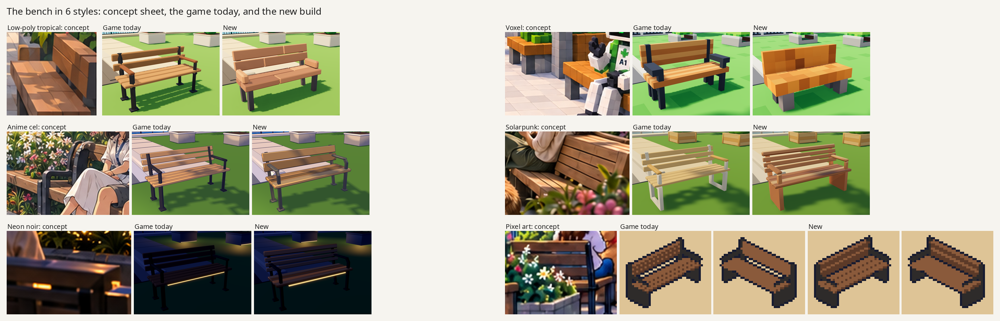
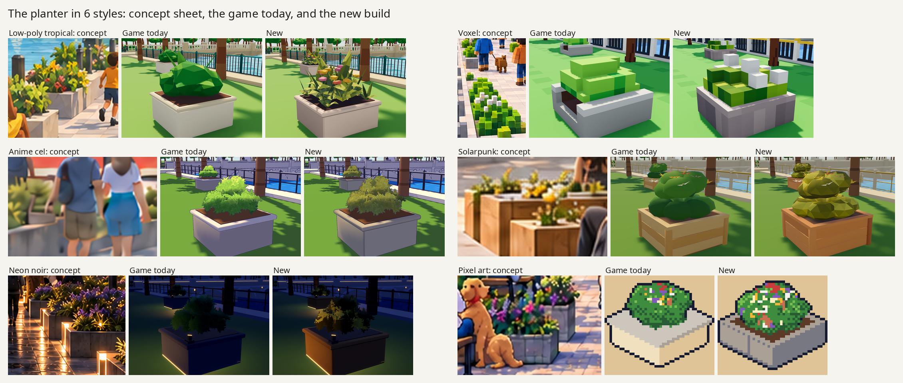

# Bringing assets toward their concept sheets: a pilot

_Pilot for Agentnagar's art rework, 2026-10-01 and 2026-10-02 · carried out and written up by an AI coding agent (Claude Opus 5.5, Anthropic) on the project's laptop, with the owner judging the results by eye · not adopted: nothing here is in the style packs, and the open decisions are listed at the end · it follows the research in [Building 3D worlds with AI agents](../2026-10-01-building-3d-worlds-with-ai-agents/README.md)._

**The game's assets are built by scripts, and beside the concept sheets they look sparse and flat. This pilot took three of them, the great tree, the park bench and the planter, through all six style packs to find what brings an asset closer to its sheet, wrote the steps down so they can be repeated, and timed them.** The largest gain came from colour: in every style the kit's palette is a different family from the sheet's, and painting an asset from colours measured in the sheet moved it more than a new shape did. The procedure replays unattended in a little over three minutes of machine time for six styles. It also has limits that no amount of fitting gets past, and the last section but one lists them.

The owner judged the second round's trees much better than today's. After the bench and the planter the owner's judgement was that the planters look acceptable and that only the low-poly and anime versions got better.



## What was done

| When | Asset | What was tested | What came of it | Record |
| --- | --- | --- | --- | --- |
| 2026-10-01 | The great tree, round 1 | A shape from an image-to-3D model that runs on the laptop (TRELLIS.2), swapped into six packs, with each pack's own kit code doing the styling | The model made real 3D from the two sheets that look like renders and flat cards from the four painterly ones. The trees still looked much like today's. One tree was squeezed by the game without anyone noticing, which a later check found | [banyan/README.md](banyan/README.md) |
| 2026-10-01 | The great tree, round 2 | The same shapes with colours measured from the sheets, leaf masses drawn as each sheet draws them, shading baked into the model, and three changes to the pack's light | The crown's distance from its sheet, on five measures the colours were not fitted to, fell in all five 3D packs. The light changes did not help and were dropped | [banyan/round2/README.md](banyan/round2/README.md) |
| 2026-10-02 | The park bench | Whether the procedure carries over to a small prop of flat faces, placed many times; how long it takes | The procedure held. The tools knew only the tree and were made general, driven by one config file an asset | [bench-test/README.md](bench-test/README.md) |
| 2026-10-02 | The planter | How long an asset takes once the tools exist | About half an hour of agent time, about three and a half minutes of machine time | [planter-benchmark/README.md](planter-benchmark/README.md) |

[WORKFLOW.md](WORKFLOW.md) is the procedure itself: ten steps, what changes with the style and with the kind of asset, the traps met, and the known gaps.





## What moved the look

In the order it mattered:

1. **Colours measured from the sheet.** Each material is measured in the sheet as a ramp from shadow to highlight, and the asset is painted from that ramp, not from the kit's palette. For the tree the kit greens are saturated emerald and lime where every sheet's crown is olive, khaki or golden.
2. **Masses drawn the way that sheet draws them**, with the kit's own code: lobed leaf pads for low-poly, small lobes of leaf cards for the anime family, cubes that keep their own faces for voxel, chunky planks where the kit had thin slats.
3. **The game's light divided partly back out of the baked colour**, then fitted against captures in the game, so the piece shows the sheet's tones under the pack's own light from the street and from above.

What did not move it: a generated shape on its own (round 1), and changing the pack's light (three changes were captured and measured, and none brought the frame closer).

The tree's crown from the street, as distance from its sheet over five measures the colours were not fitted to (0 is identical; the measures and the full tables are in [round 2's README](banyan/round2/README.md)):

| Style | Today | Round 2 |
| --- | --- | --- |
| Low-poly tropical | 1.40 | 0.31 |
| Voxel | 1.52 | 1.04 |
| Anime cel | 0.62 | 0.35 |
| Solarpunk | 0.96 | 0.39 |
| Neon noir | 0.61 | 0.47 |

The bench and the planter have no such independent measure. Their tables show the colour the fit adjusted, so they show that the fit worked; their shapes were judged by eye.

## What it costs

- **Machine.** Every machine step for one asset in six styles, from the concept sheets to the comparison sheets, runs unattended in 190 to 200 seconds. Building one 3D piece takes under a second; nearly all the rest is the game starting and capturing, 14 to 19 seconds a style.
- **Agent.** The bench took 68 minutes from first reading the kits' code to a six-style result replayed from a clean folder, with the general tools written on the way. The planter, made with those tools, took 30 minutes. Two small props are the whole sample.
- **Generator.** One to two minutes an attempt. It gave a usable shape only for the tree, and only from the two sheets that look like 3D renders.

## Limits, and what might get past them

None of the ways past has been tested. The last column says whether pictures from an image model could help, which is the direction the owner chose on 2026-10-02.

| | Limit | A way past it | Could generated images help? |
| --- | --- | --- | --- |
| 1 | **The target is a scene painting.** Each style has four sheets of four scene panels and no design for any single asset. An asset is 50 to 350 px in a panel, and it is drawn differently from panel to panel. | One clean design image for each asset in each style, looking like a render, approved before anything is built. It would also be what the 3D generator needs. | Yes, directly |
| 2 | **Painted light against one sun and a flat ambient.** The sheets have bounce light, glow and soft shadow; the packs have one sun and one ambient colour. It is worst at night (neon). | Local lights and baked glow, and a colour grade for each style. Not global light changes, which were tried. | No |
| 3 | **Flat colour against a painted surface.** The sheets' surfaces have grain, wear and brushwork; the assets have one colour a face. | Small detail textures or shader detail over the vertex colours; more colours in the pixel palette. | Yes: tiling textures, and leaf and flower cut-outs |
| 4 | **Shapes scripted from primitives.** Boxes, tubes and cards do not reach the sheets' silhouettes. | A parts library for each style, restyled CC0 kit meshes, and the generator for organic pieces. | Partly: design images to build from, and single-object images the generator can use |
| 5 | **The game's own rules.** Nothing may overhang a piece's footprint where people walk, each kit has triangle budgets, the pixel pack has 32 fixed colours, and each kind of asset has one model. | An overhang part left out of the footprint measure, variants of a kind, budgets checked against the frame-rate target. | No |
| 6 | **The bare frame round the asset.** In the sheets a square is full of planting, people and stalls; in the game it is paving and benches, on ground far brighter and more saturated than the sheets'. | Grounds repainted from the sheets, and one corner fully dressed. | Partly: a game frame repainted in the style is a like-for-like target |
| 7 | **What is fitted, and the agent's eye.** The fit matches spreads of tone, not structure, and a crop can be misread. The solarpunk and neon planters were only repainted, on the reading that their shape was already right, and the owner saw no gain. | A review of the target before building, limits on the fit, a perceptual comparison. | Partly: a clean target leaves less to misread |

## What is in this folder

- `WORKFLOW.md`: the procedure.
- `tools/`: the scripts. Setting up a working folder, capturing a placed asset in the game with its mask, material and unlit passes, measuring sheets and captures, marking and painting faces, fitting, checking the kits' specs and the game's footprint rule, composing comparison sheets, replaying everything with timings. `requirements.txt` pins the measuring environment.
- `banyan/`: the great tree. Round 1's report, its builders (`scripts/`), the six sheet crops (`inputs/`), three previews of what the generator returned, and its trees (`out/`). `round2/` has round 2's report, each style's fitted settings (`params/`), the sheets' ramps, the generated shapes reduced to the parts the builders read (`parts/`), the trees (`out/`), the measures (`metrics.txt`, `colour-distance.json`, `band-errors.json`), the comparison sheets (`compare/`) and the patch the light tests needed.
- `bench-test/` and `planter-benchmark/`: each asset's report; its config, builders and fitted settings (`bench/`, `planter/`); the built pieces and sprites (`out/`); comparison sheets and previews; results, contract checks, timings and fit logs.

## What is not in the repository

About 720 MB of the pilot's files are left out. They are kept by the maintainer outside the repository, and most can be made again:

- **The game's frames**: captures of every view with their measuring passes (1920 by 1080 for the tree, 2544 by 1424 for the two props), about 260 MB. The replay scripts take them again (`asset_replay.sh`, `bench/run_all.sh`, and `banyan_captures.sh` for the tree). The records of where each captured piece stood and the scale the game gave it are kept (`captures/*/*/asset-views.json`).
- **The generator's raw output**: meshes and textures, about 280 MB for the tree and 50 MB for three failed attempts at a bench, and the Blender files and full-resolution point lists between the raw mesh and `parts/`. The command, model, weights and seed are in [banyan/README.md](banyan/README.md). Whether the model returns the same mesh on another machine was not tested.
- **Round 1's comparison sheets** (round 2's show its trees as well), the light tests' captures, and the cut-outs and matted crops tried as generator inputs.

## Re-running

```sh
export AGENTNAGAR=/path/to/agentnagar            # the checkout; every script reads it
cd "$AGENTNAGAR/docs/research/2026-10-01-asset-to-sheet-pilot"
tools/setup.sh --bare /path/to/work planter-benchmark/planter
cd /path/to/work && ./asset_replay.sh planter/asset.json
```

`WORKFLOW.md` lists what the machine needs: the built extension, Godot 4.6.3, Blender 5.2, `uv`, and a desktop that can run a nested, windowless KWin for the captures. Each asset's report has its own commands.

**Checked from this copy on 2026-10-02**, each in a fresh working folder:

- The bench (`bench/run_all.sh`, 189 s) and the planter (`asset_replay.sh`, 200 s) ran unattended. Every bench, planter and sprite came out byte for byte as in `out/` (38 and 8 files), the contract reports were identical, and no capture had to be retried.
- The great tree's five 3D trees and its sprite rebuilt byte for byte from `parts/` and the fitted settings, round 1's five trees rebuilt byte for byte with round 1's builders, and the sheets' ramps reproduced exactly.
- The tree's frames were taken again with `banyan_captures.sh`. They are not the recorded frames pixel for pixel: the nested desktop gave the game a window of 1904 by 1064 where the recorded frames are 1920 by 1080, and the desktop, not the script, decides that. From the re-taken frames `metrics.py` gives every distance within 0.02 of the recorded one (low-poly 1.396, 1.115 and 0.293 against 1.395, 1.097 and 0.305), and one fit round for low-poly gives band errors of 0.012, 0.017 and 0.011 against the recorded 0.011, 0.017 and 0.011.
- The project's own capture script reports one script error for the pixel pack on every run (its close-up of the agent assumes a 3D pack) and saves the other seven views. That is in `city/godot/tools/sheet_views.gd`, not in these scripts, and is left as it is.

## AI-generated material and licences

- **These notes and scripts** were written by an AI coding agent. The scripts are pilot code under the repository's code licence; the notes are under its documentation licence ([COPYING.md](../../../COPYING.md)).
- **The concept sheets** that every measurement reads are AI-generated (OpenAI gpt-image) and released under CC0 1.0 ([style studies](../../vision/style-studies/README.md)). Crops of them are in `banyan/inputs/` and `banyan/round2/sheets/`, and inside the comparison sheets and previews.
- **The great tree's shape is AI-generated.** It was made by TRELLIS.2-4B through trellis.cpp from two of those crops (`banyan/inputs/lowpoly_tropical-banyan.png` and `voxel-banyan.png`, seed 42). `banyan/round2/parts/` is that output reduced to a trunk mesh, leaf points and blocks, and every tree in `banyan/out/` and `banyan/round2/out/` is built on it by the pilot's scripts. The details and the licences read are in [banyan/README.md](banyan/README.md).
- **The benches and planters** are scripted geometry with no generated shape, painted from colours measured in the concept sheets.

## Open decisions

These are the owner's, and none is taken:

- Whether to adopt this way of building assets in the kits. The trees have 1.3 to 2.7 times their kits' triangle budgets, and the pixel palette has too few greens for its sheet.
- The voxel bench's size: built to the catalogue's footprint (1.6 m by 0.6 m), it misses the voxel kit's spec (1.8 m by 0.7 m).
- The kits' own tests and a frame-time run have not been run on any asset made here.
- What comes next. The direction given on 2026-10-02 is to make design images for the assets with an image model (limits 1 and 3 above) before building more.
