# Design sheets to game pieces: the tree square in five styles

Research record, 2026-10-02. Written by Claude (an AI). It was done in three parts on the owner's instruction: alone overnight, from the pilot batch of images ("use these new asset images to create best possible 3D assets ... ready with your work for review"); in the morning, from a second batch of seven images; and in the afternoon, from a third batch of thirty, the pieces that stand in and round the tree square. For the third part four build agents (also Claude) each took one family of pieces in a folder of its own, while I built the street trees, ran the game and put their work together. Nothing in `city/` was changed (the pieces went into a working copy of the game, not into its kits), and no image was generated by me: the 58 images are the three batches the owner ran (`docs/vision/asset-studies/sheets/`).

The images, the 3D models made from them and the textures on those models are AI-generated. The image-to-3D model is TRELLIS.2, run on this laptop. The agents' reports and the notes in `notes/` are AI-written too, and say so.

## What is ready

99 pieces built from design sheets and placed in a copy of the game, in low-poly tropical, neon noir, anime, solarpunk and voxel. The number in each cell is the piece's triangle count; "none" means the style has no such piece (why, below the table).

<!-- table what is built -->
| Piece | Low-poly | Neon | Anime | Solarpunk | Voxel |
| --- | --- | --- | --- | --- | --- |
| Bench | 1,500 | 2,011 | 1,499 | 1,499 | 72 |
| Café chair | 1,500 | 2,997 | 1,999 | 2,997 | 62 |
| Reading chair | 3,000 | 6,010 | 1,498 | 1,499 | 142 |
| Great tree | 20,473 | 28,222 | 24,617 | 21,023 | 2,092 |
| Perch seat | none | none | 196 | 96 | 18 |
| Street tree, large | 3,680 | 3,634 | 3,814 | 3,772 | 470 |
| Street tree, small | 3,307 | 3,226 | 3,199 | 4,140 | 328 |
| Palm, tall | 2,470 | 2,510 | 2,550 | 2,450 | none |
| Palm, middle | 2,370 | 2,390 | 2,500 | 2,350 | none |
| Palm, short | 2,250 | 2,268 | 2,250 | 2,230 | none |
| Café table | 2,999 | 3,115 | 3,000 | 3,000 | 106 |
| Umbrella | 6,000 | 6,072 | 5,997 | 5,995 | 648 |
| Planter | 9,018 | 9,036 | 9,022 | 9,187 | 238 |
| Lamp post | 1,999 | 1,499 | 1,500 | 2,999 | 188 |
| Bollard | 1,500 | 1,500 | 1,500 | 1,500 | 10 |
| Railing | 860 | 969 | 960 | 952 | 128 |
| Railing post | 178 | 394 | 628 | 60 | 10 |
| Shrub, round | 1,436 | 1,500 | 1,500 | 1,479 | 202 |
| Shrub, leafy | 1,376 | 1,494 | 1,492 | 1,497 | none |
| Flowerbed | 3,998 | 8,012 | 7,992 | 7,999 | 150 |
| Fountain | 9,333 | 9,334 | 9,332 | 14,330 | 1,190 |
| Tram shelter | 12,000 | 8,998 | 11,997 | 11,994 | 416 |
<!-- end table what is built -->

The first five rows are the seats and the great tree, the first set (23 pieces). The rest are the square's props (batch `01a-square-props`, 76 pieces): street trees and palms, the café terrace, the street fixtures, the low planting, the fountain and the tram shelter. A railing is two files, the panel and its post, and a tree or palm outside voxel has a second file for the far distance (which the game draws only where it is placed beside the piece: in neon, anime and solarpunk): 124 files in all.

Each piece went the same way: its object was cut out of the design sheet, the image-to-3D model turned the cut-out into a mesh, and a fitting step turned the mesh into a piece the game accepts (size, seat height, named parts, colours, lights, and the shape the walking grid expects of it). In the voxel style the fitted piece is then rebuilt from cubes on the kit's grid. The piece replaced the kit's piece in a working copy of the client and was captured at the same placements as the kit's piece (for a planted piece the side the camera stands on is chosen for each capture).

Every piece in the table is in that copy of the game, and all but two are drawn by it: the anime and neon packs plant only the round shrub, so their leafy shrubs stand in the copy unused and were seen only in Blender. With all of them in place:

- the game's own collision audit counts zero in each of the five styles, as it does with the kit's pieces. `tools/audit.sh` measures three of its six counts (`out/audit-props/`); the other three need a simulated day of walkers, the player and the tram, and the game's own test of the audit runs that day inside the suite (next). What the audit is, under "The gate";
- the game's own test suite passes whole: 920 tests and no failure, run on the working copy as it stands, after the last change to a piece (`out/game-tests.txt`; the run before that change, which passed the same, is `out/game-tests-2030.txt`). In the afternoon, with three build agents working on the machine and fewer pieces placed, it had one failure, a timing test of the work app's board that does not read the pieces (4.14 ms against its budget of 4 ms);
- the kits' own pinned glTF validator finds no error and no warning in any of the 124 files (`out/validator.txt`), nor in the files of the other `out-*` folders (`out/validator-all.txt`);
- the game starts in all five styles and runs without an error or a script error (`tools/boot_test.sh`: 25 seconds in each, in a hidden desktop; `out/boot-test.txt`).

What is missing from the table, and why:

- **Pixel art** has no piece. Its sheets do not hold one pixel size, and it needs a route of its own (sprites) that is not worked out. So this covers five of the six styles.
- **Perch seat, low-poly and neon.** The first batch's sheets drew a stool with legs, which is not what the game uses; the later sheets draw the plain seat stone.
- **Voxel palms and leafy shrub.** The voxel kit has no palm and one shrub file; there is nothing to replace.

Also built and kept, not placed: the 10 first-set pieces held to their kit's triangle limit (`out-budget/`), the neon tree from its first, night-lit sheet (`out-first-sheet/`), the worn-and-mended bench in low-poly and neon (`out-worn/`; the game has no worn state to show it in), the street trees and palms of four styles in the kit's greens (`out-kit-green/`; the neon ones are the ones placed, see "Palette"), and the round shrub built as leaves for anime and neon (`out-leaves/`), which its agent offers beside the one placed.

## Look first

Each style's town, with the kit's pieces (left) and with every piece built (right): the square from the street, the park, the square at dusk, and from above.

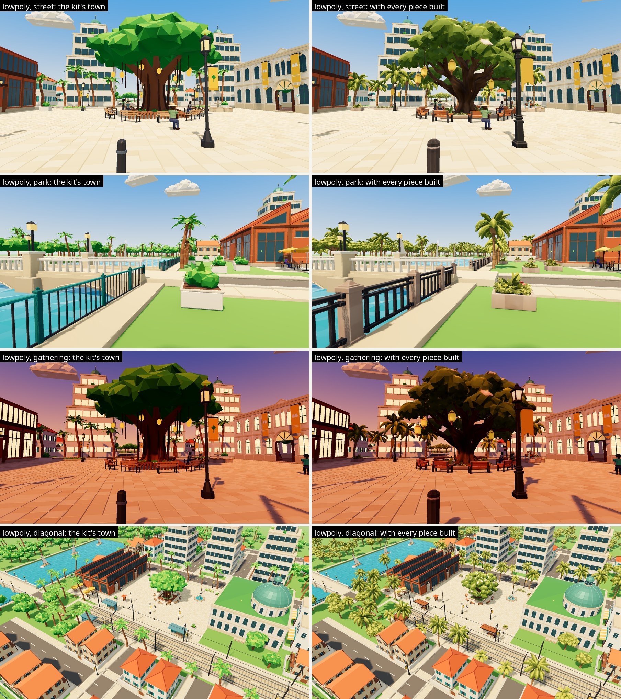

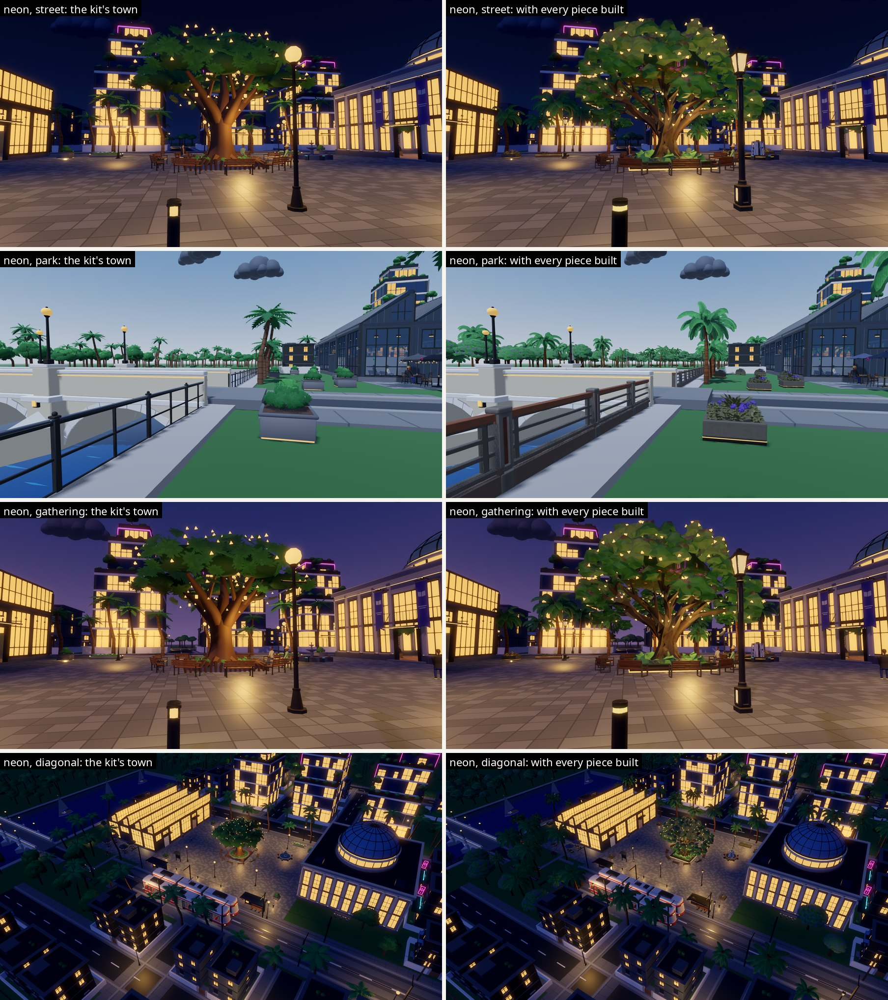

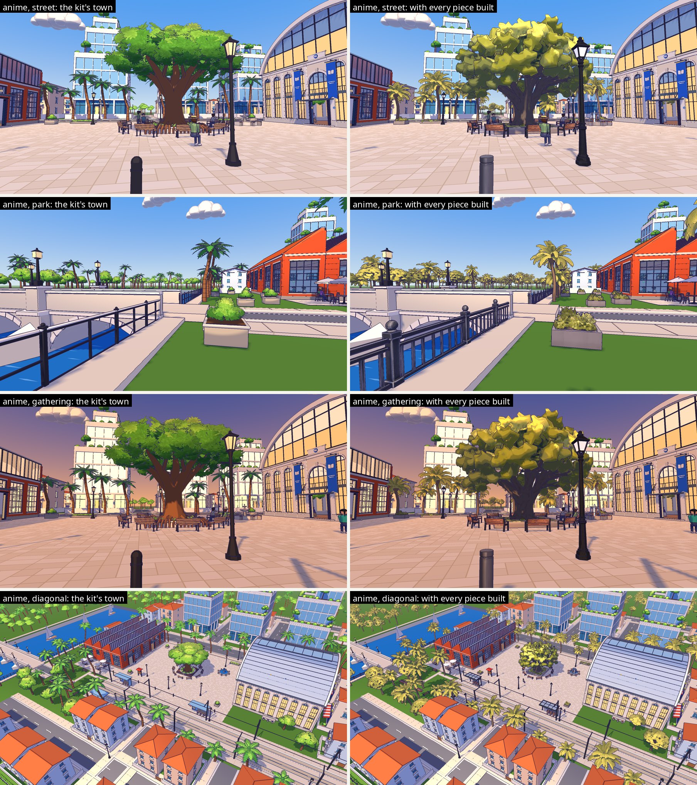

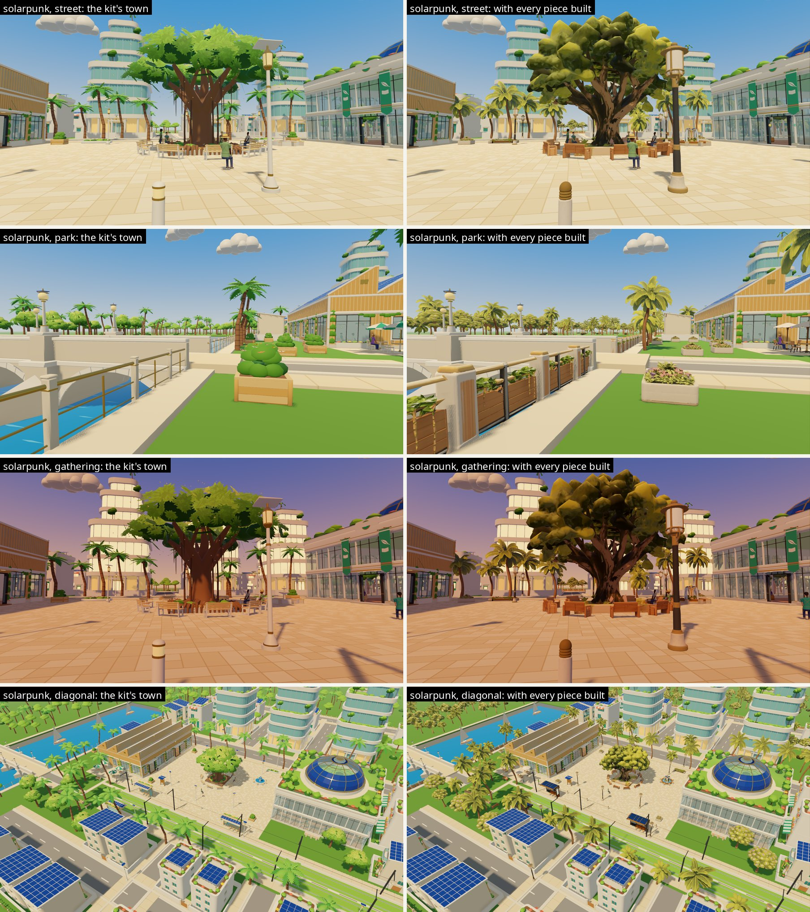

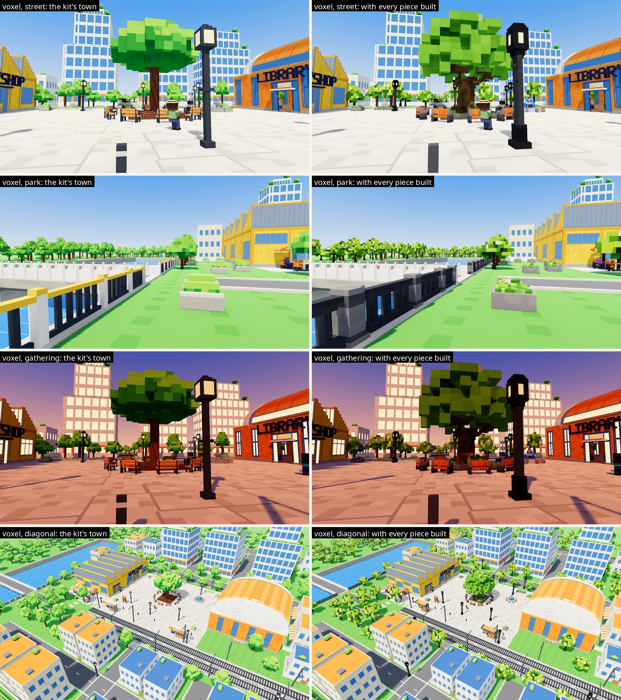

Close up, family by family: the design image, then the kit's piece and the new one from eye height and from above. One style is shown for each family here; the others are `compare/<family>-<style>.jpg` (families `trees`, `terrace`, `fixtures`, `planting`, `water`). A row shows the piece's first placement in the district, or another where the first is hidden (the neon round shrub from above, under a new street tree's crown) or has a neighbour standing in front of the camera (the small solarpunk street tree, the large voxel one); the label over each frame says which. For a planted piece the camera stands on the side from which most of the copy shows, chosen for each capture by itself, so the kit's frame and the new one of a palm can look from different sides. The kit's props were captured with the new seats and great tree already in place, so those show in the frames marked "today". A railing has no row: the capture tool does not find its copies, and it is in each town's park view.

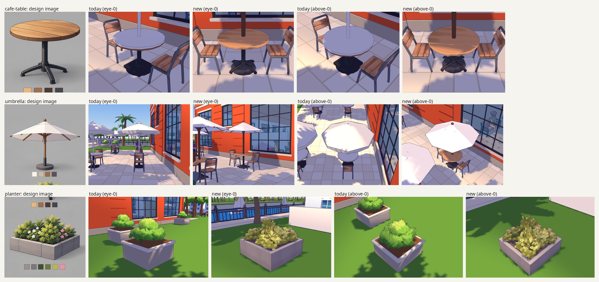

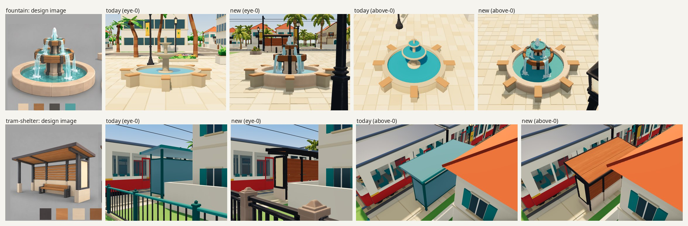

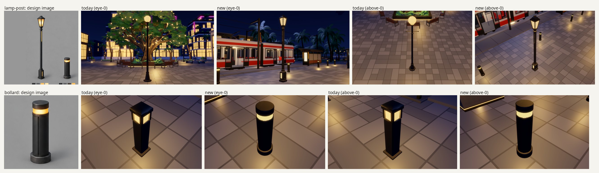

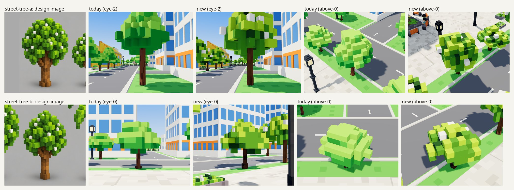

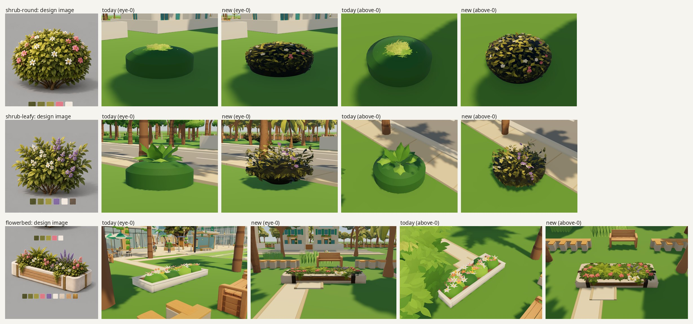

The first set, a style at a time: `compare/seats-<style>.jpg`, `compare/tree-<style>.jpg`, `compare/perch-seats.jpg`, `compare/street-<style>.jpg` (the street view beside its concept sheet), `compare/views-<style>.jpg` (four more views). People sitting on the benches round the tree, with the kit's pieces and the new ones: `compare/sitters.jpg`.

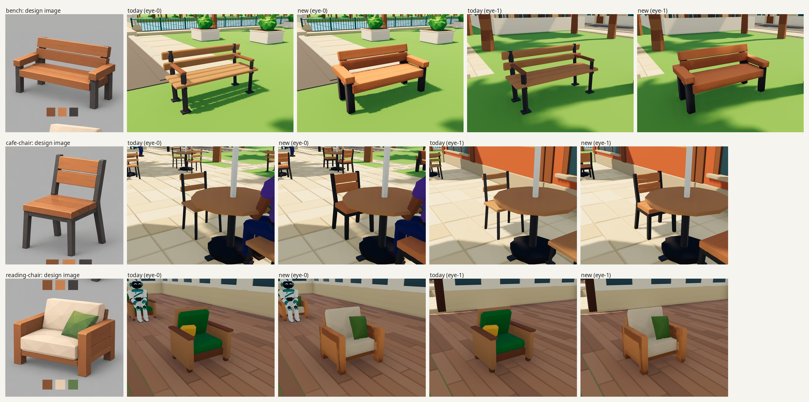

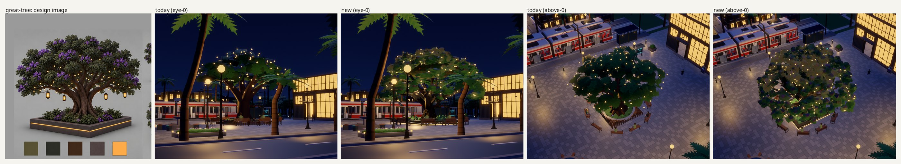

To walk round them in the game itself, on the laptop that holds the working folder (the copy of the game with the pieces in it; the checkout is untouched; elsewhere, "Running it again" below makes such a folder first):

```sh
export AGENTNAGAR=/path/to/agentnagar
"$AGENTNAGAR"/../.asset-pilot/2026-10-02-sheet-to-asset/work/run_game.sh anime_cel   # or lowpoly_tropical, neon_noir, solarpunk, voxel
```

I did not open it on the real screen.

More pictures, in `previews/`, each named where the text speaks of it: the street trees three ways (`planted-<style>-three-ways.jpg`: the kit's, the sheet's greens, the kit's greens), with and without their leaf normals leaning up (`planted-<style>-lift.jpg`) and with and without their blossoms (`street-tree-blossoms.jpg`); the voxel street trees beside their design and the kit's (`voxel-street-trees.jpg`); the seats before and after their own normals (`seats-normals-before-after.jpg`); the neon seats in neutral light (`neon-seats-neutral-light.jpg`); and each build agent's own sheets of its pieces beside the kit's and the design (`previews/terrace/`, `fountain-shelter/`, `fixtures/`, `planting/`). The pictures from the first part of the day show the first set as it stood at noon: the trees as generated and as built (`trees-generated-and-built.jpg`), the voxel seats fitted and in cubes (`voxel-seats-fitted-and-cubes.jpg`), the models that came with slabs (`solarpunk-models-with-slabs.jpg`), the anime tree from three seeds (`anime-tree-three-seeds.jpg`), a chair held to its limit (`neon-cafe-chair-budget.jpg`), the worn benches (`benches-new-and-worn.jpg`), what the cutter found on two sheets (`cut-lowpoly_tropical-A-seating.jpg`, `cut-neon_noir-A-great-tree.jpg`: objects boxed in green, swatches in magenta), four crops with their swatches and neighbours painted out (`crops-cleaned.jpg`), some of the other generated models as they came (`other-generated-models.jpg`), the solarpunk armchair cut down straight from the generated mesh and from a rebuilt surface (`solarpunk-armchair-cut-straight-and-rebuilt.jpg`), and the voxel great tree from the street beside the kit's and the earlier pilot's (`voxel-tree-street.jpg`).

## The gate: the game's own tests

A piece can keep its kit's size, parts and seat height and still be wrong for the game. The first 23 pieces were checked against the kits' specs and one of the game's rules. An independent review of this record asked whether the game's own test suite had been run with them in place. It had not. Run, 917 of its 920 tests passed and three failed, with 20 failing checks among them: 17 counts of the game's collision audit, in every style, two for a lantern material the solarpunk tree lacked, and one timing check. The kit's own pieces passed the audit at zero in the same working copy.

The audit (`city/godot/tools/collision_audit/`) sets everything a style draws between 0.25 and 1.9 m above the ground against the walking grid of 25 cm cells. A walkable cell's centre must be 10 cm clear of anything drawn, and a blocked cell's centre must have something drawn within 10 cm of it. The grid blocks cells by each kind's footprint shape in the catalogue; the game only stretches a piece's box onto that footprint's bounds. So the shape inside the box has to be the footprint's: a reading chair's seat set back between its arms (its footprint is a U), a bench's back on its rear edge along its whole length, a planting bed a solid block to its rim. `notes/collision-audit.md` has the rules, the code they were read from and what each failing piece had wrong; `previews/audit-first-seats.jpg` shows three of the first seats as the audit saw them (red: a walkable cell the piece touches; blue: a blocked cell with nothing drawn near it), and `previews/audit-reading-chair-kit-and-first.jpg` sets each style's kit reading chair, its seat set back between its arms, beside the chair as first built, which stood on two walkable cells.

What was done about it:

- the fit got a plan-view step that presses a generated model into its footprint's shape before it is cut down (`--plan-pull`, `--plan-cols`, `--plan-rows`, `--plan-notch`), and the cube rebuild a solid foot (`--solid`);
- `tools/audit.sh STYLE` runs the three counts of the game's audit that need no simulated day (through, within 10 cm, blocked and bare) on the working copy in under half a minute and lists the offenders by piece, and the two scripts that place pieces (`run_all.sh`, `props_run.sh`) run it each time. The other three counts (walkers, the player and the tram passing pieces) need the day that the game's own test of the audit simulates inside its suite;
- the four build agents each wrote a check that follows the audit's code on a built file, because they could not run the game. Those checks were useful while fitting, and every one of the 54 pieces the agents built passed the game's own audit when it was placed. They do not replace the audit: it reads the ground drawn under each placement, the placements' real facings and the grid's phase at each point.

<!-- table audit -->
| Style | Kit's pieces: through, within 10 cm, blocked and bare | The seats and great tree new | Every built piece in place |
| --- | --- | --- | --- |
| Low-poly | 0, 0, 0 | 0, 0, 0 | 0, 0, 0 |
| Neon | 0, 0, 0 | 0, 0, 0 | 0, 0, 0 |
| Anime | 0, 0, 0 | 0, 0, 0 | 0, 0, 0 |
| Solarpunk | 0, 0, 0 | 0, 0, 0 | 0, 0, 0 |
| Voxel | 0, 0, 0 | 0, 0, 0 | 0, 0, 0 |
<!-- end table audit -->

## The pieces in numbers

Written from the result files by `tools/report_tables.py` (`out/results.json`, each piece's report `out/<style>/<piece>.json`, `out/seat-heights.txt`), which can check this page against them (`--check README.md`).

The first set:

<!-- table first set -->
| Style | Piece | Triangles | Kit's limit | Kit's piece | Shape kept | Colour off the design | Design colours found | File | Size, parts and footprint as the kit's spec |
| --- | --- | --- | --- | --- | --- | --- | --- | --- | --- |
| Low-poly | bench | 1,500 | 1,500 | 428 | 1.5 mm | 1.0 | 100% | 0.33 MB | yes |
| Low-poly | café chair | 1,500 | 1,500 | 204 | 1.3 mm | 4.1 | 100% | 0.32 MB | yes |
| Low-poly | reading chair | 3,000 | 1,500 | 412 | 0.9 mm | 3.4 | 74% | 0.40 MB | yes |
| Low-poly | great tree | 20,473 | 6,500 | 6,045 | 225.6 mm | 3.6 | 100% | 3.0 MB | yes |
| Neon | bench | 2,011 | 1,500 | 704 | 2.0 mm | 6.3 | 91% | 0.37 MB | yes |
| Neon | café chair | 2,997 | 1,500 | 252 | 1.1 mm | 1.5 | 100% | 0.48 MB | yes |
| Neon | reading chair | 6,010 | 1,500 | 412 | 1.3 mm | 4.2 | 93% | 0.57 MB | yes |
| Neon | great tree | 28,222 | 7,500 | 5,942 | 231.1 mm | 9.4 | 98% | 2.9 MB | yes |
| Anime | bench | 1,499 | 1,500 | 692 | 2.4 mm | 3.6 | 96% | 0.32 MB | yes |
| Anime | café chair | 1,999 | 1,500 | 252 | 1.6 mm | 3.1 | 100% | 0.37 MB | yes |
| Anime | reading chair | 1,498 | 1,500 | 412 | 1.6 mm (of the rebuilt surface) | 4.0 | 100% | 0.24 MB | yes |
| Anime | perch seat | 196 | 200 | 100 | 0.5 mm (of the rebuilt surface) | 7.2 | 58% | 33 kB | yes |
| Anime | great tree | 24,617 | 7,500 | 7,326 | 202.7 mm | 4.9 | 68% | 2.3 MB | yes |
| Solarpunk | bench | 1,499 | 1,500 | 588 | 2.2 mm | 2.5 | 100% | 0.33 MB | yes |
| Solarpunk | café chair | 2,997 | 1,500 | 252 | 1.6 mm | 4.4 | 100% | 0.41 MB | yes |
| Solarpunk | reading chair | 1,499 | 1,500 | 412 | 2.0 mm (of the rebuilt surface) | 4.2 | 100% | 0.32 MB | yes |
| Solarpunk | perch seat | 96 | 100 | 68 | 2.4 mm (of the rebuilt surface) | 2.3 | 89% | 24 kB | yes |
| Solarpunk | great tree | 21,023 | 7,500 | 6,475 | 317.5 mm | 2.4 | 100% | 2.4 MB | yes |
| Voxel | bench | 72 | 300 | 280 | cubes of 0.1 m | 0.8 | 100% | 14 kB | yes |
| Voxel | café chair | 62 | 100 | 72 | cubes of 0.1 m | 1.1 | 100% | 8 kB | yes |
| Voxel | reading chair | 142 | 150 | 92 | cubes of 0.1 m | 1.4 | 100% | 16 kB | yes |
| Voxel | perch seat | 18 | 100 | 40 | cubes of 0.1 m | 1.2 | 100% | 4 kB | yes |
| Voxel | great tree | 2,092 | 7,500 | 7,306 | cubes of 0.25 m and 0.75 m | 4.6 | 100% | 0.16 MB | yes |
<!-- end table first set -->

- **Kit's limit**: the triangle limit in the kit's spec for the piece. It is reported, not held to (the owner's decision, below).
- **Shape kept**: 95% of 6,000 points sampled on the generated model lie within this distance of the cut-down piece. Where the reduction stalled and the piece was cut from a rebuilt surface instead, the points are on that surface (a generated model has faces inside it, which make the other figure meaningless). A great tree's figure is large because its leaves are rebuilt from coarse cells on purpose. A voxel piece is rebuilt from cubes; its colour figures are those of the fitted piece the cubes were coloured from.
- **Colour off the design**: the finished texture against the design image. The image's pixels are gathered into its main colours (two to eight, by piece); each is set against the texels nearest to it; the distances, in CIELAB units, are averaged by how much of the image each colour covers. About 2 is a just-visible difference and 10 is plainly different. Ten props were matched to two colours (the anime bollard, café table and railing, the low-poly and solarpunk café tables, and the voxel bench, bollard, café chair, café table and fountain): their figures, 0.0 to 3.9, are met almost by construction and say little.
- **Design colours found**: the share of the design image whose colours some part of the texture came near. Read the two together: a piece can be close on the colours it has and still lack one of the design's.
- **Size, parts and footprint as the kit's spec**: the kit tests' own rule on the file (each axis within 10% and 2 cm of the spec's size, named parts present), and for a tree the game's footprint rule. As the game draws them the pieces differ from the kit's by the scales in the table further down.

Where a piece's colours were changed on purpose after the match (a tree's leaves moved to another green, a bed to the stone's colour, lanterns to their swatch), the figures above are the finished texture's and these are the match's own:

<!-- table colour as matched -->
| Style | Piece | As matched: colour off the design | As matched: design colours found | Finished | Finished: found | Texels changed after the match |
| --- | --- | --- | --- | --- | --- | --- |
| Low-poly | reading chair | 3.4 | 74% | 3.4 | 74% | 1% |
| Low-poly | great tree | 4.2 | 100% | 3.6 | 100% | 1% |
| Neon | reading chair | 4.2 | 93% | 4.2 | 93% | 1% |
| Neon | great tree | 3.8 | 98% | 9.4 | 98% | 73% |
| Anime | reading chair | 4.2 | 100% | 4.0 | 100% | 2% |
| Anime | great tree | 6.5 | 91% | 4.9 | 68% | 88% |
| Solarpunk | reading chair | 4.2 | 100% | 4.2 | 100% | 2% |
| Solarpunk | great tree | 2.2 | 100% | 2.4 | 100% | 0% |
| Voxel | reading chair | 1.3 | 100% | 1.4 | 100% | 5% |
| Voxel | great tree | 4.6 | 100% | 4.6 | 100% | 0% |
<!-- end table colour as matched -->

The square's props. "Rules of the kit's spec met" is the same rule on the file, with what departs from the spec on purpose named: a lamp post narrower than its kit's ornament, a railing as deep as its sheet draws it, a planter as high as drawn. Each such departure is declared in `tools/assets.json` with its reason.

**Street trees and palms**

<!-- table street trees and palms -->
| Style | Piece | Size (m) | Triangles | Kit's limit | Kit's piece | Colour off the design | File | Rules of the kit's spec met |
| --- | --- | --- | --- | --- | --- | --- | --- | --- |
| Low-poly | street tree, large | 4.69 by 5.51 by 4.97 | 3,680 | 1,500 | 627 | 6.1 | 0.69 MB | yes |
| Neon | street tree, large | 5.21 by 5.51 by 5.04 | 3,634 | 2,000 | 822 | 7.6 | 0.43 MB | yes |
| Anime | street tree, large | 4.86 by 5.45 by 4.87 | 3,814 | 2,000 | 822 | 4.7 | 0.53 MB | yes |
| Solarpunk | street tree, large | 4.90 by 5.46 by 4.81 | 3,772 | 2,000 | 822 | 8.2 | 0.56 MB | yes |
| Voxel | street tree, large | 5.00 by 5.50 by 4.50 | 470 | 850 | 544 | 2.7 | 43 kB | yes, but drawn 0.79 times as wide as built |
| Low-poly | street tree, small | 3.18 by 4.38 by 3.81 | 3,307 | 1,500 | 367 | 7.1 | 0.64 MB | yes |
| Neon | street tree, small | 3.67 by 4.39 by 3.69 | 3,226 | 2,000 | 814 | 5.5 | 0.41 MB | yes |
| Anime | street tree, small | 3.31 by 4.38 by 3.49 | 3,199 | 2,000 | 814 | 4.0 | 0.44 MB | yes |
| Solarpunk | street tree, small | 3.07 by 4.38 by 3.50 | 4,140 | 2,000 | 814 | 10.2 | 0.50 MB | yes |
| Voxel | street tree, small | 3.20 by 3.60 by 2.80 | 328 | 550 | 350 | 2.5 | 31 kB | yes, but drawn 1.12 times as wide as built |
| Low-poly | palm, tall | 5.24 by 8.54 by 4.71 | 2,470 | 1,500 | 681 | 6.7 | 0.50 MB | yes |
| Neon | palm, tall | 5.39 by 8.67 by 5.25 | 2,510 | 2,000 | 1,666 | 4.2 | 0.30 MB | yes |
| Anime | palm, tall | 5.14 by 8.50 by 5.10 | 2,550 | 2,000 | 1,666 | 4.9 | 0.40 MB | yes |
| Solarpunk | palm, tall | 5.17 by 8.55 by 5.08 | 2,450 | 2,000 | 1,666 | 7.3 | 0.40 MB | yes |
| Low-poly | palm, middle | 4.43 by 6.52 by 3.97 | 2,370 | 1,500 | 641 | 6.7 | 0.49 MB | yes |
| Neon | palm, middle | 4.45 by 6.64 by 4.33 | 2,390 | 2,000 | 1,586 | 4.1 | 0.29 MB | yes |
| Anime | palm, middle | 4.34 by 6.50 by 4.30 | 2,500 | 2,000 | 1,586 | 4.9 | 0.41 MB | yes |
| Solarpunk | palm, middle | 4.40 by 6.54 by 4.31 | 2,350 | 2,000 | 1,586 | 6.6 | 0.38 MB | yes |
| Low-poly | palm, short | 3.42 by 4.51 by 3.17 | 2,250 | 1,500 | 601 | 4.7 | 0.44 MB | yes |
| Neon | palm, short | 3.31 by 4.56 by 3.46 | 2,268 | 2,000 | 1,506 | 3.1 | 0.27 MB | yes |
| Anime | palm, short | 3.42 by 4.48 by 3.41 | 2,250 | 2,000 | 1,506 | 4.3 | 0.34 MB | yes |
| Solarpunk | palm, short | 3.24 by 4.53 by 3.43 | 2,230 | 2,000 | 1,506 | 9.6 | 0.32 MB | yes |
<!-- end table street trees and palms -->

The neon rows are the files in the neon sheet's greens (`out/neon_noir/`). The game draws the same meshes in the neon kit's greens (`out-kit-green/neon_noir/`): colour off the design 13.9, 11.0, 7.7, 7.7 and 8.4 (the large and the small street tree, the tall, middle and short palm) and 0.46, 0.42, 0.33, 0.33 and 0.29 MB.

**Terrace**

<!-- table terrace -->
| Style | Piece | Size (m) | Triangles | Kit's limit | Kit's piece | Colour off the design | File | Rules of the kit's spec met |
| --- | --- | --- | --- | --- | --- | --- | --- | --- |
| Low-poly | café table | 0.80 by 0.75 by 0.80 | 2,999 | 1,500 | 132 | 0.0 | 0.40 MB | yes |
| Neon | café table | 0.80 by 0.75 by 0.81 | 3,115 | 1,500 | 360 | 5.3 | 0.35 MB | yes |
| Anime | café table | 0.80 by 0.75 by 0.80 | 3,000 | 1,500 | 304 | 3.9 | 0.38 MB | yes |
| Solarpunk | café table | 0.80 by 0.75 by 0.80 | 3,000 | 1,500 | 304 | 0.3 | 0.24 MB | yes |
| Voxel | café table | 1.00 by 0.80 by 1.00 | 106 | 150 | 112 | 2.4 | 11 kB | yes |
| Low-poly | umbrella | 2.31 by 2.60 by 2.31 | 6,000 | 1,500 | 196 | 5.0 | 1.1 MB | yes |
| Neon | umbrella | 2.31 by 2.52 by 2.31 | 6,072 | 1,500 | 600 | 5.8 | 0.65 MB | yes |
| Anime | umbrella | 2.30 by 2.55 by 2.29 | 5,997 | 1,500 | 472 | 3.7 | 1.0 MB | yes |
| Solarpunk | umbrella | 2.30 by 2.53 by 2.30 | 5,995 | 1,500 | 472 | 3.6 | 1.2 MB | yes |
| Voxel | umbrella | 2.40 by 2.80 by 2.40 | 648 | 650 | 498 | 2.4 | 53 kB | yes |
| Low-poly | planter | 1.30 by 1.06 by 1.30 | 9,018 | 1,500 | 436 | 4.7 | 1.4 MB | yes, but y 1.06 m against the spec's 1.4 m |
| Neon | planter | 1.31 by 0.97 by 1.31 | 9,036 | 1,500 | 1,104 | 7.6 | 1.5 MB | yes, but y 0.97 m against the spec's 1.42 m |
| Anime | planter | 1.30 by 1.03 by 1.30 | 9,022 | 1,500 | 956 | 7.3 | 0.82 MB | yes, but y 1.03 m against the spec's 1.4 m |
| Solarpunk | planter | 1.30 by 0.92 by 1.30 | 9,187 | 1,500 | 1,462 | 8.8 | 1.6 MB | yes, but y 0.92 m against the spec's 1.4 m |
| Voxel | planter | 1.30 by 0.90 by 1.30 | 238 | 300 | 216 | 6.6 | 22 kB | yes |
<!-- end table terrace -->

**Street fixtures**

<!-- table street fixtures -->
| Style | Piece | Size (m) | Triangles | Kit's limit | Kit's piece | Colour off the design | File | Rules of the kit's spec met |
| --- | --- | --- | --- | --- | --- | --- | --- | --- |
| Low-poly | lamp post | 0.93 by 4.20 by 0.41 | 1,999 | 1,500 | 418 | 0.4 | 0.31 MB | yes, but x 0.93 m for the spec's 0.75 m; z 0.41 m for the spec's 0.50 m |
| Neon | lamp post | 0.40 by 4.20 by 0.40 | 1,499 | 1,500 | 392 | 2.9 | 0.27 MB | yes, but x 0.40 m for the spec's 0.74 m; z 0.40 m for the spec's 0.50 m |
| Anime | lamp post | 0.47 by 4.20 by 0.49 | 1,500 | 1,500 | 456 | 3.1 | 0.14 MB | yes, but x 0.47 m for the spec's 0.74 m |
| Solarpunk | lamp post | 0.80 by 4.20 by 0.79 | 2,999 | 1,500 | 664 | 2.1 | 0.38 MB | yes, but z 0.79 m for the spec's 0.50 m |
| Voxel | lamp post | 0.60 by 4.50 by 0.60 | 188 | 250 | 196 | 0.4 | 27 kB | yes |
| Low-poly | bollard | 0.24 by 0.90 by 0.24 | 1,500 | 1,500 | 152 | 1.0 | 99 kB | yes |
| Neon | bollard | 0.27 by 0.90 by 0.27 | 1,500 | 1,500 | 204 | 3.0 | 0.11 MB | yes |
| Anime | bollard | 0.24 by 0.90 by 0.24 | 1,500 | 1,500 | 278 | 1.7 | 71 kB | yes |
| Solarpunk | bollard | 0.24 by 0.90 by 0.24 | 1,500 | 1,500 | 380 | 0.6 | 0.12 MB | yes |
| Voxel | bollard | 0.20 by 0.80 by 0.20 | 10 | 50 | 28 | 2.0 | 3 kB | yes |
| Low-poly | railing | 2.00 by 1.23 by 0.31 | 860 | 900 | 328 | 1.1 | 0.23 MB | yes, but z 0.31 m for the spec's 0.14 m |
| Neon | railing | 2.00 by 1.17 by 0.21 | 969 | 1,000 | 336 | 6.5 | 0.17 MB | yes, but z 0.21 m for the spec's 0.14 m |
| Anime | railing | 2.00 by 1.16 by 0.20 | 960 | 1,000 | 336 | 1.8 | 0.15 MB | yes, but z 0.20 m for the spec's 0.14 m |
| Solarpunk | railing | 2.00 by 1.23 by 0.37 | 952 | 1,000 | 272 | 3.3 | 0.47 MB | yes, but z 0.37 m for the spec's 0.16 m |
| Voxel | railing | 2.00 by 1.10 by 0.40 | 128 | 400 | 112 | 1.6 | 15 kB | yes, but z 0.40 m for the spec's 0.20 m |
| Low-poly | railing post | 0.30 by 1.23 by 0.31 | 178 | 300 | 120 | as its panel | 0.18 MB | yes, but x 0.30 m for the spec's 0.14 m; z 0.31 m for the spec's 0.14 m |
| Neon | railing post | 0.21 by 1.17 by 0.21 | 394 | 1,000 | 212 | as its panel | 0.12 MB | yes, but x 0.21 m for the spec's 0.14 m; z 0.21 m for the spec's 0.14 m |
| Anime | railing post | 0.19 by 1.16 by 0.20 | 628 | 1,000 | 212 | as its panel | 0.12 MB | yes, but x 0.19 m for the spec's 0.14 m; z 0.20 m for the spec's 0.14 m |
| Solarpunk | railing post | 0.39 by 1.23 by 0.36 | 60 | 1,000 | 176 | as its panel | 0.37 MB | yes, but x 0.39 m for the spec's 0.16 m; z 0.36 m for the spec's 0.16 m |
| Voxel | railing post | 0.40 by 1.10 by 0.40 | 10 | 60 | 28 | as its panel | 4 kB | yes, but x 0.40 m for the spec's 0.20 m; z 0.40 m for the spec's 0.20 m |
<!-- end table street fixtures -->

**Low planting**

<!-- table low planting -->
| Style | Piece | Size (m) | Triangles | Kit's limit | Kit's piece | Colour off the design | File | Rules of the kit's spec met |
| --- | --- | --- | --- | --- | --- | --- | --- | --- |
| Low-poly | shrub, round | 1.10 by 0.94 by 1.10 | 1,436 | 1,500 | 612 | 3.3 | 0.31 MB | yes |
| Neon | shrub, round | 1.10 by 0.82 by 1.10 | 1,500 | 1,500 | 670 | 1.8 | 0.21 MB | yes |
| Anime | shrub, round | 1.10 by 0.83 by 1.10 | 1,500 | 1,500 | 670 | 1.5 | 0.17 MB | yes |
| Solarpunk | shrub, round | 1.10 by 0.83 by 1.10 | 1,479 | 1,500 | 670 | 4.9 | 0.28 MB | yes |
| Voxel | shrub, round | 2.10 by 0.80 by 2.10 | 202 | 500 | 410 | 0.8 | 19 kB | yes |
| Low-poly | shrub, leafy | 1.10 by 1.29 by 1.10 | 1,376 | 1,500 | 528 | 7.6 | 0.32 MB | yes |
| Neon | shrub, leafy | 1.10 by 1.28 by 1.10 | 1,494 | 1,500 | 684 | 6.9 | 0.26 MB | yes |
| Anime | shrub, leafy | 1.10 by 1.28 by 1.10 | 1,492 | 1,500 | 684 | 2.0 | 0.28 MB | yes |
| Solarpunk | shrub, leafy | 1.10 by 1.29 by 1.10 | 1,497 | 1,500 | 684 | 4.9 | 0.27 MB | yes |
| Low-poly | flowerbed | 3.00 by 0.59 by 1.05 | 3,998 | 1,500 | 1,308 | 4.1 | 0.61 MB | yes |
| Neon | flowerbed | 3.07 by 0.60 by 1.08 | 8,012 | 1,500 | 1,264 | 4.3 | 1.3 MB | yes |
| Anime | flowerbed | 3.10 by 0.60 by 1.08 | 7,992 | 1,500 | 1,216 | 6.9 | 0.73 MB | yes |
| Solarpunk | flowerbed | 3.05 by 0.58 by 1.11 | 7,999 | 1,500 | 1,192 | 5.7 | 1.2 MB | yes |
| Voxel | flowerbed | 2.00 by 0.50 by 1.00 | 150 | 650 | 474 | 2.4 | 15 kB | yes |
<!-- end table low planting -->

**Water and shelter**

<!-- table water and shelter -->
| Style | Piece | Size (m) | Triangles | Kit's limit | Kit's piece | Colour off the design | File | Rules of the kit's spec met |
| --- | --- | --- | --- | --- | --- | --- | --- | --- |
| Low-poly | fountain | 3.00 by 1.86 by 3.00 | 9,333 | 1,500 | 1,292 | 3.5 | 2.7 MB | yes |
| Neon | fountain | 3.00 by 1.86 by 3.00 | 9,334 | 1,500 | 1,292 | 7.5 | 2.1 MB | yes |
| Anime | fountain | 3.00 by 1.86 by 3.00 | 9,332 | 1,500 | 1,292 | 3.5 | 1.3 MB | yes |
| Solarpunk | fountain | 3.00 by 1.86 by 3.00 | 14,330 | 1,500 | 1,292 | 5.7 | 3.3 MB | yes |
| Voxel | fountain | 3.00 by 2.00 by 3.00 | 1,190 | 600 | 456 | 0.9 | 0.17 MB | yes |
| Low-poly | tram shelter | 4.47 by 2.95 by 2.19 | 12,000 | 800 | 328 | 3.5 | 1.2 MB | yes |
| Neon | tram shelter | 4.30 by 2.97 by 2.30 | 8,998 | 1,000 | 648 | 1.2 | 0.80 MB | yes |
| Anime | tram shelter | 4.34 by 2.97 by 2.29 | 11,997 | 1,000 | 636 | 5.2 | 1.00 MB | yes |
| Solarpunk | tram shelter | 4.34 by 3.17 by 2.23 | 11,994 | 1,400 | 984 | 5.8 | 1.2 MB | yes |
| Voxel | tram shelter | 4.30 by 3.00 by 1.60 | 416 | 550 | 526 | 1.7 | 64 kB | yes |
<!-- end table water and shelter -->

The seats' tops, as a sitter meets them (rays dropped on the middle of each seat; a perch seat has no back, so its top is the piece's own):

<!-- table seat tops -->
| Style | Seat | Kit's seat top | New seat top |
| --- | --- | --- | --- |
| Low-poly | bench | 0.47 m | 0.47 m |
| Low-poly | café chair | 0.48 m | 0.48 m |
| Low-poly | reading chair | 0.42 m | 0.42 m |
| Neon | bench | 0.47 m | 0.47 m |
| Neon | café chair | 0.47 m | 0.47 m |
| Neon | reading chair | 0.42 m | 0.42 m |
| Anime | bench | 0.47 m | 0.47 m |
| Anime | café chair | 0.47 m | 0.47 m |
| Anime | reading chair | 0.42 m | 0.42 m |
| Anime | perch seat | 0.49 m | 0.49 m |
| Solarpunk | bench | 0.47 m | 0.47 m |
| Solarpunk | café chair | 0.47 m | 0.47 m |
| Solarpunk | reading chair | 0.42 m | 0.42 m |
| Solarpunk | perch seat | 0.46 m | 0.46 m |
| Voxel | bench | 0.50 m | 0.50 m |
| Voxel | café chair | 0.50 m | 0.50 m |
| Voxel | reading chair | 0.50 m | 0.50 m |
| Voxel | perch seat | 0.51 m | 0.50 m |
<!-- end table seat tops -->

How the game placed the first set. It stretches most pieces to their footprints, and a tree until what it draws low down fills its bed; 1.000 is the piece as built. The perch seat is never scaled.

<!-- table scales -->
| Style | Piece | Scale the game gave it (width, depth) |
| --- | --- | --- |
| Low-poly | bench | 1.000, 1.050 |
| Low-poly | café chair | 1.164, 0.976 |
| Low-poly | reading chair | 1.000, 1.000 |
| Low-poly | great tree | 1.020, 1.042 |
| Neon | bench | 1.000, 1.043 |
| Neon | café chair | 1.082, 0.961 |
| Neon | reading chair | 1.000, 1.000 |
| Neon | great tree | 1.020, 1.040 |
| Anime | bench | 1.000, 1.050 |
| Anime | café chair | 1.106, 1.001 |
| Anime | reading chair | 1.000, 1.000 |
| Anime | perch seat | 1.000, 1.000 |
| Anime | great tree | 1.020, 1.040 |
| Solarpunk | bench | 1.000, 1.096 |
| Solarpunk | café chair | 1.094, 0.974 |
| Solarpunk | reading chair | 1.000, 1.000 |
| Solarpunk | perch seat | 1.000, 1.000 |
| Solarpunk | great tree | 1.020, 1.040 |
| Voxel | bench | 0.889, 0.893 |
| Voxel | café chair | 1.250, 1.175 |
| Voxel | reading chair | 1.125, 1.000 |
| Voxel | perch seat | 1.000, 1.000 |
| Voxel | great tree | 1.060, 1.060 |
<!-- end table scales -->

The game gives the kit's own voxel seats the same scales as the new ones: the voxel pieces fill the kit pieces' boxes exactly.

## Triangles

The owner asked in the morning why the pieces were held to the kits' triangle limits. They stood in for frame cost, which can be measured instead. The owner's decision at midday: "Keep \"the shape decides\" for triangles." So a piece takes the count its shape needs, and the limit is reported beside it. The pieces the game draws by the hundred (street trees, palms, shrubs, railings) are the ones whose count matters for a frame; I propose to set theirs by measured frame time (my proposal, not the owner's decision: see Open decisions), and "Frame time" under Measures has the measurement: it is the low-poly trees and palms that cost, drawn in full because no far twin is placed for them.

The 10 first-set pieces that are over their limit are also built inside it (`out-budget/`), by the same tools:

<!-- table held to the limit -->
| Style | Piece | Triangles | Kit's limit | Kit's piece | Shape kept | Colour off the design | Design colours found | File | Inside the kit's limit |
| --- | --- | --- | --- | --- | --- | --- | --- | --- | --- |
| Low-poly | reading chair | 1,499 | 1,500 | 412 | 2.4 mm | 3.4 | 74% | 0.31 MB | yes |
| Low-poly | great tree | 6,492 | 6,500 | 6,045 | 297.9 mm | 6.3 | 100% | 1.5 MB | yes |
| Neon | bench | 1,451 | 1,500 | 704 | 4.0 mm | 6.2 | 91% | 0.33 MB | yes |
| Neon | café chair | 1,497 | 1,500 | 252 | 7.5 mm | 1.4 | 100% | 0.44 MB | yes |
| Neon | reading chair | 1,451 | 1,500 | 412 | 6.4 mm | 4.4 | 93% | 0.35 MB | yes |
| Neon | great tree | 7,039 | 7,500 | 5,942 | 287.0 mm | 9.4 | 98% | 1.4 MB | yes |
| Anime | café chair | 1,499 | 1,500 | 252 | 2.2 mm | 3.2 | 100% | 0.35 MB | yes |
| Anime | great tree | 7,021 | 7,500 | 7,326 | 240.2 mm | 4.7 | 68% | 1.2 MB | yes |
| Solarpunk | café chair | 1,497 | 1,500 | 252 | 3.9 mm | 4.5 | 100% | 0.36 MB | yes |
| Solarpunk | great tree | 7,271 | 7,500 | 6,475 | 354.8 mm | 5.3 | 100% | 1.4 MB | yes |
<!-- end table held to the limit -->

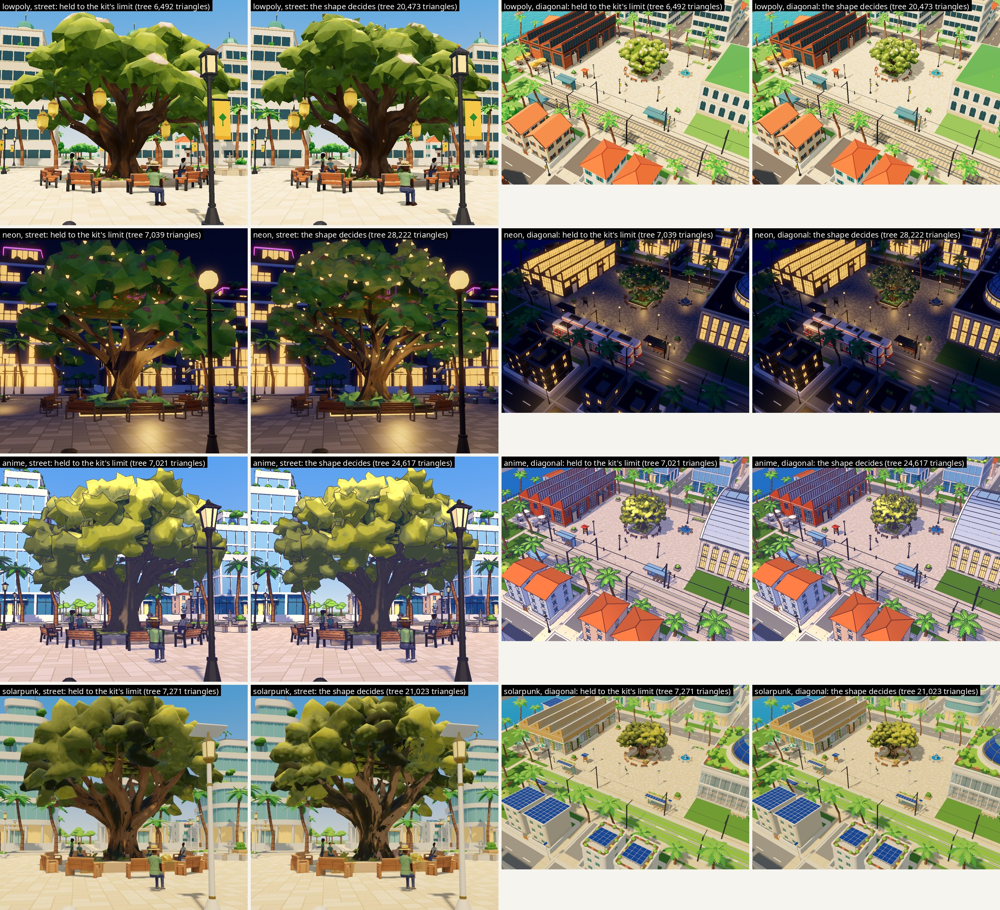

What the triangles buy is finer leaf masses and a crown that is closed from above (but for one anime street tree: see its faults); for the seats, thin parts: held to about 1,500 triangles (1,440 in `previews/neon-cafe-chair-budget.jpg`) the neon café chair's steel legs become spikes, where the kept chair has 2,997.

## How it was done

1. **Cut.** `cut_sheet.py` finds the objects on a design sheet's grey backdrop, finds the colour swatches, and writes three square images an object: the crop as it is on the sheet, a cleaned one with the swatches and the neighbours painted out, and a cut-out with its own transparency for an object with grey glass in it.
2. **Generate.** `gen3d.sh` runs one image through TRELLIS.2: 57 to 477 seconds an image on this laptop, 140 at the middle, 5.5 hours for the 121 runs of the day (`notes/gen3d-times.tsv`).
3. **Fit.** `fit_generated.py` (in Blender) makes the game piece: turned to face the way the kit's does, sized (to the kit's box, or part by part where a box would distort it: a seat's top to the kit's height, a table's column, an umbrella's pole, a tree's trunk and crown, a shelter zone by zone), pressed into its footprint's shape, cut to the triangles its shape needs, given its own texture layout, the colour and relief baked across, the colours matched to the design image, and the lights the game expects put on.
4. **Cubes** (voxel only). `voxelise.py` rebuilds the fitted piece on the kit's 0.1 m grid: a cell is filled when half of it lies inside the piece, only the faces between filled and empty are drawn, joined into the largest rectangles that fit.
5. **Place, audit and capture.** `build.py` copies the piece over the kit's in a working copy of the client; `audit.sh` runs the game's collision audit; the earlier pilot's capture tools take the same views with the kit's piece and with the new one, inside a hidden desktop.
6. **Check.** `check.py` holds each piece to its kit's spec and to the rules of its kind (`terrace_rules.py`, `fixture_rules.py`, `piece_rules.py`, `planted_rules.py`); `seat_top.py` measures the seats; `bench_pairs.sh` runs the game's own frame-time bench; `tree_metrics.py` repeats the earlier pilot's measures on the great tree.

**In parallel.** For the third batch the owner asked whether agents could work in parallel. They did, in this order:

1. Six notes were written first, one a family (`notes/contracts/`), each by an agent that read the game's code, the kits' specs and tests and the kit files and changed nothing: what the game does with the piece, what its tests hold it to, what a replacement must keep.
2. Four build agents then each took a family (terrace; fountain and tram shelter; street fixtures; low planting) with its note, a copy of the tools and a folder of its own. None could run the game or the image-to-3D model. Each returned its pieces, its changes to the tools and a report (`families/`). I built the street trees and palms meanwhile and kept the generator's queue fed.
3. Their tool changes were merged back into one set, a fork at a time. Each merge was proved by building pieces again and comparing them byte for byte with the agent's own, except the fountain agent's first, whose build did not then repeat: it was checked by the pieces' reports and by eye. Its second was proved byte for byte, four fountains differing only by a change made in the merged tools meanwhile.
4. Every piece was then placed in the game, audited and captured, and what the game showed went back to the agents that were still working.

`WORKFLOW.md` is the step-by-step for a new piece, with the traps.

## What the work found

These are the findings that change how the rest should be done. Each was met in the work; where an agent found it, its report in `families/` has the detail.

### About the game

**The collision audit holds a piece to its footprint's shape.** See "The gate" above.

**A piece the game plants by the hundred has a contract of its own.** Street trees, palms, shrubs and railings are drawn as copies of the file's first mesh. A tree's width is scaled by 0.25 m over its trunk's reach: the farthest point from the origin, between 0.15 and 2.2 m up, of everything whose material is not named as leaf (a name containing leaf, leaves, foliage or frond). So a planted tree is one mesh with a trunk material and a leaf material, its trunk upright over the origin and slimmed to that reach, and nothing but trunk in that band. A planted piece with a second file beside it, `<piece>_far.glb`, is drawn as that file beyond 90 m, in any pack (`city/godot/styles/pack_3d.gd`, `_plant`); the kits of neon, anime and solarpunk carry such files and low-poly's does not.

**The game squeezes a piece that reaches outside its footprint low down.** A piece the game fits to its footprint is scaled until nothing it draws between 0.15 and 2.2 m up lies outside that footprint. The first neon tree's leaves hung below 2.2 m beyond the bed, and the game shrank the whole tree to 58% of its width.

**The game seats a figure at one height, whatever the piece.** Filling the kit's box does not put a design's seat where the kit's is: of the first six seats only one came out right, and the others lay between 7 cm low and 9 cm high. The fit moves the top of the seat to the kit's height.

**A piece swapped into the game must be imported before the game can load it.** Swapping deletes the engine's cached import of the piece. `run_game.sh` imports first.

**A piece can stand inside another piece's holder.** The game puts a wall, a flight of steps, a fountain or a shelter in a holder node and stands a perch seat at each of its places to sit as a child of that holder; the capture tool now looks inside the holders.

**Names matter.** Materials named `lamp_glow`, `window_glow`, `fairy_glow` are lit by the game, a mesh part named `light` gets a lamp at its middle, names beginning `glass` or `neon` are lit by name, and names beginning with street, path, road, kerb, paving or asphalt turn wet in rain. Two materials given one name come out as `name` and `name.001`, and the game does not know the second.

### About the generator

**A design-sheet object is the right input.** The asset-to-sheet pilot fed the generator crops of concept scenes: two of the six came back as real trees and four as flat cards. Objects cut from design sheets came back as whole, upright objects square to the axes, in 121 runs that made 117 models by now (`notes/gen3d-times.tsv`). The exceptions were faults of the cut-out or of what was drawn (next).

**Whatever else is in the cut-out becomes geometry, and what the cutter clears is gone.** Swatches under an object become slabs and a neighbour's edge a lump, so models are generated from the cleaned crop. The cutter also took a bollard and the catenary pole beside it for one object on one sheet. And it cleared grey glass with the grey backdrop: the neon and solarpunk shelters came back as open frames with no panes and no back screen. A cut-out that carries its own transparency keeps the glass, and both shelters were generated again from one.

**Drawn water becomes solid.** The generator makes falling water as geometry fused with the stone and painted blue. In three styles that reads as drawn water once it is parted from the stone by colour and matched on its own. In neon the falls came out as dark streaked slabs hiding the centre piece; another seed gave white falls.

**The generator's metal map blacked out the textures.** It marks dark pieces as mostly metal, and a metal has no surface colour of its own, so the colour bake returned black. The fit ignores the metal map.

**Its shading normals stay on a cut-down piece and point wrong.** Blender keeps the generator's normals through the reduction, stored against faces that no longer exist. On the first seats 54 to 92% of the larger faces' area had a corner leaning more than 20 degrees off its face (the kits' pieces: 0 to 19%), so flat boards shaded as if dished. The piece's own normals, weighted by face area, cure it (`--own-normals --weighted-normals`; found by the fixtures agent). The seats were built again with them: the boards shade flat, and the textures are as before but for the anime café chair's, which was baked again and differs over about a fifth of its area (`previews/seats-normals-before-after.jpg`).

**A generated model is a shell with a second skin inside it.** Of one bench's 1,499 triangles, 295 were loose parts inside it. Dropping every face from which no ray leaves the piece frees them (`--drop-hidden`), and a lamp post then holds at half the triangles. It is not a rule for every piece: on the anime reading chair, which is cut from a rebuilt surface, it took 14,414 of 14,859 faces.

**The triangle reduction stalls on generated meshes.** A generated mesh has thousands of edges shared by three or more faces, and Blender's reduction stops on them. Rebuilding the surface from small cells first fixes it, and the fit does that by itself when a reduction ends more than 15% over what was asked. A thin shell (an umbrella's canopy) does not survive that rebuild unless it is swollen a little first.

**The generator paints darker and flatter than the image, and with the image's light in it.** A timber seat drawn in two oranges comes back one flat dark brown, and the colour match lifts it, material by material. A design image is also lit: tops light, sides dark. Baked into a texture and lit again by the game, the sides come out twice darkened; this made the first shrubs read as mossy rocks and the voxel trees' crowns dark. The cure is flat colours of the sheet's own, chosen by rank: a cube, a facet or a leaf takes one of the swatches' greens by how light the design is there against the rest (`voxelise.py --tones` for cubes; `fit_generated.py --tones-by-rank` for facets and `--leaf-swatches` for leaves).

**A flowering tree's flowers are a few percent of its texture.** Recolouring "the leaves" takes them with it: the first street trees of neon and solarpunk, whose sheets draw trees in flower, came out all leaf. A leaf texel the generator painted as a flower now takes the sheet's blossom swatch instead and is drawn a little wider (`--leaf-blossoms`; `previews/street-tree-blossoms.jpg`).

**Some things the generator does not make, and they were put back by rule:** strings of small lights; a crown that is closed from above (it sees a tree from one side and builds a ring of leaf); a plain bed, kerb, planter box or fountain rim where the generated one came out ragged; light strips; a table's column long enough to put its top at the kit's height.

### About the styles

**The sheets' greens are olive.** In every style the leaf swatches are olive to yellow (hue 54 to 75 degrees), because the image pack's briefs took their foliage palettes from the concept sheets. Built faithfully they read yellow-olive in low-poly and solarpunk and brown under neon's amber lamps, beside the kits' true greens. See "Palette" under Open decisions.

**Leaves are drawn by their normals.** The anime pack uses the engine's toon step: a face turned from the sun is drawn in shadow, at 38% of its painted colour on the new street tree. In solarpunk's daylight a closed leaf mass shows mostly its shaded sides from eye height. The kits of anime, neon and solarpunk, which share a tree builder, lean their trees' leaf normals upward for this reason, and the new street trees and palms of those three styles now do the same, as do the anime planter, shrubs and bed (`--leaf-round`, `--leaf-lift`). That, not the palette, was what made the first anime trees dull, and it took the solarpunk trees from dark khaki to the sheet's yellow-green (`previews/planted-anime_cel-lift.jpg`, `planted-solarpunk-lift.jpg`, `planted-neon_noir-lift.jpg`). The anime pack also draws an ink line wherever the surface turns sharply, so leaf masses are smooth-shaded there and carry no relief map. Lifted normals want a matt leaf: the neon pieces are built a little glossy (roughness 0.6), and with their normals leaning up the neon trees' and palms' tops took the night's light as a pale sheen, like frost on the crown. With the neon kit's own foliage roughness (0.85) it is gone (`previews/neon-leaf-roughness.jpg`).

**A night style's design sheet must be lit neutrally.** The neon tree first came as a night scene lit by its own lamps, and its colours could not be matched. The pack was changed and the sheet made again in neutral light.

**The voxel style needs its pieces rebuilt, and each kind built its own way.** A generated voxel design is blocky already, but its cubes are neither square nor on the kit's grid. A seat is rebuilt from 0.1 m cubes (a leg thinner than a cube is given the one cell that holds most of it). The great tree is built in two cube sizes with its crown's surface broken up. A street tree could not go the way of the other styles' trees at all: that route rebuilds a crown as leaf masses and a trunk as a round tube, and the cube tree came out of it ragged with its trunk in pieces. It is built from the design's own cubes instead: the crown in the kit's large cubes, each one flat green of the sheet's three, the whitest as blossom, and the trunk built as the kit's own column, because a trunk as thick as the design draws it would make the game draw the tree at about 0.4 of its width.

### About the route

**A check from the file is not the game.** Size, parts and seat height all passed on pieces that failed the game's audit. The agents' own readings of the audit agreed with it when their pieces were placed; the pieces they had not looked at in the game still showed faults a render does not: a kerb the wrong stone colour, a planter whose walls tore, plants drawn dark by the toon step, shrubs that read as mossy rocks. Each went back to its agent and was cured in a second pass.

**Parallel agents cost a merge.** Each agent changed its own copy of the one large fitting script. Forks came back with changes inside code that had changed meanwhile: one agent's own merge stopped on five places both sides had edited (`families/low-planting.md`), and where the coordinating session had restructured a function, an agent's additions had to be carried over one by one (twelve in one file for the terrace agent's second pass). What worked: keeping every agent's changes behind options of its own, merging with a rule for each conflict, merging the piece list as data and not as text, and proving every merge by building pieces again and comparing bytes. Two forks were merged by their own agents on a snapshot of the merged tools, which was quicker and safer than my doing it. Follow-up work went back to the same agent with the rule that it change only its own functions.

**A build repeats byte for byte only if nothing in it walks an unordered set.** One agent's first panel code gave the same piece in a different byte order each run. The fountain's build did not repeat either, so its first merge could not be proved by comparing files; there the cause was a mesh operation that makes its faces in a different order from run to run. Both are fixed: built twice, a fountain now gives the same bytes, and the rebuild of every piece in an empty folder matched the kept files, but for four whose settings had changed since they were built, which were taken from that rebuild and have been built only once since (`out/replay.txt`).

**A warm graphics card hides what a frame-time bench is looking for**, and so does anything else rendering on it. See Measures.

## Measures

**Frame time.** The game's own bench (`city/godot/tools/bench.gd`), run in the hidden desktop at 1920 by 1080 on the laptop's NVIDIA card, one style at a time: first with the kit's pieces until the card stops warming, then kit, new, new, kit. In the evening, with nothing else running on the machine and the card at 72 to 76 °C, "new" was every piece this record keeps. Median frame time in milliseconds:

<!-- table frame time evening -->
| Scene | Kit, first | New, first | New, second | Kit, second | New less kit |
| --- | --- | --- | --- | --- | --- |
| Low-poly, diagonal | 4.05 | 5.65 | 5.67 | 4.10 | +1.59 ms |
| Low-poly, street | 3.21 | 4.70 | 4.70 | 3.22 | +1.48 ms |
| Neon, diagonal | 3.21 | 3.57 | 3.62 | 3.15 | +0.41 ms |
| Neon, street | 2.53 | 2.88 | 2.88 | 2.50 | +0.36 ms |
| Anime, diagonal | 2.80 | 3.20 | 3.20 | 2.81 | +0.40 ms |
| Anime, street | 2.37 | 2.63 | 2.63 | 2.38 | +0.26 ms |
| Solarpunk, diagonal | 3.71 | 4.26 | 4.26 | 3.70 | +0.55 ms |
| Solarpunk, street | 2.94 | 3.41 | 3.41 | 2.93 | +0.47 ms |
| Voxel, diagonal | 3.76 | 3.73 | 3.74 | 3.82 | -0.05 ms |
| Voxel, street | 2.80 | 2.83 | 2.84 | 2.81 | +0.03 ms |
<!-- end table frame time evening -->

The two runs of each pair agree within 0.06 ms, so the differences stand clear of the runs' own spread. Every built piece together costs 1.5 to 1.6 ms a frame in low-poly, about 0.4 ms in neon, 0.3 to 0.4 ms in anime, about 0.5 ms in solarpunk, and nothing that can be measured in voxel. With every piece in place a frame takes 2.6 to 5.7 ms at the median and at most 6.6 ms at the 99th percentile, against the 8.33 ms of 120 frames a second (`bench/evening/README.md` has the 99th percentiles). The neon trees' leaf roughness was changed after these runs, which alters one number in a material and no geometry or texture.

The same bench with only the street trees and palms new and every other piece the kit's, in low-poly and neon:

<!-- table frame time trees-only -->
| Scene | Kit, first | New, first | New, second | Kit, second | New less kit |
| --- | --- | --- | --- | --- | --- |
| Low-poly, diagonal | 4.15 | 5.24 | 5.24 | 4.16 | +1.08 ms |
| Low-poly, street | 3.30 | 4.53 | 4.51 | 3.33 | +1.21 ms |
| Neon, diagonal | 3.16 | 3.26 | 3.25 | 3.16 | +0.10 ms |
| Neon, street | 2.51 | 2.64 | 2.63 | 2.50 | +0.12 ms |
<!-- end table frame time trees-only -->

The trees and palms are 1.1 to 1.2 ms of low-poly's 1.5 to 1.6 ms, and 0.1 ms of neon's 0.4 ms. One difference between the two lies in what is placed, not in the game's code: the game draws a planted piece as its far twin beyond 90 m wherever the twin's file sits beside it, in any pack, and the build places the twins only where the kit has its own, in neon, anime and solarpunk. The low-poly kit has none, so the new low-poly trees and palms were drawn in full at every distance, at 2,250 to 3,680 triangles where its kit's have 370 to 680. With the five twins built for low-poly placed beside them (774 to 776 triangles, textures a quarter the size), the same bench gives, the next morning on a quiet machine:

<!-- table frame time trees-far-swap -->
| Scene | Kit, first | New, first | New, second | Kit, second | New less kit |
| --- | --- | --- | --- | --- | --- |
| Low-poly, diagonal | 4.08 | 4.14 | 4.17 | 4.15 | +0.04 ms |
| Low-poly, street | 3.23 | 3.54 | 3.55 | 3.28 | +0.29 ms |
<!-- end table frame time trees-far-swap -->

That is +0.04 ms from above and +0.29 ms from the street, where many copies stand within 90 m and are drawn in full, against +1.08 and +1.21 ms (`bench/trees-far-swap/`). The twins were taken out again afterwards: the game copy, and every other result here, are without them. An earlier trial drew the twins at every distance and gave +0.03 and +0.11 ms (`bench/trees-as-far-twins/`); it changed the trees' triangles, vertices and texture size at once, so it shows that the full files cost, not which of the three.

Three earlier attempts are kept because they show what not to do. In the afternoon the same run was made while three build agents were working on the machine: its neon pairs agreed within 0.02 ms and gave 0.4 ms for the pieces built by then, its low-poly kit pairs differed by up to 0.44 ms (about 1.0 ms), and the pairs of the other three styles disagreed by up to 2.2 ms (`bench/afternoon/`; a run of the trees alone was spoiled the same way, `bench/trees-only-disturbed/`). At noon the card was let cool to 68 °C before each style, and what the table measures is the card warming: the last run of each style, a kit one, is the slowest in eight of the ten scenes.

<!-- table frame time noon -->
| Scene | Kit, first | New, first | New, second | Kit, second | New less kit |
| --- | --- | --- | --- | --- | --- |
| Low-poly, diagonal | 4.11 | 5.46 | 4.74 | 4.91 | +0.59 ms |
| Low-poly, street | 3.25 | 4.35 | 4.33 | 4.43 | +0.50 ms |
| Neon, diagonal | 3.13 | 3.25 | 3.70 | 3.78 | +0.02 ms |
| Neon, street | 2.48 | 2.73 | 3.51 | 3.46 | +0.15 ms |
| Anime, diagonal | 2.80 | 2.97 | 2.99 | 3.74 | -0.29 ms |
| Anime, street | 2.35 | 2.45 | 3.12 | 3.78 | -0.28 ms |
| Solarpunk, diagonal | 3.87 | 3.99 | 4.37 | 4.97 | -0.25 ms |
| Solarpunk, street | 3.04 | 3.78 | 4.14 | 4.59 | +0.14 ms |
| Voxel, diagonal | 3.78 | 3.77 | 4.18 | 5.40 | -0.61 ms |
| Voxel, street | 2.83 | 3.06 | 3.86 | 4.64 | -0.27 ms |
<!-- end table frame time noon -->

An attempt with all five styles in one run was worse: the card ended its four runs at 79 to 82 °C and later runs were up to four times slower than the first (`bench/five-in-one-run/`). The night's runs, on a cooler card, are of the first pieces as they were then (low-poly and neon only):

<!-- table frame time night -->
| Scene | Kit, run 1 | Kit, run 2 | New, run 1 | New, run 2 |
| --- | --- | --- | --- | --- |
| Low-poly, diagonal | 4.00 | 4.09 | 4.08 | 4.09 |
| Low-poly, street | 3.17 | 3.23 | 3.27 | 3.27 |
| Neon, diagonal | 3.09 | 3.14 | 3.21 | 3.30 |
| Neon, street | 2.46 | 2.51 | 2.58 | 2.72 |

Graphics card after each of those runs, in the order they ran (kit, new, kit, new): 71 °C, 74 °C, 76 °C, 77 °C.
<!-- end table frame time night -->

None of this is the project's frame-rate gate: the gate needs the real display at its own refresh rate, and I did not run it.

**The great tree against its concept sheet.** The earlier pilot's five measures of the crown from the street (contrast, fine detail, colour variety, deep shadow, highlight; none of them is anything a colour was fitted to), as a distance from the concept sheet, smaller is closer. Every tree is captured from one camera set by one box.

<!-- table tree measures -->
| Style | Kit's tree | Pilot round 2 | From the first sheet | Held to the kit's limit | New |
| --- | --- | --- | --- | --- | --- |
| Low-poly | 1.396 | 0.305 | none | 0.570 | 0.531 |
| Neon | 0.607 | 0.468 | 0.701 | 0.812 | 0.547 |
| Anime | 0.613 | 0.345 | none | 0.626 | 0.552 |
| Solarpunk | 0.956 | 0.388 | none | 0.837 | 0.715 |
| Voxel | 1.518 | 1.036 | none | none | 1.654 |
<!-- end table tree measures -->

By these measures four of the five new trees are closer to their concept sheets than the kit's trees, and the voxel tree is a little further. None is as close as the tree the earlier pilot built by hand in its second round, and each is closer with the shape deciding its triangles than held to its kit's limit. The measure has no spread of its own: the views are taken at a fixed moment of the game's day, and three captures of one state gave the same figure three times (`out/tree-metrics-repeat.txt`). What the new trees have that the measures do not see is structure: a branching trunk, separate leaf masses, hanging lanterns where they survived, strings of lights, a bed with a kerb. Whether that is the better tree is for the eye to judge in the pictures.

**File size.** Textures are WebP inside the files. Outside voxel a bench or chair is 0.24 MB to 0.57 MB and a great tree 2.3 MB to 3.0 MB, where the kit's are 14 kB to 38 kB and 0.38 MB to 0.64 MB; a prop is 71 kB to 3.3 MB. A voxel piece is 3 kB to 0.17 MB, and the voxel kit's are 3 kB to 0.40 MB. The pieces together are 58 MB where the kit's pieces they replace are 6.9 MB: a generated piece carries a texture of its own, and a kit piece carries colours on its corners.

**Time.** Machine time a piece: one to eight minutes to generate; a fit takes about ten seconds for a seat, a street tree or a flowerbed and half a minute for a great tree, a fountain or a shelter (all 179 files are fitted in twelve minutes with the five styles side by side); a capture of all of a style's pieces takes one start of the game. The four build agents took between 85 minutes and three hours each for a family of three pieces in up to five styles, most of it writing the rules for a kind of piece the route had not met; each was asked for 45 to 60 minutes. Three of them took about as long again for a second pass, on the styles whose models came late and on what the game showed. Merging their tools took me about as long as one agent's work.

## Not done

- **Pixel art.** It needs a sprite route that is not worked out.
- **Most of the pack.** The image pack lists 126 design sheets; the pieces here are built from 43 of the 58 images made so far. The guild hall, the surfaces (paving texture, material boards, leaf atlases), the meadow clumps, the planter pot and the catenary pole are not built.
- **The frame-rate gate** on the real display. The shrubs' and the railings' frame cost is not measured apart from the rest.
- **Character and movement.** Untouched.
- **The kits' own test suites** were not run on these pieces (they test the files in the repository, and these are not in it). Of what they hold a file to, the pinned glTF validator was run on every piece; the byte-for-byte rebuild test cannot pass for a generated file.
- **Sitting close up.** The benches' sitters are shown in `compare/sitters.jpg`; no capture shows a figure at a café table, in a shelter or on a fountain's rim.
- **The real screen.** Everything was captured in a hidden desktop.

## Known faults in the pieces

Family by family; each family's page in `families/` has the rest.

**The seats and the great tree**

- **The anime great tree is the weakest of the first set.** The generator built its crown as a hollow ring of thin leaf, and two more runs from other seeds gave the same (`previews/anime-tree-three-seeds.jpg`). It is filled by rule, but from above it still reads as a ring round a busy middle, its silhouette is jagged and it has lost its lanterns. Its sheet is to be made again (the owner's decision).
- **Palette.** Outside neon the great trees carry their sheets' olive and yellow greens, and the seats their designs' colours, darker and redder than the kit's in low-poly and anime.
- **Lanterns.** The low-poly tree keeps five (0.86 to 1.05 m tall, as drawn; the kit hangs eleven of half that size) and the solarpunk tree some small ones. The anime, neon and voxel trees have none of the lanterns their sheets draw.
- **Stretch.** The seats are stretched to the kit pieces' boxes, by 1.2 to 1.8 times on one axis against another, because the designs' proportions are not the kit's; moving the seat's top to the kit's height stretches them again in two parts; and pressing them into their footprints' shapes moves parts again: every reading chair's seat is set back between its arms by a sixth of its depth (nearly a quarter in voxel), and a bench's back is drawn to its rear edge along its whole length.
- **Design colours not found.** The anime perch seat shows 58% of its design's colours, the anime great tree 68% and the low-poly reading chair 74%.
- **Low-poly reading chair.** Its timber carries blotchy painted shading, and its pillow lies where a sitter sits.
- **Low-poly bench.** At 1,500 triangles its two seat boards read as one slab.
- **Low-poly tree.** Pale patches with dark centres show on its crown; their cause is not traced.
- **Solarpunk café chair.** Its seat came out charcoal with a few wood streaks where its design draws tan slats, while its back and the tops of its legs are tan (`previews/solarpunk-cafe-chair-seat.jpg`; no comparison sheet shows it, because the table hides the seat in both eye frames). The brass its design draws on the legs was never one of the colours matched.
- **Neon tree.** Its leaves are the kit's green, not the design's. Its crown is a mass of irregular facets where the kit's is leaf cards.
- **Voxel tree.** Its crown's broken surface comes from a fixed pattern, not from the design.
- **The neon armchair's light bar** glows but lights no floor (nor does the kit bench's strip). The neon tree's bed strip does, through one small lamp.
- **The neon worn bench** is poor: its mesh needed the rebuild route and the texture smeared.

**Street trees and palms** (`families/street-trees-and-palms.md`)

- The sheets' greens, as decided: yellow-olive in low-poly, olive in anime, yellow-green in solarpunk. Blossoms are flat patches on the neon and solarpunk trees and missing from the low-poly ones.
- Crowns are masses of facets, pressed to two thirds to seven eighths of their drawn height by the fork raised clear of the walking band. They are closed from above but for the large anime tree's, which has a hollow at the top that shows its inside and trunk (`compare/trees-anime_cel.jpg`, from above).
- Palms stand 3.5 to 9.4 cm off their point.
- Triangles: 2,230 to 4,140 a copy outside voxel against the kits' 370 to 1,670, and 608 copies in the district.

**Terrace** (`families/terrace.md`)

- The planters' plants are jagged leaf facets, not the designs' rounded clusters, and the same leaves repeat where a bare middle was filled.
- Table tops carry no plank lines in colour; the joints survive only as relief.
- An umbrella's base is a low plate under the table's feet, not the drawn block, and its pole is thinner than drawn below the table's top.
- The solarpunk table has no slats, brass rim or brass leg tips, and four legs where its sheet draws three.
- The voxel umbrella is two triangles under its kit's limit and stands 2.8 m against the kit's 2.7; its base is dark where the design draws pale stone.

**Street fixtures** (`families/street-fixtures.md`)

- The neon railing has none of its design's lit strips.
- The solarpunk railing, a row of planter boxes, breaks up at the 952 triangles a railing is held to; it holds at about 4,000.
- The solarpunk bollard was taken out of a model that held two objects, and nothing on it glows.
- The voxel lamp post is nearly black in daylight: its cubes are its sheet's own dark grey. The voxel railing's post carries two dark bands its design lacks.
- Railings are as deep as their sheets draw them, 20 to 40 cm against the kits' 14 to 20, so a fence stands 11 to 21 cm off the floor's edge.

**Low planting** (`families/low-planting.md`)

- The shrubs built as leaves on a dark inside (low-poly and solarpunk, and the leafy ones of anime and neon, which the game does not draw) read as bushes, and dark: the inside shows between the leaves, most in solarpunk. Their hoop of leaves round the ring is evenly spaced.
- The round shrub in anime and neon is still a closed skin with its leaves only painted on; the game draws it 1.9 times wider than built, which smears them.
- A bed's plants are pressed to a third to two thirds of their drawn height, because the kit's box is 0.6 m and the kerb takes 0.3 m. Kerbs are plain boxes with their joints painted.
- The voxel shrub is a flat cap of two levels on its drum, and the voxel bed's plants stand one or two cubes above the kerb.
- The meadow clumps are not built: the game's sway shader takes no texture, and the sheets draw clumps more than twice as wide as the kits' (the planting's spacing depends on that width).

**Fountain and tram shelter** (`families/fountain-and-shelter.md`)

- The anime shelter's bench is 0.59 of its drawn length (the footprint allows 2.4 m), and beside it the wall is open below 0.84 m.
- The low-poly shelter has nothing that glows at night; its end sign is squeezed to 13 cm.
- A fountain's wall is taller than drawn (the game seats people on its rim at 0.45 m), and its streams end in points at the water.
- The anime fountain's troughs came out timber-coloured; the solarpunk fountain's plants are coarse.
- The neon shelter has none of the amber lines round its soffit, nor the magenta strip; the solarpunk shelter's frame came out near black where its design draws brass, its back is a copy of the front's picture, and the lamp strips under its roof are not lit.
- The neon fountain's falling water is white ribbons standing round the centre piece, and its centre piece's amber strips are missing.
- The voxel fountain has twice its kit's triangle limit, and its basin is a smooth ring in one stone colour, not the design's stepped cubes.

## The owner's decisions

Made on 2026-10-02 at 12:15, in the owner's words: "Keep the design sheets' greens, Keep \"the shape decides\" for triangles, Yes, redo anime great tree."

1. **Plants keep their design sheets' colours.** One exception I made and reported: the neon street trees and palms are placed in the neon kit's greens, because the neon sheet's leaf colours read brown in the game; the sheet-coloured ones are built too (`out/neon_noir/`).
2. **The shape decides a piece's triangle count**, not the kit's limit.
3. **The anime great tree is to be made again.** A redo batch of three sheets is in the image pack (`01b-redo`); it had not been run when this was written.

Made on 2026-10-03, in the owner's words: "300 MB should not be an issue" and "we will put pieces into the game later."

4. **This record and the image pack are committed whole**, the built pieces and the cut-outs included.
5. **The pieces go into the game later**, as work of its own.

## Decisions I made for you

All can be reversed by changing `tools/assets.json` and running the build again. The agents' reports list theirs in full; these are the ones that show.

1. **Pieces are pressed into their footprints' shapes** where the game's audit needs it: a reading chair's seat is set back between its arms, a bench's back stands on its rear edge, splayed legs are drawn in.
2. **Three kinds stay near their kit's triangle limits** although the shape decides elsewhere, because the game draws many of each: the perch seat (36 places to sit on walls, steps, rims and in shelters), the railing panel (226) and its post.
3. **The neon street trees are placed in the kit's greens**, and the neon great tree, built from its second, neutral-light sheet, has its leaves moved to the neon kit's leaf green (`#296238`).
4. **Things the generator does not make are put back by rule**: lights, a crown's filling, plain beds, kerbs, planter boxes and a fountain's wall and rim, light strips.
5. **The seats and great trees take the kit pieces' boxes and seat heights**, so the game's footprints and sitting figures still fit. Lamp posts, railings and planters keep what their sheets draw on one or two axes instead (a lamp post is scaled evenly to its height; a railing is as deep as drawn; a planter's box is 0.45 m high and its plants as high above it as drawn). Each departure is declared in `tools/assets.json` and printed by the check. Which way to go for the rest is the open decision on proportions.
6. **Colours** are matched to as many design colours as the sheet shows swatches for the object where that is counted, to five otherwise, and a tree's leaves follow its sheet's leaf swatches from dark to light.
7. **The perch seat** is built where the sheet draws it as the game uses it, a plain seat stone with a board (anime, solarpunk, voxel).
8. **Voxel** pieces are cubes of 0.1 m. The great tree's are 0.25 and 0.75 m with its crown's surface broken up by rule. The street trees keep the kit's cube sizes and the kit's trunk, not the design's finer cubes and thick trunk.
9. **Falling water is kept**, as still geometry in a part named `water`; a fountain's basin is one flat disc painted from the generated water.
10. **An umbrella stands on a low plate** under its table's feet, and its pole is thinned below the table's top so that the table's column hides it.
11. **A shrub is leaves standing on a dark inside**, with its widest ring on the kit's reach: the generated ball's own leaves as separate blades, and its flowers rebuilt in the sheet's colours. The round shrub of anime and neon is still the first build, a closed skin with its leaves painted on (the same shrub built as leaves is offered in `out-leaves/`). A bed's plants may hang 3 cm over its kerb.
12. **The middle palm** has no design object and is the tall palm's model at the middle palm's size. The neon trees and palms take the neon kit's foliage roughness (0.85) where every other neon piece is built at 0.6.
13. **Textures are WebP** inside the files; the voxel pieces' small flat textures are PNG. Zero tangents are mended in the written files so that the kits' validator passes.
14. **The first set's models were not generated again** when the cleaned crop came; only the four that came with junk were. For the props every model is from the cleaned crop, two shelters from the cut-out with its own transparency, and the neon fountain from a second seed.

## What the batches say about the image pack

The pack's README set six questions for the pilot. The answers, from the first two batches (28 images, 18 of them run through the image-to-3D model):

1. **Does a design sheet hold the style?** Low-poly, anime, solarpunk and voxel: yes. Neon: the objects are right but drawn near-photoreal, not stylised. Pixel: no.
2. **Is the layout usable?** Yes: whole objects on a plain backdrop, with swatches. Views of one object do not agree in detail, and neighbours and swatches have to be painted out of a cut-out before the model sees it.
3. **Is the night style readable in neutral light?** The seats, yes. The tree only once the sheet was asked for again in neutral light.
4. **Do the shapes work in the image-to-3D model?** Yes. A crown drawn as airy layers of small leaves (the anime tree) comes back hollow; one drawn as solid clumps comes back whole.
5. **Does a repainted frame keep the layout?** Yes. It stays close to the capture.
6. **Do the pixel sheets keep one pixel size?** No.

The pack was revised from these and from two reviews of it (`notes/pack-review-*.md`); see "Changes after the pilot batch" in `docs/vision/asset-studies/README.md`.

The third batch (30 sheets, six kinds of sheet in five styles) says more, all of it about what the game needs of a piece that the briefs did not know to ask for. None of this is changed in the pack yet, so that the redo batch stays as it was written:

- **Planted trees need a clear stem and a slim trunk.** All eight street trees outside voxel were drawn forking between 1.45 and 1.92 m, inside the band the game measures a trunk in, and six with trunks reaching further from the axis than the 0.25 m the game allows before it shrinks the tree (four of them over half a metre thick). The fork is raised and the trunk slimmed by rule, which presses the crown. A brief that asks for a single stem to 2.4 m, no thicker than a tenth of the crown, would need neither.
- **Blossoms should be drawn as fewer, larger clusters.** The generator keeps about 3% of a flowering crown's texture as flowers where the sheet draws far more, and the low-poly sheet's handful of small cream flowers left nothing that could be told from lit leaf.
- **Foliage palettes.** The briefs take them from the concept sheets, and they are olive to yellow in every style. This is the palette decision; if it changes, it changes in `data/styles.json`.
- **Objects on a shared sheet need more room between them and a backdrop they stand out from.** The cutter took a bollard and the pole beside it for one object, took a swatch for an object, and clipped a pale post on the pale backdrop. Grey glass on the grey backdrop is now handled in the cutter.
- **A voxel sheet should use its kit's cube sizes.** The voxel railing's cubes are twice the kit's, and the street trees' crowns are drawn in cubes of about 0.3 m where the kit builds in 0.5 m.
- **A railing panel has to be plain enough for a thousand triangles.** Solarpunk's is a row of planted boxes.
- **A shelter's bench should be as long as its footprint allows** (2.4 m), not the whole shelter; a lamp's banner should hang no lower than 2.2 m; a planter's and a bed's plants should stay inside the box's outline.
- **Drawn falling water** came back as usable geometry in three styles and as dark slabs in one; a second seed cured it. It does not need a change to the brief.

## Open decisions

1. **Palette.** Outside neon the new plants carry the sheets' olive and yellow greens, as decided, and the town reads differently for it: `previews/planted-<style>-three-ways.jpg` sets the kit's trees, the new ones in the sheets' greens and the new ones in the kit's greens side by side for four styles. If the sheets' greens are not what is wanted in the game, the pack's foliage palettes are the place to change them (`docs/vision/asset-studies/data/styles.json`), or the pieces can take the kit's greens as neon's do.
2. **Proportions.** Keep the kit's boxes (stretching the designs) or let a piece take its design's proportions. The seats and trees are stretched to the kit's boxes; lamps, railings and planters keep what their sheets draw on one axis or two, which is declared piece by piece. The catalogue's footprints and the sit anchors hold either way so far.
3. **Triangles for the planted pieces.** Measured ("Frame time" under Measures): drawn in full at every distance, the new low-poly trees and palms cost 1.1 to 1.2 ms a frame. With the game's own far swap switched on, by placing the five far twins built for them beside them, they cost 0.04 to 0.29 ms, and nothing in the game's code changes; in neon, where the twins are placed, they cost 0.1 ms. So for low-poly the ways to go are: place the twins (the trees stay as built within 90 m; `previews/lowpoly-far-twins-close.jpg` shows what a twin looks like close up, and beyond 90 m that is all that shows); cut the trees and palms themselves to fewer triangles (`previews/lowpoly-trees-full-and-far.jpg` shows the town with them all drawn as twins: the palms lose little, the street trees' crowns turn into a few coarse lumps); or accept the 1.1 to 1.2 ms, with which a low-poly frame is 4.7 to 5.7 ms at the median against the gate's 8.33 ms. The shrubs and railings are not measured apart.
4. **The anime great tree's sheet** and the two other redo sheets: run batch `01b-redo`.
5. **How the pieces go into the game**, later, as decided on 2026-10-03. Going into the kits would mean the kits' own tests: the byte-for-byte rebuild test cannot pass for a generated file, the validator needs every piece's tangents mended, and the kits' triangle limits would have to be raised or the pieces held to them.

## Running it again

```sh
docs/research/2026-10-02-design-sheet-to-asset/tools/setup.sh /some/work/dir
export AGENTNAGAR=/path/to/agentnagar
/some/work/dir/work/run_all.sh                 # the seats and the great tree: cut, generate, fit, capture, audit, check
/some/work/dir/work/props_run.sh anime_cel     # a style's props on top of them: place, audit, capture
/some/work/dir/work/sheets_all.sh anime_cel    # its comparison sheets
```

It needs uv, rsync, Blender 5.2, the game's development environment (`.local/dev-env.sh`), KDE's `kwin_wayland` and `setpriv` for the hidden desktop the captures and the bench run in, and for the generating step trellis.cpp with the TRELLIS.2 weights (`tools/gen3d.sh` says where it looks).

Every piece kept here was built again from nothing for this record. `tools/replay.sh` makes an empty folder, cuts the sheets again, and fits every piece from the generator's output (the slow step, which is not repeated) with the tools as they are, the five styles side by side: twelve minutes on this laptop when it is doing nothing else. All 124 files of `out/`, the 40 trees and palms of `out-kit-green/` and the neon tree from its first sheet came out byte for byte the same as the ones kept, which had been built at different hours of the day by the coordinating session and by the four agents (`out/replay.txt`); so did the two shrubs of `out-leaves/` when the comparison was widened to them (`out/replay-after-adopting.txt`). The seats held to their limit and the worn benches were older than their settings and came out different; the ones kept here are the rebuilt ones (`out/replay-after-adopting.txt`). One setting changed after that, the neon trees' and palms' leaf roughness: the ten neon pieces were fitted again, and a rebuild of the neon style alone in another empty folder gave all 43 neon files byte for byte as kept (`out/replay-neon.txt`). After the last review the solarpunk small street tree was fitted again with its foot cleared (one new option, used by it alone), and a rebuild of the solarpunk style alone gave all its files byte for byte as kept (`out/replay-solarpunk.txt`). No other fitting setting changed. The captures, the audit, the checks and the game's tests were run on the pieces as kept. The frame-time bench is not part of any of these scripts; `WORKFLOW.md` says how it is run.

## How this record was checked

Three times by a second agent given the record with one instruction: check every claim against the files, look at every picture, read the code, change nothing.

- After the night's part. It found, among others, that the new seats did not sit at the kit's seat heights and that the neon tree was still squeezed by the footprint rule (`notes/record-review.md`).
- At noon, of the 23 pieces in five styles: 45 findings, two of them must-fix. One was that "colour off the design" had been measured before a tree's leaves were recoloured. The other was that the game's own tests had not been run with the pieces in place, which led to everything under "The gate" (`notes/review-five-styles.md`; what was done about each finding, `notes/review-five-styles-answers.md`).
- In the evening, of the whole record as it stands here, with every piece of the third batch in it. Its report is `notes/review-evening.md`, and what was done about each finding is `notes/review-evening-answers.md`.

Every table here is written from the result files by `tools/report_tables.py`.

## Files

- `tools/`: the scripts and `assets.json` (which sheet, which object, which kit file, how each piece is fitted).
- `inputs/<style>/`: the cut-outs given to the generator for the first set (the props' are made again by the cut step from the sheets in the image pack).
- `out/<style>/`: the pieces and each one's report; `out/check.txt`, `out/seat-heights.txt`, `out/tree-metrics.txt`, `out/tree-metrics-repeat.txt`, `out/results.json`, `out/audit*/` (the game's audit with the kit's pieces, with the first set and with everything; the one line each run printed is `out/audit*-<style>.txt`), `out/game-tests.txt` (and `-2030`, `-work_app`), `out/boot-test.txt`, `out/validator.txt`, `out/validator-all.txt`, `out/replay.txt`, `out/replay-after-adopting.txt`, `out/replay-neon.txt`.
- `out-budget/<style>/`: the 10 first-set pieces held to their kit's limit. `out-first-sheet/neon_noir/`: the neon tree from the first sheet. `out-worn/<style>/`: the worn benches. `out-kit-green/<style>/`: street trees and palms in the kit's greens. `out-leaves/<style>/`: the round shrub built as leaves.
- `compare/`, `previews/`: the sheets shown and named above.
- `families/`: the four build agents' reports, with what the game showed of their pieces afterwards, and the street trees' own page.
- `bench/`: the frame-time runs (`evening/`, `trees-only/`, `trees-as-far-twins/`, and the earlier attempts `afternoon/`, `trees-only-disturbed/`, `noon/`, `night/`, `five-in-one-run/`), each run's result and temperature files, with a README in the newer ones.
- `notes/`: the collision audit, the six contract notes, the reviews of this record and of the image pack, the timing log of the image-to-3D runs, and the figures quoted from runs whose files were replaced (`observations.md`).
- `WORKFLOW.md`: the steps for a new piece, and the traps.

The generator's raw output and the game captures are not here. They are in the working folder on the laptop, `.asset-pilot/2026-10-02-sheet-to-asset/` beside the checkout, with a ledger.

## AI and licences

The design images were made by an image model (OpenAI, through the owner's ChatGPT subscription) from the pack's instructions; the 3D models and their textures by TRELLIS.2 from those images. Neither has a human author. The fitting scripts, this record, the agents' reports and the notes were written by Claude (an AI) and are SJL's. `REUSE.toml` carries the annotations for this folder, on the same lines as the asset-to-sheet pilot's.
