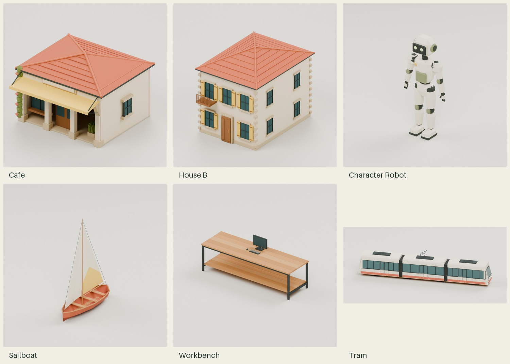

# Tropical Blender collection

Original AI-assisted Blender asset study, authored with Codex on October 3–4,
2026 and added to the repository on October 5. These are versioned candidates;
the active assets in `city/godot/styles/lowpoly_tropical/assets/` are unchanged.

[Open the gallery](gallery.html) · [Provenance and licences](SOURCES.md) ·
[Measured GLB inventory](reports/glb-validation.json)



## Contents

- 82 editable Blender sources, GLB exports and measured JSON records in
  `assets/lowpoly_tropical/`: all 71 existing kit filenames, five distant tree
  variants and six additional planned designs.
- 26 approved assets preserved byte-for-byte and 56 additional exports.
- Three illustrative assembled scenes in `assemblies/`: hall, library, bridge.
- Human and robot with 17-bone rigs and idle, walk, sit and typing clips.
- 23 concept sheets, modelling scripts, compact rendered previews and evidence.
- The approved fountain flow shader/controller under `godot/fountain_flow/`.
  Flow runs in Godot; it is not an animation embedded in the GLB or Blender file.

Open a `.blend` file directly in Blender. To browse the gallery, serve the
repository with `python3 -m http.server 8000 --bind 127.0.0.1`, then open
`http://127.0.0.1:8000/docs/research/2026-10-03-tropical-blender-collection/gallery.html`.
GitHub displays HTML source rather than running the gallery.

## Validation and limits

The original isolated Godot test copy used base commit `0795960`. Its archived
reports record 105 focused checks passing, 38 vehicle/ride checks rerun after
final tram changes, six shared tram contract checks, and zero offenders in all
six collision gates. These are local study results, not current production or
remote CI results. `reports/verification-summary.json` describes that study.
The repository addition rechecks GLB validation, byte identity, gallery links,
licence mappings and documentation. See [addition checks](reports/repository-addition.json).
No active runtime code changes here.

Detailed towers are about 22k triangles each, tram 18k, houses 6.4–6.6k and
pegboard 7.6k. These exceed earlier budgets. Whole-city performance and LOD
work remain before adoption. Generated concept views are design guidance,
not engineering drawings. Runtime pivots and clearance requirements take
precedence; component-specific decisions are in the reports.

## Rebuild and inspect

Blender 5.2.2 was used for authoring. From this directory:

```sh
blender -b -noaudio -t 2 --python scripts/build_architecture.py
blender -b -noaudio -t 2 --python scripts/build_architecture_assemblies.py
blender -b -noaudio -t 2 --python scripts/build_props_complete.py
blender -b -noaudio -t 2 --python scripts/build_characters_complete.py
blender -b -noaudio -t 2 --python scripts/build_transit_sky.py
blender -b -noaudio --python scripts/render_assets.py -- ours cafe,house_a,tram hero,rear
```

Builders find repository context relative to this directory. They overwrite
new asset outputs; work on a branch. The 26 carried-forward assets retain their
editable Blender sources; their earlier builder scripts are not required for
editing. Rendering writes PNGs; `python3 scripts/compact_previews.py` converts
them to the JPEG paths used by the gallery (requires Pillow). GPU rendering
uses OptiX when available and otherwise falls back to CPU.

Install the existing pinned validator from the repository root, then validate:

```sh
npm ci --prefix prototypes/voxel-work-bay/tools
node docs/research/2026-10-03-tropical-blender-collection/scripts/validate_glbs.cjs
```

## Storage

This collection follows the repository's regular-Git storage convention.
Every individual file is below 3 MiB. The generated ZIP, disposable Godot test
copy, caches, Blender backups and original full-size PNG previews are omitted.
Model bytes are preserved; preview JPEGs are compressed derivatives. No Git
LFS setup, paid storage or billing settings are introduced by this addition.
