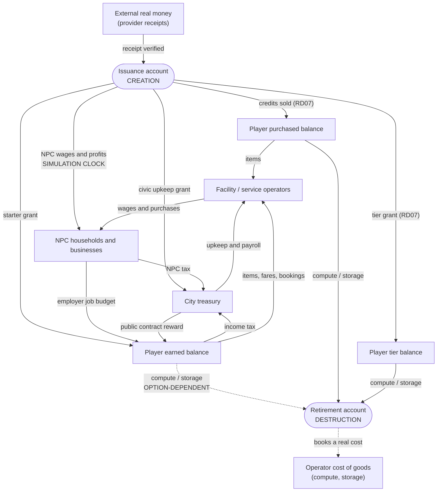

# Where credits come from, and what each one costs

Model and desk research · 2026-09-18 · [Plan index](../README.md)

**Evidence limits.** This is a toy model with placeholder parameters. It shows
structure and sensitivities, not forecasts. There is no playtest data, no
measured hosting or inference cost, no pricing research and no user. Every
figure below is produced by
[`models/economy_model.py`](models/economy_model.py) from parameters written at
the top of that file; changing a parameter changes every number that depends on
it, which is the point. Nothing here is a proposed price, reward, tax rate,
term or cost, and nothing here is legal, tax or accounting advice. The
regulatory notes are flavour for a conversation with a qualified adviser.

This brief answers the questions opened by the
[2026-09-18 decisions](../planning/VISION_DECISIONS.md#decisions-recorded-on-2026-09-18):
credits are earned, bought or included with a tier (RD07) and they buy facility
access, items, **compute and storage** (RD08). It is the model the
[economy brief](../gameplay/ECONOMY.md#open-questions-the-decisions-create),
[operating model](../vision/OPERATING_MODEL.md#op04--credits-earned-bought-or-included),
[civic simulation](../gameplay/CIVIC_SIMULATION.md#the-simulation-economy) and
[reading garden](../gameplay/scenarios/READING_GARDEN.md#known-limitation-no-source-of-new-money)
each defer to. `JC` remains the working label (RD06). It owns the arithmetic
only: the legal character of a purchased credit belongs to
[legal and compliance](LEGAL_COMPLIANCE.md), provider and checkout mechanics to
[payments and credits](PAYMENTS_AND_CREDITS.md), and measured per-task
inference cost to [agent runtime costs](AGENT_RUNTIME_COSTS.md).

## The one sentence that reorganises the economy

Before RD08 a credit was a token in a fiction. After RD08 a credit is a claim
on a graphics card and a disk. **Every faucet is therefore a liability**, and
its size is set by decisions nobody has taken: how fast credits are earned, how
many accounts one person may hold, and how fast the NPC simulation runs. Three
findings are worth acting on before any price is chosen.

1. Under a single fungible balance the operator's real cost is dominated by
   **earned** credits, not purchased ones: in the baseline run, redeemed
   service credits cost $10,528 against $645 of credit revenue, a ratio of
   16:1. That ratio is a design choice, not a market fact.
2. A farmer with ten free alternate accounts extracts **$1,003 of real
   compute a year** under a single balance, **$449** when faucets are budgeted,
   **$137** behind a capped reviewed window and **$0** when earned credits
   cannot reach real-cost services at all.
3. Under today's fixtures a casual resident reaches the 800 JC cottage in
   **one week, on two to three hours of play** — or in 0.7 hours, or in 6.0
   hours, depending only on how long somebody decides a job takes. The
   fixtures do not pin the rate at all.

## A. The accounting frame

### Every account

| Account | Unit | Who holds it | Notes |
| --- | --- | --- | --- |
| Player earned balance | JC | One per account | Faucet-fed; nobody paid money for it |
| Player purchased balance | JC | One per account | Issued against a verified receipt (RD07) |
| Player tier-granted balance | JC | One per account | One-time or recurring per [Residency](../gameplay/RESIDENCY.md#what-a-tier-includes-and-for-how-long) |
| City treasury | JC | One city account | Funds public contracts, upkeep, projects |
| Facility / service operators | JC | Per facility | Simulated staff, suppliers, service recipients |
| NPC sector | JC | Cohort accounts | Simulated households and businesses |
| Issuance | JC | City authority | Signed contra-account; every mint debits it |
| Retirement | JC | City authority | Every credit destroyed lands here |
| External real money | currency | Outside the city | Provider receipts, refunds, chargebacks |
| Operator cost of goods | currency | Outside the city | Real compute, storage, bandwidth, support |

The last two are in a **different unit**. JC and currency postings never
balance against each other — already the rule in
[ECONOMY.md](../gameplay/ECONOMY.md#technical-contract-and-payment-lifecycle) —
and the model enforces it by keeping currency outside the credit ledger.

### Every faucet and sink, classified

| Flow | Kind | Real cost at the moment it happens? |
| --- | --- | --- |
| Starter grant to a new account | **Creation** | No, but it is a claim on future cost |
| Contract reward from treasury | Transfer | No |
| Contract reward from an NPC employer budget | Transfer | No |
| NPC wage and profit generation | **Creation** | No — this is the hidden mint |
| NPC tax into the treasury | Transfer (of minted money) | No |
| Player income tax | Transfer | No |
| Credits bought with money | **Creation against a receipt** | No — revenue arrives first |
| Tier-included credits, one-time | **Creation against a receipt** | No |
| Tier-included credits, recurring on a lapsed tier | **Creation, unfunded** | No — pure liability |
| Scenario or civic upkeep grant | **Creation** | No |
| Buying an item, furnishing, fare or booking slot | Transfer | No (authored content) |
| Paying a utility bill or virtual tax | Transfer | No |
| Gift or transfer between accounts | Transfer | No — but it launders provenance |
| **Spending credits on compute or storage** | **Destruction** | **Yes** |
| Purchased credits refunded | Destruction + currency refund | Reverses revenue |
| Expiry of unspent credits | Destruction | No |

Two rows create credits against money: purchase and one-time tier grant. Four
create credits against nothing: starter grants, NPC income, civic grants, and a
recurring grant on a lapsed tier. Exactly one row costs the operator money at
the moment it happens. The design problem is the gap between those sets.



The dashed arrow from the earned balance to retirement is the entire argument
of section B. Whether it exists, and how wide it is, decides the operator's
exposure.

### Answering problem 1: sources and sinks were unspecified

They are enumerated above and implemented in the script. Two rules fall out of
the enumeration and should be adopted as invariants, not aspirations:

```text
1. Every credit that exists was either transferred from an account that
   already held it, or created against a NAMED issuance reason.
2. Sum over all accounts, including issuance and retirement, never changes.
```

The model asserts rule 2 after every weekly step; it holds across all five runs.

## The clock problem (problem 2)

[CIVIC_SIMULATION.md](../gameplay/CIVIC_SIMULATION.md#the-simulation-economy)
computes treasury income as a tax on simulated household income and business
profit. Both are produced by the simulation, so the tax is not a transfer from
a pre-existing pool — the money is created one step earlier and then moved:

```text
NPC income created per week = base_income_per_week x clock_multiplier
NPC tax to treasury         = NPC income created x npc_tax_rate
treasury -> human rewards   = transfer of freshly created credits
```

The model uses the [city lab](../../prototypes/city-lab.html) coefficients —
40 households at 100 income per day, taxed at 10% — as its placeholder base.
At clock x1 that mints 1,456,000 JC across the simulated year and delivers
145,600 JC to the treasury. At clock x10 it mints 14,560,000 JC and delivers
1,456,000 JC. Share of human contract demand the city can fund rises from
**79% to 100%**, and credit supply per account at week 52 rises from 2,111 to
2,661 JC.

Nobody chose that. A world-speed setting changed the human earn rate by a
quarter and, under RD08, changed how much real compute the population can
claim: under a single fungible balance the operator's annual service cost rises
from $10,528 to $13,109 for the same players doing the same things. Treat NPC
income generation as issuance with a published wall-clock budget, or fence
NPC-sourced treasury credits to fictional services only. Both are options the
civic brief already lists; the model prices not choosing.

## B. Four ways to settle a credit that buys real compute

Each option changes only the settlement rule; player behaviour, earn rates and
demand are held constant, so the columns are comparable. `Farmer take` is the
operator's real cost of the compute one person's **earned** credits redeem
across their alts.

| Option | Cost/yr | Credit revenue/yr | Net exposure/yr | Per account/mo | Farmer take/yr |
| --- | ---: | ---: | ---: | ---: | ---: |
| (i) single fungible balance | $10,528 | $645 | $9,883 | $7.36 | $1,003 |
| (ii) dual; earned buys only zero-cost things | $495 | $645 | **−$150** | $0.35 | **$0** |
| (iii) dual + capped reviewed window | $1,680 | $645 | $1,035 | $1.17 | $137 |
| (iv) fungible, faucets budgeted from a pool | $8,052 | $645 | $7,407 | $5.63 | $449 |

Placeholders: credit price $0.0100, service cost $0.0080 per redeemed credit,
110 accounts of which 10 are one person's alts.

| Option | Farming exposure | Player experience | Accounting complexity | Regulatory flavour (not advice) |
| --- | --- | --- | --- | --- |
| (i) | Unbounded. Any faucet, any exploit, any clock change converts directly into compute | Simplest to explain: one number, buys everything | One balance, one posting | Worst case. One fungible balance sold for money and redeemable for a service looks most like stored value in most markets |
| (ii) | Zero by construction. Liability can never exceed credits sold | Two numbers to explain; earned credits feel second-class and the "residents build products here" promise weakens | Two balances, provenance per lot, spend-order rules, refunds to origin | Cleanest separation: earned credits are a game score, purchased credits are a prepaid service balance |
| (iii) | Bounded and reviewable: cap x accounts that pass review | Preserves the promise — contribution really can earn compute — with a visible monthly ceiling | Two balances plus a per-period cap, a review queue and a funded allocation | Mixed bucket; the free tranche resembles a promotional credit and should carry those terms |
| (iv) | Bounded in aggregate but not per person: a farm competes with real players for the same pool | Rate varies with total demand, which is hard to explain and feels arbitrary in a bad month | One balance plus a city-wide issuance budget and a scaling rule | One fungible balance again, with an internal budget the player never sees |

**How the numbers behave.** Option (ii) bounds liability by construction, and
the model asserts it: `liability <= revenue` always. Option (iii) is the only
one that keeps RD08's promise — that earned contribution can buy compute —
while keeping the bill finite and attributable. Option (iv) bounds the
*city-wide* bill but not the *per-person* one: a farm with ten alts still takes
$449 a year, because a budget shared out by demand rewards whoever generates
the most demand.

### What comparable platforms do

- **Roblox** separates earned from purchased currency at the redemption
  boundary: only *Earned Robux* are eligible for the Developer Exchange, with a
  30,000 Earned Robux minimum and an age gate; purchased Robux are never
  convertible. Provenance decides which credits may cross a money-adjacent
  boundary — option (ii)'s discipline, applied in the other direction.
- **Cloud promotional credits** are the closest analogue to a free compute
  faucet. AWS promotional credit "may not be sold, licensed, rented or
  otherwise transferred", has "no cash value, is nonrefundable", applies only
  to the recipient's own account and expires. Google Cloud's $300 welcome
  credit must be used within 90 days, is gated on never having signed up
  before, and closes the billing account when exhausted. Azure's $200 credit
  lasts 30 days and "cannot be transferred to other Azure subscriptions".
- **Recurring free allowances** are the model for a tier grant: GitHub
  Codespaces gives personal accounts 120 core-hours and 15 GB-months a month,
  resetting each billing cycle, and **blocks usage** rather than auto-charging
  when the quota is gone and no payment method exists.

Three properties recur in all of them and none is in our design yet:
non-transferable, time-limited, and hard-stop rather than auto-charge. The
hard-stop rule is already ours
([OP06](../vision/OPERATING_MODEL.md#op06--compute-and-storage-paid-with-credits-bounded-by-real-budgets));
the other two are not.

### Problem 5: multi-accounting

Free accounts, per-account starter grants, a per-account weekly exemption and
tax-exempt gifts compose into an arithmetic invitation. On OP05's own
placeholders (table in the output below) the same 11,000 JC of work pays 1,000
JC of tax on one account and **nothing at all on eleven**, and each of the
eleven also collects a starter grant: splitting the work raises the total kept
by 57% before a single credit is spent. Under RD08 the proceeds are compute.

Structural fixes, all needing a decision rather than more drafting:
per-**person** rather than per-account exemptions and grants; starter grants
made spend-restricted and non-transferable; transfers either abolished or taxed
at the receiving end; and — the one that actually bounds the damage — option
(ii) or (iii), which cap what an earned credit can ever be worth in real terms.

## C. The parametric simulation

Deterministic, seeded (`SEED = 20260918`), standard library only. 110 accounts
across four archetypes — registered visitor, casual resident, active builder,
and one farmer with ten alts — stepped weekly for 52 weeks, with the OP05
seven-day civic period as the tax period. Reproduce with:

```sh
python3 docs/research/models/economy_model.py
```

The script exits non-zero if any assertion fails. It asserts the OP05 worked
example exactly (eligible income 900, a 400 JC job, taxable excess 300, tax 30,
net 370, accounts 500/1,000/2,000 → 870/600/2,030, total 3,500 unchanged); that
splitting that job into 400 separate 1 JC receipts still yields exactly 30 JC
of tax; the
[ECONOMY.md worked example](../gameplay/ECONOMY.md#worked-accounting-example)
(resident 680, treasury 1,820, total 4,200); the reading-garden fixture; the
option (ii) liability bound; and credit conservation after every weekly step.
Runs: baseline from today's fixtures; NPC clock x1 against x10; with and
without the per-account weekly exemption; farmer with ten alts against none; a
job-anchored slow earn rate; and the garden with and without upkeep funding.

Output as run on 2026-09-18:

```text
==============================================================================
Agentnagar economy model - toy simulation, placeholder parameters
seed 20260918 - all figures are structure and sensitivity, not forecasts
==============================================================================
Assertions: OP05 example, split-receipt rounding, ECONOMY.md worked
example, reading-garden fixture, option (ii) bound and ledger/account
reconciliation all pass.

Credit supply per account (JC) and velocity proxy
-------------------------------------------------
run                     wk4    wk13   wk26   wk39   wk52   velocity
----------------------  -----  -----  -----  -----  -----  --------
baseline, clock x1      1,552  2,047  2,113  2,116  2,111     14.78
NPC clock x10           1,823  2,547  2,656  2,665  2,661     14.78
no weekly exemption     1,530  2,031  2,096  2,099  2,093     14.90
farmer with 0 alts      1,668  2,214  2,287  2,290  2,284     14.53
job-anchored earn rate    876    972    959    951    946     14.78
velocity proxy = year's spend flows / average player credit supply

Treasury: faucets, runway and how much of the contract demand is funded
-----------------------------------------------------------------------
run                     NPC income mint  NPC tax in  player tax  starter grants  wk52 treasury  runway wk  rewards funded
----------------------  ---------------  ----------  ----------  --------------  -------------  ---------  --------------
baseline, clock x1            1,456,000     145,600      92,158          55,000          2,307       > 52             79%
NPC clock x10                14,560,000   1,456,000     151,944          55,000        450,976       > 52            100%
no weekly exemption           1,456,000     145,600     372,602          55,000          7,700       > 52             85%
farmer with 0 alts            1,456,000     145,600      92,507          50,000          2,302       > 52             79%
job-anchored earn rate        1,456,000     145,600      13,949          55,000            809          3             80%
NPC income mint is credit CREATION on the simulation clock; the NPC
tax that reaches the treasury is a transfer of freshly minted money.
runway = first week the treasury reaches its reserve floor

Time to the 800 JC cottage under today's unreconciled fixtures
--------------------------------------------------------------
anchor                       weeks  hours of play  implied JC/hour
---------------------------  -----  -------------  ---------------
simulated casual resident      1-1        2.0-3.0              460
garden milestone at 3 min        -            0.8            1,000
garden milestone at 6.5 min      -            1.7              462
garden milestone at 10 min       -            2.7              300
whole garden in 30 min           -            2.0              400
one job in 20 min                -            0.7            1,200
one job in 60 min                -            2.0              400
one job in 3 hours               -            6.0              133
the same fixture set implies 0.7 to 6.0 hours depending only on an
undecided duration; nobody has decided how long a job or garden takes

Operator liability under the four options (baseline, clock x1)
--------------------------------------------------------------
option                                   service JC  cost/yr     credit revenue/yr  net exposure/yr  cost per acct/mo  farmer take/yr
---------------------------------------  ----------  ----------  -----------------  ---------------  ----------------  --------------
(i) single fungible balance               1,315,962  $10,527.70            $645.00        $9,882.70             $7.36       $1,002.62
(ii) dual, earned buys only free things      61,873     $494.98            $645.00         $-150.02             $0.35           $0.00
(iii) dual + capped reviewed window         209,991   $1,679.93            $645.00        $1,034.93             $1.17         $137.28
(iv) fungible, faucets budgeted           1,006,532   $8,052.26            $645.00        $7,407.26             $5.63         $449.07
placeholders: credit price $0.0100, service cost $0.0080/credit, 110 accounts incl. 10 alts

Operator liability under the four options (NPC clock x10)
---------------------------------------------------------
option                                   service JC  cost/yr     credit revenue/yr  net exposure/yr  cost per acct/mo  farmer take/yr
---------------------------------------  ----------  ----------  -----------------  ---------------  ----------------  --------------
(i) single fungible balance               1,638,614  $13,108.91            $645.00       $12,463.91             $9.17       $1,265.85
(ii) dual, earned buys only free things      62,510     $500.08            $645.00         $-144.92             $0.35           $0.00
(iii) dual + capped reviewed window         224,044   $1,792.35            $645.00        $1,147.35             $1.25         $137.28
(iv) fungible, faucets budgeted           1,080,240   $8,641.92            $645.00        $7,996.92             $6.04         $449.49
placeholders: credit price $0.0100, service cost $0.0080/credit, 110 accounts incl. 10 alts

Farmer: what alternate accounts extract per year under each option
------------------------------------------------------------------
run                     accts  starter grants  earned JC  (i)        (ii)   (iii)    (iv)
----------------------  -----  --------------  ---------  ---------  -----  -------  -------
exemption on, 10 alts      11           5,500    125,328  $1,002.62  $0.00  $137.28  $449.07
exemption off, 10 alts     11           5,500    135,230    $983.02  $0.00  $137.28  $449.08
exemption on, 0 alts        1             500      9,361     $74.89  $0.00   $12.48   $34.63
value extracted = operator real cost of the compute/storage the
farmer's EARNED credits redeem; free accounts cost the farmer nothing

Per-account exemption and starter grant: splitting the same income
------------------------------------------------------------------
accounts  gross each  total tax  effective rate  starter grants  kept + granted
--------  ----------  ---------  --------------  --------------  --------------
1             11,000      1,000            9.1%             500          10,500
2              5,500        900            8.2%           1,000          11,100
5              2,200        600            5.5%           2,500          12,900
11             1,000          0            0.0%           5,500          16,500
22               500          0            0.0%          11,000          22,000
OP05 placeholders: 1,000 JC exempt per account per period, 10% above.
the same 11,000 JC of work pays 1,000 JC of tax on one account and
nothing at all on eleven, and each account also collects a grant

Reading garden: periods open before the insufficient-budget rule fires
----------------------------------------------------------------------
upkeep funding                      treasury after build  income/period  periods open  credits minted
----------------------------------  --------------------  -------------  ------------  --------------
no upkeep source (today's fixture)                   700              0            35               0
civic grant 10 JC/period                             700             10            69             690
civic grant 20 JC/period                             700             20   open at 200           4,000
civic grant 25 JC/period                             700             25   open at 200           5,000
horizon 200 periods. every non-zero upkeep source is an
explicit mint; a labelled issuance account is the only honest way to
record it, and under RD08 those credits can reach real compute

Internally consistent placeholder reward ladders
------------------------------------------------
ladder             milestone  garden  job  cottage  workbench  wk exemption  min to cottage  sessions
-----------------  ---------  ------  ---  -------  ---------  ------------  --------------  ---------
L1 short evening          50     200  400    1,200        420           600             120      6x20m
L2 weekend build          50     200  300    1,600        560           600             320      8x40m
L3 slow homestead         30     120  180      960        340           180             480     16x30m
today's fixtures          50     200  400      800        450         1,000       undecided  undecided
each ladder derives every price from JC/minute x minutes of ordinary
play; placeholders for playtesting, not proposed rewards or prices

Net present cost of hosting one home (8% annual discount)
---------------------------------------------------------
placeholder hosting cost  1 yr    3 yr    5 yr    10 yr    for ever
------------------------  ------  ------  ------  -------  --------
$0.35/mo                   $4.03  $11.22  $17.38   $29.20    $54.40
$0.75/mo                   $8.63  $24.03  $37.23   $62.57   $116.57
$1.50/mo                  $17.27  $48.06  $74.47  $125.15   $233.14
placeholder costs; no measured per-home storage or compute figure
exists. 'for ever' is the perpetuity C/r at a flat cost - the whole
infinite promise, which only holds if the cost never grows

Years of hosting a one-time payment covers (break-even)
-------------------------------------------------------
placeholder net proceeds  at $0.35/mo  at $0.75/mo  at $1.50/mo
------------------------  -----------  -----------  -----------
$5.00                          1.3 yr       0.6 yr       0.3 yr
$15.00                         4.2 yr       1.8 yr       0.9 yr
$30.00                        10.5 yr       3.9 yr       1.8 yr
$60.00                          > 100       9.4 yr       3.9 yr
axis of a sensitivity table, NOT a proposed price; net proceeds are
after payment fees and any consumer tax, which differ by market (RD11)

Faucets in the baseline run (credits created, not transferred):
  NPC income created          1,456,000 JC   (x1 clock)
    of which taxed to city      145,600 JC   (transfer of minted money)
  starter grants                 55,000 JC   (110 accounts)
  credits sold for money         64,500 JC   ($645.00)
Sinks (credits destroyed):
  compute/storage retired     1,316,985 JC   ($10,535.88 real cost)
  ledger invariant              220,000 JC   (signed sum across all accounts, unchanged)

Every figure above comes from the placeholder parameters at the top of
this file.  No price, rate, reward or cost here is a proposal.
```

### Reading the output

**Treasury runway.** The baseline treasury survives 52 weeks only because NPC
tax refills it; the job-anchored run hits its reserve floor in **week 3** and
never recovers, leaving 20% of contract demand unfunded for the rest of the
year. A city whose reward budget depends on NPC tax is a city whose reward
budget depends on the tick rate. **Velocity** sits near 14.8 turns of the
player credit stock a year in every run because spend is modelled as a share of
balance; it is a diagnostic to instrument later, not a finding.

**Problem 4, the reading garden.** The fixture is confirmed: treasury 1,000 →
700 after the 100 JC kit and four 50 JC milestones, then 35 periods at 20 JC
and closure. Funding it at 10 JC per period buys 69 periods; at 20 JC it never
closes. But every one of those upkeep credits is **minted** — 4,000 JC over 200
periods — and under RD08 minted credits are claims on real compute. There is no
version of "fund the garden" that is not also "issue currency". The honest
options: fund it from player taxes once tax is non-zero (a transfer); fund it
from an explicit issuance account with a published wall-clock cap; or let it
close and make reopening a civic decision players get to make.

## D. Reconciling the reward fixtures (problem 3)

Today's fixtures were written independently and cannot all be right: one job
(400 JC) pays twice what an entire four-milestone cooperative garden pays (200
JC), and a cottage (800 JC) costs four gardens or two jobs. The deeper problem
is that **no fixture states a duration**, so no exchange rate between play time
and credits exists.

Comparable cozy and simulation games pace the first meaningful upgrade in
sessions, not minutes of grinding:

- *Animal Crossing: New Horizons* opens with a 5,000 Nook Miles moving fee,
  then a 98,000 Bell house loan, then 198,000, 348,000, 548,000 and up — an
  escalating ladder whose first step is deliberately small and interest-free
  and whose second is roughly twenty times it.
- *Stardew Valley* prices the first backpack upgrade at 2,000g and the first
  farmhouse upgrade at 10,000g plus 450 wood — a five-fold step, with the
  first upgrade reachable inside the opening season.
- *Eco* makes currency itself a player decision: backed or fiat currencies,
  player-set tax rates and allocated community money — the closest reference
  for a city where issuance is a visible political act.

Three internally consistent placeholder ladders follow, each derived from a
single `JC per minute of ordinary play` parameter plus target session lengths.
**These are playtest placeholders, not proposals.**

| Ladder | Milestone | Garden | Job | Cottage | Workbench | Weekly exemption | Minutes to cottage | Shape |
| --- | ---: | ---: | ---: | ---: | ---: | ---: | ---: | --- |
| L1 short evening | 50 | 200 | 400 | 1,200 | 420 | 600 | 120 | 6 × 20 min |
| L2 weekend build | 50 | 200 | 300 | 1,600 | 560 | 600 | 320 | 8 × 40 min |
| L3 slow homestead | 30 | 120 | 180 | 960 | 340 | 180 | 480 | 16 × 30 min |
| today's fixtures | 50 | 200 | 400 | 800 | 450 | 1,000 | undecided | undecided |

```text
milestone  = minutes_per_milestone x JC_per_minute
job        = minutes_per_job       x JC_per_minute
cottage    = sessions_to_upgrade x session_minutes x JC_per_minute
workbench  = 0.35 x cottage, rounded to 10 JC
exemption  = weekly_play_target_minutes x JC_per_minute
```

**L1 is the smallest change from what is written today.** It keeps the 50 JC
milestone, the 200 JC garden and the 400 JC job exactly as they are, pins a
milestone at five minutes and a job at forty, and moves only the cottage:
800 → 1,200 JC, six twenty-minute evenings. The existing fixtures are nearly
consistent already; it is the cottage that is mispriced, and the weekly
exemption at 1,000 JC that is far too generous against the earn rate.

**L3 is the interesting one to test against.** At 2 JC per minute a cottage is
eight hours spread over a fortnight, closer to Animal Crossing's pacing where
the first home is a commitment rather than an evening. A slower ladder also
shrinks every downstream liability: the same faucets issue a third as many
credits, so option (i) exposure falls roughly in proportion.

Whichever is tested, the rule to adopt is: **price every reward and upgrade in
minutes of ordinary play first, then convert once**. Today's fixtures were
priced in credits directly, which is why they disagree.

## E. One-time block against perpetual hosting (problem 6)

RD09 sells a block and residency for one payment; hosting a home costs
something every month for as long as the service runs. That is a one-time
receipt against an open-ended cost — the same shape as the trap
[Residency](../gameplay/RESIDENCY.md#what-a-tier-includes-and-for-how-long)
already names for a lasting tier carrying a recurring credit grant.

Net present cost of hosting one home, 8% annual discount, monthly compounding:

```text
PV(C, Y) = sum over m = 1..12Y of  C / (1 + r)^m,  r = (1.08)^(1/12) - 1
```

| Placeholder hosting cost | 1 yr | 3 yr | 5 yr | 10 yr | for ever |
| --- | ---: | ---: | ---: | ---: | ---: |
| $0.35/mo | $4.03 | $11.22 | $17.38 | $29.20 | $54.40 |
| $0.75/mo | $8.63 | $24.03 | $37.23 | $62.57 | $116.57 |
| $1.50/mo | $17.27 | $48.06 | $74.47 | $125.15 | $233.14 |

The break-even table in the output above inverts this: a placeholder $15 of net
proceeds covers 4.2 years at $0.35 a month but only 0.9 years at $1.50.

Discounting is what makes a perpetual promise survivable at all: at $0.35 a
month the *entire infinite* stream is worth $54.40, because a dollar in year
twenty is worth very little today. That arithmetic holds only if the cost per
home is small and stays flat. A home that accumulates storage, or that runs
anything, breaks it at once — and a recurring credit grant on a one-time tier
breaks it by design, handing the resident a renewable claim on compute against
a single past payment.

**Structures that bound the promise**, increasing in how much they constrain
the buyer:

| Structure | What it bounds | Cost to the player's experience |
| --- | --- | --- |
| Resource caps per block | The slope of the cost curve — storage, entities, no execution in a home | Low; caps are publishable and a home is not a server |
| Archive on lapse ([OP10](../vision/OPERATING_MODEL.md#op10--inactivity-storage-and-exit)) | Long-tail cost of abandoned homes; already 150/180 days in draft | Low; address, blueprint and restore right are preserved |
| A defined hosted term with free renewal on activity | Open-ended tail for accounts that never return | Low if renewal is automatic for active residents |
| Upkeep paid in credits | Ongoing cost, partly | Medium; it reintroduces a bill the buyer thought they had settled |
| A stated hosted term with paid renewal | All of it | High; it makes "buys a block" misleading unless said at checkout |

The model's reading: **cap the resources, archive on lapse, and state the
hosting term plainly**, rather than charging renewal. And keep the one-time
tier's credit grant one-time, per the Residency proposal — a recurring grant
with no recurring payment is the single clearest unfunded liability in the
current design.

## F. Guardrails and open questions

### Guardrails the model supports

| # | Guardrail | Tied to |
| --- | --- | --- |
| G1 | Every credit is created against a named issuance reason or transferred; issuance and retirement are real accounts, reported | RD08, [ECONOMY.md](../gameplay/ECONOMY.md#technical-contract-and-payment-lifecycle) |
| G2 | Record provenance on every credit lot: earned, purchased, tier-included, granted | OP04, RD07 |
| G3 | Real-cost services draw purchased/tier credits first; earned credits reach them only through a published, capped, funded window | OP04, OP06, RD08 |
| G4 | NPC-sourced treasury credits are issuance: cap human-payable rewards per **wall-clock** period, independent of the sim clock | OP05, [CIVIC_SIMULATION](../gameplay/CIVIC_SIMULATION.md#the-simulation-economy) |
| G5 | Exemptions, starter grants and any conversion window are per **person**, not per account | OP05, RD08 |
| G6 | Starter grants are spend-restricted and non-transferable; they never reach a real-cost sink | OP04, VD03 |
| G7 | Faucets carry a city-wide monthly issuance budget with an alert before it is exhausted | OP07 |
| G8 | Hard stop at the cap: queue or decline, never auto-charge, never silently degrade | OP06 |
| G9 | Price rewards in minutes of ordinary play, then convert once | VD20, [ECONOMY.md fixtures](../gameplay/ECONOMY.md#unreconciled-reward-and-price-fixtures) |
| G10 | Resource caps per block, archive on lapse, hosted term stated at checkout | RD09, OP02, OP08, OP10 |

### Instrument from day one

Cheap to add before launch, impossible to reconstruct afterwards: credits
issued per reason per wall-clock day; credits retired per sink; redeemed
service credits by provenance; real cost per redeemed credit; balance and
issuance per **person** as well as per account; accounts per payment
instrument and per device; gift and transfer graphs; minutes of play per
reward accepted and per upgrade purchased; treasury reserve and unfunded
contract demand; simulation clock multiplier alongside every treasury figure;
and the share of contract demand declined for want of funding.

### Open questions for the owner

| # | Question | IDs | Why the model cannot answer it |
| --- | --- | --- | --- |
| Q1 | Which of the four options? | RD07, RD08, OP04 | It is a product promise, not arithmetic. The model prices each |
| Q2 | May NPC-sourced treasury credits ever fund real-cost services? | RD08, OP05 | A yes makes the tick rate a cost driver |
| Q3 | Do credits transfer between accounts at all? | OP04 | Transfers launder provenance and make G2/G3 evadable |
| Q4 | Per-person identity strength for grants and exemptions | RD11, OP04 | Depends on what identity evidence is acceptable per market |
| Q5 | What does the block price include, and for how long is the home hosted? | RD09, OP02 | Needs a measured per-home cost that does not exist |
| Q6 | Does a one-time tier's credit grant expire? | RD07, OP03 | A fairness and legal question per market, not a modelling one |
| Q7 | Do credits expire, and is expiry lawful in each market? | RD07, RD11 | Legal advice |
| Q8 | Is "no cash-out" a decision or still a proposal? | OP04 | It shapes the legal character of a purchased credit |
| Q9 | Does the public city advance while nobody is online? | [three clocks](../gameplay/CIVIC_SIMULATION.md#open-question-three-clocks-and-the-returning-player) | Decides whether unattended issuance happens at all |
| Q10 | Which reward ladder goes to playtest? | VD20 | Needs players |

### What would change these numbers most

In descending order of sensitivity: the earn rate (the job-anchored run holds
less than half the baseline's credit supply); the option chosen (a 21× spread
between (i) and (ii)); accounts per person; the real cost per redeemed credit,
unmeasured and provider-dependent; and the clock multiplier. The credit sale
price barely moves exposure at all, because purchased credits are a small
fraction of supply under every faucet configuration tested — itself a finding.

## Sources

Checked 2026-09-18. Game and platform figures describe those products as their
own documentation states them; they are reference points for pacing and
provenance rules, not benchmarks we claim to match.

- [Roblox — earning on Roblox and Developer Exchange eligibility](https://create.roblox.com/docs/production/earning-on-roblox)
- [AWS promotional credits terms](https://aws.amazon.com/awscredits/)
- [Google Cloud Free Trial credit and expiry](https://docs.cloud.google.com/free/docs/free-cloud-features)
- [Microsoft Azure free account offer terms](https://azure.microsoft.com/en-us/pricing/offers/ms-azr-0044p/)
- [GitHub Codespaces included usage and blocking behaviour](https://docs.github.com/en/billing/managing-billing-for-your-products/managing-billing-for-github-codespaces/about-billing-for-github-codespaces)
- [Nookipedia — Animal Crossing loan ladder](https://nookipedia.com/wiki/Loan)
- [Stardew Valley Wiki — Carpenter's Shop farmhouse upgrades](https://stardewvalleywiki.com/Carpenter%27s_Shop)
- [Stardew Valley Wiki — Pierre's General Store backpack upgrades](https://stardewvalleywiki.com/Pierre%27s_General_Store)
- [Eco — player-run economy, currencies, laws and taxes](https://store.steampowered.com/app/382310/Eco/)
- [Cities: Skylines II Economy 2.0 developer diary](https://www.paradoxinteractive.com/zh-CN/games/cities-skylines-ii/news/dev-diary-economy-part-one)

Internal inputs: the
[decision register](../planning/VISION_DECISIONS.md#decisions-recorded-on-2026-09-18)
(RD01–RD17), [ECONOMY.md](../gameplay/ECONOMY.md),
[OPERATING_MODEL.md](../vision/OPERATING_MODEL.md) (OP04–OP08, OP10),
[RESIDENCY.md](../gameplay/RESIDENCY.md),
[CIVIC_SIMULATION.md](../gameplay/CIVIC_SIMULATION.md),
[READING_GARDEN.md](../gameplay/scenarios/READING_GARDEN.md), and coefficients
read from the [economy lab](../../prototypes/economy-lab.html) and
[city lab](../../prototypes/city-lab.html) prototypes.

No price, rate, reward, term or cost in this brief is adopted or proposed for
use. No checkout, payment, subscription or service was created by this work.
