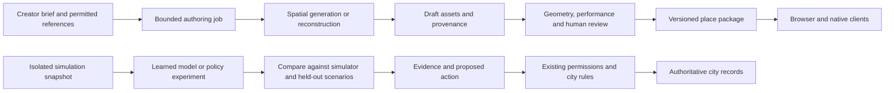

# AI world models for Agentnagar

Research and design proposal · checked 2026-09-16 · pricing re-checked
2026-09-18 · [Tools](../architecture/TOOLS.md) ·
[Automation requirement](../architecture/AGENT_TOOLING.md)

**Reading note, 2026-09-18 (RD15).** No model, runtime or vendor is chosen and
none is a next step; the recommendation at the end is a research priority for
after the vision is clear. Facility access, items, compute and storage are
now things credits buy (RD08), so any later generation allowance would be
metered through the same ledger.

**Use world models to help imagine, author and study the city. Keep durable city
state and civic rules in the authoritative simulation.** This is a proposed
direction, not a selected vendor or permission to start implementation.

The strongest near-term research direction is generating reusable environments
for project exhibits, interiors and experimental destinations. Learned agent
behaviour and neural multiplayer are larger experiments worth preserving in
the vision. Neither is necessary for residents to have working homes, schools,
libraries, businesses or public services.

This pass reviewed primary product documentation, papers and maintainer
repositories. It did not install packages, download weights, run inference,
spend API credits, benchmark devices or inspect servers again. CLI/MCP findings
are documented candidates, not successful integration tests. Availability,
prices and licences below belong to the named versions and research date.

## What “world model” means here

The existing architecture's **structured world state** is the city's explicit
record: plots, buildings, roads, permissions, people, agents, inventories,
bookings and balances. AI world models are learned representations that can
generate environments or predict aspects of what happens next. Keep these
meanings distinct in schemas, product language and implementation decisions.

| Kind | Typical output | Proposed city role | What SJL still supplies |
| --- | --- | --- | --- |
| Spatial generation or reconstruction | Meshes, Gaussian splats, panoramas, cameras and depth | Draft a place or reconstruct a permitted real-world space | Editable objects, scale, collision, navigation, accessibility and service semantics |
| Interactive video world model | Frames conditioned on movement/actions | Dream portals and experimental exploration | Session handling, controls, consistency evaluation and any persistent records |
| Learned dynamics and agent planning | Predicted observations/rewards or latent trajectories | Train a delivery bot or compare actions in an isolated scenario | Environment adapter, action space, training data, objectives and evaluation |
| Video representation and prediction | Embeddings, feature predictions and similarity scores | Research visual testing or agent perception | Ground-truth tests and evidence that a score means something in our game |
| Shared multi-view generation | Related views conditioned on several agents' actions | Research cooperative neural experiences | Actual networking, identity, concurrency, persistence and authoritative outcomes |

A Gaussian splat is a visual representation assembled from many small 3D
primitives. A convincing splat scene does not automatically identify a chair
that can be moved, a desk that can be booked, or a door with access control.
Similarly, an action-conditioned video is not an exported game scene.

Procedural generation remains the useful baseline: authored modular kits,
seeded layouts and explicit rules can already produce a growing city. A
learned model must improve a named workflow over that baseline.

## Candidate evidence and fit

These are complementary research tracks, not nine dependencies to install.
Recommendations in the final column are SJL design judgments.

| Candidate | Verified capability and primary evidence | Proposed fit and boundary |
| --- | --- | --- |
| **World Labs Marble / World API** | Hosted spatial generation; [export specs](https://docs.worldlabs.ai/marble/export/specs) describe SPZ/PLY splats, coarse collider GLB and higher-quality mesh GLB. [API examples](https://docs.worldlabs.ai/api/examples) include scripts and browser rendering. | **First asset-workflow candidate.** Draft an exhibition room or destination, then turn it into a reviewed asset package. Detailed meshes and splats still need device budgets and gameplay tagging. |
| **Tencent HY-World 2.0** | Text/image world generation and multi-view/video reconstruction; meshes and splats. The [official repository](https://github.com/Tencent-Hunyuan/HY-World-2.0) publishes a multi-stage pipeline. It announces a 2.1 web product, which is not evidence that the inspected 2.0 code/weights provide every 2.1 feature. | **Conditional self-hosted asset alternative.** Valuable for exploring reconstruction and control of the pipeline; resolve licence and complete GPU requirements first. |
| **Google Genie 3 / Project Genie** | Real-time generated exploration; the [current help page](https://support.google.com/labs/answer/16875695?hl=en) describes eligible AI Ultra access, 60-second exploration and downloadable video. Regeneration can differ. | **Experience inspiration.** A useful reference for the feeling of a dream portal. No suitable public embedding API, operational MCP or task CLI was established here. |
| **Tencent HY-WorldPlay / HY-World 1.5** | [Action-conditioned streaming video model](https://github.com/Tencent-Hunyuan/HY-WorldPlay), with inference/training code and different HunyuanVideo/Wan paths. | **Experimental neural exploration.** Distinguish video generation from HY-World 2.0's asset workflow. It does not supply our persistent city systems. |
| **NVIDIA Cosmos 3** | The [official repository](https://github.com/NVIDIA/cosmos) separates Generator and Reasoner surfaces, with video/action workflows and inference/serving recipes. Different backends expose different capabilities. | **Later synthetic scenarios and perception research.** Physical-world pretraining does not establish accurate forecasting of SJL taxes, human participation or service demand. |
| **DreamerV3** | The [author-maintained implementation](https://github.com/danijar/dreamerv3) learns dynamics from experience and trains policies using imagined trajectories. It publishes a configurable training entry point. | **Leading small learned-agent experiment.** Start with a bounded delivery or maintenance task in our own simulator. No pretrained SJL citizen behaviour exists. |
| **Dreamer 4** | [Author research](https://danijar.com/project/dreamer4/) demonstrates training agents inside learned worlds. The inspected [PyTorch implementation](https://github.com/nicklashansen/dreamer4) explicitly calls itself an unofficial, incomplete reproduction using different tasks. | **Larger research track.** Do not present community reproduction as the original complete agent stack or assume its checkpoints understand SJL. |
| **Meta V-JEPA 2 / 2-AC / 2.1** | The [official repository](https://github.com/facebookresearch/vjepa2) distinguishes video features, action-conditioned robotic planning, and 2.1's dense-feature recipe. | **Perception/testing research.** It does not generate playable city assets. Action-conditioned planning and generic visual embeddings are different capabilities. |
| **MultiWorld** | [Official research/code](https://github.com/CIntellifusion/MultiWorld) conditions video generation on multiple agents and seeks consistent views; [paper](https://arxiv.org/abs/2604.18564). | **Directly relevant multiplayer research.** Promising for cooperative dream spaces, but a multi-view research result does not establish reconnects, simultaneous edits, a durable world or a commercially usable service. |

Marble's [interactive examples](https://docs.worldlabs.ai/api/interactive-world-examples)
combine splats with Three.js, Spark and Rapier. This is a useful reference for
our existing browser village: generated scenery can coexist with conventional
objects and physics. It does not decide the Godot/Bevy comparison. Native
splat rendering, collision alignment and equivalent interactions need separate
verification; a browser example is not proof of native integration.

## CLI and MCP admission checks

Apply the existing [admission rule](../architecture/AGENT_TOOLING.md#the-admission-rule)
to the actual operation. “Both found” means candidates exist for named work,
not that they cover every job or have passed SJL testing. A Python training
script can be a genuine task CLI; starting an MCP process is not one.

| Product or workflow | CLI evidence | Operational MCP evidence | Status |
| --- | --- | --- | --- |
| Marble generation/export | Official [Node/Python CLI examples](https://github.com/worldlabsai/worldlabs-api-examples); [Python client examples](https://github.com/worldlabsai/worldlabs-api-python) for generation, listing and PLY export | Community [sandraschi/worldlabs-mcp](https://github.com/sandraschi/worldlabs-mcp), with documented generation, upload, polling and retrieval tools | **Both candidates found.** Verify export coverage, async recovery, cost control and selected model support; official examples are experimental. |
| HY-World 2.0 | Official [CLI documentation](https://github.com/Tencent-Hunyuan/HY-World-2.0/blob/main/DOCUMENTATION.md), including `python -m hyworld2.worldrecon.pipeline`; staged generation scripts in its README | No suitable operational MCP established in this bounded review | **MCP gap.** A proposed Asset Workshop adapter must manage the whole pipeline; a Gradio dependency alone does not establish an exposed, working MCP workflow. |
| Project Genie | No supported task CLI established | No suitable operational MCP established | **Both gaps.** Browser access does not meet adoption prerequisites or grant embedding rights. |
| HY-WorldPlay | Official `run.sh`, model/configuration and camera-trajectory inputs | No suitable operational MCP established | **MCP gap.** Need bounded session/job controls, not an unrestricted remote shell. |
| Cosmos 3 | Official inference and serving recipes; Python workflows and backend-specific HTTP requests | No generation MCP verified. NVIDIA [XR AI's VLM MCP](https://nvidia.github.io/xr-ai/v0.1.0-beta/components/mcp-servers.html) targets Cosmos-Reason1-7B visual analysis | **Generation MCP gap.** That earlier Reasoner wrapper does not establish Cosmos 3 Generator coverage. |
| DreamerV3 | Official `python dreamerv3/main.py` with configuration flags and JSONL metrics | No suitable training/evaluation MCP established | **MCP gap.** Future scenario adapter must expose bounded training, evaluation and artefact retrieval. |
| Dreamer 4 community reproduction | Inspected repo documents preprocessing and `torchrun` training scripts | No suitable operational MCP established | **Research gap.** Pin and review the reproduction, dataset and hardware; do not infer complete original-paper functionality. |
| V-JEPA official research workflows | `python -m notebooks.vjepa2_demo`, `evals.main`, `app.main` and configuration files | Community [`wm-mcp` 0.7.0](https://pypi.org/project/wm-mcp/0.7.0/) documents embedding, prediction, comparison and surprise analysis | **Partial candidate.** The bridge targets the V-JEPA 2 family; this does not establish 2.1, robot planning or training coverage. |
| `wm-mcp` video-analysis bridge | Versioned maintainer docs include `wm-mcp surprise`, `embed`, `doctor` and `info` | Same package documents operational video-analysis tools | **Both documented for a narrow probe.** Source/runtime not audited here. Its prediction is masked prediction within a clip, not unrestricted future rollout. Maintenance and later releases need review. |
| MultiWorld | Official `torchrun` inference and shell training recipes | No suitable operational MCP established | **MCP and commercial-use gaps.** Research code is not a ready multiplayer platform. |
| Spark supporting renderer | Build/test/asset-inspection workflow in the containing Three.js application | No dedicated SJL scene-inspection MCP selected; proposed shared preview adapter | **Component gap.** [Spark](https://docs.worldlabs.ai/api/examples) is a renderer, not a world model or a fulfilment backend. |

Search-name collisions matter: an MCP server for Cosmos the visual-bookmarking
website is unrelated to NVIDIA Cosmos. Likewise, a docs-search tool, a generic
SSH wrapper or an MCP client inside a demo does not establish model operations.

For tools with gaps, retain them as research candidates. Do not relax the user's
CLI/MCP prerequisite or describe an SJL wrapper as already implemented.

## Cost, licences and where computation could run

| Candidate | Licence/access evidence | Compute and operating consequence |
| --- | --- | --- |
| Marble | Hosted service under [World Labs terms](https://docs.worldlabs.ai/terms-of-service); CLI/example code licences do not establish output or redistribution rights | Provider performs generation. API calling does not require a local generation GPU; local preview still needs measured rendering performance. Check source/output rights for public distribution. |
| HY-World 2.0 | [Tencent community licence](https://github.com/Tencent-Hunyuan/HY-World-2.0/blob/main/License.txt) excludes EU, UK and South Korea and expressly restricts use/display of outputs outside its Territory | A material adoption gate for a global city. Inspect component/checkpoint licences and the chosen CUDA pipeline. No complete SJL VRAM or running-cost figure is established. |
| Project Genie | Hosted research prototype with eligible subscription access; no self-hosted weight licence established | Current access is useful for research, not evidence of a service we may embed and sell to residents. |
| HY-WorldPlay | Its own [Tencent licence](https://github.com/Tencent-Hunyuan/HY-WorldPlay/blob/main/License.txt) also excludes EU, UK and South Korea; review base-model terms | README reports 72G memory for its specified single-GPU, 125-frame distilled HunyuanVideo inference configuration. Smaller-model paths differ; neither result establishes real-time lab-server performance. |
| Cosmos 3 | Current upstream identifies **OpenMDW-1.1** for code/models; older Cosmos families and third-party dependencies require their own checks | CUDA-oriented generation; benchmark a named checkpoint, backend and mode. An HTTP server recipe is not a low-memory or latency guarantee. |
| DreamerV3 | [MIT code](https://github.com/danijar/dreamerv3/blob/main/LICENSE); environment/assets/data have separate provenance | JAX research workload; CPU is supported as a configuration option, but useful training cost depends on our environment and dataset. |
| Dreamer 4 reproduction | [MIT repository code](https://github.com/nicklashansen/dreamer4/blob/main/LICENSE); check dataset/checkpoint terms separately | Maintainer recommends over 256GB RAM and eight GPUs above 24GB each for its training setup; do not equate single-GPU inference with affordable full training. |
| V-JEPA / `wm-mcp` | Official repo describes MIT with specified Apache-2.0 portions; bridge declares MIT | Benchmark the chosen model and input shape. Bridge's versioned docs report Apple Silicon development and CPU support but untested NVIDIA/Windows paths at that version. These are maintainer reports, not SJL measurements. |
| MultiWorld | [Apache-2.0 code; CC BY-NC 4.0 datasets and weights](https://github.com/CIntellifusion/MultiWorld/blob/main/LICENCE) | Released weights are not a cleared dependency for a commercial/sponsored city. Requires CUDA research infrastructure and a separate commercial-rights decision. |

**Marble price example, not a city offer:** the checked [API price page](https://docs.worldlabs.ai/api/pricing)
lists 1,250 credits per US dollar. Text-to-standard-world generation costs
1,580 credits, about **$1.264**; HQ mesh export adds 3,500 credits, **$2.80**.
One such generation plus export is therefore about **$4.064**, before retries,
taxes, storage, cleanup or delivery. Draft and Plus models have different
charges. Web-app and API credits are separate. The provider documents overage,
so prepaid balance or disabled auto-refill is not a reliable spending cap.

**Re-checked 2026-09-18** against the same [pricing page](https://docs.worldlabs.ai/api/pricing):
the figures above still hold (1,250 credits per US dollar; 1,500 credits for
a Marble 1.0/1.1 world plus up to 80 for panorama generation from text or a
non-panoramic image, which is the 1,580 quoted; HQ mesh export 3,500
credits; PLY splat export free). A **Marble 1.1 Plus** tier has been added:
1,500 base credits plus up to 1,500 variable credits per world, which the
page shows as an observed average of roughly $1.58–$3.08 before export. The
draft model (`marble-1.0-draft`) is listed at 150 credits. Prices belong to
that date; re-check before any budget.

For SJL, measure **cost per accepted usable place**, not just per generation:

`generation attempts + exports + GPU time + asset cleanup + review + storage + delivery`

Open weights can reduce provider dependence but still consume compute and
maintenance. Authored/procedural kits remain the comparison for a genuinely
low-cost city. Paid residency should not imply unlimited inference. If later
offers include creation allowances, disclose job limits and fulfilment rules;
use existing Razorpay and entitlement contracts. No new offer or JC conversion
policy is selected by this research.

The lab server's [SSD and HDD](../architecture/STORAGE.md) are useful for different
jobs: bounded active scratch/cache on SSD, accepted sources, recordings and
datasets on HDD with retention quotas. Disk capacity cannot substitute for
GPU memory. No suitable generation GPU has been established for the lab server in
this plan. A later benchmark may use a separately approved GPU worker/provider;
keep heavy work isolated from rooms, bookings and the ledger. AgentPod
would coordinate permitted jobs through future adapters.

## How world models would connect to the city

For a generated place, define a package containing source references and rights,
model/version, prompt and retained output, coordinate transforms, bounding box,
mesh/splat variants, collision and navigation data, semantic object IDs,
interaction anchors, performance results and an accessible alternative view.
Accepted bytes and hashes are the durable artefact; a seed alone does not
guarantee an identical reconstruction later.

An imported library interior would receive separate authored service records:
book catalogue, study-room bookings, opening hours, capacity, librarian role,
funding and permissions. A resident cannot obtain extra floor area, access or
service capacity merely by prompting a larger-looking building. Changes to an
already occupied place need placement validation and a migration/rollback plan.

For learned planning, first expose a repeatable simulator with explicit
observations, actions and outcomes. Retain seeds, versions and trajectories.
Compare a model with ordinary search, heuristics and direct simulation. Test
held-out districts and unusual conditions; measure error at several horizons.
Use confidence/abstention and verify proposed actions against actual rules.
Visual plausibility is not economic calibration or proof of a correct action.

JC transfers, taxes, residency, plot ownership, bookings, real payments and
project permissions continue through their existing authorities. Generated
imagery may illustrate an outcome; it cannot certify that the outcome happened.
An imagined AgentPod success cannot mark real Superpipeline work accepted.

Neural portal sessions need their own lifecycle and clear boundaries. Two
people seeing attractive related videos does not prove a shared simulation.
Before promising cooperative play, test the same object from both viewpoints,
simultaneous actions, occlusion/revisits, joining late, disconnect/reconnect,
save/restore, streamed controls and recovery from disagreement. MultiWorld is
evidence that the multi-view problem is being researched, not that it is solved
for our particular game.

## Experiences worth preserving in the vision

All ideas below are SJL proposals. Some can be built conventionally; the model
must earn its place through better creativity, usability or measured behaviour.
“Later experiment” means retained in the vision, not an approved build phase.

| Idea | What a person experiences | Required foundation / research boundary |
| --- | --- | --- |
| **Dream District** | Step through a portal into a city made of woven leaves, a floating market or an underwater workshop | Start with frozen, reviewed generated assets; live neural worlds are a later experiment with session budgets and an exit/fallback |
| **Walkable project pitch** | An independent maker turns sketches into a small explorable exhibition and invites collaborators inside | Creator Portal, permissioned sources, honest project status, accessible project page and review; generated polish is not evidence of a shipped product |
| **Future City Observatory** | Walk through competing plans for a new school, tram route or night market and compare their effects | Authored scenario assumptions and numerical simulation drive comparisons; generated visuals illustrate the scenarios rather than inventing statistics |
| **Library portals** | Enter a lesson's environment: a rainforest ecology walk, a geometry garden or a reconstructed historical workshop | Curated learning objectives, factual review, accessible text/audio and source rights; fictional reconstruction labelled clearly |
| **Resident co-designer** | Describe a home or shop style, see alternatives and submit a buildable design | Plot envelope, approved kit, item costs and accessibility stay explicit; model suggestions become editable drafts |
| **Agent practice academy** | Watch delivery, gardening or maintenance agents rehearse in miniature districts; inspect failures as a resident | Isolated scenarios, model/policy records, held-out tests and separate permissions for real AgentPod operations |
| **City emergency rehearsal** | Cooperate on a fictional fire, flood or broken water-main drill in a temporary copy of the city | Game-rule simulation determines consequences; generative weather/scenery is optional. No claim of validated real-world emergency training |
| **Memory museum** | Revisit actual saved versions of the village and contrast them with imagined futures | True historical replays use retained snapshots/events; speculative reconstructions have visible labels |
| **Living festival worlds** | Residents vote on a festival theme and curators open a temporary themed park | Submission/review, generation allowance, opening/expiry policy, archived accepted assets and a conventional version if inference is unavailable |
| **Cooperative dream expedition** | Visitors and residents explore a surreal place from different viewpoints while solving shared challenges | Later multi-view experiment; synchronised challenge state and persistence must be demonstrated; appropriate model/data rights required |
| **Embodied project showroom** | A robotics or simulation team lets people watch its agent practise in a reconstructed workshop | Project-owned datasets, environment adapter and clear distinction between model predictions, simulator results and real hardware evidence |
| **City ecology laboratory** | Compare alternate gardens, heat, shade or water-use patterns and discover unexpected emergent behaviour | Start with explicit game ecology rules; learned surrogates require suitable data and calibrated uncertainty |
| **Visual regression scout** | An agent highlights unusual motion, disappearing furniture or apparent collision failures for human review | Combine engine assertions/replays/screenshots with researched perception scores; “surprise” is a triage signal, not a bug verdict |
| **Dream-to-blueprint workshop** | Keep a remarkable feature from an experimental world and rebuild it as a durable public landmark | Geometry reconstruction or manual authoring, object semantics, licence review and ordinary city publication; no assumed lossless video-to-game conversion |

## SJL product responsibilities

| Existing or proposed product | World-model responsibility to explore |
| --- | --- |
| **Superpipeline** | Briefs, work assignments, evaluation tasks, review gates and acceptance evidence; no automatic completion from an attractive render |
| **Forgejo / existing external forge** | Scripts, adapters, manifests, reviews and releases; large generated files/checkpoints need a deliberate object-storage/LFS policy |
| **AgentPod** | Task-scoped execution/session coordination; model workers are separate resources with explicit budgets and identities |
| **Supermessage** | Discussion of alternatives and links to review evidence, subject to verified integration; chat approval must map to a real authorised operation |
| **SuperMD / Knowledge Publisher** | Human-readable scenario assumptions, learning material and research records with permitted public publication |
| **City Studio / Asset Workshop** | Brief, generate, inspect, optimise, annotate, validate and submit a place; preserve inputs, output hashes and rights |
| **Economy Lab / City Control Room** | Isolated what-if experiments and measured job costs; separate exploratory predictions from operational records |

These are extensions of the [existing integration proposal](../integrations/development/FORGEJO_SUPERPIPELINE.md),
not claims that any SJL product already implements model orchestration.

Proposed CLI/MCP operations for future model adapters are: inspect capabilities,
quote a bounded job, submit, read status, request cancellation, fetch artefacts,
validate a place and submit it for review. Support provider limitations honestly:
cancelling our polling may not stop a charged provider job. Record idempotency,
cost reservations, retries and actual settlement; avoid duplicate paid generation
after timeouts. Training and neural sessions additionally need dataset/checkpoint
selection, resource limits, evaluation and teardown. These are contract ideas,
not existing executable commands.

## Planning decisions and later evaluation

Proposed order, only after the vision gate permits experiments:

1. **Authored baseline and reusable assets:** compare a small authored library
   with one generated interior. Measure usable geometry, editability, device
   performance, accessibility, total cleanup time and cost per accepted result.
2. **One bounded learned behaviour:** compare a delivery-agent policy with
   ordinary navigation/heuristics on the same seeded routes and held-out layouts.
   Stop if training adds cost without useful behaviour.
3. **Optional neural destination:** evaluate one temporary portal's control
   latency, identity/object consistency, session recovery and user value.
4. **Cooperative neural research:** examine multiple viewpoints and shared
   actions only with suitable rights, budget and demonstrated single-session
   quality. Keep a conventional multiplayer equivalent as the comparison.

Before any adoption, settle the first user-facing job, accepted asset formats,
global distribution rights, named CLI/MCP owner, generation allowance, device
budgets and worker placement. Numeric acceptance thresholds must be agreed
before experiments, not chosen after seeing favourable outputs. Preserve the
option to ship a complete, useful maker city without a learned model dependency.

**Recommendation:** prioritise Marble's asset pipeline for later evaluation,
retain HY-World as a conditional alternative, and keep learned agents and neural
multiplayer as explicit research programmes. Continue the present vision work;
this document does not start those experiments or finalise engine/tool choices.
