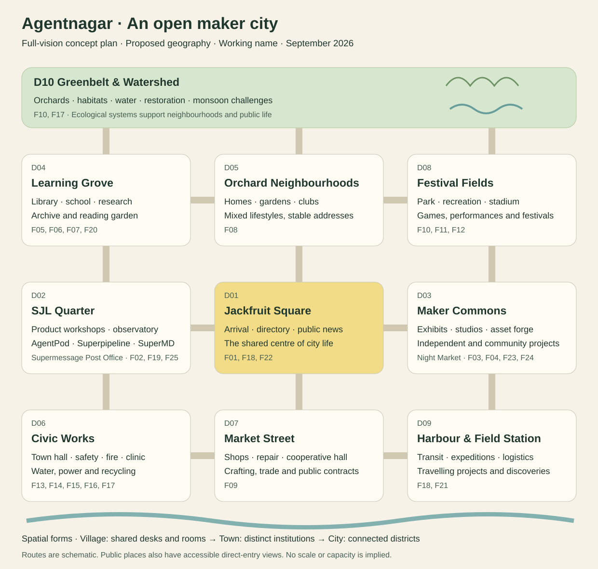

# The city map and its institutions

Planning milestone 2 · proposed spatial and service design · 2026-09-18

The city grows around a public square, learning grove and maker commons.
Its enduring structure is a walkable civic core with room for independent
projects, homes, public services and play. This is a labelled concept plan,
not surveyed geography, a playable map or a capacity estimate.

**This document is the canonical list of places.** It names 10 districts
(D01–D10) and 25 facilities (F01–F25). The [vision](VISION.md), the
[master plan](MASTER_PLAN.md) and the map group or describe these same places;
where a name differs, the D and F IDs here decide. A named place with no ID
is atmosphere or a later idea and is labelled as such.

## The first walk (RD01)

The first experience of this city is to walk it and watch the 14 Guild agents
doing their actual current work (RD01). Each agent has a proposed workplace in
the catalogue below: the visitor centre F01, the SJL workshops F02, studios
F04, library F05, school F06, research campus F07, town hall F13, safety
station F14, observatory F19, press room F22 and asset forge F23. The
[Guild resident designs](GUILD_RESIDENTS.md) assign them. A public visitor
observes this work and cannot interact with the agents (RD03); a registered
person interacts according to tier and granted authority (RD04). Which
work-state fields are public, how private repositories and operator data are
redacted, and how stale or idle work is shown remain open (RD01 opens).

## Districts and growth

V, T and C describe village, town and city forms. They preserve the complete
vision while showing how the same institution can grow. Stable place identities
survive expansion; streets, public entrances and plot boundaries are versioned.

**Which meaning of village, town and city applies here.** In this document the
three words mean **spatial form** only: how a district is housed as it grows.
The same words carry three other meanings elsewhere, and none of them moves in
step with this one:

- **Release horizon** in [features and experiments](EXPERIENCES.md): how far
  away an idea is, not a date or a promise.
- **Governance stage** in the [community charter](COMMUNITY_CHARTER.md) (CC07):
  a consultative village, then a town with a voting roll, with an illustrative
  threshold of 30 enrolled participants for binding civic votes.
- **Agent-housing stage** in the [Guild resident designs](GUILD_RESIDENTS.md):
  a shared courtyard first, distinct homes and studios later.

A district can take its town form while civic government is still
consultative. The [glossary](../planning/GLOSSARY.md) keeps the four meanings
apart.

| ID | District | Village form | Town form | Full city form |
| --- | --- | --- | --- | --- |
| D01 | Jackfruit Square | Tree, visitor desk, directory, noticeboard | Public calendar, gathering court, transit interchange | Civic forum linking districts; accessible direct entry throughout |
| D02 | SJL Quarter | Shared workshop with four product corners and a post counter | Distinct AgentPod Workshop, Superpipeline Yard, SuperMD Reading Room and Supermessage Post Office | Lab campus, agent observatory, demonstration and review halls |
| D03 | Maker Commons | Rotating exhibition stalls and shared table | Independent project studios, asset forge, collaboration rooms, evening Night Market stalls | Mixed studios, incubator programmes, creator-run learning venues |
| D04 | Learning Grove | Library room, school table, reading garden | Classrooms, archive, experiment plots | Research campus, museums, public collections and travelling libraries |
| D05 | Orchard Neighbourhoods | Bounded homes and shared garden | Several mixed neighbourhoods and club pavilions | Heritage areas, accessible apartments, cooperative amenities and local charters |
| D06 | Civic Works | Combined service desk and utility yard | Town hall, fire/safety/clinic buildings, utility network | Interconnected service districts, dispatch, recycling and resilience projects |
| D07 | Market Street | NPC supply stall and civic contract board | Shops, repair yards, cooperative hall | Production chains, procurement, service markets and commercial districts |
| D08 | Festival Fields | Park games and multipurpose lawn | Recreation centre, performance ground and sports courses | Stadium, seasonal circuits, creator conventions and regional events |
| D09 | Harbour and Field Station | Scenic landing and authored trail | Logistics puzzles, expedition depot, ferry stop | Multi-district transit, research expeditions and eventual inter-city links |
| D10 | Greenbelt and Watershed | Orchard, paths, simple water/soil model | Catchments, habitats, farms and maintenance routes | Regional ecology, drainage, restoration and optional advanced water models |

Three primary public routes connect the core: a **learning walk** through
Square–Grove–Greenbelt, a **making walk** through Square–SJL–Commons–Market,
and a **leisure loop** through homes–park–festival ground–harbour. Tram/ferry
routes can later connect these loops. Walking, direct links and accessible
navigation remain free; a fictional fare never gates basic discovery.

Project studios have public fronts and optional authorised private interiors.
Residences use bounded plot instances with stable addresses; a larger home
style does not consume a neighbour's land. The common map can feature selected
entrances and exhibitions while the full directory remains available. That
allows growth without promising one scarce main-street frontage per account.

## Named places and where they live

Earlier documents named places that had no district or facility ID. Each now
has a home, or is marked as atmosphere.

| Name used elsewhere | Home in this plan | Note |
| --- | --- | --- |
| AgentPod Workshop | F02, D02 | One of the four product places inside the SJL workshops |
| Superpipeline Yard | F02, D02 | Product place; its queue-and-review miniature is an exhibit there |
| SuperMD Library, SuperMD Reading Room | F02, D02 | The product place is the **Reading Room**. "Library" alone always means the public library F05 in D04, which SuperMD is proposed to power |
| Supermessage Post Office | F25, D02 | A working post office and the product's place at once |
| MCP Night Market, MCP Alley | F24, D03 | Evening tool-interface stalls; keeps the present website's neon character |
| Market, Market Street | F09, D07 | "Market" alone always means the game-economy market and cooperative hall. It is not the Night Market |
| Maker Commons | D03 | District containing F03, F04, F23 and F24 |
| Archive Garden | F20, D04 | |
| Simulation Harbour | F21, D09 | Earlier name for the expedition harbour and its linked teaching models |
| Agent Works, Odd Shop | None | Present-website catalogue names awaiting editorial migration; atmosphere, not facilities |

## Facility and service catalogue

A facility may be a desk inside another building in the village and a separate
building later. The two tables form one catalogue using stable F IDs. Capacities
are units to budget and measure, not invented concurrent-user promises.

**Admission follows RD03 and RD04.** "Public" in the table means anyone can
observe and read, without an account. Every interaction with an agent, and
every comment, message or seat in an assembly, starts at a registered account
and widens with tier and granted authority. Whether anonymous visitors can see
each other, and what they can do besides observe, is open (RD03 opens).

**Powered by** is a proposal under RD02: the city prefers to run on the SJL
products in active development. No mapping below is decided, integration
points are still moving (RD14), and the [ecosystem map](ECOSYSTEM.md) lists
what each product would have to expose first. Independent projects still
choose their own tools (VD08); a dash means no sensible product mapping yet.

| ID | Place and district | What people do | Operator role and admission | Powered by (proposed, RD02) |
| --- | --- | --- | --- | --- |
| F01 | Visitor centre, D01 | Find projects, routes, events; choose avatar and preferences | City editor; public browsing, account for durable participation | SuperMD for authored guides and directory pages |
| F02 | SJL workshops, D02: AgentPod Workshop, Superpipeline Yard, SuperMD Reading Room | Understand products, watch Guild agents at work, find contributions, attend maintainer office hours | Product maintainers; public exhibits, explicit project membership for work | All four; each product place shows its own product in use |
| F03 | Exhibition Commons, D03 | Present projects, demo, collect feedback, recruit | Curators and project owners; free submission, moderated public display | SuperMD for project pages; Supermessage for feedback threads |
| F04 | Project studios, D03 | Coordinate tasks, discuss work, review results | Project maintainers; private membership checked by each service | Superpipeline tasks, Supermessage rooms, SuperMD handbooks, AgentPod sessions; a project's own tools where it prefers them (VD08) |
| F05 | Library, D04 | Read, search, curate, study, attend reading circles | Librarian/editor; public reading, reservable sessions | SuperMD |
| F06 | School, D04 | Learn, practise, teach and attend workshops | Course hosts; open lessons, booked instruction and scholarships | SuperMD for lessons; Supermessage for class rooms |
| F07 | Research campus, D04 | Reproduce experiments and share methods/blueprints | Project researchers; declared scope and reviewed public claims | AgentPod for experiment runs; SuperMD for research journals |
| F08 | Homes and neighbourhood pavilions, D05 | Decorate, invite, host clubs, display a reviewed project | Resident/club hosts; owner-controlled visits and bounded bookings | —; where a resident's personal agent runs is open (RD12 opens) |
| F09 | Market and cooperative hall, D07 | Craft, trade JC goods, repair, bid for civic work | Shop owners and market steward; published offers and funded orders | Superpipeline for the civic contract board |
| F10 | Park and community garden, D08/D10 | Play casual games, garden, relax, do restoration | Park steward; public access and scoped build permissions | — |
| F11 | Recreation centre, D08 | Board games, puzzles, clubs, building jams | Hosts/referees; open tables and separately booked rooms | Supermessage for club rooms |
| F12 | Stadium and festival ground, D08 | Perform, spectate, race, exhibit at festivals | Event host; published admission and capacity rules | Supermessage for event rooms |
| F13 | Town hall and treasury, D06 | Read budgets, propose projects, deliberate, vote when enabled | Civic steward; public records, scoped decision rights | Superpipeline for proposals and public works; Supermessage for assemblies; SuperMD for budgets and minutes |
| F14 | Community safety station, D06 | Lost-and-found, fictional patrol/traffic scenarios | Simulation crew; real reporting handled by moderators through a separate channel | Superpipeline for the moderators' real report queue, kept apart from the fiction |
| F15 | Fire and rescue, D06 | Drills, dispatch, prevention and incident replay | Civic crew/steward; emergency response has no tier check | — |
| F16 | Clinic and wellness garden, D06 | Quiet spaces and fictional household-health scenarios | Civic steward; public basics, no real clinical service | — |
| F17 | Water, power and recycling, D06/D10 | Inspect networks, maintain, balance resources | Utility steward; published game tariffs and public service duties | — |
| F18 | Transit depot, D01/D09 | Ride, plan routes and move goods in the simulation | Transit steward; free navigation plus optional funded/JC rides | — |
| F19 | Agent observatory, D02 | Watch what each Guild agent is working on now (RD01); registered people request a scoped task or tutoring | Task service/operator; public observation only (RD03); requests need an account, tier and granted authority (RD04), plus separate grants and allowance | AgentPod for runtime status and sessions; Superpipeline for task and run state |
| F20 | Archive garden and museum, D04 | Explore history, retired projects, decision replays | Archivist; public approved records, private histories stay private | SuperMD |
| F21 | Expedition harbour, D09 | Join authored expeditions, research, logistics and discoveries | Scenario host; public practice and reserved cooperative instances | — |
| F22 | Press and radio room, D01 | Read news, prepare sourced stories, hear captioned programmes | Editors; consented publication, corrections, labelled programme funders | SuperMD for stories; Superpipeline for the editorial queue |
| F23 | Asset forge and creator lab, D03 | Submit kits, lessons, exhibits and bounded world extensions | Creator/reviewer; draft freely, publish only reviewed versions | Superpipeline for the review queue |
| F24 | Night Market, D03 | Browse tool-interface stalls, see a request path through a mock tool, find selected public experiments | Stallholders and curator; public observation with fixture data and no visitor credentials; stalls for SJL and independent tools alike | The MCP and CLI surfaces of all four products, shown as exhibits |
| F25 | Supermessage Post Office, D02 | Send and receive messages, find project rooms, read notices of assemblies, learn how Supermessage works | Postmaster and moderators; registered accounts only for sending (RD04, RD05); public visitors see the building, not the messages (RD03) | Supermessage |

## Funding, capacity and closure

**Civic JC** funds fictional costs. **Operating budget** funds actual hosting,
content and people. Named facility funders and explicitly purchased allowances
can support the latter. In this section a "funder" is someone who pays for a
facility, event or programme. "Sponsor" is kept for the RD10 sense: a person
who funds the lab and its product development.

RD07 and RD08 change the draft beneath this table. Credits (working label JC,
RD06) can be earned, bought with real money or included with a tier, and they
pay for facility access, items, compute and storage. The earlier rule that
fictional JC never touches a real cost is therefore superseded. How a credit
price tracks real cost, how earned credits are kept from being farmed into real
compute, and how metering, caps and interruption work are open (RD08 opens).
Until they are answered, the table still names which real budget carries each
facility's actual cost. A balanced civic treasury inside the simulation is
still not evidence that a real server bill has been paid.

| ID | Capacity and dependencies | Funding and upkeep | Reduced-capacity or closure behaviour |
| --- | --- | --- | --- |
| F01 | Directory availability, editorial time, loaded-scene budget | Operating budget; catalogue maintenance | Static/readable fallback, dated status |
| F02 | Approved exhibits, maintainer time, demo slots | SJL operating allocation; scoped events paid for by a named funder | Recorded guides remain; no fake office hours |
| F03 | Review slots, display slots, moderated feedback | Operating budget; optional labelled facility funder | Queue or rotate exhibits; retain project pages |
| F04 | Members, room/storage quota, task integrations | Baseline plus project-funded extras; credits for room, compute and storage (RD08) | Stop new costly sessions; preserve permitted work and export |
| F05 | Licensed catalogue, seats, host/research slots | Civic JC plus funded operating allocation | Reduce hosted sessions; public documents remain readable |
| F06 | Teachers, lessons, seats, water/power in simulation | Civic JC; funded classes or explicit booking fee | Cancel/reschedule/refund affected class under its offer; retain open lessons |
| F07 | Experiment instances, datasets, task budget | Project/research allocation and JC construction | Pause runs at cap; keep methods and checkpoints |
| F08 | Plot data, invitation/session limits, pavilion bookings | One-time residency purchase of a block for a house (RD09), or residency that comes with sponsorship (RD10); optional tier; JC furnishings | Earned designs preserved; expire costly allowances independently |
| F09 | Inventory, inputs, transport, orders, commercial permits | JC trade and bills; real commerce separately designed | Pause unfunded new orders; return unfulfilled reservations |
| F10 | Paths, water, gardeners, game seats | Civic JC and a park operating funder | Maintenance effects visible; keep a basic public route/activity |
| F11 | Room time, refereeing/moderation, deterministic game service | Funded open tables; allowance/JC for funded reserved capacity | Waitlist or reschedule; no duplicate rewards or charges |
| F12 | Venue/session slots, transport, staff, cleanup | Event budget, named event funder or explicit ticket | Overflow/reschedule under booking rules; no unlimited ticket sale |
| F13 | Steward time, ledger freshness, deliberation capacity | Civic JC and real operator allocation | Freeze new discretionary commitments; publish last verified state |
| F14 | Crew coverage and fictional road access; separate report queue | Civic JC and actual moderation staffing | Fictional patrol capacity can fall; basic reporting remains available |
| F15 | Water, reachable routes, crews, equipment | Priority civic allocation and optional facility funder | Show response degradation and recovery; never sell emergency priority |
| F16 | Fictional capacity, sanitation, quiet-space access | Civic JC and operating budget | Explain simulated effects; retain accessible quiet content |
| F17 | Supply, connectivity, storage, maintenance | JC tariffs, civic reserve, infrastructure funder | Planned rationing/game effects; preserve real account and file access |
| F18 | Routes, vehicles, schedules and delivery capacity | JC fares, public operating subsidy | Reroute/refund affected bookings; direct navigation remains |
| F19 | Verified adapter, isolated runners, reservations and metering | Explicit service budget/allowances; credits for compute (RD08); scholarships | Honest stale cards; deny new unfunded dispatch; preserve task records |
| F20 | Licensed snapshots, archive storage, curation | Operating/archive budget | Read-only static exports; replay has no external side effects |
| F21 | Authored scenario, instance slots, checkpoint storage | Funded practice and explicit group bookings | Checkpoint/pause/reschedule; keep earned evidence |
| F22 | Source events, editorial consent, corrections | Operating budget; labelled programme funder | Publish less often; no invented activity to fill the schedule |
| F23 | Review capacity, format budgets, preview isolation | Creator/project allocation; funded public kits | Keep private drafts; stop publication/execution until reviewed |
| F24 | Curated stalls, fixture data, reviewer time | Operating budget; optional labelled stall funder | Fewer stalls or a static catalogue; never live visitor credentials |
| F25 | Moderation and reporting capacity, message retention, room limits | Operating budget; tier allowances for heavier use; no charge to read a notice | Slow or close new rooms first; keep reporting and export working; capacity, retention, age scope and legal duties are open (RD05 opens) |

## How the settlement earns expansion

A new district proposal names its purpose, accountable operator, public access,
construction inputs, recurring JC upkeep, real operating allocation, content
supply, moderation burden and fallback. Approval requires all of these, not a
population counter. Larger systems from [World systems](../gameplay/WORLD_SYSTEMS.md)
remain in the target even when their dependencies are substantial.

A village can share buildings and staff. A town separates institutions when
shared capacity constrains useful activity. A city introduces more specialised
services, transport and neighbourhood charters when it can sustain them.
Numerical thresholds need later cost/capacity evidence; inventing a number of
residents would not settle that planning question.

## Atmosphere and a day in the place

Keep verandas, shade trees, terracotta, limewashed walls, water tanks, repair
benches, paper notices and small improvised machines. Homes mix lifestyle tiers
and interests. The lab quarter has recognisable workshop silhouettes; independent
creators have equal-quality public wayfinding. The Night Market (F24) can
preserve the existing website's neon character as a local evening atmosphere.

In the morning, the Square points to public lessons and work requests. During
quiet periods, NPC routines, gardens and solo games give the town life without
claiming human attendance. Scheduled office hours bring people into studios;
a festival animates the lawn; the library and direct-entry pages remain useful
outside any event. Local calm mode may reduce weather or change lighting while
the underlying world rules remain the same.

The city is global (RD11). "Morning" and "evening" above are moods of the
world, not one country's clock. How world time, scheduled gatherings and
languages work across time zones is open (RD11 opens).

## Creative decisions still needing a choice

This plan recommends the geography and tropical maker character. Exact scale,
visual density, landmark shapes and how streets frame interiors remain art
choices. A larger avatar kit, pets, multi-level homes, racing courses and advanced
water belong to the full vision. Compare their visual concepts during planning;
no engine trial or game implementation is started by publishing this map, and
no engine, room server, database or host is chosen (RD15).
