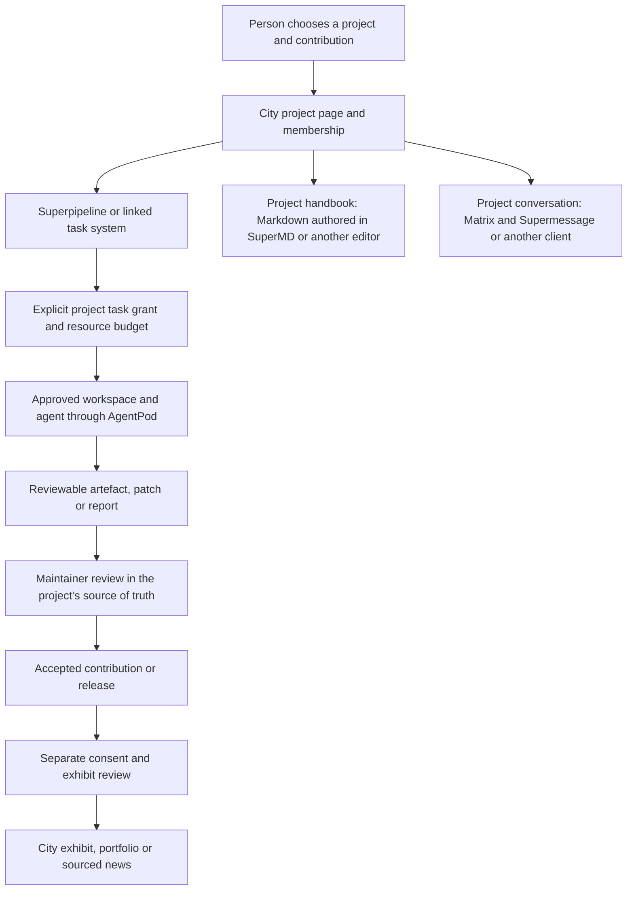

# How SJL projects power the city

Evidence and proposed integration roles · revised 2026-09-18 ·
[Master plan](MASTER_PLAN.md) · [Glossary](../planning/GLOSSARY.md)

The city is a shared place to discover, learn, collaborate and play. Existing
SJL products supply specialised tools. The city does not turn their independent
products into compulsory parts of a monolith. Each proposed integration below
needs a verified contract and its own delivery work.

The [complete city system map](../architecture/CITY_SYSTEMS.md) now develops
these product roles into logical owners, records, flows, failure behaviour and
integration gaps. It reuses the evidence below; it does not assert a new live
integration or product release.

The subsequent tools discussion adds a [Forgejo/Superpipeline ownership proposal](../integrations/development/FORGEJO_SUPERPIPELINE.md)
and requires [CLI and MCP access](../architecture/AGENT_TOOLING.md). The dated
[automation catalogue](../research/TOOL_AUTOMATION.md) supplies additional local-source
evidence for these interfaces, separate from the historical revision audit below.

**Later September 16 refresh:** Kaambaan is now **Superpipeline**. Current
product labels below use the new name; the earlier E01–E07 evidence remains
dated to its inspected revisions. The [product refresh](../research/SJL_PRODUCT_REFRESH_2026-09-16.md)
records the merged rename, changed MCP/Matrix vocabulary, the subsequent
`supi` / `superpipeline` CLI names and the remaining approval-loop and
migration checks. Its note that the `kbn_` agent-token prefix was retained is
**stale**: see E08 below.

## What the 2026-09-18 decisions change here

Rakesh's [decisions](../planning/VISION_DECISIONS.md#decisions-recorded-on-2026-09-18)
set the direction for this map. Text citing an RD ID restates a decision;
the product-to-facility mappings remain proposals.

- **RD02 — the city runs on SJL's products.** Prefer that facilities are
  powered by Superpipeline, AgentPod, SuperMD and Supermessage. Independent
  projects still choose their own tools (VD08). The
  [facility mapping](#which-product-could-power-which-facility) below is the
  proposal that follows.
- **RD13 — Forgejo runs on the lab server, and agents get a dedicated git system as
  part of the stack.** This is decided. How it integrates with Superpipeline
  and AgentPod is a later discussion; the row below records the decision and
  the integration shape stays open.
- **RD14 — integration points are still moving.** The gaps verified on
  2026-09-18 are recorded as facts to design around, not as decisions:
  [verified gaps](../planning/GAP_REVIEW_2026-09-18.md#integration-gaps-verified-against-sibling-repositories).
- **RD16 — Agentic Space is a knowledge bank.** An older collection of
  concepts and ideas to draw on; not a product, a dependency or a sibling
  client. The entry below is relabelled accordingly.

## Facts verified on 2026-09-18

Each item was read from the sibling repository named, at its default branch
or tag, on 2026-09-18. Anything not listed here is not verified on that date.

| Product | Verified today | Not verified on 2026-09-18 |
| --- | --- | --- |
| Superpipeline | Agent tokens use the `spa_` prefix; a `kbn_` token is no longer recognised as an agent credential and there is deliberately no fallback (`apps/api/src/auth/agent-token.ts`, `origin/main` at f2d72a1, 2026-09-17) [E08]. The README describes REST and MCP agent contracts, approval gates, agent questions, cost reporting, budgets and optional AgentPod fleet/principal links | The MCP tool list and the run-read gap recorded in the product refresh; board/tenant access rules |
| AgentPod | The README states that principals, station occupancy and dispatch grants are implemented, within one bootstrap tenant rather than independently managed organisations [E09]. `docs/DEPLOYMENT.md` documents the control pair: grants live in `principal_grants`, are carried in issued tokens, and enforcement is off unless `ENFORCE_CONTROL_PAIR=true`. Tag `v0.1.33` (2026-09-17) shipped `apn fleet` with `login`, `whoami`, `logout`, `nodes`, `agents`, `stats` and `activity`, acting as a principal on a credential separate from the node's [E10]. A branch in progress on 2026-09-18 moves these verbs to a separate `fleet` binary and removes `apn fleet` with no shim; the command name should be treated as unstable | Whether any machine has v0.1.33 installed; MCP coverage; Teams and Roles, which SJL's internal decisions list as part of an Organization plane with no repository and which the AgentPod README does not describe as built |
| Supermessage | README (2026-09-17): a Matrix client for desktop, iOS and Android over a shared Rust core; login, sync, messages, files, room joining, homeserver search, SDK encryption, and AgentPod turn/permission cards and Superpipeline gates are listed as implemented; background push is not | Any live end-to-end gate; a web build (the README lists none) |
| SuperMD | README (2026-09-17): native GPU-rendered Markdown editor, plain CommonMark on disk, wiki links, backlinks, graph view, plugin authoring | Headless export or a CLI; publishing to a city library |
| Forgejo | Decided to run on the lab server (RD13) | Nothing deployed or configured was inspected |

## Product roles

| Project | Evidence-backed role | Proposed city experience | What still needs to exist |
| --- | --- | --- | --- |
| AgentPod | Fleet/runtime console; workspace and lifecycle operations [E01] | Named workshop agents, approved status, bounded project sessions | City-safe exports, project-specific grants, isolated participant workspaces, quotas and cancellation |
| Superpipeline | Work boards, agent runs and human gates; REST/MCP integration surfaces [E02], updated names/interfaces in [SP01–SP03](../research/SJL_PRODUCT_REFRESH_2026-09-16.md) | Project task boards, contribution requests, review desks, civic work coordination | City/project/board mappings, participation workflow, approved public projections and tested integration; MCP run-read gap remains |
| Forgejo — decided, RD13 | Will run on the lab server as the agents' dedicated git system; git collaboration, issues/boards, PRs, CI, releases and packages; [ownership proposal](../integrations/development/FORGEJO_SUPERPIPELINE.md) | Project workshops with real source, reviews, builds and releases | Integration shape with Superpipeline and AgentPod is a later discussion (RD13); capacity, isolation, backup, the lab/production boundary, agent accounts and permissions; nothing is deployed yet |
| Supermessage | Matrix client; newer product docs describe agent turn/permission/gate cards [E03] | Project rooms, office hours, persistent discussion and authorised review conversations | Supported-client verification, room membership mapping, audience rules and end-to-end gate tests |
| SuperMD | Native Markdown editor over plain files [E04] | Authoring project handbooks, library material, learning trails and research journals | Publishing/import workflow, licences and audience control; no assumption of a hosted collaborative editor |
| super-jackfruit-website | Public website and entry surface, as recorded in the repository split | Discover the city, read project pages, enter at a destination without installing | Agreed navigation, account handoff and accessible project discovery |
| agentnagar | City design and planning prototypes | World state, place directory, residence, gameplay, public facilities, project-place links | The planned product itself; no hosted city exists yet |

A SuperMD-authored handbook can be read in an ordinary browser. A Superpipeline task
can be opened outside the game. A project can use a different chat client or
an external tool. These are useful connections, not membership requirements
for independent projects (VD08); for the city's own facilities, RD02 prefers
the SJL product.

## Which product could power which facility

Proposals under RD02, matching the "Powered by" column of the
[facility catalogue](CITY_PLAN.md#facility-and-service-catalogue). None is
decided; each needs the product to expose the surface named in the last column
first, and the [verified gaps](../planning/GAP_REVIEW_2026-09-18.md#integration-gaps-verified-against-sibling-repositories)
say how far each is from that today.

| Product | Facilities it could power | What it would have to expose first |
| --- | --- | --- |
| AgentPod | F02 AgentPod Workshop, F07 experiment runs, F19 agent observatory (runtime status and sessions), F04 studio sessions; personal-agent hosting at F08 is open (RD12) | Read-only, opted-in per-agent status for the RD01 public work state; scoped dispatch for registered users under a grant; participant isolation, quotas and cancellation |
| Superpipeline | F02 Superpipeline Yard, F04 studio task boards, F09 civic contract board, F13 proposals and public works, F14 the moderators' real report queue, F19 task and run state, F22 editorial queue, F23 review queue | Per-project board mapping and membership, approved public projections of card and run state, a way to read gate and run answers over MCP, a service credential |
| SuperMD | F01 authored guides, F02 Reading Room, F03 project pages, F05 library, F06 lessons, F07 journals, F13 budgets and minutes, F20 archive, F22 stories | A publishing or export path from plain files to city pages with audience and licence control; no headless CLI exists today |
| Supermessage | F03 feedback threads, F04 project rooms, F06 class rooms, F11 club rooms, F12 event rooms, F13 assemblies, F25 Post Office | A homeserver decision, room-membership mapping to city identities, audience rules, and the moderation and retention load that RD05 makes core |
| Forgejo (RD13) | Source, review, CI and releases behind F02, F04 and F23 | Integration shape with Superpipeline and AgentPod, agent accounts and permissions; deferred by RD13 |
| All four | F24 Night Market shows each product's MCP and CLI surfaces as exhibits | Nothing beyond what each product already documents; a fixture, not a live credential |

## Other SJL work and its place

| Project or group | Proposed relationship to the city | Evidence boundary |
| --- | --- | --- |
| SJL's internal cross-product decisions | Ownership, identity and interface agreements when integration affects multiple products | Agreements are design records. Principals, grants and the control pair are live in AgentPod within one bootstrap tenant [E09]; Teams and Roles belong to an Organization plane that is not built [E05]. An internal decision gives each agent exactly one principal [E11], so a "builder" and its "city character" are the same principal unless decided otherwise |
| SJL's private infrastructure operations | Machines, provisioning, recovery and runbooks | No infrastructure addresses, credentials or host configuration belongs in exhibits |
| The Agentic Space | Knowledge bank (RD16): an older internal collection of concepts on spatial navigation, personas, learning and collaboration zones, to draw ideas from | Not a product, a dependency or a sibling client. It is design documentation with no runnable platform; see the earlier [audit](../gameplay/AGENT_CITY.md) |
| SJL marketing | Approved lab stories, clear product claims and optional opt-in project showcases | Internal campaigns do not automatically publish private project activity |
| Other internal and archived SJL projects | Archive Garden material, research exhibits or design lessons if useful | Not selected as a supported runtime or a dependency for this city |
| .github and .github-private | Public and member-only organization navigation | Routing/documentation, not game services |

The organization inventory was refreshed on September 16, including the new
world repository. The four product READMEs and selected integration documents
and internal decisions were read at the revisions below. Other roles reuse the
dated inventory and existing world audit; this pass did not repeat all
implementation or server inspections.

## A real contribution, from request to exhibition

Not every task needs an agent, a chat room or a new board. A contributor can
submit a normal PR with their own editor and machine. The diagram describes
a connected option, not a claim that this full flow is currently deployed.

## Which system decides what

| Concern | Authority | City's responsibility |
| --- | --- | --- |
| Code, history and releases | Project's selected source/artifact store and maintainers | Link or project approved results; never merge because a game quest finished |
| Work state and review gates | Selected board/work system | Show an authorised projection and route a decision to its actual owner |
| Conversations | Selected communication service and room rules | Display only permitted content and distinguish live output from durable history |
| Files and authored knowledge | Chosen source/document store | Publish specific revisions with consent; private Markdown files do not become library books automatically |
| Agent workspace and runtime operations | AgentPod and host's runtime policy | Request explicitly scoped tasks; no broad fleet token in clients |
| World simulation, place allocation, JC | City simulation and its ledger | Own accepted commands, game balances, snapshots and civic rules |
| Residency, purchased benefits and service allowances | City entitlements with verified payment evidence | Preserve a clear relationship between a payment, a benefit and its duration |
| Membership and permissions | Each project/product checks its local permissions | Record explicit mappings; no automatic admin role across products |

The internal SJL distinction between skills, available operations and authority
is useful here [E06]. A game profession, an agent's skill, a project's work
assignment and a product permission are different facts. Likewise, being a
city steward or buying a mansion must not create an operator seat in AgentPod
or an owner seat in Superpipeline [E07].

## The integration layer the city actually needs

Proposed shared concepts: city person/project/place IDs; explicit external
identity mappings; a project directory; approved event projections; artefact
references with visibility; task requests with grants and budgets; revocation;
consented publication; integration health and stale-state handling.

This is new city integration work, not evidence that a universal SJL account,
team service, project service or public compute marketplace already exists.
Avoid inventing a second full task engine, chat server or document editor in
the game. Where existing tools lack needed capabilities, record the gap and
choose between extending the owner product and offering a simpler linked flow.

The lab server is the proposed home for city simulation and bounded heavy jobs, with
active work on SSD and appropriate archives/backups on HDD, and the decided
home of Forgejo (RD13). The existing AgentPod setup runs separately. These
are hosting observations and one placement decision, not a capacity promise
or authorisation to open any machine to participants.
Integration points between the products are still moving (RD14); design
against the verified gaps rather than against an assumed contract.
A public multi-user service requires its own isolation, quotas, metering,
operational ownership and recovery design. See [architecture](../architecture/ARCHITECTURE.md)
and [storage](../architecture/STORAGE.md).

## Useful failure behaviour

An unavailable AgentPod integration stops new connected-agent tasks, not
ordinary exploration. An unavailable board shows an honestly stale status
and a source link. Chat outages do not delete world saves. A project can still
exist in the directory when its demo is offline. Account revocation must affect
queued tasks and further retrieval; replaying city events cannot launch jobs
or publish a release again.

## Evidence record

Read through the authenticated GitHub API on September 16, 2026. Source and
documentation inspection only; no new product builds, deployment, account
provisioning, live gates or cross-product sessions were tested.

- **E01:** [AgentPod README at ed10da5](https://github.com/SuperJackfruitLabs/agentpod/blob/ed10da546e15c85950e33c95271ca461efeea192/README.md), together with the existing [route-level world audit](../gameplay/AGENT_CITY.md). Its old short repository description does not describe the current fleet product.
- **E02:** [Kaambaan README](https://github.com/SuperJackfruitLabs/kaambaan/blob/f2b0115026052b35aea4f553d88a9b622c7a524c/README.md) and [integration surfaces](https://github.com/SuperJackfruitLabs/kaambaan/blob/f2b0115026052b35aea4f553d88a9b622c7a524c/docs/05-integration-surfaces.md) at f2b0115. External use is through supported wire APIs, not unpublished private SDK packages. The documented MCP auth limitations remain relevant.
- **E03:** [Supermessage's current product description](https://github.com/SuperJackfruitLabs/supermessage/blob/59abd49ddb9e4c14afc33dedf04519c6eacfba9d/docs-site/src/content/docs/start/what-it-is.md) at 59abd49. The root README still conflicts with newer docs; the newer page's no-public-build wording also conflicts with older published assets recorded in the prior audit. This brief makes no current-build availability or end-to-end approval claim.
- **E04:** [SuperMD README at ec53bce](https://github.com/SuperJackfruitLabs/supermd/blob/ec53bce15a2bac22cd845a3058d5688de95ae183/README.md). File-based authoring is supported as a role; hosted collaboration and library publication are city proposals.
- **E05:** SJL's internal cross-product agreements (overview, September 2026): every product should remain independently usable.
- **E06:** "Capability is three words", an internal SJL decision of September 2, distinguishes skill, affordance and authority.
- **E07:** "Role is a seat and a post", an internal SJL decision of September 3, keeps local product permission seats separate from job descriptions and assignments.

Read from local checkouts of the sibling repositories on 2026-09-18:

- **E08:** Superpipeline `apps/api/src/auth/agent-token.ts` at `origin/main`
  (f2d72a1, 2026-09-17): tokens are `spa_` ("superpipeline agent"); `kbn_`
  was retired on 2026-09-17 with no fallback. Supersedes the "retained
  `kbn_`" note in the product refresh and in earlier revisions of this page.
- **E09:** AgentPod `README.md` at `origin/main` (1cf75621, 2026-09-17):
  "Principals, station occupancy, and dispatch grants connect runtime
  operations to agent identity"; "AgentPod currently resolves requests to one
  bootstrap tenant, not independently managed organizations. Principals and
  grants are implemented within that boundary." `docs/DEPLOYMENT.md` describes
  the control pair and its off-by-default enforcement.
- **E10:** AgentPod tag `v0.1.33` (2026-09-17): "Ships `apn fleet`, which no
  release has carried"; also carries the bridge's `spa_` agent tokens. The
  in-progress `apn`/`fleet` split plan is dated 2026-09-18 and is not a release.
- **E11:** the internal SJL decision "An agent is a principal": a
  principal is its own entity; each agent has one canonical identity; grants
  name one principal with no wildcards. Marked decided and, for the
  Organization plane, unbuilt.

SJL's earlier internal repository inventory and product-claims records retain
historical scope and caveats. This city's proposed experience must not
be presented as a shipped, integrated SJL suite.
