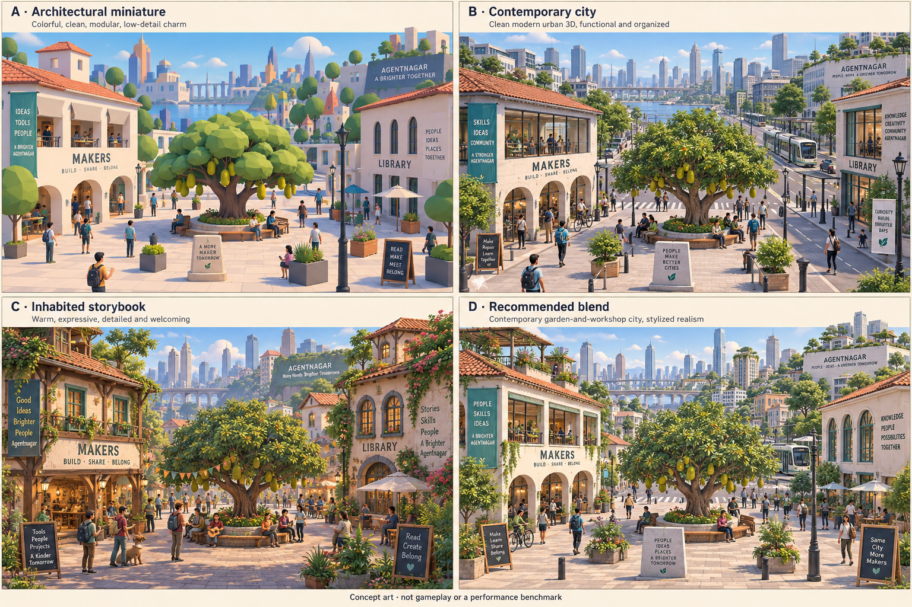
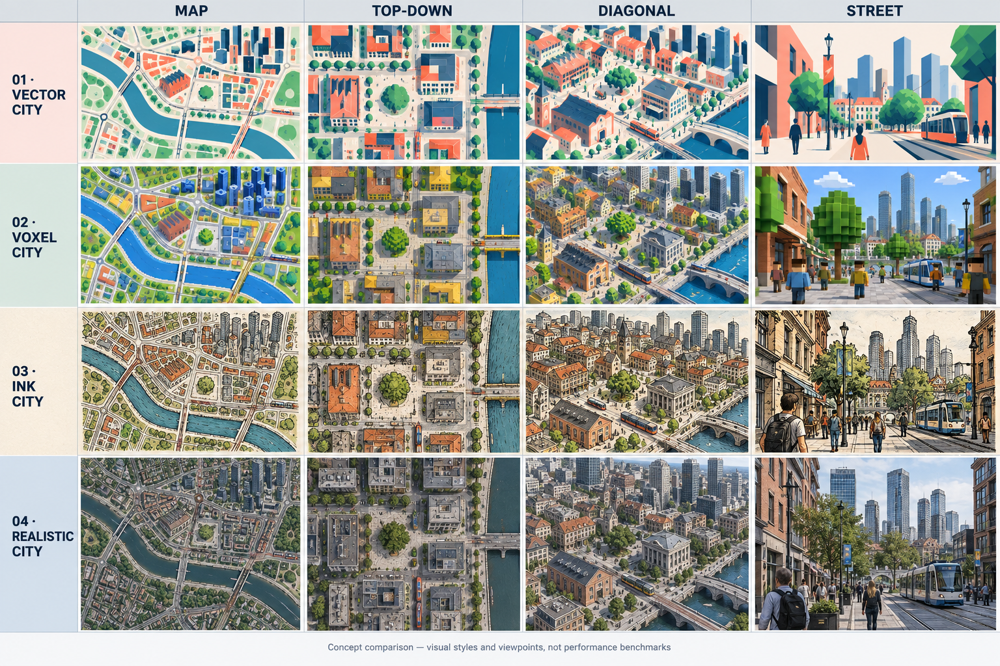

# Historical comparison sheets

[Current style gallery](../README.md)

These are early exploratory comparisons, not generated views of the currently
selected revisions.

Both sheets are **AI-generated** concept art, made with OpenAI's image model
(gpt-image 2.0, per the C2PA content credentials they carry). They are not
game captures or shipped assets, and they are released under
[CC0 1.0](../../../../LICENSES/CC0-1.0.txt) with no rights claimed; see
[AI-generated images](../README.md#ai-generated-images).

