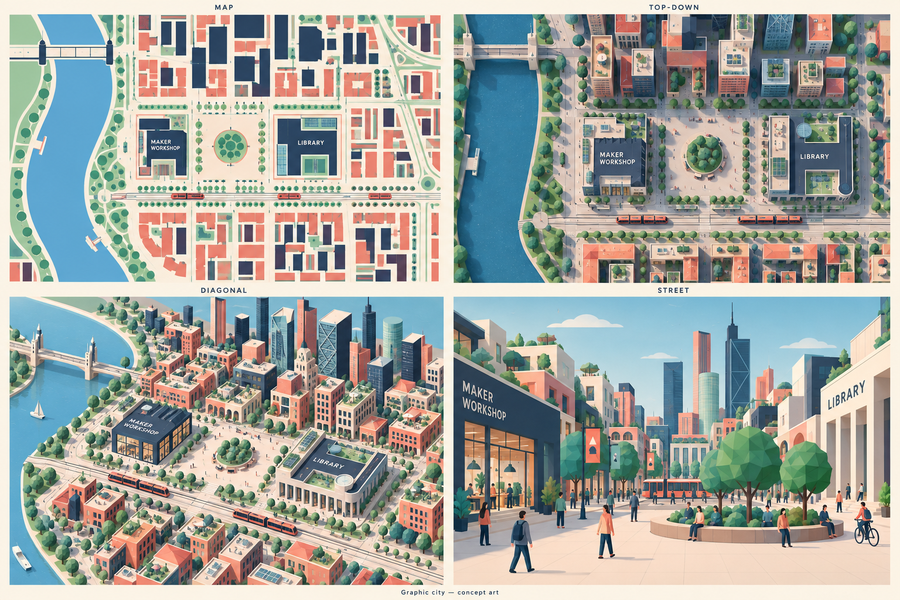
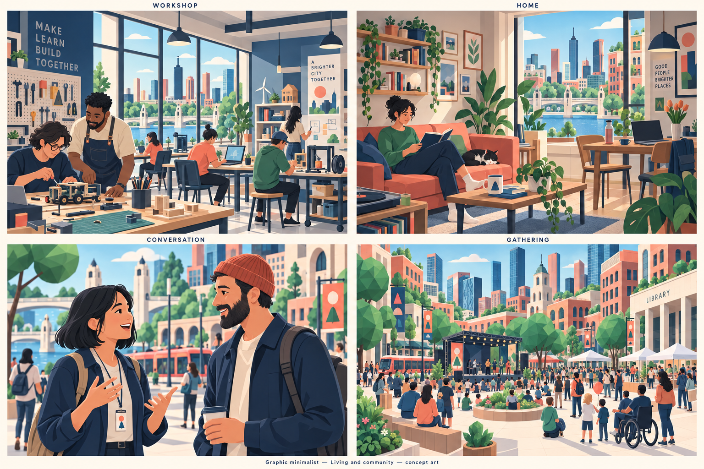
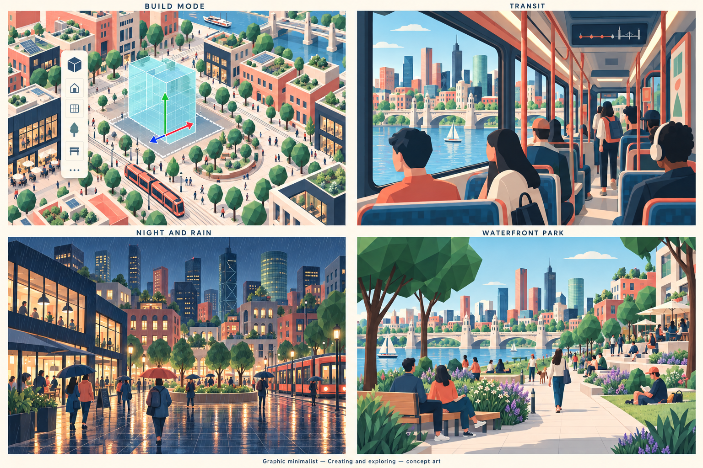
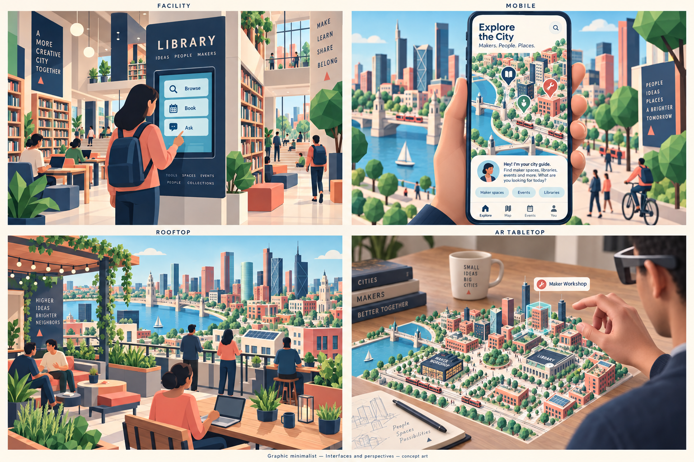

> Historical record migrated from `docs/vision/style-studies/revisions/2026-09-20-first-ten/01-graphic/originals/README.md`. File paths in prose/JSON may describe the old layout; use the migration ledger for exact mappings.

# Graphic minimalist

Concept art, not gameplay or performance evidence. [All styles](../README.md).

## Style description

A bright, deliberately simplified city built from strong silhouettes and broad color areas. Coral, navy, cream, and mint give neighborhoods a recognizable identity. Flat shading and sparse surface detail make the architecture feel like a navigable illustration.

Buildings use clean geometric volumes, generous windows, and clearly marked entrances. Interiors carry the same language into desks, shelving, tools, and seating. People and agents should have expressive simplified faces and recognizable outfits; their roles should remain readable without relying only on color.

Across views, district shapes and landmark colors should connect the map to the street. Close-up scenes need carefully chosen details and gestures so simplicity still feels inhabited. Mobile controls should use the same restrained palette while keeping labels and interaction states clear.

**Proposed device adaptation:** preserve silhouettes, colors, and landmarks at every quality tier. Lower tiers would reduce decorative props, shadow detail, and background crowds; higher tiers could add subtle material variation and richer lighting. Prototype readability and depth first: excessive simplification could make different buildings feel interchangeable.

## City perspectives

Map, top-down, diagonal, and street.

[Original generation prompt](../../../sheets/00-city-perspectives/r001/prompt.txt)

## Living and community

Workshop, home, conversation, and gathering.

[Generation prompt](../../../sheets/01-living-community/r001/prompt.txt)

## Creating and exploring

Build mode, transit, night and rain, and waterfront park.

[Generation prompt](../../../sheets/02-creating-exploring/r001/prompt.txt)

## Interfaces and perspectives

Facility, mobile, rooftop, and AR tabletop.

[Generation prompt](../../../sheets/03-interfaces-perspectives/r001/prompt.txt)
