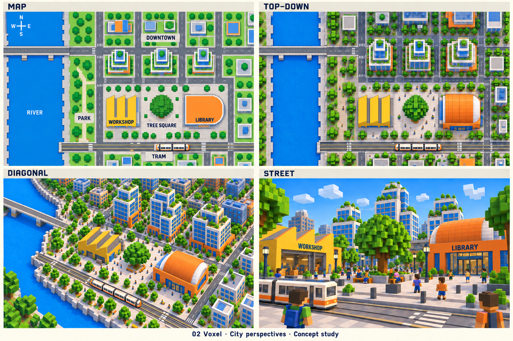
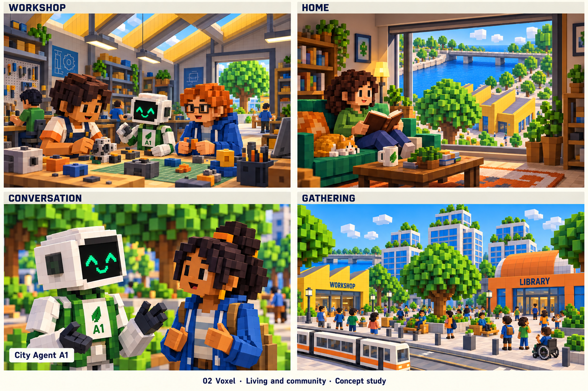
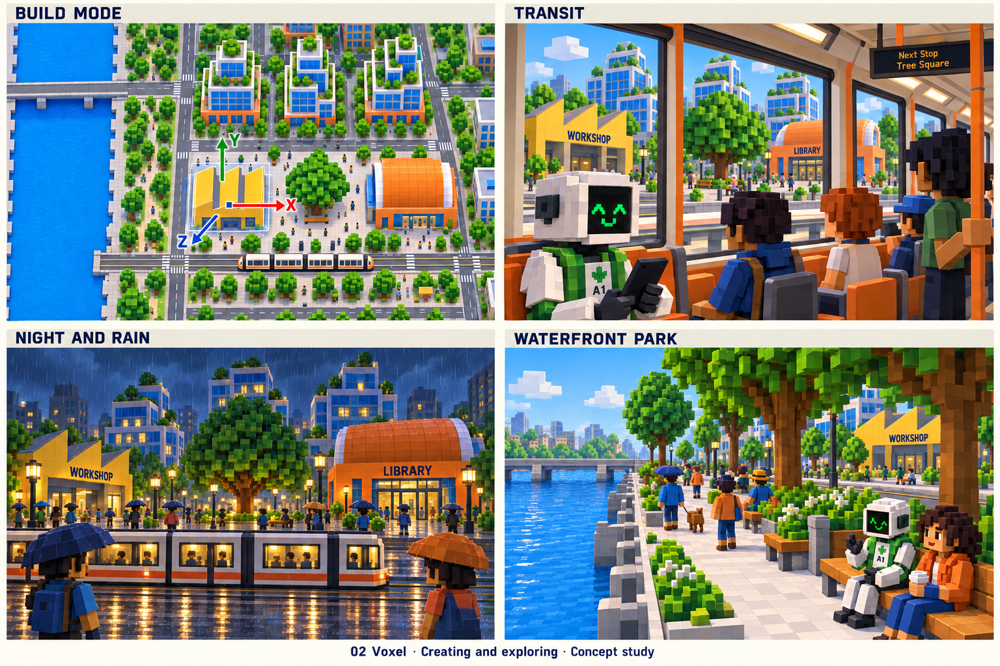
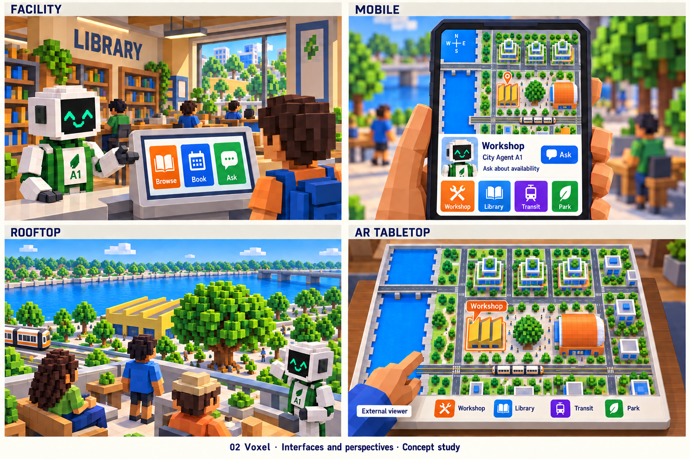

> Historical record migrated from `docs/vision/style-studies/02-voxel/README.md`. File paths in prose/JSON may describe the old layout; use the migration ledger for exact mappings.

# Voxel

Concept art, not gameplay or performance evidence. [All styles](../../../../README.md).

Gallery images were repaired on 2026-09-20. [Repair record, current prompts and residual limitations](../2026-09-20-first-ten/REPAIR.md). [Preserved original gallery](../2026-09-20-first-ten/originals/README.md).

## Style description

A city assembled from chunky cubes and stepped forms, with a playful, tangible construction language. Emerald, cobalt, and orange distinguish buildings and activities. Trees, furniture, vehicles, and residents share the block-based aesthetic.

Architecture should feel intentionally designed within the grid: terraces, window rhythms, roof profiles, and entrances provide variety. Interiors use blocky workbenches and objects with readable silhouettes. Square-headed people and agent residents express personality through proportions, faces, clothing, and animation.

The same building should be recognizable as a district landmark, a roof pattern, and a street facade. Conversation views need particular attention to eyes, gestures, and framing so characters remain expressive. Editing could visually echo the grid, without requiring the underlying city mechanics to become a voxel simulation.

**Proposed device adaptation:** group distant blocks into simplified shapes, reduce hidden detail, and keep nearby interactive objects legible. High-quality tiers could add contact shadows and material variation. A blocky appearance alone is not a performance guarantee; actual geometry, visibility, and scene density require measurement.

## City perspectives

Map, top-down, diagonal, and street.

[Original generation prompt](00-city-perspectives.prompt.md)

## Living and community

Workshop, home, conversation, and gathering.

[Original generation prompt](01-living-community.prompt.txt)

## Creating and exploring

Build mode, transit, night and rain, and waterfront park.

[Original generation prompt](02-creating-exploring.prompt.txt)

## Interfaces and perspectives

Facility, mobile, rooftop, and AR tabletop.

[Original generation prompt](03-interfaces-perspectives.prompt.txt)
