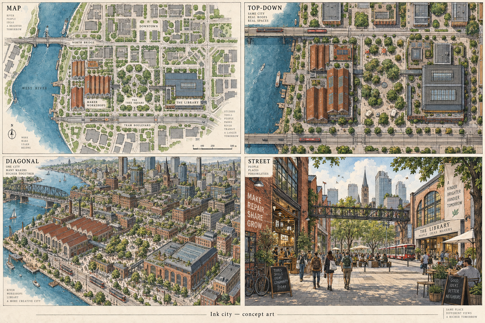
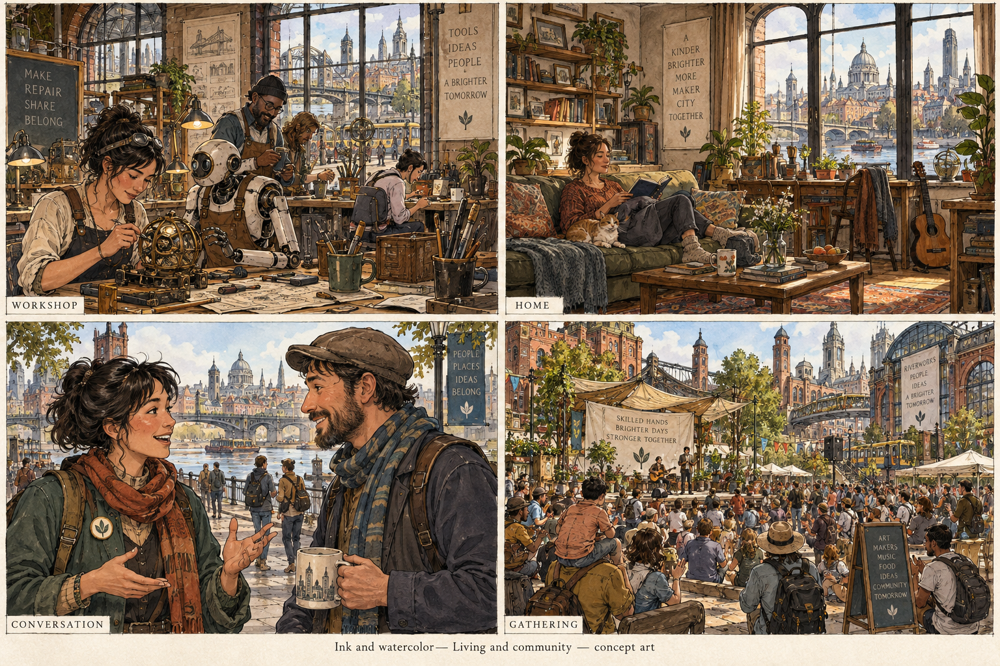
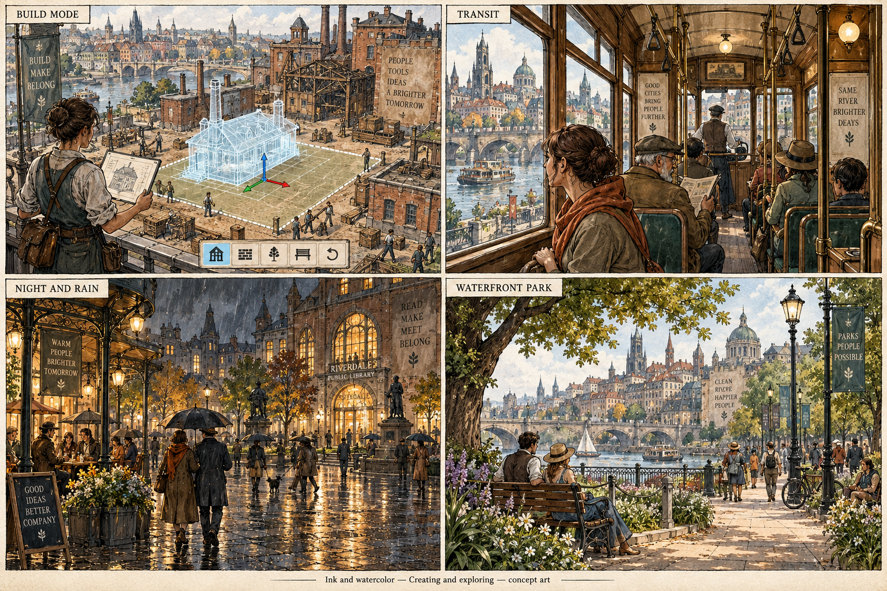
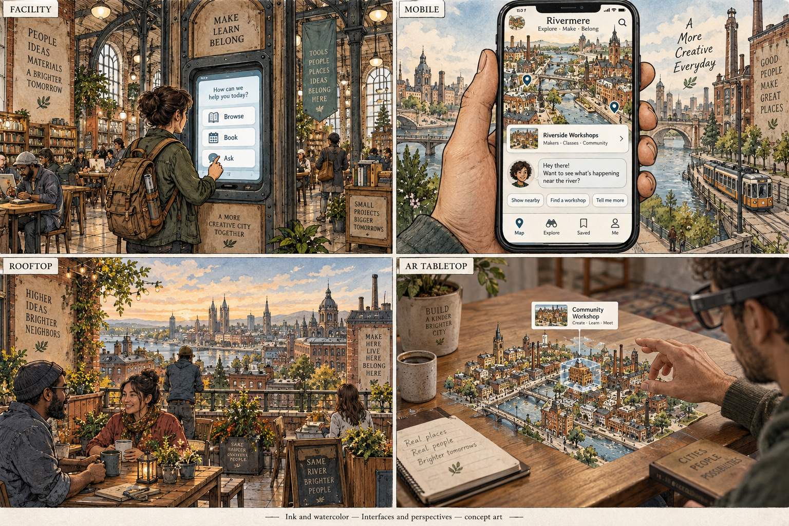

> Historical record migrated from `docs/vision/style-studies/revisions/2026-09-20-first-ten/03-ink/originals/README.md`. File paths in prose/JSON may describe the old layout; use the migration ledger for exact mappings.

# Ink and watercolor

Concept art, not gameplay or performance evidence. [All styles](../README.md).

## Style description

An illustrated city that feels drawn in an architectural sketchbook. Black ink contours, selective crosshatching, ivory paper, and watercolor washes create warmth and visible human authorship. Ochre, rust, sage, and teal support a quieter atmosphere.

Brick workshops, adapted warehouses, libraries, and planted public spaces suit this direction. Interiors are layered with books, tools, fabrics, and personal belongings. People and agents should share the illustrated linework rather than appearing as realistic figures placed in a drawing.

Maps can resemble hand-drawn city guides; diagonal views can emphasize roof rhythms and urban composition. At street and conversation distance, line weight and selective detail should direct attention toward faces, doors, and interactive objects. Night scenes should retain readable paths through light washes and clear silhouettes.

**Proposed device adaptation:** explore stable outlines and economical surface treatments, reducing hatching density and small decorative marks on smaller screens. Higher tiers could enrich texture and atmospheric layering. The main prototype question is whether linework remains stable during movement and zooming; these still images do not answer it.

## City perspectives

Map, top-down, diagonal, and street.

[Original generation prompt](../../../sheets/00-city-perspectives/r001/prompt.txt)

## Living and community

Workshop, home, conversation, and gathering.

[Generation prompt](../../../sheets/01-living-community/r001/prompt.txt)

## Creating and exploring

Build mode, transit, night and rain, and waterfront park.

[Generation prompt](../../../sheets/02-creating-exploring/r001/prompt.txt)

## Interfaces and perspectives

Facility, mobile, rooftop, and AR tabletop.

[Generation prompt](../../../sheets/03-interfaces-perspectives/r001/prompt.txt)
