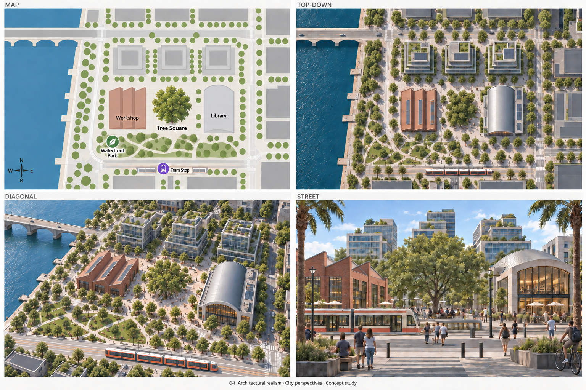
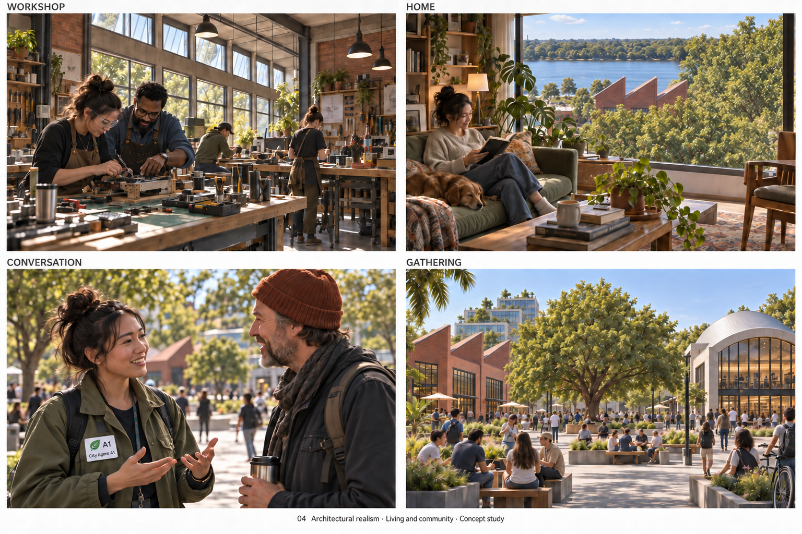
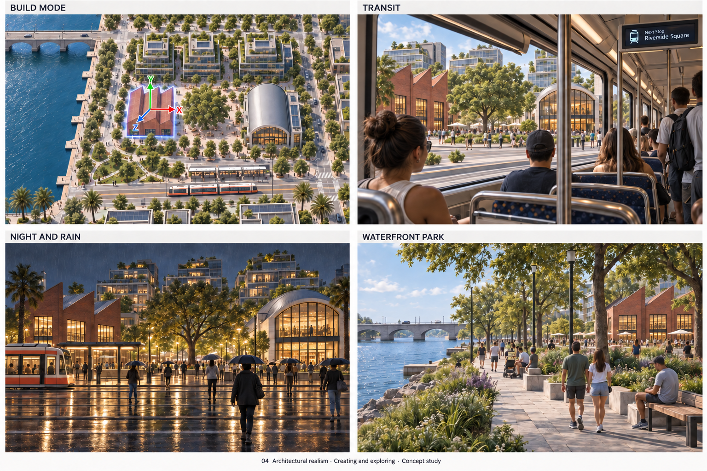
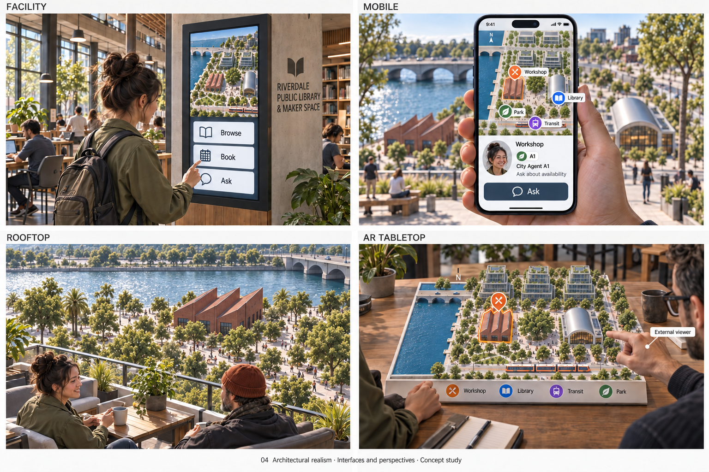

# Architectural realism

[Collection](../../README.md) · [Brief](brief.md) · [Manifest](manifest.json)

Revised and inspected concept sheets; approximate projection, proportions, small details and typography remain.

Selection does not imply review approval.

The sheet images are AI-generated concept art (OpenAI gpt-image, per the C2PA content credentials every sheet image carries), not game captures, released under CC0 1.0 with no rights claimed; see [AI-generated images](../../README.md#ai-generated-images).

## Review sources

- [REPAIR.md](history/2026-09-20-first-ten/REPAIR.md)

## Current selections

### City perspectives — r005

[Exact prompt](sheets/00-city-perspectives/r005/prompt.txt) · [Generation record](sheets/00-city-perspectives/r005/generation.json) · [Review](sheets/00-city-perspectives/r005/review.md) · Generator: OpenAI gpt-image (C2PA credentials)

### Living community — r004

[Exact prompt](sheets/01-living-community/r004/prompt.txt) · [Generation record](sheets/01-living-community/r004/generation.json) · [Review](sheets/01-living-community/r004/review.md) · Generator: OpenAI gpt-image (C2PA credentials)

### Creating exploring — r003

[Exact prompt](sheets/02-creating-exploring/r003/prompt.txt) · [Generation record](sheets/02-creating-exploring/r003/generation.json) · [Review](sheets/02-creating-exploring/r003/review.md) · Generator: OpenAI gpt-image (C2PA credentials)

### Interfaces perspectives — r003

[Exact prompt](sheets/03-interfaces-perspectives/r003/prompt.txt) · [Generation record](sheets/03-interfaces-perspectives/r003/generation.json) · [Review](sheets/03-interfaces-perspectives/r003/review.md) · Generator: OpenAI gpt-image (C2PA credentials)

## Revision history

Revision numbers record migration ordering, not generation timestamps.

- City perspectives / r001: [image](sheets/00-city-perspectives/r001/image.png), [generation](sheets/00-city-perspectives/r001/generation.json), [review](sheets/00-city-perspectives/r001/review.md)
- City perspectives / r002: [image](sheets/00-city-perspectives/r002/image.png), [generation](sheets/00-city-perspectives/r002/generation.json), [review](sheets/00-city-perspectives/r002/review.md)
- City perspectives / r003: [image](sheets/00-city-perspectives/r003/image.png), [generation](sheets/00-city-perspectives/r003/generation.json), [review](sheets/00-city-perspectives/r003/review.md)
- City perspectives / r004: [image](sheets/00-city-perspectives/r004/image.png), [generation](sheets/00-city-perspectives/r004/generation.json), [review](sheets/00-city-perspectives/r004/review.md)
- City perspectives / r005 — selected: [image](sheets/00-city-perspectives/r005/image.png), [generation](sheets/00-city-perspectives/r005/generation.json), [review](sheets/00-city-perspectives/r005/review.md)
- Living community / r001: [image](sheets/01-living-community/r001/image.png), [generation](sheets/01-living-community/r001/generation.json), [review](sheets/01-living-community/r001/review.md)
- Living community / r002: [image](sheets/01-living-community/r002/image.png), [generation](sheets/01-living-community/r002/generation.json), [review](sheets/01-living-community/r002/review.md)
- Living community / r003: [image](sheets/01-living-community/r003/image.png), [generation](sheets/01-living-community/r003/generation.json), [review](sheets/01-living-community/r003/review.md)
- Living community / r004 — selected: [image](sheets/01-living-community/r004/image.png), [generation](sheets/01-living-community/r004/generation.json), [review](sheets/01-living-community/r004/review.md)
- Creating exploring / r001: [image](sheets/02-creating-exploring/r001/image.png), [generation](sheets/02-creating-exploring/r001/generation.json), [review](sheets/02-creating-exploring/r001/review.md)
- Creating exploring / r002: [image](sheets/02-creating-exploring/r002/image.png), [generation](sheets/02-creating-exploring/r002/generation.json), [review](sheets/02-creating-exploring/r002/review.md)
- Creating exploring / r003 — selected: [image](sheets/02-creating-exploring/r003/image.png), [generation](sheets/02-creating-exploring/r003/generation.json), [review](sheets/02-creating-exploring/r003/review.md)
- Interfaces perspectives / r001: [image](sheets/03-interfaces-perspectives/r001/image.png), [generation](sheets/03-interfaces-perspectives/r001/generation.json), [review](sheets/03-interfaces-perspectives/r001/review.md)
- Interfaces perspectives / r002: [image](sheets/03-interfaces-perspectives/r002/image.png), [generation](sheets/03-interfaces-perspectives/r002/generation.json), [review](sheets/03-interfaces-perspectives/r002/review.md)
- Interfaces perspectives / r003 — selected: [image](sheets/03-interfaces-perspectives/r003/image.png), [generation](sheets/03-interfaces-perspectives/r003/generation.json), [review](sheets/03-interfaces-perspectives/r003/review.md)
