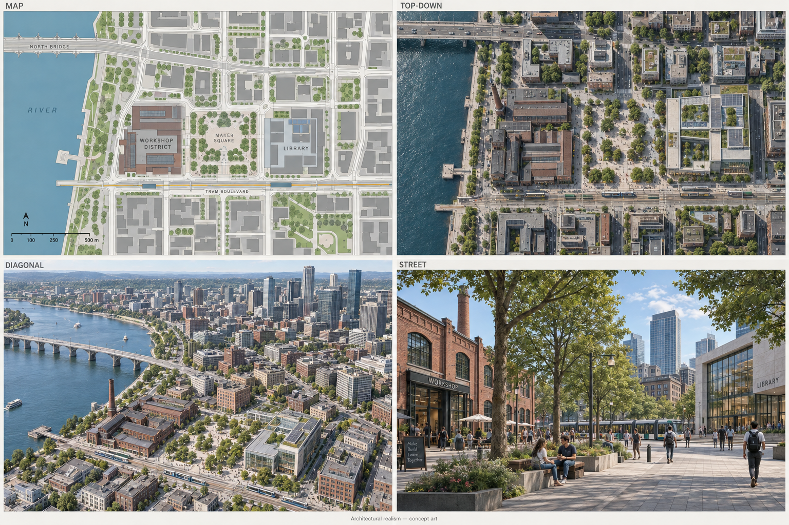
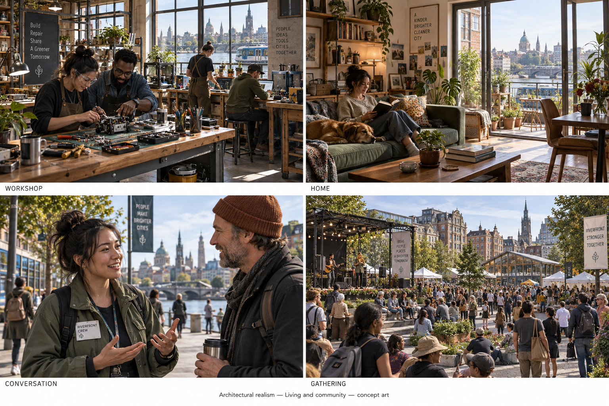
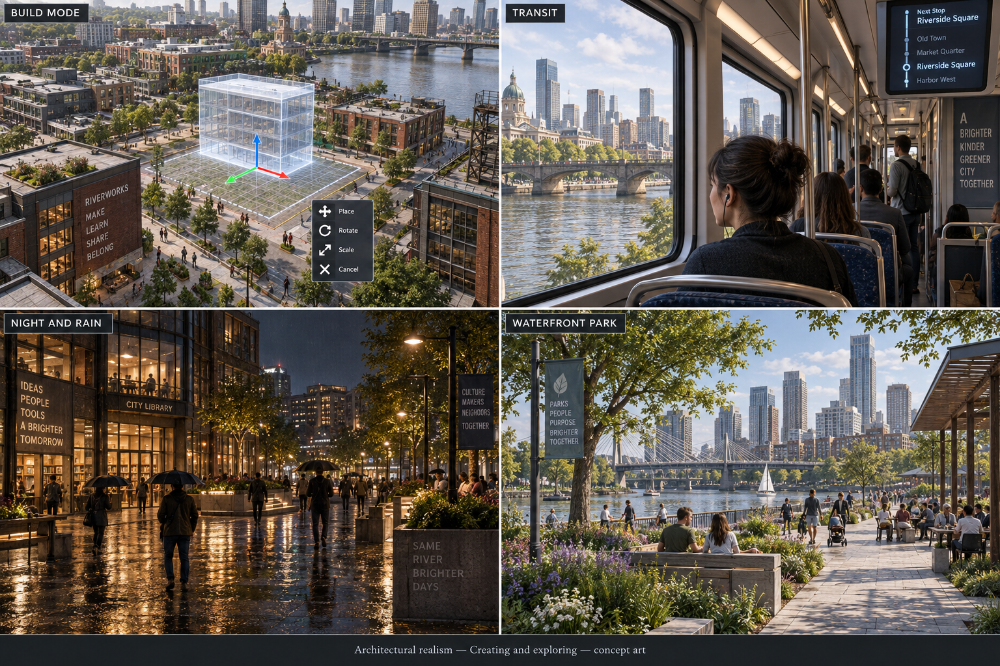
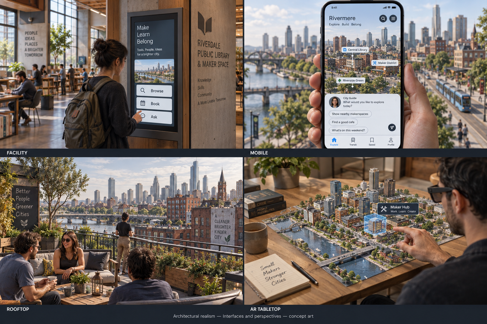

> Historical record migrated from `docs/vision/style-studies/revisions/2026-09-20-first-ten/04-realistic/originals/README.md`. File paths in prose/JSON may describe the old layout; use the migration ledger for exact mappings.

# Architectural realism

Concept art, not gameplay or performance evidence. [All styles](../README.md).

## Style description

A believable contemporary city with natural proportions, grounded lighting, and recognizable materials. Brick, concrete, wood, glass, and steel give places a physical identity. Subtle wear and everyday objects make the city feel occupied rather than staged.

Workshops should reveal how people use them, with practical storage, tools, and task lighting. Homes need personal possessions and comfortable arrangements. Public facilities should communicate their purpose through entrances, circulation, and signage. Human and agent identities need clear visual cues that remain consistent in conversation.

Map views would still require abstraction; realism should become progressively richer toward the street and interior. Close-up character quality, lighting, and motion need to work together. The concept sheets establish an atmosphere, not a production target for facial animation or material accuracy.

**Proposed device adaptation:** preserve building scale, layout, and material categories across devices, while varying texture resolution, reflections, shadows, decorative density, and distant geometry. Mobile and browser could emphasize exploration and interaction with reduced visual detail. A representative playable scene must establish achievable fidelity and latency before this direction is chosen.

## City perspectives

Map, top-down, diagonal, and street.

[Original generation prompt](../../../sheets/00-city-perspectives/r001/prompt.txt)

## Living and community

Workshop, home, conversation, and gathering.

[Generation prompt](../../../sheets/01-living-community/r001/prompt.txt)

## Creating and exploring

Build mode, transit, night and rain, and waterfront park.

[Generation prompt](../../../sheets/02-creating-exploring/r001/prompt.txt)

## Interfaces and perspectives

Facility, mobile, rooftop, and AR tabletop.

[Generation prompt](../../../sheets/03-interfaces-perspectives/r001/prompt.txt)
