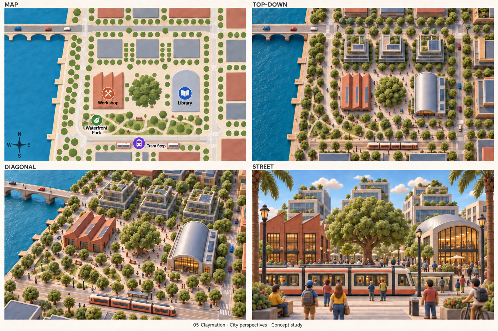
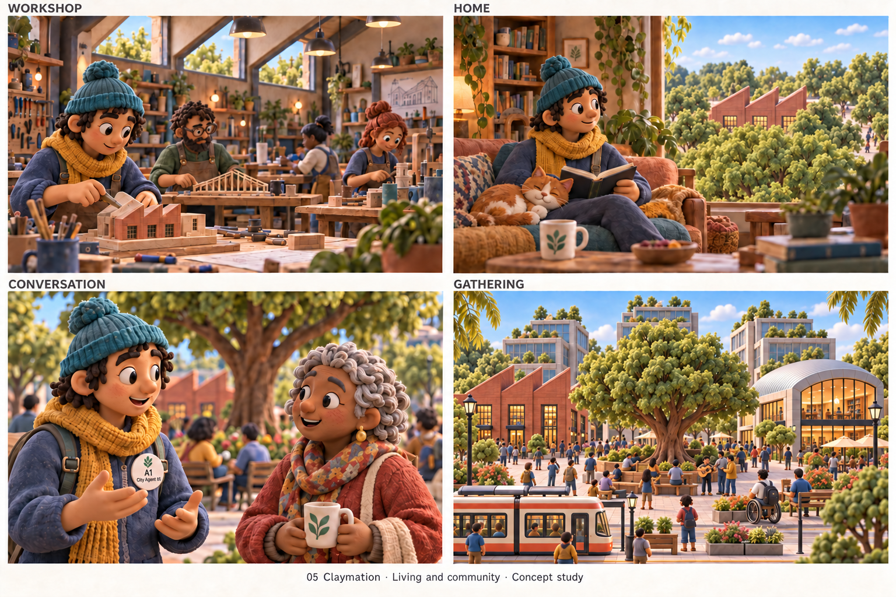
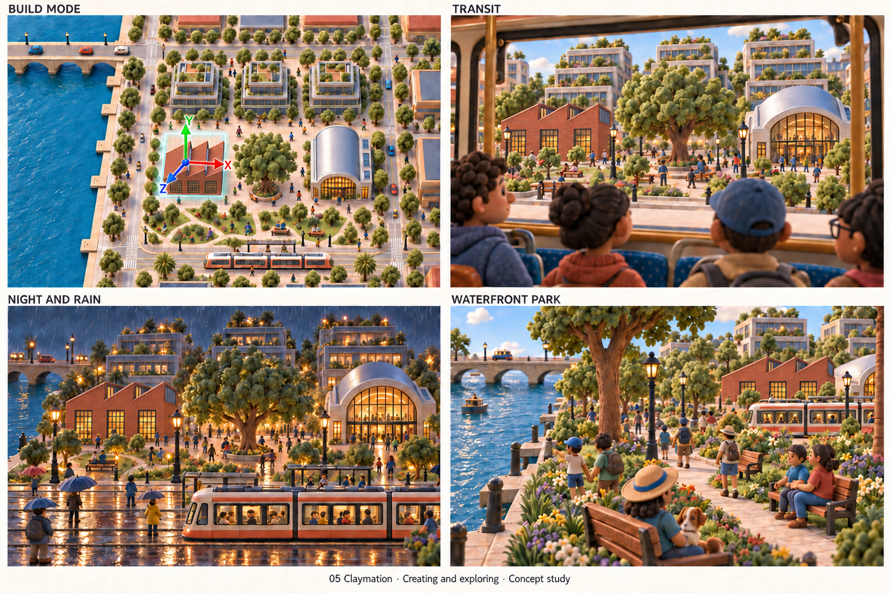
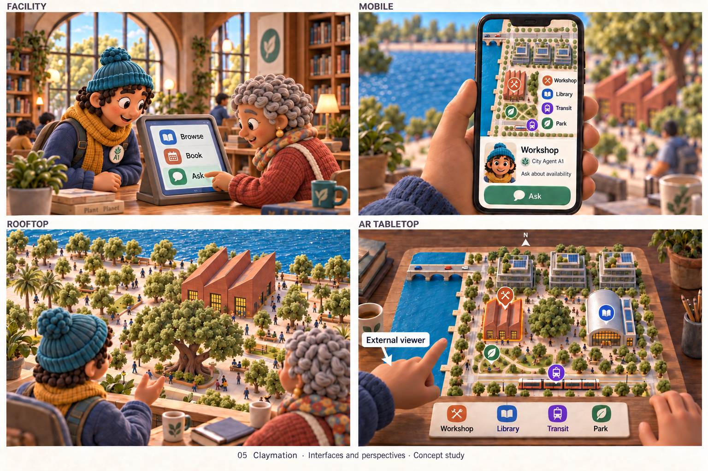

> Historical record migrated from `docs/vision/style-studies/05-claymation/README.md`. File paths in prose/JSON may describe the old layout; use the migration ledger for exact mappings.

# Claymation

Concept art, not gameplay or performance evidence. [All styles](../../../../README.md).

## Style description

A warm city that resembles a handmade stop-motion set. Rounded sculpted forms, slight irregularities, and tactile surfaces give buildings and residents an approachable personality. Turquoise, mustard, cream, and brick red anchor the palette.

Architecture should retain useful distinctions despite its softness: workshops, homes, and public buildings need different silhouettes and entrances. Interiors can combine sculpted furniture with textile-like details and carefully arranged props. People and agents should have expressive faces, clear gestures, and a shared handcrafted appearance.

City overviews can feel like large physical models, while street and home scenes emphasize intimacy. Conversation views are especially important for testing character appeal. The visual style does not require a low animation frame rate; motion cadence should be chosen separately for responsiveness and comfort.

**Proposed device adaptation:** keep rounded silhouettes and material colors consistent, simplifying surface texture, decorative objects, and lighting on lower tiers. Higher tiers could enrich tactile detail and soft shadows. Avoid excessive depth-of-field blur that hides navigable spaces; test how the miniature-set appearance works at full city scale.

Repaired gallery, 2026-09-20. [Repair record, exact prompts and residuals](../2026-09-20-first-ten/REPAIR.md). [Historical originals](../2026-09-20-first-ten/originals/README.md). A reviewed concept revision, not full contract compliance.

## City perspectives

Map, top-down, diagonal, and street.

[Historical original generation prompt](00-city-perspectives.prompt.md)

## Living and community

Workshop, home, conversation, and gathering.

[Historical generation prompt](01-living-community.prompt.txt)

## Creating and exploring

Build mode, transit, night and rain, and waterfront park.

[Historical generation prompt](02-creating-exploring.prompt.txt)

## Interfaces and perspectives

Facility, mobile, rooftop, and AR tabletop.

[Historical generation prompt](03-interfaces-perspectives.prompt.txt)
