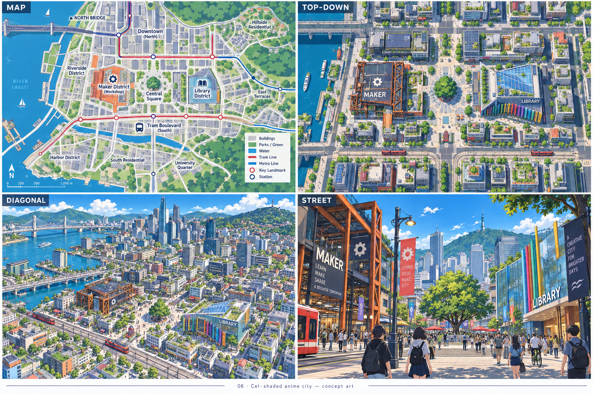
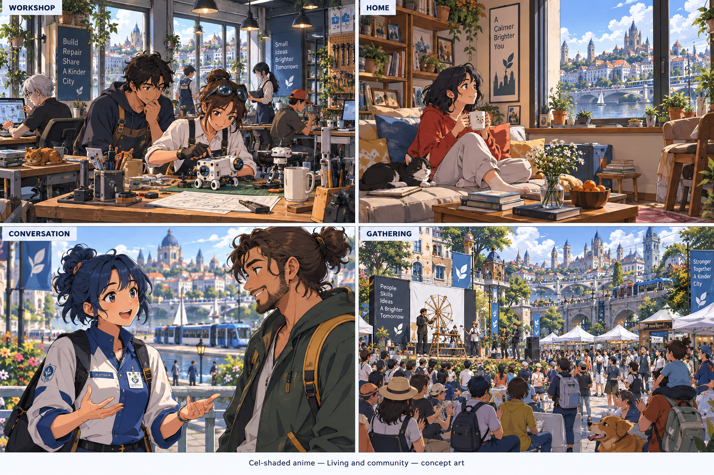
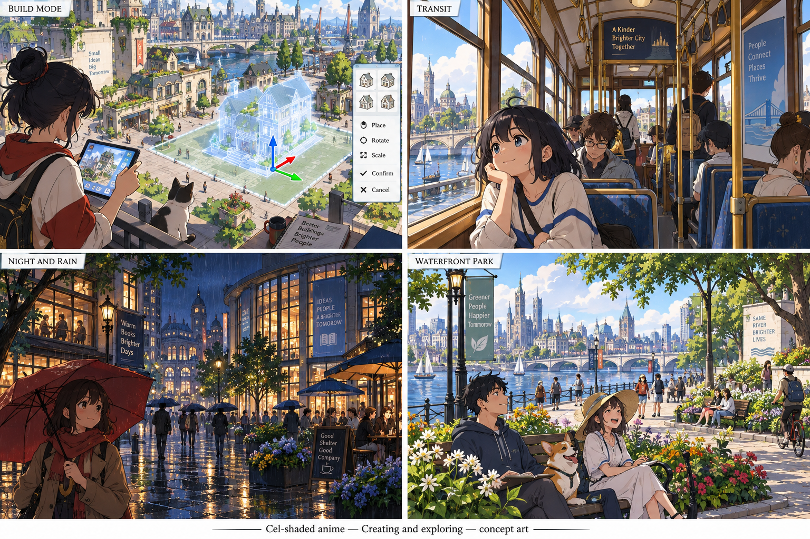
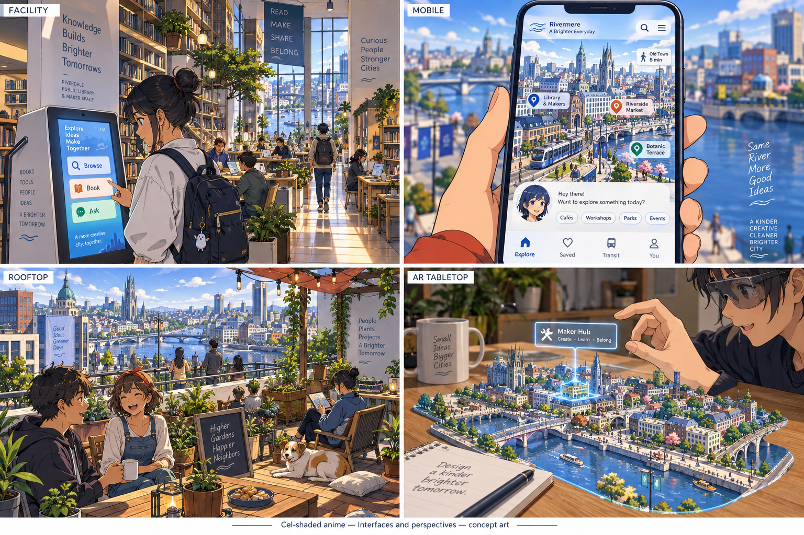

> Historical record migrated from `docs/vision/style-studies/revisions/2026-09-20-first-ten/06-anime/originals/README.md`. File paths in prose/JSON may describe the old layout; use the migration ledger for exact mappings.

# Cel-shaded anime

Concept art, not gameplay or performance evidence. [All styles](../README.md).

## Style description

A cel-shaded city with expressive characters, composed color, and selective outlines. Warm whites, blues, indigo, and vermilion support lively daylight scenes. Limited shadow steps create an illustrated feel while architecture retains convincing spatial depth.

Buildings can combine contemporary urban forms with distinctive roofs, balconies, shopfronts, and transit infrastructure. Interiors should communicate character through layout and selected possessions. People and agent residents need original, consistent designs, with readable expressions, clothing, and gestures.

District views emphasize silhouette and color organization. Street scenes add carefully chosen environmental detail, while conversations bring facial expression and pose forward. Night and rain should preserve the same shading language rather than turning into a separate realistic treatment.

**Proposed device adaptation:** maintain character silhouettes, palette, and shadow design at all tiers. Lower tiers could simplify outlines, background props, and lighting; higher tiers could add secondary motion and environmental detail. Prototype outline stability, face readability, and animation together. The generated sheets include some painterly detail, so a production style guide would need to define the desired boundary.

## City perspectives

Map, top-down, diagonal, and street.

[Original generation prompt](../../../sheets/00-city-perspectives/r001/prompt.txt)

## Living and community

Workshop, home, conversation, and gathering.

[Generation prompt](../../../sheets/01-living-community/r001/prompt.txt)

## Creating and exploring

Build mode, transit, night and rain, and waterfront park.

[Generation prompt](../../../sheets/02-creating-exploring/r001/prompt.txt)

## Interfaces and perspectives

Facility, mobile, rooftop, and AR tabletop.

[Generation prompt](../../../sheets/03-interfaces-perspectives/r001/prompt.txt)
