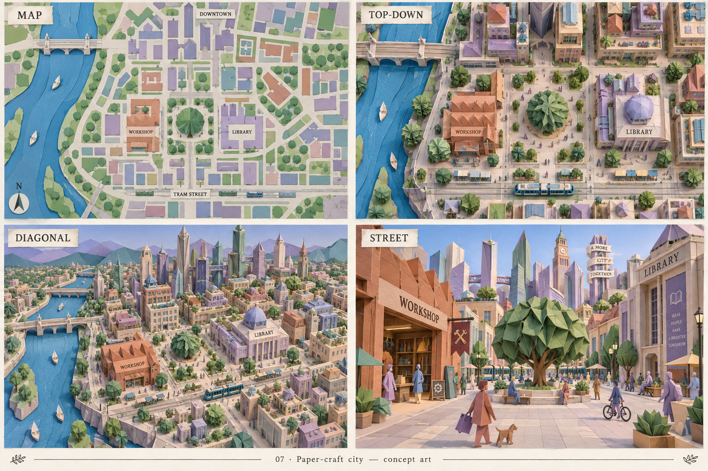
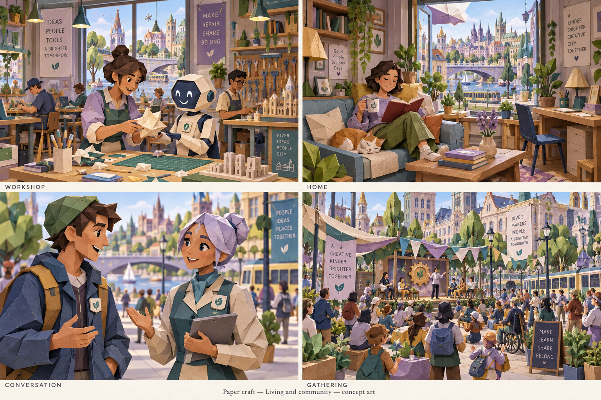
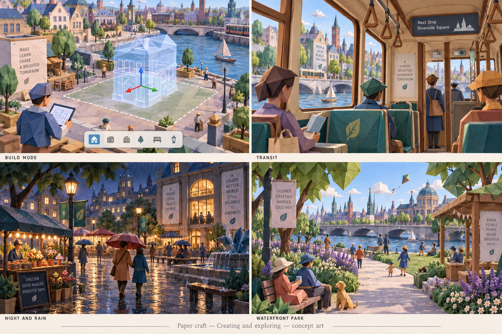
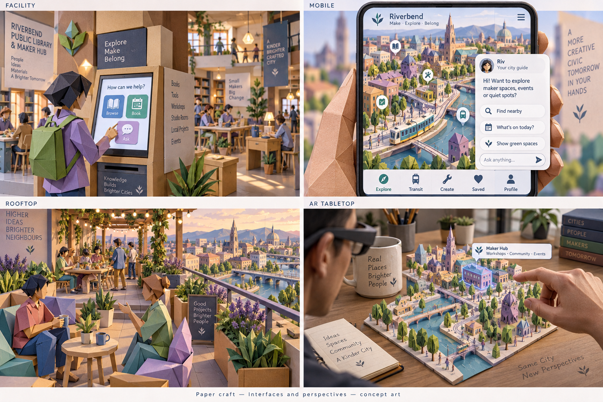

> Historical record migrated from `docs/vision/style-studies/revisions/2026-09-20-first-ten/07-paper-craft/originals/README.md`. File paths in prose/JSON may describe the old layout; use the migration ledger for exact mappings.

# Paper craft

Concept art, not gameplay or performance evidence. [All styles](../README.md).

## Style description

A city made to look folded, cut, and assembled from colored paper. Visible edges, layered surfaces, origami forms, and subtle fibers establish the material language. Lavender, pistachio, terracotta, cream, and peacock blue create a gentle but distinctive palette.

Buildings should look constructed from purposeful folds and layered panels. Trees, furniture, signage, vehicles, and residents should follow the same logic. Interiors can use cut-paper shelves, folded chairs, and layered decorations. Character expressions should remain readable without losing the angular, handmade quality.

Maps can resemble cut-paper plans; diagonal views can reveal assembly and depth. Street and conversation views should show folds and edges at a useful scale. Rain and water are artistic treatments within the virtual world, not a requirement to simulate paper becoming wet or damaged.

**Proposed device adaptation:** preserve major folds and silhouettes, simplifying tiny layers, fibers, and shadow detail on lower tiers. Higher tiers could emphasize contact shadows and surface texture. Test animation and camera movement early: folds should remain coherent when characters move and when the viewer enters buildings.

## City perspectives

Map, top-down, diagonal, and street.

[Original generation prompt](../../../sheets/00-city-perspectives/r001/prompt.txt)

## Living and community

Workshop, home, conversation, and gathering.

[Generation prompt](../../../sheets/01-living-community/r001/prompt.txt)

## Creating and exploring

Build mode, transit, night and rain, and waterfront park.

[Generation prompt](../../../sheets/02-creating-exploring/r001/prompt.txt)

## Interfaces and perspectives

Facility, mobile, rooftop, and AR tabletop.

[Generation prompt](../../../sheets/03-interfaces-perspectives/r001/prompt.txt)
