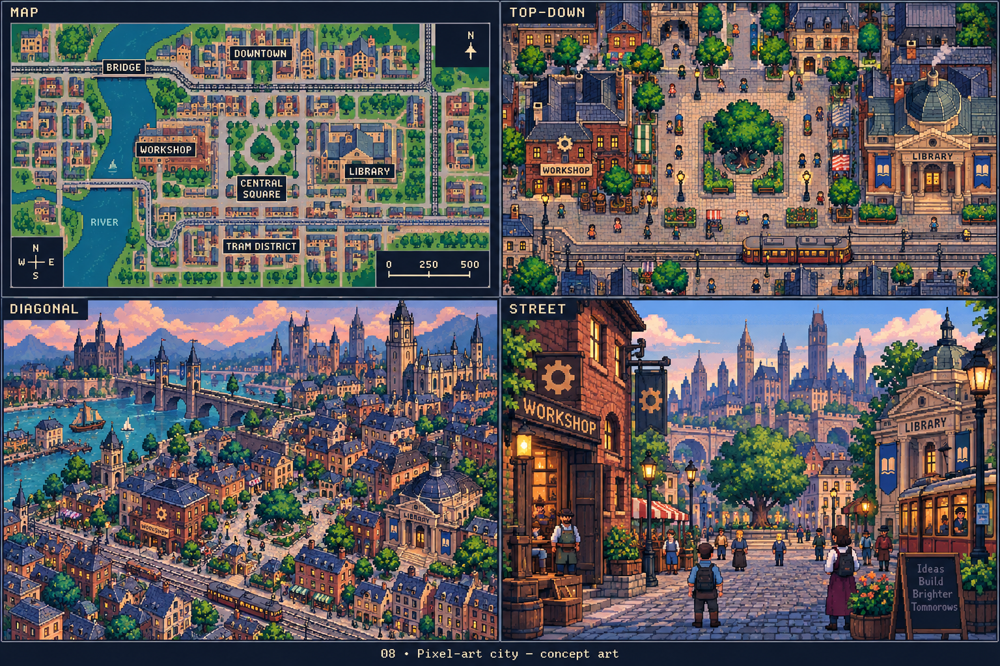
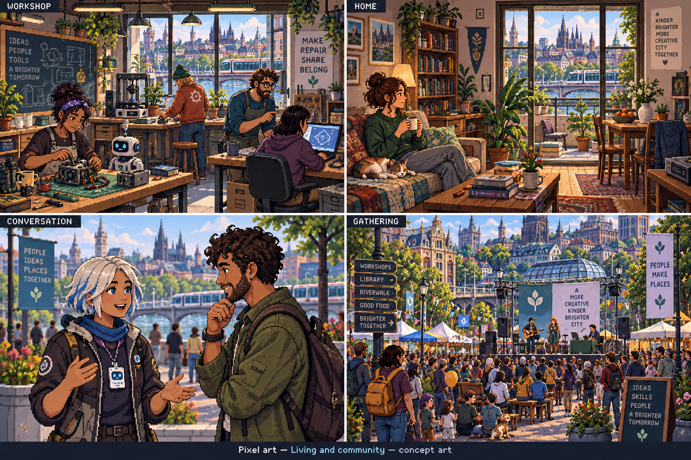
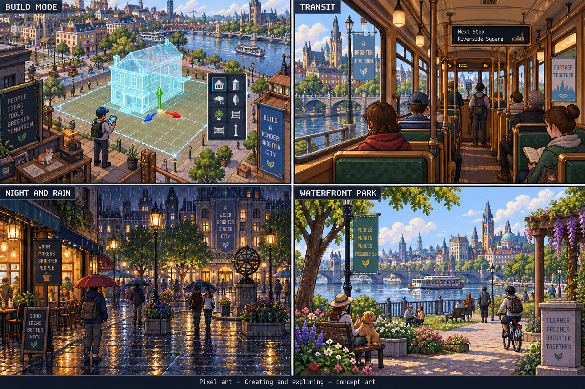
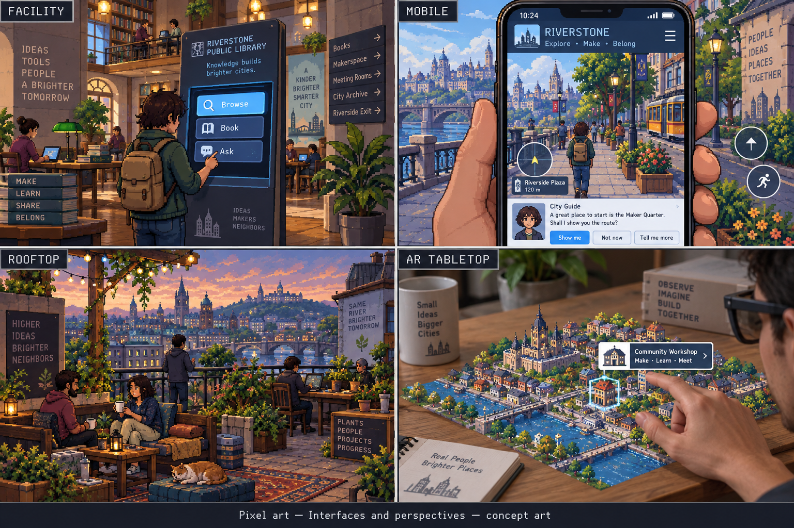

> Historical record migrated from `docs/vision/style-studies/revisions/2026-09-20-first-ten/08-pixel-art/originals/README.md`. File paths in prose/JSON may describe the old layout; use the migration ledger for exact mappings.

# Pixel art

Concept art, not gameplay or performance evidence. [All styles](../README.md).

## Style description

A city expressed through visible pixel clusters, a controlled palette, and selective dithering. Its appeal comes from deliberate shape and color placement rather than smooth surfaces. The concept sheets explore both broad city scenes and close-up character moments.

Buildings need strong roof profiles, window rhythms, and entrances that read at limited resolution. Interiors rely on carefully chosen props rather than continuous fine detail. People and agents should remain identifiable through silhouettes, outfits, portraits, and expressive animation.

Map, diagonal, and eye-level views introduce an important design question: whether to use authored sprites, pixel-styled 3D, or a hybrid. These sheets do not choose an implementation. Conversation framing, free camera movement, and future AR must be tested against that choice.

**Proposed device adaptation:** define intentional pixel scales and readable text independently from scene detail. Lower tiers could reduce background density and effects; higher tiers could enrich animation and atmosphere while preserving the pixel language. Avoid arbitrary blur or inconsistent pixel sizes. The generated art is directional reference, not a ready-to-use sprite atlas.

## City perspectives

Map, top-down, diagonal, and street.

[Original generation prompt](../../../sheets/00-city-perspectives/r001/prompt.txt)

## Living and community

Workshop, home, conversation, and gathering.

[Generation prompt](../../../sheets/01-living-community/r001/prompt.txt)

## Creating and exploring

Build mode, transit, night and rain, and waterfront park.

[Generation prompt](../../../sheets/02-creating-exploring/r001/prompt.txt)

## Interfaces and perspectives

Facility, mobile, rooftop, and AR tabletop.

[Generation prompt](../../../sheets/03-interfaces-perspectives/r001/prompt.txt)
