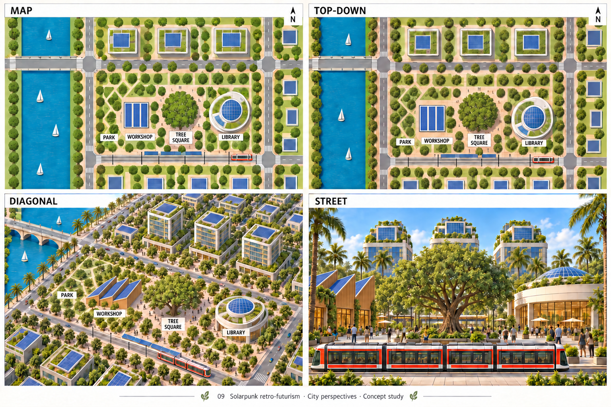
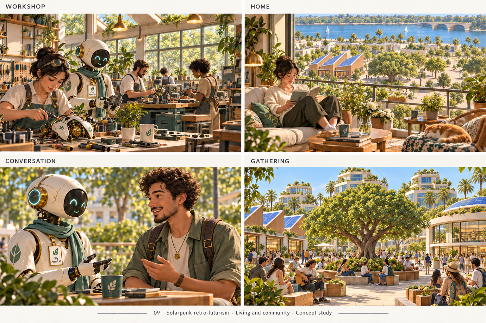
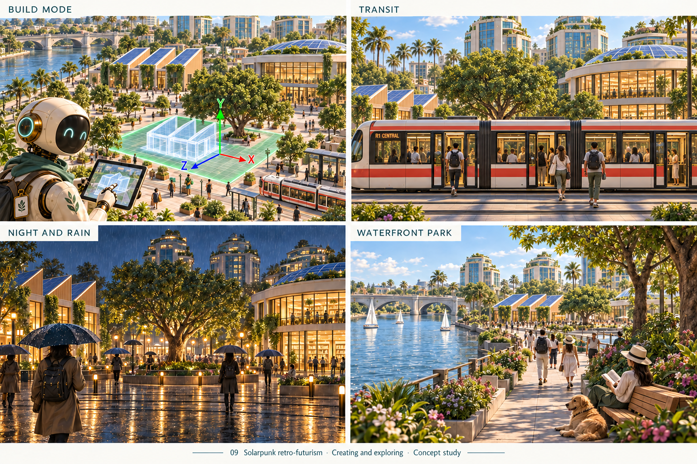
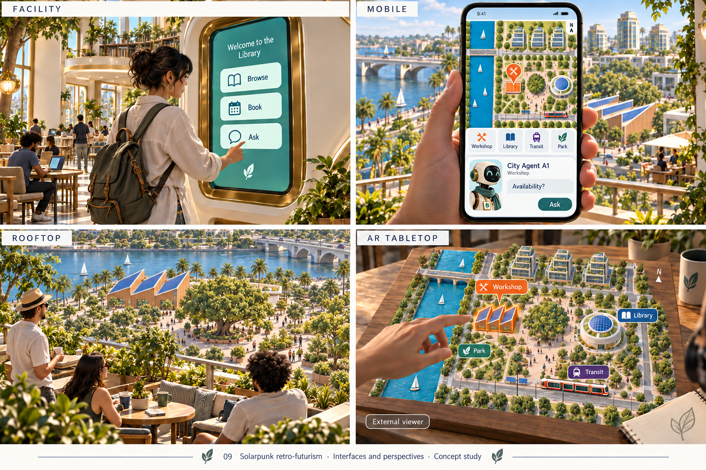

> Historical record migrated from `docs/vision/style-studies/09-solarpunk/README.md`. File paths in prose/JSON may describe the old layout; use the migration ledger for exact mappings.

# Solarpunk retro-futurism

Concept art, not gameplay or performance evidence. [All styles](../../../../README.md).

The gallery below contains the 2026-09-20 repaired comparison sheets. See the
[repair record, exact prompts, candidates and residual issues](../2026-09-20-first-ten/REPAIR.md).
The original sheets and prompts remain in the [historical archive](../2026-09-20-first-ten/originals/README.md).

## Style description

An optimistic retro-futurist city where gardens, shared civic spaces, and visible technology belong together. Curved ceramic architecture, brass details, turquoise glass, solar canopies, and planted terraces establish the identity. Jade, coral, and cream keep the city inviting.

Workshops and libraries should feel useful and accessible, with practical equipment integrated into the architecture. Homes balance greenery with comfortable living space. People and agents can have varied everyday clothing and forms; shared civic life should be more prominent than spectacular machinery.

Large views emphasize connected terraces, transit, and green corridors. Street scenes reveal shade, seating, entrances, and communal activity. Rooftops are lived-in places as well as skyline features. Close-up scenes should retain warmth without depending on decorative foliage everywhere.

**Proposed device adaptation:** preserve distinctive architecture and major planting masses, varying leaf detail, glass effects, reflections, and distant decoration by tier. Decide how stylized the characters and materials should be: some generated panels lean toward realism. This is both an architectural theme and a visual direction; its civic ideas could also appear in other rendering styles.

## City perspectives

Map, top-down, diagonal, and street.

[Historical original generation prompt](00-city-perspectives.prompt.md)

## Living and community

Workshop, home, conversation, and gathering.

[Historical original generation prompt](01-living-community.prompt.txt)

## Creating and exploring

Build mode, transit, night and rain, and waterfront park.

[Historical original generation prompt](02-creating-exploring.prompt.txt)

## Interfaces and perspectives

Facility, mobile, rooftop, and AR tabletop.

[Historical original generation prompt](03-interfaces-perspectives.prompt.txt)
