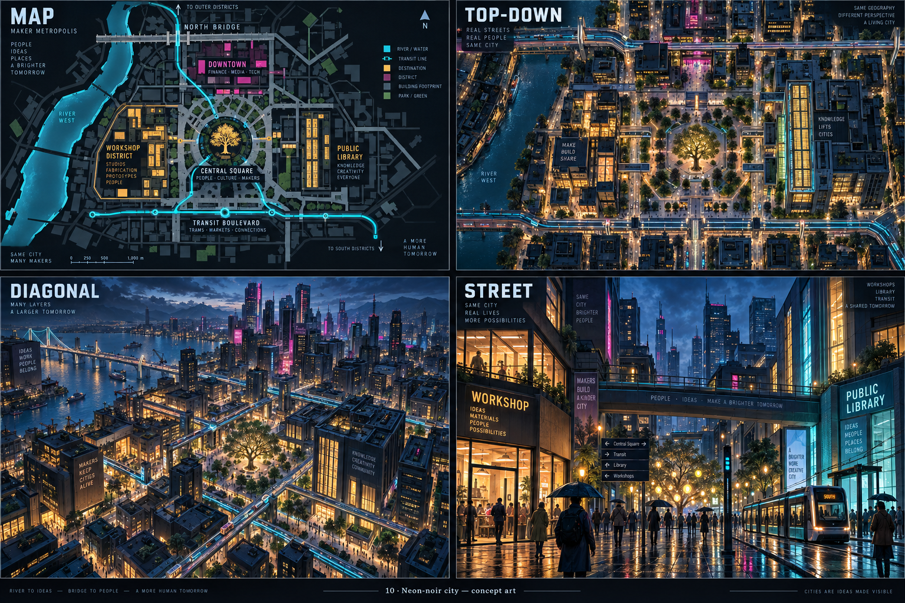
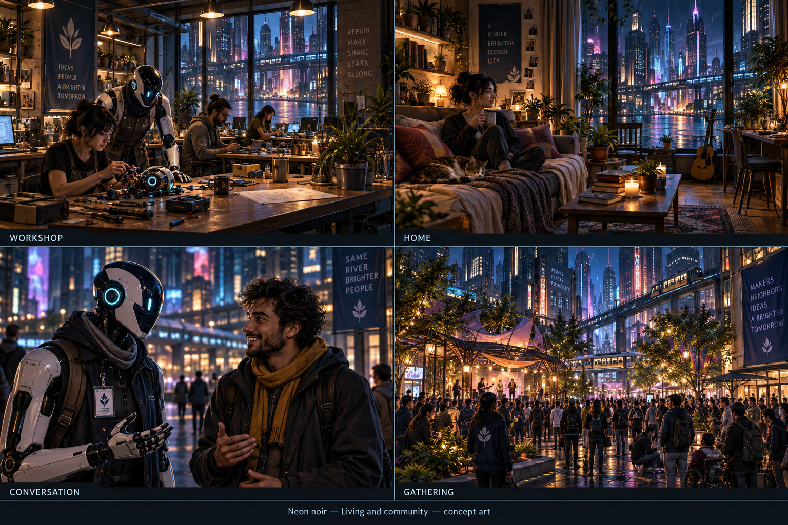
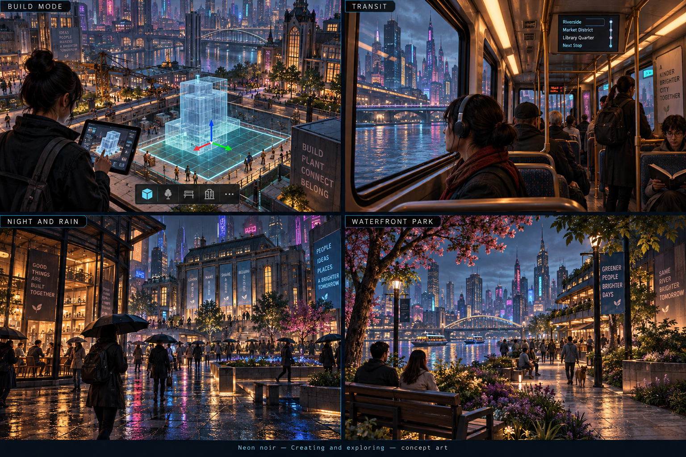
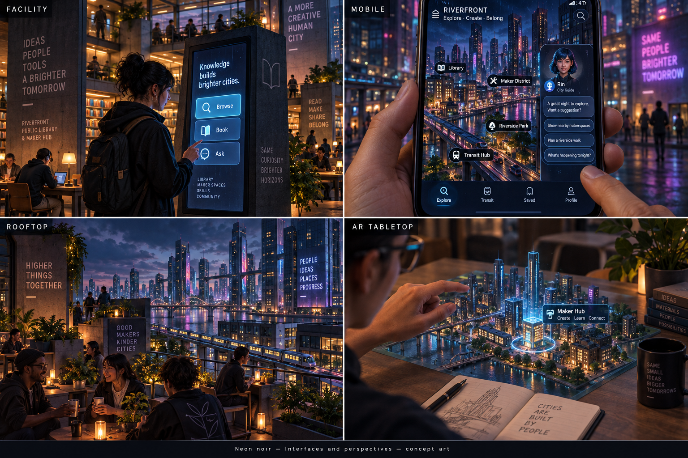

> Historical record migrated from `docs/vision/style-studies/revisions/2026-09-20-first-ten/10-neon-noir/originals/README.md`. File paths in prose/JSON may describe the old layout; use the migration ledger for exact mappings.

# Neon noir

Concept art, not gameplay or performance evidence. [All styles](../README.md).

## Style description

A dense vertical city shaped by dark architecture and selective pools of light. Charcoal and navy contrast with cyan, amber, and magenta. Skybridges, elevated transit, luminous windows, and rain-darkened pavement establish its nighttime identity.

Occupied interiors should feel warm and useful: workshops, homes, libraries, and gathering spaces provide inviting destinations within the dramatic skyline. People and agents wear everyday clothing and retain approachable expressions. The direction focuses on urban atmosphere and community, without requiring combat or dystopian mechanics.

Maps need clear district structure despite the dark palette. Street and transit views should use lighting to reveal routes and destinations. Conversation scenes require enough facial light for expression. The style also needs a deliberate daytime interpretation; the current sheets primarily explore dusk and night.

**Proposed device adaptation:** preserve key light accents and readable silhouettes, reducing reflection complexity, volumetric effects, particles, and distant animated signage on lower tiers. Higher tiers could add richer atmosphere. Test contrast, glare, and route visibility on small screens; bright effects must not obscure interaction cues.

## City perspectives

Map, top-down, diagonal, and street.

[Original generation prompt](../../../sheets/00-city-perspectives/r001/prompt.txt)

## Living and community

Workshop, home, conversation, and gathering.

[Generation prompt](../../../sheets/01-living-community/r001/prompt.txt)

## Creating and exploring

Build mode, transit, night and rain, and waterfront park.

[Generation prompt](../../../sheets/02-creating-exploring/r001/prompt.txt)

## Interfaces and perspectives

Facility, mobile, rooftop, and AR tabletop.

[Generation prompt](../../../sheets/03-interfaces-perspectives/r001/prompt.txt)
