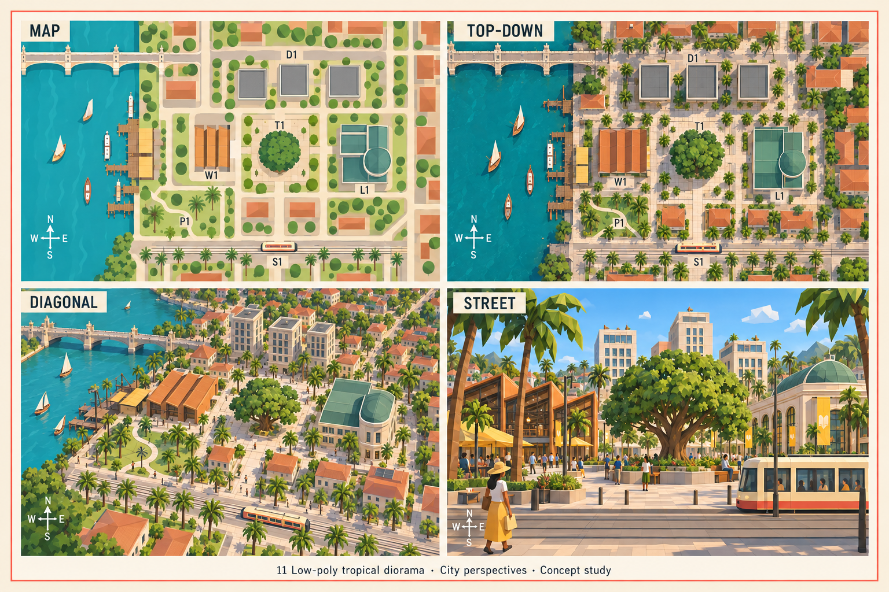
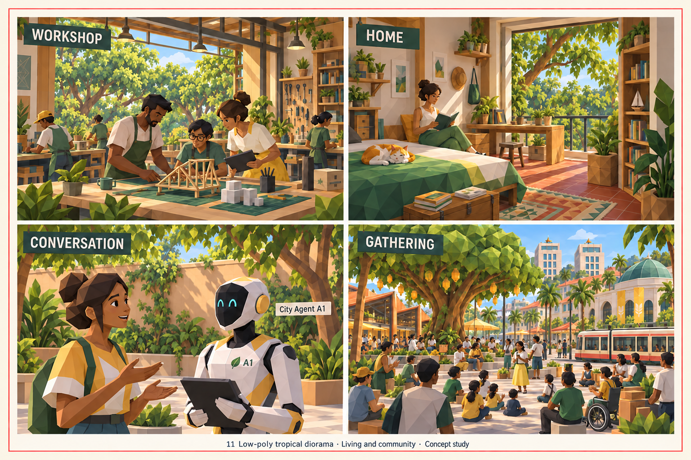
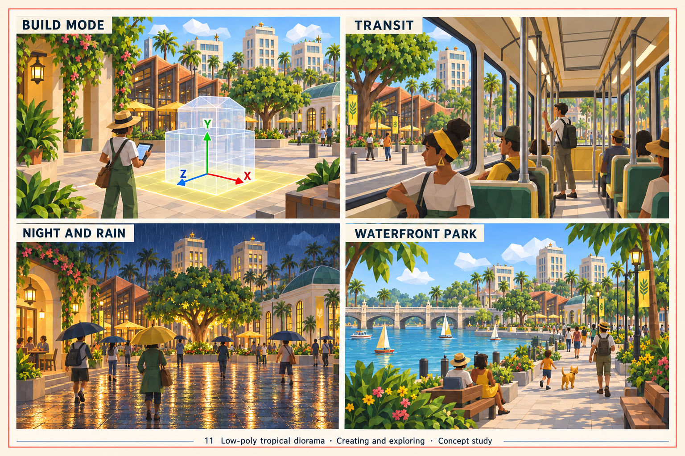
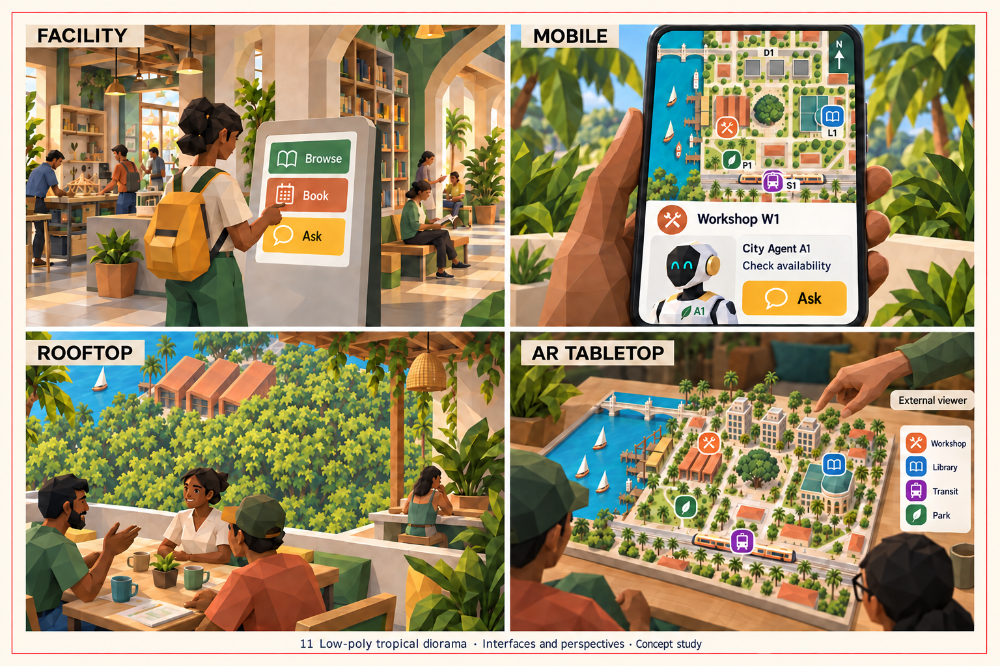

> Historical record migrated from `docs/vision/style-studies/11-low-poly-tropical-diorama/README.md`. File paths in prose/JSON may describe the old layout; use the migration ledger for exact mappings.

# Low-poly tropical diorama

Concept art, not gameplay or performance evidence. [All styles](../../../../README.md).

Original generation prompts were not saved; revision prompts are retained beside the sheets. The original frame treatment follows the candidate brief.

The following description records the original exploration; consult the [correction status](../../../../reviews/REPAIR-STATUS.md) for superseding changes.

Originally, the frame treatment follows the [candidate brief](../../../../shared/CANDIDATE-STYLES.md).

## Style description

A warm riverfront city presented as a faceted model set. Limewash walls, terracotta roofs, green copper domes, and jackfruit-yellow awnings, trams, and umbrellas sit against a teal river. The facets show most clearly in foliage, hair, and props; the buildings read as smooth painted volumes.

Plazas, arched bridges, bell towers, and one large central tree organize the district. Workshops and homes are open, plant-filled rooms with wooden furniture and a river view. People have faceted hair and clothing but smoothly shaded faces; the agent is a white and yellow robot with a dark visor.

Map, top-down, and diagonal views share one layout, so landmarks carry across scales. Street and park scenes rely on the yellow accent and the central tree to anchor the eye. Interfaces use green and coral panels with icon labels that stay readable.

**Proposed device adaptation:** preserve the roof and awning colors, the central tree, and the faceted plant silhouettes at every tier. Lower tiers would flatten leaf clusters and thin crowds; higher tiers could keep the soft lighting. The sheets drift toward painted illustration rather than a true low-poly kit, and footer captions on three sheets are clipped by the frame.

## Correction pass — 2026-09-19

Replaced `00-city-perspectives.png`, `01-living-community.png`, `02-creating-exploring.png` after visual inspection. These revisions address the shared district, landmark continuity and caption clipping. The community agent is labelled A1, the build axes have letters and consistent colours, and the night square has a living tree. The interface sheet was replaced after two further edits: the phone background no longer invents a suspension bridge, the rooftop looks toward nearby canopy and workshop roofs, and the AR district has three stepped towers. The phone retains A1 and the single-screen Workshop/Ask task. Exact framing, entrance orientation and cross-sheet mass proportions still need the final consistency pass. This is partial progress, not certification of full contract compliance. Originals are preserved under [the revision archive](../../README.md).

## City perspectives

Map, top-down, diagonal, and street.

## Living and community

Workshop, home, conversation, and gathering.

## Creating and exploring

Build mode, transit, night and rain, and waterfront park.

## Interfaces and perspectives

Facility, mobile, rooftop, and AR tabletop.

