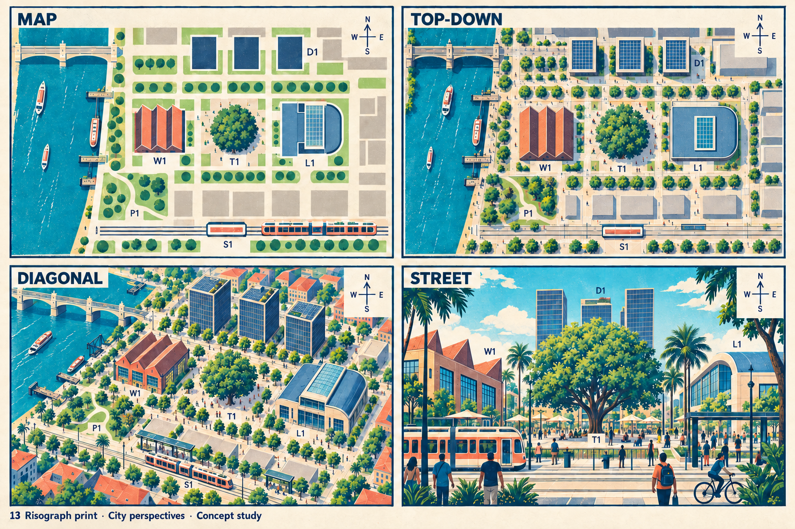
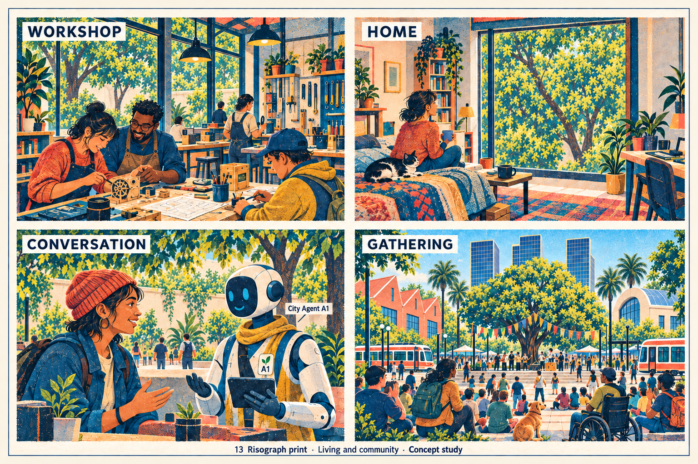
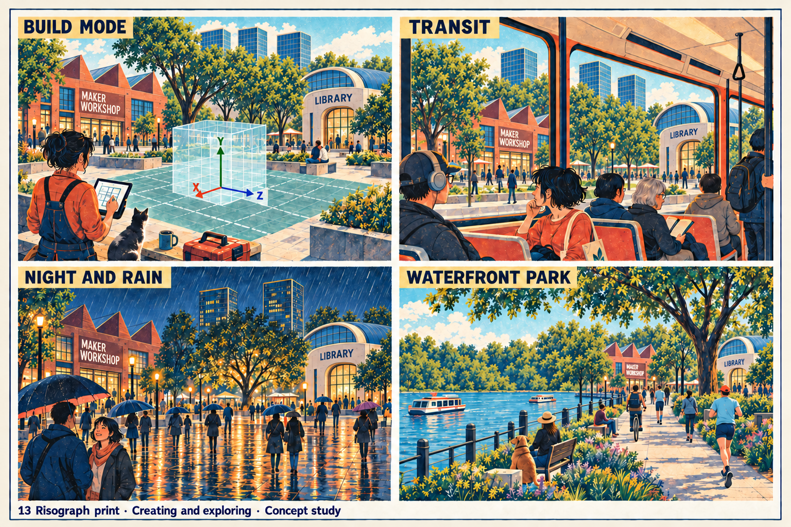
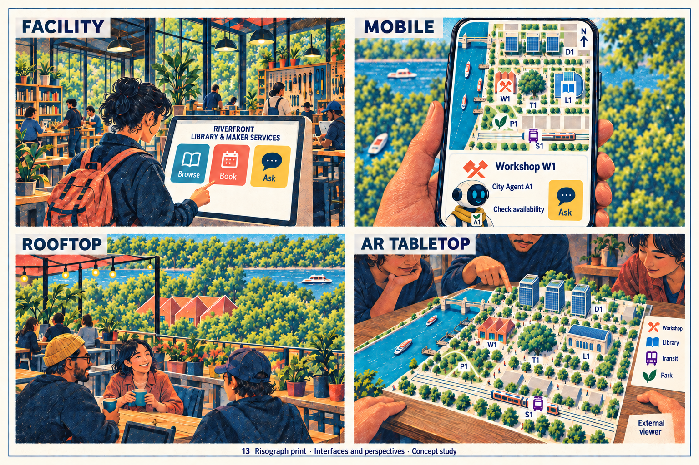

> Historical record migrated from `docs/vision/style-studies/13-risograph-print/README.md`. File paths in prose/JSON may describe the old layout; use the migration ledger for exact mappings.

# Risograph print

Concept art, not gameplay or performance evidence. [All styles](../../../../README.md).

Original generation prompts were not saved; revision prompts are retained beside the sheets. The original frame treatment follows the candidate brief.

The following description records the original exploration; consult the [correction status](../../../../reviews/REPAIR-STATUS.md) for superseding changes.

Originally, the frame treatment follows the [candidate brief](../../../../shared/CANDIDATE-STYLES.md).

## Style description

A few overprinted inks on uncoated paper: coral red, teal, mustard yellow, and navy, with visible grain and slight registration offsets. Color fills are flat and shapes are bold, so the city reads like a printed poster at every scale.

Buildings are simple blocks with red-tiled roofs, a glass-roofed maker hall, a columned library, and a contemporary downtown skyline. Interiors keep the same ink logic across tools, textiles, and plants. People have simple faces and strong outlines; the agent is a white robot with a yellow scarf and cyan eyes.

The map and top-down views are the clearest in the set: blocks, tram lines, and the tree square read at a glance. Street, rain, and park scenes hold their grain without losing figures. Interfaces use the same ink set, and wayfinding labels remain readable.

**Proposed device adaptation:** preserve the limited ink palette, paper grain, and misregistration on silhouettes at every tier. Lower tiers would drop the halftone overlay; higher tiers could animate the offset. The downtown skyline drifts toward a generic modern city rather than a riverfront maker town, and the footer caption is cut off on two sheets.

## Correction pass — 2026-09-19

Replaced `00-city-perspectives.png` after visual inspection. These revisions address the shared district, landmark continuity and caption clipping. Experience-sheet corrections have advanced; see the resumed pass below. This is partial progress, not certification of full contract compliance. Originals are preserved under [the revision archive](../../README.md).

## City perspectives

Map, top-down, diagonal, and street.

## Living and community

Workshop, home, conversation, and gathering.

## Creating and exploring

Build mode, transit, night and rain, and waterfront park.

## Interfaces and perspectives

Facility, mobile, rooftop, and AR tabletop.

## Resumed correction pass — 2026-09-19

Community pass 2 removes duplicated window landmarks and preserves A1. Exploration pass 3 corrects workshop bay counts, the night library vault, axes and distant park geography. Interface pass 3 places the shared map symbols on the phone, preserves A1 and the one-screen task, simplifies the rooftop view and restores the AR library. The AR library scale and storey reading still differ from the overview; full geometric and presentation acceptance remains pending.

Built-in image generation was used. Exact revision prompts are retained beside the sheets; intermediate outputs and original replacements are preserved in [the revision archive](../../README.md). See [repair status](../../../../reviews/REPAIR-STATUS.md) for remaining work.
