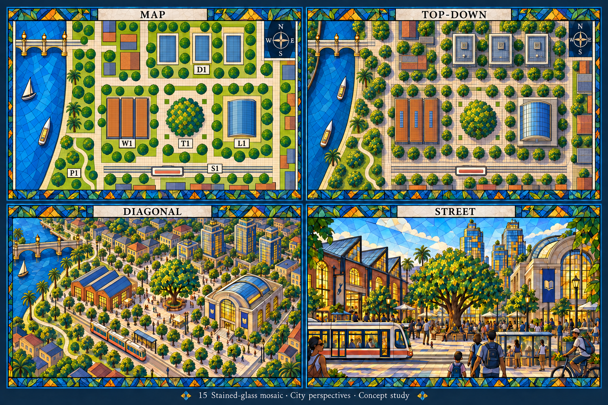
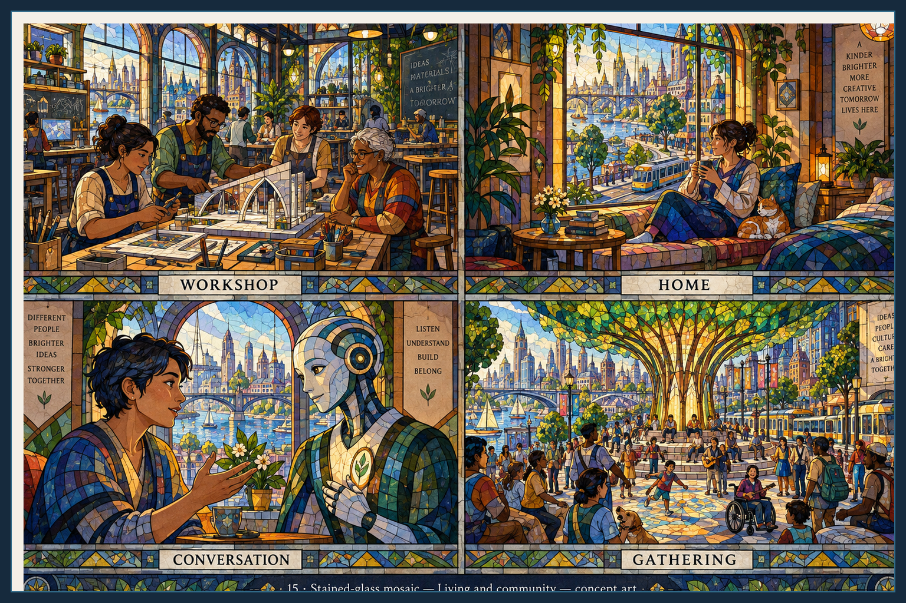
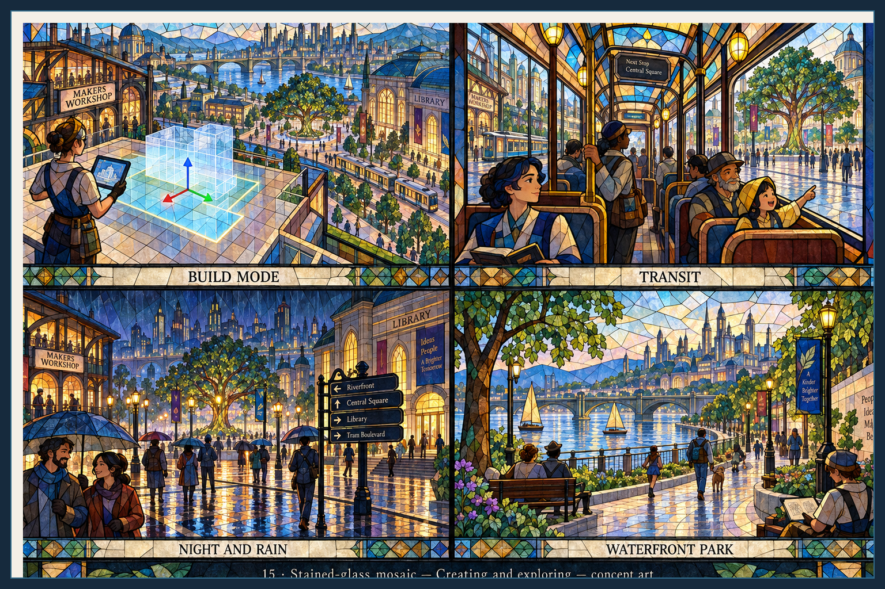
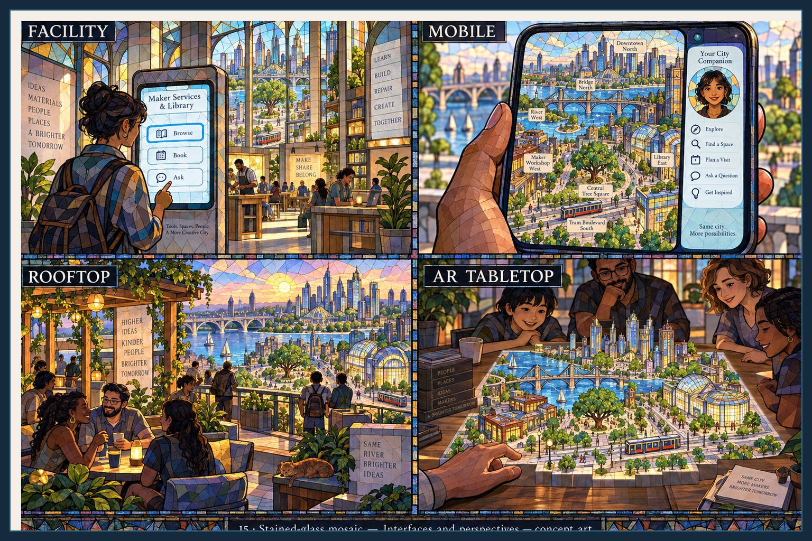

> Historical record migrated from `docs/vision/style-studies/15-stained-glass-mosaic/README.md`. File paths in prose/JSON may describe the old layout; use the migration ledger for exact mappings.

# Stained-glass mosaic

Concept art, not gameplay or performance evidence. [All styles](../../../../README.md).

Original experience-sheet prompts were not saved. The new overview follows the [correction contract](../../../../shared/CONSISTENCY-CONTRACT.md); its exact prompts are saved as [first pass](../../sheets/00-city-perspectives/r001/prompt.txt), [camera correction](../../sheets/00-city-perspectives/r002/prompt.txt), and [plan-guided correction](../../sheets/00-city-perspectives/r003/prompt.txt). See [remaining work](../../../../reviews/REPAIR-STATUS.md).

## Style description

Translucent color cells separated by dark leading cover every surface, from sky to skin. Cobalt, gold, emerald, and amber dominate, with warm light glowing through windows and lamps. Decorative tiled borders frame each panel and carry its label.

Buildings are cathedral-like halls with tall arched windows, a glass-domed library, and a spired skyline. Interiors are leaded too, so furniture, textiles, and plants all become mosaic. People and the agent share the same cell treatment; faces stay readable but every character wears the pattern. The agent is a white and blue humanoid with a leaf emblem.

The new overview anchors the river, bridge, workshop, living tree, library, tram and downtown to the reference district. The original experience sheets below still need continuity corrections. Street, rain, and park scenes glow well but the leading competes with figures. Interfaces use quieter fills.

**Proposed device adaptation:** preserve the leading, the jewel palette, and lit-window glow at every tier. Lower tiers would use larger cells and fewer border patterns; higher tiers could add projected light across floors. The uniform mosaic on people risks losing expression at play distance. These adaptations remain untested.

## City perspectives

Map, top-down, diagonal, and street.

Generated with the built-in image tool, then corrected twice after visual inspection. Camera types, the single northern crossing and the principal landmark arrangement are improved. Workshop roof colour and entrance orientation still need reconciliation across views; this is not a declaration of exact geometric consistency.

## Living and community

Workshop, home, conversation, and gathering.

## Creating and exploring

Build mode, transit, night and rain, and waterfront park.

## Interfaces and perspectives

Facility, mobile, rooftop, and AR tabletop.

