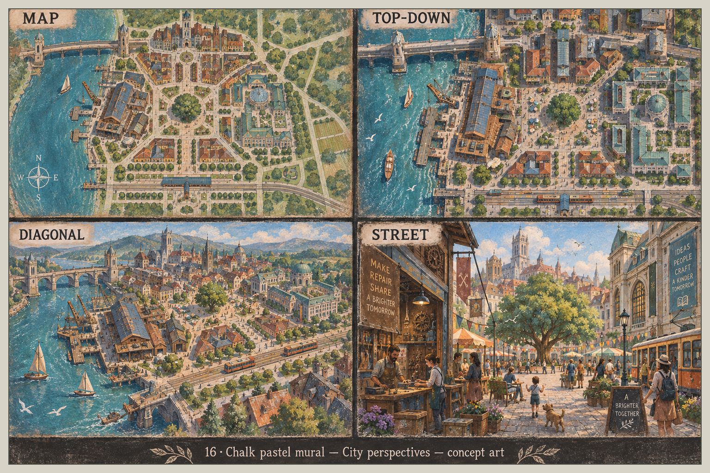
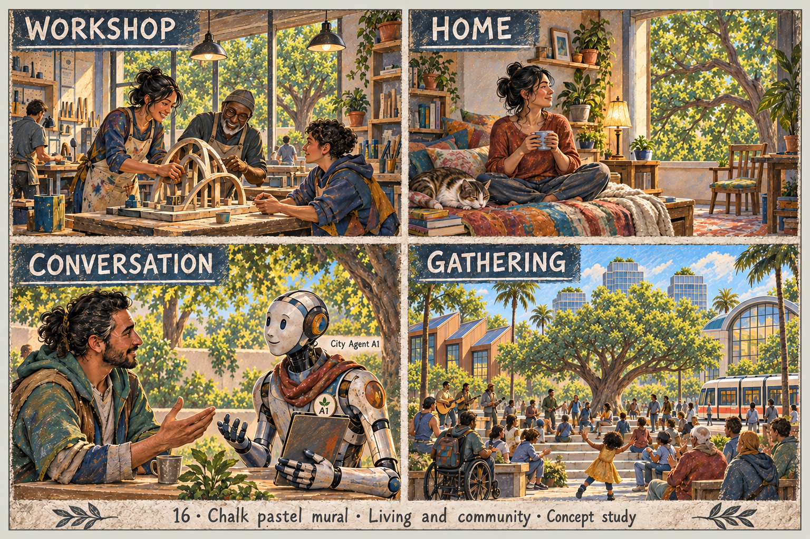
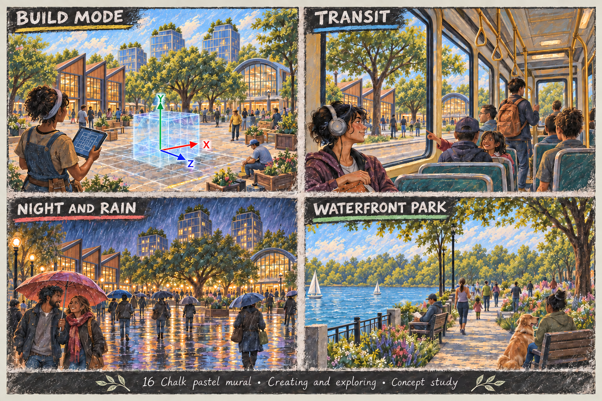
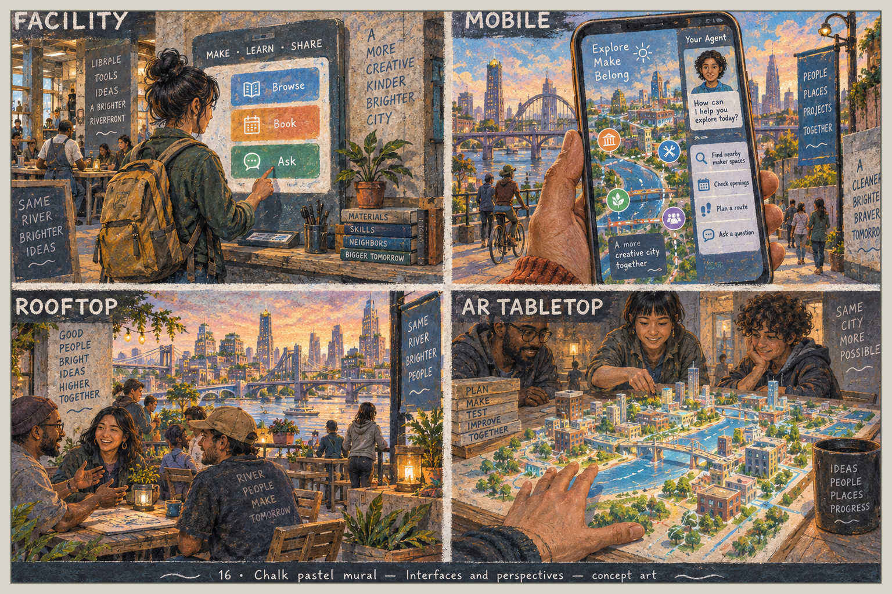

> Historical record migrated from `docs/vision/style-studies/16-chalk-pastel-mural/README.md`. File paths in prose/JSON may describe the old layout; use the migration ledger for exact mappings.

# Chalk pastel mural

Concept art, not gameplay or performance evidence. [All styles](../../../../README.md).

Original generation prompts for this style were not saved; revision prompts are now saved beside the sheets. For the original exploration, the frame treatment follows the [candidate brief](../../../../shared/CANDIDATE-STYLES.md).

## Style description

A city drawn as if onto a weathered wall, with powdery color, speckled grain, and soft charcoal contours. Teal river water, terracotta roofs, cream stone, and slate-blue chalkboard panels set the palette; warm lamp light carries the night scenes.

Buildings are stone and timber with arched bridges, spires, domes, and gabled workshop sheds beside dock cranes. Interiors show wooden benches, hanging lamps, plants, and quilted textiles. People have realistic proportions and painterly faces; the agent is a white and orange android with a scarf.

Large views read as a painted illustration and the chalk texture almost disappears, while street scenes and close-ups show the grain clearly. Chalkboard slogans fill most panels and compete with the scene.

**Proposed device adaptation:** preserve the charcoal contours, the powdery grain, and the terracotta and teal palette at every quality tier. Lower tiers would flatten the speckle to one overlay and drop background crowds; higher tiers could keep visible strokes on facades and water. The generated sheets drift toward realism in faces and lose the chalk identity at map scale.

## City perspectives

Map, top-down, diagonal, and street.

## Living and community

Workshop, home, conversation, and gathering.

## Creating and exploring

Build mode, transit, night and rain, and waterfront park.

## Interfaces and perspectives

Facility, mobile, rooftop, and AR tabletop.

## Resumed correction pass — 2026-09-19

Community pass 2 replaces duplicate window landmarks with foliage and adds the A1 leaf badge. Exploration pass 3 corrects workshop bay and tower counts, preserves the labelled axes and simplifies the park horizon. Overview pass 4 remains a draft: its overhead view became another diagram and lost the curved library roof. Interface pass 2 remains a draft because its rooftop workshop reads as separate buildings. The gallery overview and interface originals have not been replaced in this resumed pass.

Built-in image generation was used. Exact revision prompts are retained beside the sheets; intermediate outputs and original replacements are preserved in [the revision archive](../../README.md). See [repair status](../../../../reviews/REPAIR-STATUS.md) for remaining work.
