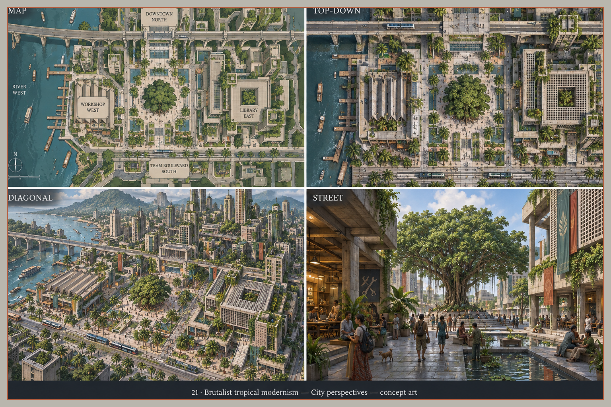
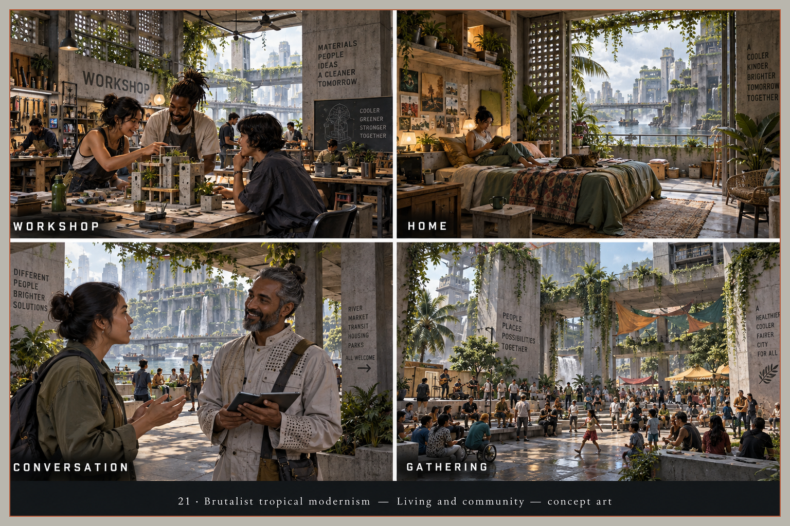
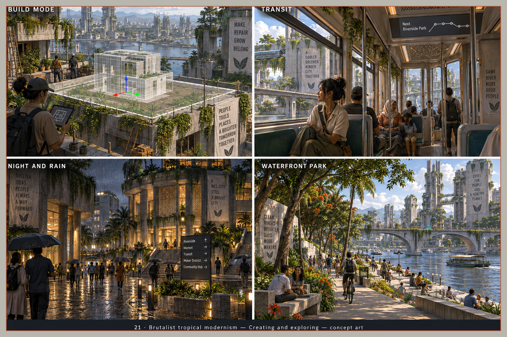
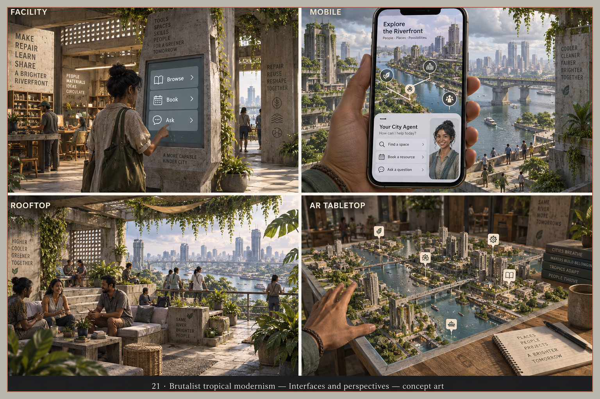

> Historical record migrated from `docs/vision/style-studies/21-brutalist-tropical-modernism/README.md`. File paths in prose/JSON may describe the old layout; use the migration ledger for exact mappings.

# Brutalist tropical modernism

Concept art, not gameplay or performance evidence. [All styles](../../../../README.md).

Generation prompts for this style were not saved; the frame treatment follows the [candidate brief](../../../../shared/CANDIDATE-STYLES.md).

## Style description

A monumental concrete city softened by climate. Board-formed concrete, perforated breeze-block screens, deep overhangs, and climbing vines set the identity, with a large banyan tree anchoring the central square. Concrete gray, foliage green, teal water, and terracotta banners carry the palette.

Buildings are stacked slabs with square courtyards, open terraces, and shaded colonnades. Interiors keep the raw concrete and add timber benches, woven rugs, and potted plants. People are photographic humans in everyday clothes; the city agent appears only as a human portrait on the phone.

Large views read as a grid of slab blocks, tram lines, and the river bridge. Street scenes rely on shade, shallow pools, and stepped seating. Close-ups lean on wall lettering for character, which should not carry the style alone.

**Proposed device adaptation:** preserve slab silhouettes, screen patterns, and the main planting masses at every tier. Lower tiers would flatten concrete texture and thin vines and crowds; higher tiers could add weathering, wet reflections, and dense foliage. Every sheet renders as a photograph rather than a stylized game, so the level of stylization must be decided before further testing.

## City perspectives

Map, top-down, diagonal, and street.

## Living and community

Workshop, home, conversation, and gathering.

## Creating and exploring

Build mode, transit, night and rain, and waterfront park.

## Interfaces and perspectives

Facility, mobile, rooftop, and AR tabletop.

