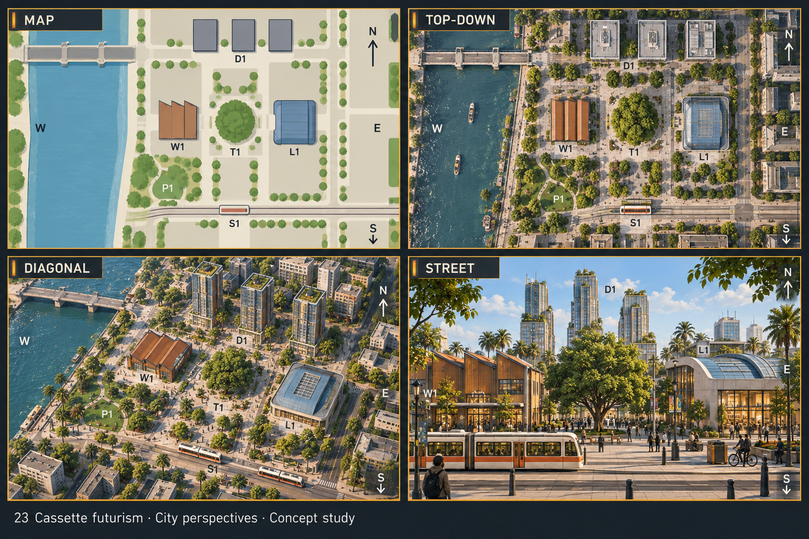
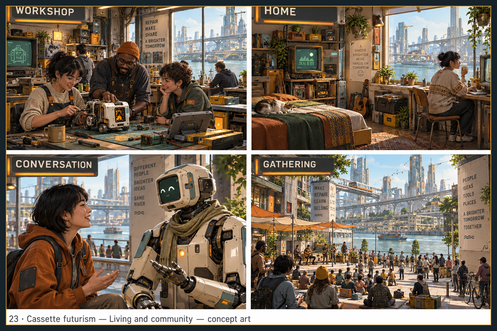
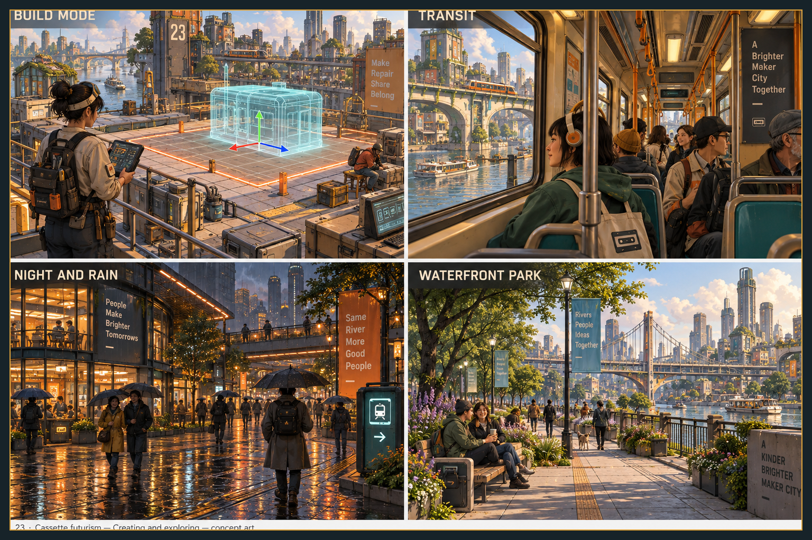
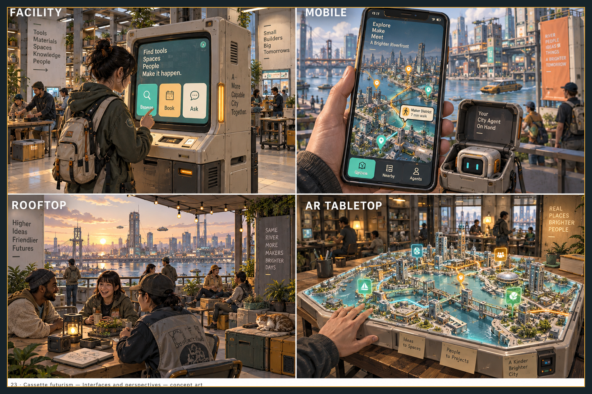

> Historical record migrated from `docs/vision/style-studies/23-cassette-futurism/README.md`. File paths in prose/JSON may describe the old layout; use the migration ledger for exact mappings.

# Cassette futurism

Concept art, not gameplay or performance evidence. [All styles](../../../../README.md).

Original experience-sheet prompts were not saved. The new overview follows the [correction contract](../../../../shared/CONSISTENCY-CONTRACT.md); its [exact prompt](../../sheets/00-city-perspectives/r001/prompt.txt) is preserved. The original experience sheets below still need reconciliation with this overview; see [progress](../../../../reviews/REPAIR-STATUS.md).

## Style description

A warm, hands-on tech city where machines are boxes with buttons. Beige plastic housings, green-phosphor CRT screens, orange indicator strips, cassette motifs, and stackable hard cases define the identity. Amber evening light, charcoal, teal, and mustard carry the palette.

Buildings are dense mid-rise blocks with exposed ducts, panel cladding, and elevated tram bridges. Interiors are cluttered with monitors, tool crates, and cables. People are painted humans in workwear and knit sweaters; the city agent is a boxy cream robot with a smiling green CRT face and a scarf, and a smaller version rides in a clamshell case beside the phone.

Large views appear only from rooftops and windows, and read as busy skylines with bridges. Night streets rely on reflected amber light and glowing signs. Close-ups work because every object, including the kiosk and tabletop model, shares the same plastic-and-indicator language.

**Proposed device adaptation:** preserve the beige plastic, indicator colors, and the robot agent at every tier. Lower tiers would remove screen glow, cable clutter, and rain reflections; higher tiers could add scanlines and worn plastic edges. Kiosk button labels are partly garbled and the footer caption is cropped on two sheets, so interface text needs a real typographic pass.

## City perspectives

Map, top-down, diagonal, and street.

Added during the 2026-09-19 consistency pass using the built-in image tool and the shared district plan. All four views were inspected for the principal landmark arrangement, living central tree, one northern bridge, ground-level tram, captions and footer. Exact geometry and cross-sheet continuity remain separate checks.

## Living and community

Workshop, home, conversation, and gathering.

## Creating and exploring

Build mode, transit, night and rain, and waterfront park.

## Interfaces and perspectives

Facility, mobile, rooftop, and AR tabletop.

