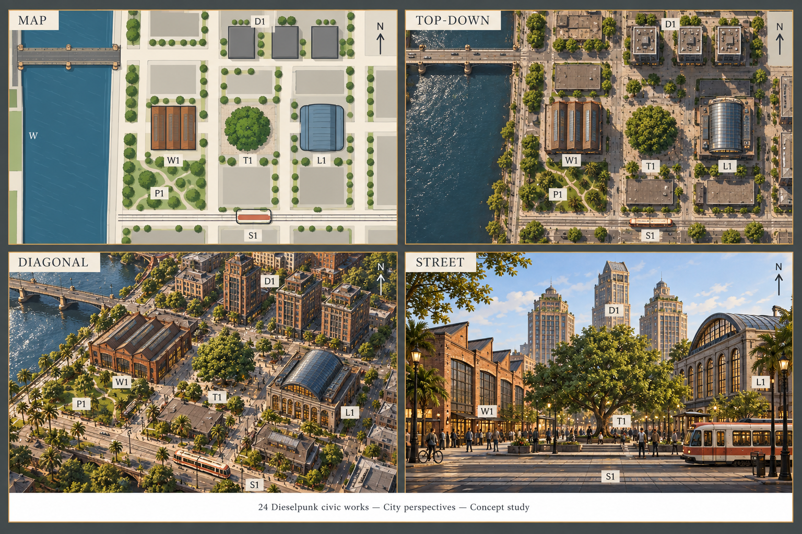
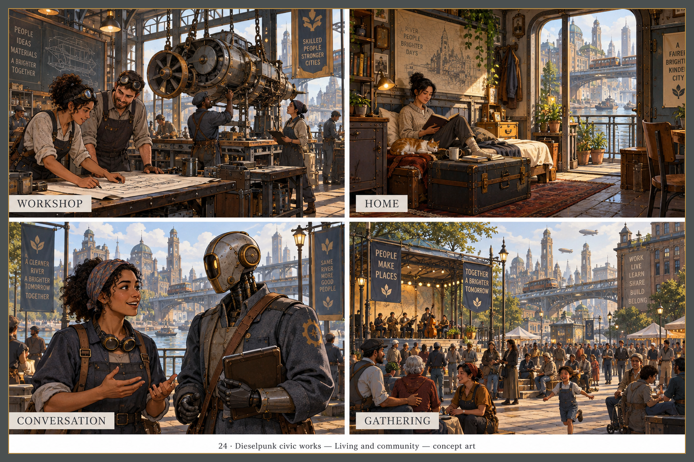
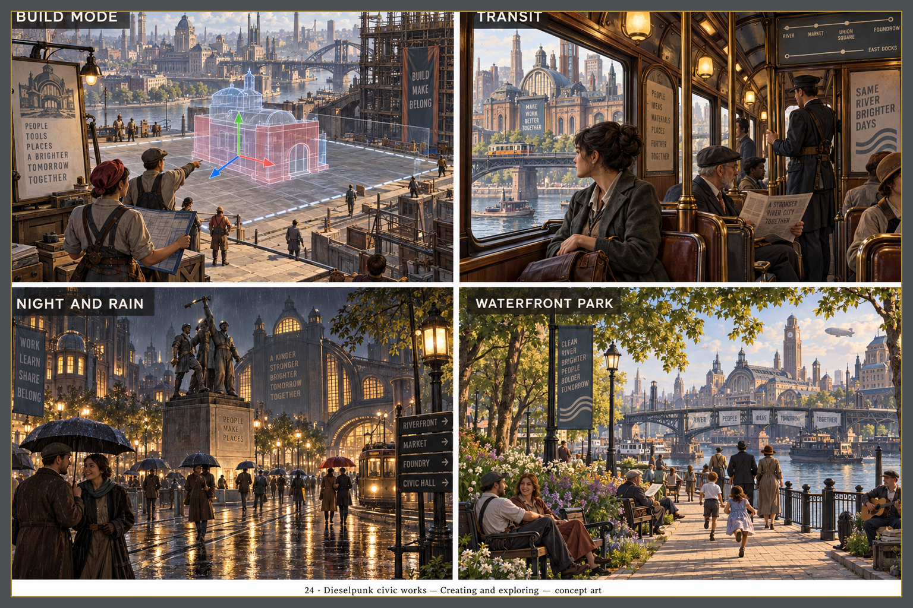
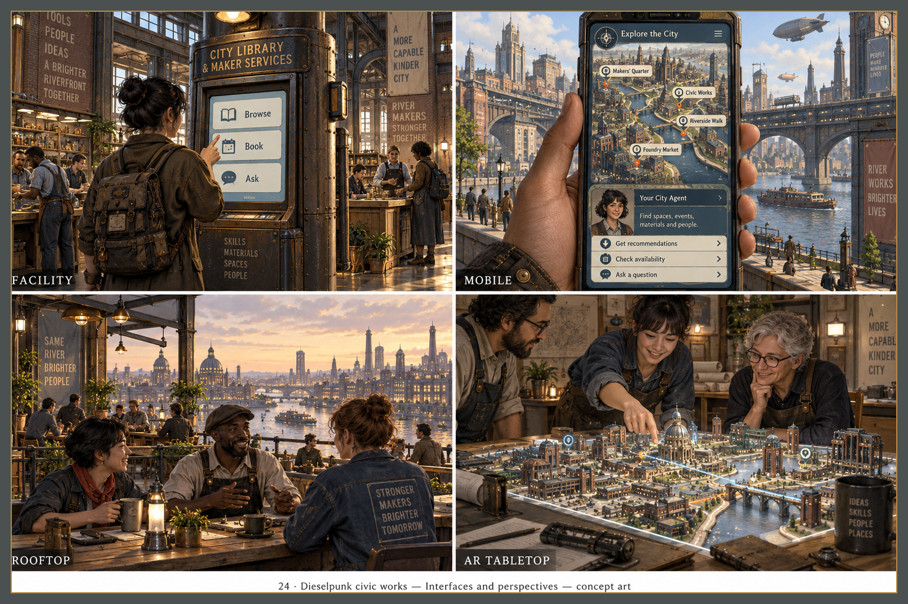

# Dieselpunk civic works

[Collection](../../README.md) · [Brief](brief.md) · [Manifest](manifest.json)

Historical selection retained. Corrections and review coverage vary by sheet; see dated records. Full contract compliance is not claimed.

Selection does not imply review approval.

The sheet images are AI-generated concept art (OpenAI gpt-image for the 1 of 4 sheet images that carry its C2PA content credentials; the generator was not recorded for the others), not game captures, released under CC0 1.0 with no rights claimed; see [AI-generated images](../../README.md#ai-generated-images).

## Review sources

- [REPAIR-STATUS.md](../../reviews/REPAIR-STATUS.md)
- [REVIEW-2026-09-19.md](../../reviews/REVIEW-2026-09-19.md)

## Current selections

### City perspectives — r001

[Exact prompt](sheets/00-city-perspectives/r001/prompt.txt) · [Generation record](sheets/00-city-perspectives/r001/generation.json) · [Review](sheets/00-city-perspectives/r001/review.md) · Generator: OpenAI gpt-image (C2PA credentials)

### Living community — r001

Exact prompt: missing · [Generation record](sheets/01-living-community/r001/generation.json) · [Review](sheets/01-living-community/r001/review.md) · Generator: not recorded

### Creating exploring — r001

Exact prompt: missing · [Generation record](sheets/02-creating-exploring/r001/generation.json) · [Review](sheets/02-creating-exploring/r001/review.md) · Generator: not recorded

### Interfaces perspectives — r001

Exact prompt: missing · [Generation record](sheets/03-interfaces-perspectives/r001/generation.json) · [Review](sheets/03-interfaces-perspectives/r001/review.md) · Generator: not recorded

## Revision history

Revision numbers record migration ordering, not generation timestamps.

- City perspectives / r001 — selected: [image](sheets/00-city-perspectives/r001/image.png), [generation](sheets/00-city-perspectives/r001/generation.json), [review](sheets/00-city-perspectives/r001/review.md)
- Living community / r001 — selected: [image](sheets/01-living-community/r001/image.png), [generation](sheets/01-living-community/r001/generation.json), [review](sheets/01-living-community/r001/review.md)
- Creating exploring / r001 — selected: [image](sheets/02-creating-exploring/r001/image.png), [generation](sheets/02-creating-exploring/r001/generation.json), [review](sheets/02-creating-exploring/r001/review.md)
- Interfaces perspectives / r001 — selected: [image](sheets/03-interfaces-perspectives/r001/image.png), [generation](sheets/03-interfaces-perspectives/r001/generation.json), [review](sheets/03-interfaces-perspectives/r001/review.md)
