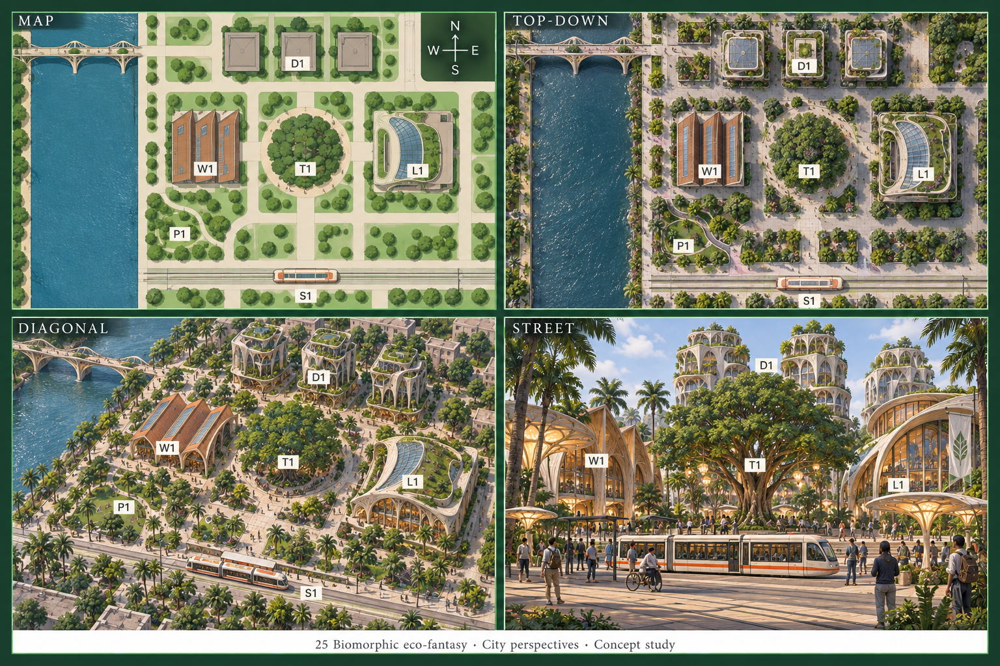
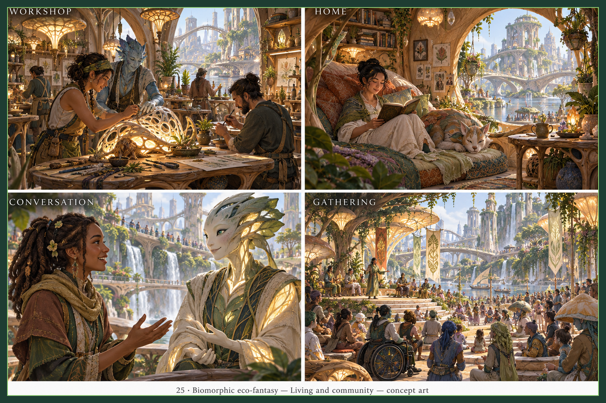
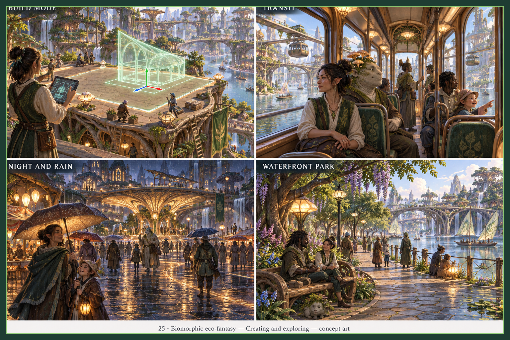
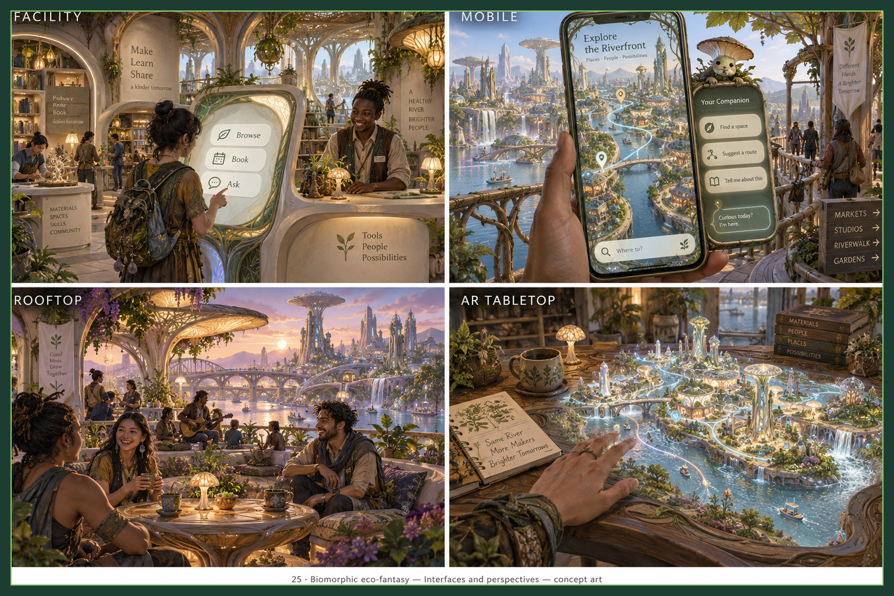

> Historical record migrated from `docs/vision/style-studies/25-biomorphic-eco-fantasy/README.md`. File paths in prose/JSON may describe the old layout; use the migration ledger for exact mappings.

# Biomorphic eco-fantasy

Concept art, not gameplay or performance evidence. [All styles](../../../../README.md).

Original experience-sheet prompts were not saved. The new overview follows the [correction contract](../../../../shared/CONSISTENCY-CONTRACT.md); its [exact prompt](../../sheets/00-city-perspectives/r001/prompt.txt) is preserved. The original experience sheets below still need reconciliation with this overview; see [progress](../../../../reviews/REPAIR-STATUS.md).

## Style description

A grown rather than built city. Root-like timber lattices, bone-white arches, mushroom-cap canopies, glowing fungal lamps, wisteria, and waterfalls define the identity. Ivory, warm gold, moss green, lavender, and clear teal water carry the palette, with most scenes lit by bioluminescence.

Buildings are branching towers and layered arch bridges with no straight edges. Interiors use curved shelving, woven cushions, and lamp-shaped fungi. Residents include humans alongside pointed-eared people, a blue-skinned maker, and a large mushroom-capped creature on the tram; the city agent is a leaf-crowned plant being with luminous skin.

Large views read as tiered organic terraces around water. Street scenes rely on lantern light and wet stone. Close-ups are densely detailed, and the kiosk, phone, and tabletop take grown, glowing forms.

**Proposed device adaptation:** preserve branching silhouettes, warm glow, and the green and gold palette at every tier. Lower tiers would reduce foliage, waterfalls, and glow effects; higher tiers could animate light and water. The sheets introduce fantasy species and costume rather than an architectural treatment of the maker city, so this is a different world premise, and that boundary must be decided before comparison with other styles.

## City perspectives

Map, top-down, diagonal, and street.

Added during the 2026-09-19 consistency pass using the built-in image tool and the shared district plan. All four views were inspected for the principal landmark arrangement, living central tree, one northern bridge, ground-level tram, captions and footer. Exact geometry and cross-sheet continuity remain separate checks.

## Living and community

Workshop, home, conversation, and gathering.

## Creating and exploring

Build mode, transit, night and rain, and waterfront park.

## Interfaces and perspectives

Facility, mobile, rooftop, and AR tabletop.

