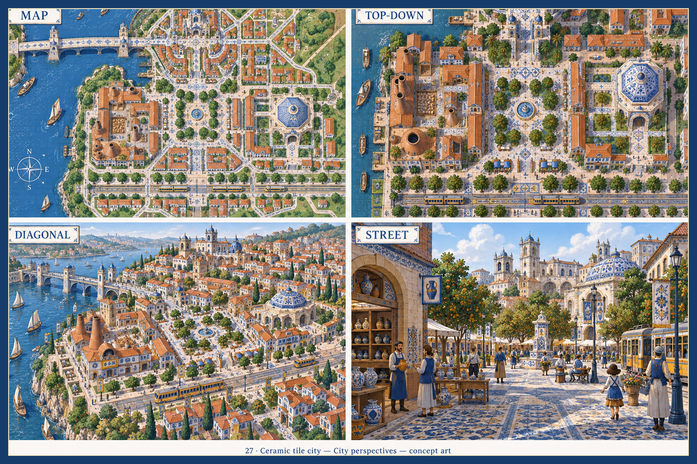
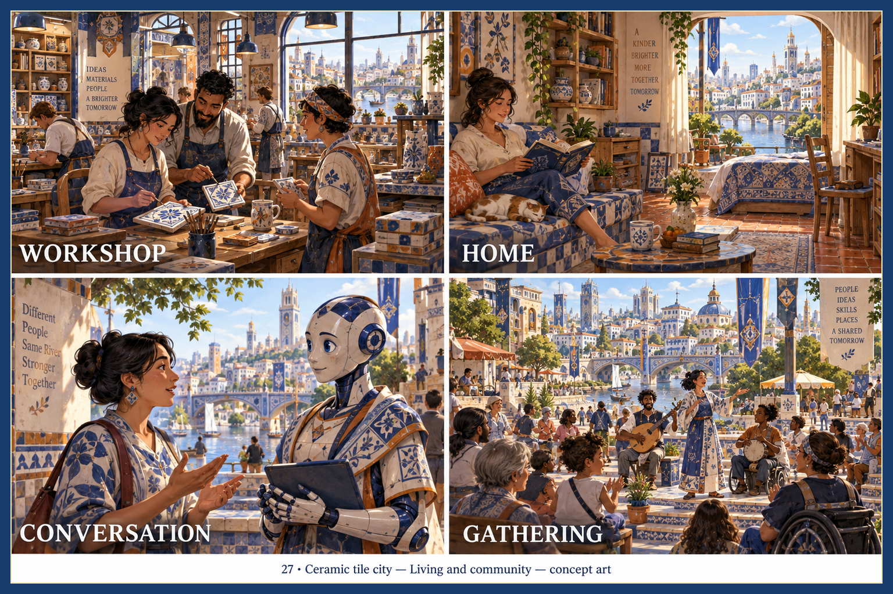
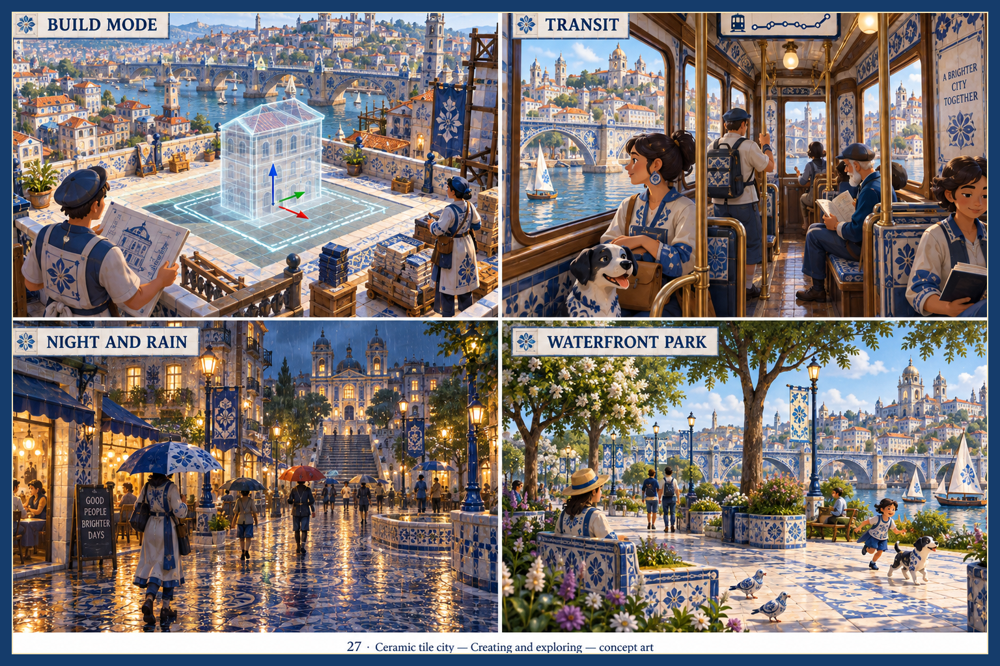
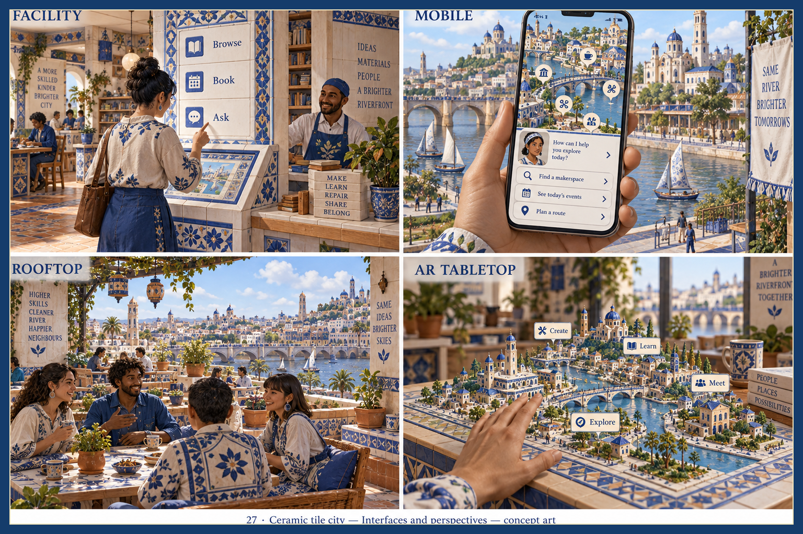

> Historical record migrated from `docs/vision/style-studies/27-ceramic-tile-city/README.md`. File paths in prose/JSON may describe the old layout; use the migration ledger for exact mappings.

# Ceramic tile city

Concept art, not gameplay or performance evidence. [All styles](../../../../README.md).

Original generation prompts for this style were not saved; revision prompts are now saved beside the sheets. For the original exploration, the frame treatment follows the [candidate brief](../../../../shared/CANDIDATE-STYLES.md).

## Style description

An old riverfront city surfaced in glazed tile. Cobalt and white azulejo panels, terracotta roofs, warm limestone, orange trees, and a yellow tram set the palette. Repeating geometric borders run along floors, walls, fountains, bridge piers, and benches.

Buildings are Mediterranean in form: tiled domes, bell towers, kiln chimneys on the workshop, and a pottery shop on the square. Interiors continue the tile onto tables, sofas, and window surrounds. People wear blue-and-white patterned aprons and dresses; the agent is a white robot with cobalt tile plating and an amber sash.

Large views should let terracotta roofs and blue domes mark the districts, with the tram line and bridge as continuous cobalt threads. Street scenes rely on patterned paving and tiled signage for orientation. Close-ups should carry the glaze onto kiosks, tram interiors, and the AR tabletop so tile becomes the UI language.

**Proposed device adaptation:** preserve the cobalt-and-white pattern on key surfaces and the terracotta roof silhouettes at every tier. Lower tiers would replace tile borders with flat color bands and simplify reflections; higher tiers could add glaze specular and hand-painted variation. Decide how far pattern coverage goes: in the generated sheets tile runs onto clothing and furniture, characters approach painterly realism, and panel labels shift position and lose their boxes between sheets.

## City perspectives

Map, top-down, diagonal, and street.

## Living and community

Workshop, home, conversation, and gathering.

## Creating and exploring

Build mode, transit, night and rain, and waterfront park.

## Interfaces and perspectives

Facility, mobile, rooftop, and AR tabletop.

## Correction draft — 2026-09-19

A [revised overview draft](../../sheets/00-city-perspectives/r001/image.png) restores the living tree in all four panels. It has not replaced the gallery image: camera and landmark inconsistencies remain, as recorded in [repair status](../../../../reviews/REPAIR-STATUS.md). The exact [revision prompt](../../sheets/00-city-perspectives/r001/prompt.txt) is preserved.
