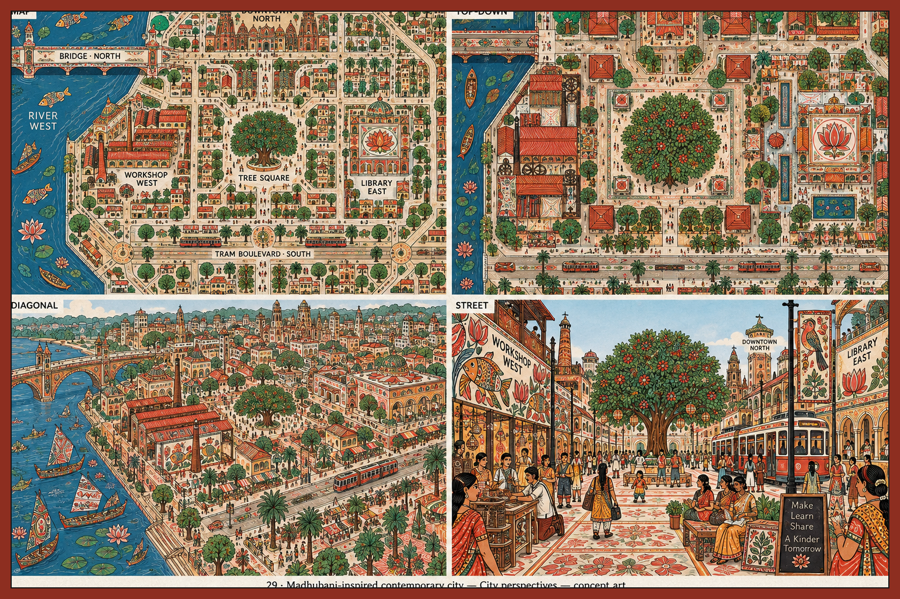
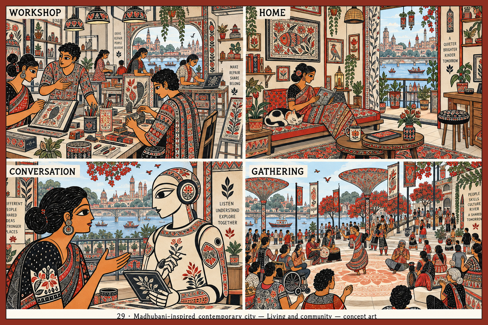
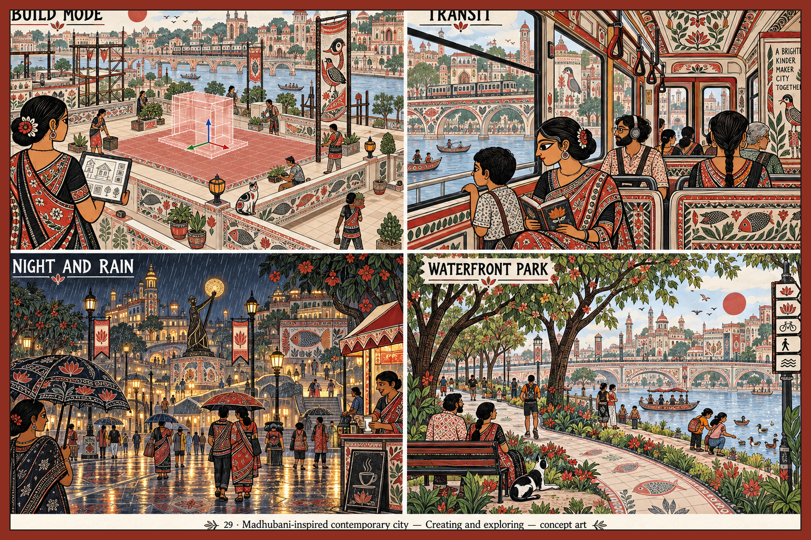
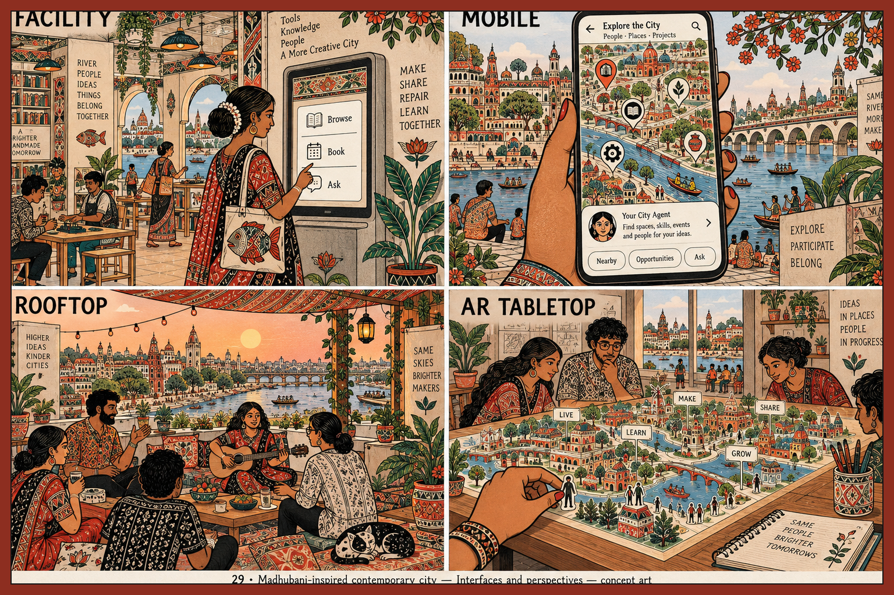

> Historical record migrated from `docs/vision/style-studies/29-madhubani-contemporary-city/README.md`. File paths in prose/JSON may describe the old layout; use the migration ledger for exact mappings.

# Madhubani-inspired contemporary city

Concept art, not gameplay or performance evidence. [All styles](../../../../README.md).

Generation prompts for this style were not saved; the frame treatment follows the [candidate brief](../../../../shared/CANDIDATE-STYLES.md).

## Style description

A riverfront city rendered in dense hand-drawn pattern. Vermilion, black ink, cream ground, leaf green, and a cobalt river hold the palette. Flat color, double-line borders, hatching, and fish, bird, lotus, and tree motifs fill every surface from facades to paving to tram sides.

Buildings are red-roofed blocks with arched openings, a tree-filled central square, and a library marked by a lotus roundel. District names are drawn onto the map. Interiors have patterned sofas, framed fish and bird panels, and tiled floors. People are drawn in profile with large outlined eyes and patterned saris and kurtas; the agent is a white robot with the same botanical motifs and profile eye.

Large views should let color blocks and the river separate districts before pattern is added. Street and gathering scenes should hold a plain ground plane so figures stand out. Close-ups, including kiosk and phone, should keep the line grammar while leaving interface panels plain.

**Proposed device adaptation:** preserve the black contour, the red-cream-black palette, and the border grammar at every tier. Lower tiers would reduce fill hatching to flat color; higher tiers could add full motif density on facades. Collaboration with artists knowledgeable in the Mithila tradition is a precondition for any production treatment. In the generated sheets pattern covers floors, clothing, and furniture at once, which lowers figure legibility, and panel labels and footer are cropped on three of the four sheets.

## City perspectives

Map, top-down, diagonal, and street.

## Living and community

Workshop, home, conversation, and gathering.

## Creating and exploring

Build mode, transit, night and rain, and waterfront park.

## Interfaces and perspectives

Facility, mobile, rooftop, and AR tabletop.

