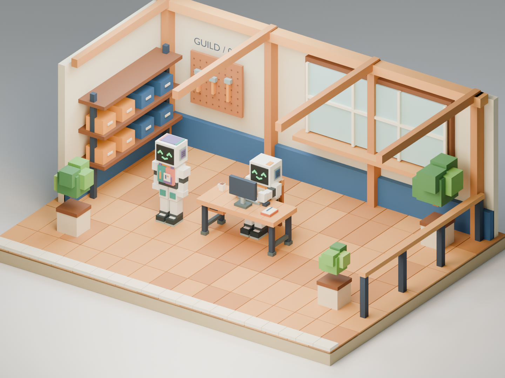

# First Guild Voxel work-bay pilot

Coder Kai and Artistic Lyra robot appearances, a shared chair, desk and terminal
in a small workshop crop. Kai’s robot appearance was approved by the user;
Lyra is the second shared-rig trial and awaits visual approval. This is a local authoring/import/interaction experiment with **sample
data only**. It has no accounts, network requests, live agent feed or dispatch.

`scripts/character.py`'s `RESIDENTS` table — and the `build_assets.py`
pipeline this pilot documents — now cover all fourteen Guild residents on
the same shared rig, not just Kai and Lyra; see [Shared workshop
extension](#shared-workshop-extension) below and
[evidence/FULL-CAST-VERIFICATION.md](evidence/FULL-CAST-VERIFICATION.md).
This one-bay review scene itself stages only Kai (typing) and Lyra (idle) as
a fixed curated composition — that is deliberate, not a gap; the other
twelve residents' own GLBs export normally, they are just not staged in
*this* review render.



See [Asset and scene workflow](ASSET_WORKFLOW.md) for the end-to-end authoring,
validation, review and checkpoint process.

## Shared workshop extension

The [shared workshop and courtyard](SHARED_WORKSHOP.md) places all fourteen
Guild residents in the same modular building, each with an independent
workstation and collision-aware desk journey. The original one-bay inspector
below remains available and unchanged.

## Run the preview

Requires Godot 4.6.x (tested with 4.6.3), using the compatibility renderer.
From this directory:

```sh
godot --editor --path godot --import --quit
godot --path godot
```

Choose **Coder Kai** or **Artistic Lyra**, then **Leave desk** or **Return to desk**.
The chair pulls back before standing; the robot walks around the desk along a
fixed clear route. Returning reverses the route, sits, and slides the chair in.
Only the selected robot occupies the bay. Reduced motion jumps to the requested
stable destination; reset, resident selection and manual clip inspection cancel
travel safely. Movement is an explicit demonstration, independent of sample
work state. A working fixture types only while seated.

The preview also provides an overview camera, first-person inspection, sample
working/idle/stale/unavailable/unknown states, animation inspection, reduced
motion and a text description of the scene and current state. The persistent
sample notice applies to everything on screen. Use the on-screen controls;
WASD moves, mouse looks, Escape releases the pointer, O returns to overview,
F enters first person, and R resets the scene.

## Editable sources and reproducible exports

Open [source/work-bay.blend](source/work-bay.blend) in Blender. It includes the
original meshes, rigid segmented rig, seven shared actions, furniture anchors, palette,
and a review camera. Each runtime asset also has a separate GLB in
[godot/assets](godot/assets/). These small pilot files are committed directly;
no Git LFS dependency is introduced.

To regenerate in a **fresh background process**, with Blender 5.2.2:

```sh
blender --background --factory-startup --python-exit-code 1 --python scripts/build_assets.py
# Include two offline review renders:
blender --background --factory-startup --python-exit-code 1 --python scripts/build_assets.py -- --render
```

The builder replaces only this pilot's generated source, exports, manifest and
optional review renders. Do not run it inside an unrelated open Blender file.
Geometry and animation are procedural; no image-to-3D service is used. The
authoring render uses Cycles, while the playable scene uses Godot's renderer,
so lighting appearance differs. Blender render images are not runtime captures.

## Check the delivery

Node.js/npm is needed only for the pinned Khronos validator:

```sh
npm ci --prefix tools
npm run --prefix tools validate
python3 scripts/test_exports.py
blender --background --factory-startup source/work-bay.blend --python-exit-code 1 --python scripts/check_contacts.py
godot --headless --editor --path godot --import --quit
godot --headless --path godot --script tests/fixture_test.gd
godot --headless --path godot --script tests/import_test.gd
godot --headless --path godot --script tests/scene_test.gd
godot --headless --path godot --script tests/movement_test.gd
godot --headless --path godot --script tests/journey_test.gd
godot --headless --path godot --script tests/bay_pitch_test.gd
```

Khronos reports in [evidence](evidence/) name the
validator version and each file's diagnostics. `test_exports.py` checks the
actual files for geometry, skin, seven clips, matching bind poses and animation data, portable hierarchy and anchors.
Godot tests check fixture behavior and actual imported scenes/animations.

Capture the real Godot viewport on a machine with a graphical display:

```sh
godot --path godot -- --capture="$PWD/evidence/godot-work-bay.png"
```

## Visual references and provenance

The user selected **02-voxel** on 2026-09-22 and authorised this pilot. The
reference revisions remain those pinned by PR #16:

| Sheet | Revision | Use in this pilot |
| --- | --- | --- |
| [City perspectives](../../docs/vision/style-studies/styles/02-voxel/sheets/00-city-perspectives/r004/image.png) | r004 | Broader context; this crop does not implement the district |
| [Living and community](../../docs/vision/style-studies/styles/02-voxel/sheets/01-living-community/r002/image.png) · [review](../../docs/vision/style-studies/styles/02-voxel/sheets/01-living-community/r002/review.md) | r002 | WORKSHOP blocks/palette/furniture; CONVERSATION face and body proportions; inspected before authoring |
| [Creating and exploring](../../docs/vision/style-studies/styles/02-voxel/sheets/02-creating-exploring/r002/image.png) | r002 | Pinned reference, not a claim of reproduced panels |
| [Interfaces and perspectives](../../docs/vision/style-studies/styles/02-voxel/sheets/03-interfaces-perspectives/r003/image.png) | r003 | Pinned reference; pilot UI is a local inspection interface |

Kai's apron and tool motif follow [GR04](../../docs/vision/GUILD_RESIDENTS.md#gr04--coder-kai).
The corrected `pilot-r002-robot` uses a white mechanical shell, a dark screen
face with green chevron eyes and a smiling mouth, segmented limbs, and Kai’s
tool apron with cobalt/orange engineering accents. The first human-presenting
pilot misread the human residents as the agent reference and is superseded.
City Agent A1 supplies the robot design grammar; Kai retains a separate identity.
Kai’s robot appearance is approved; Lyra and wider production acceptance remain pending. The excluded humanoid experiment
was not used for geometry, rig, proportions or animation.

All mesh/animation source here was authored procedurally for this pilot.
There are no downloaded textures, models or audio. The backdrop sign uses
Blender's bundled font converted to geometry; runtime UI uses Godot's default
font. The pilot's assets (Blender sources, GLB exports, renders and
captures) are licensed under CC BY-SA 4.0 and its scripts under the
AGPL-3.0-only, as [COPYING.md](../../COPYING.md) describes.

## Scope and next decision

The [production tracker](../../docs/gameplay/asset-catalogue/FIRST_GUILD_SCENE.md)
still governs the full 60-deliverable scene. This pilot contributes partial
work to GS-018, 019, 022, 027–040, 041–047 and 060; it does not accept those
entries. All fourteen appearances are now authored and exported, but **only
Kai's and Lyra's have user approval** — the other twelve remain Review
*Pending*. The environment and UI are inspection aids, not completion of the
whole workshop or the full interface package.

Seven clips are provided: standing idle, walk, seated idle, typing, look/attend,
sit-down and stand-up. The last two are one-shot transitions. All fourteen
residents share exactly the same 16-bone bind structure and exported
animation channels — asserted by an ordered bone-name and clip-set parity
test, not just a bone count. Walking uses a 0.72 m full stride over 32
frames at 24 fps (0.54 m/s). The path is a fixed demonstration route, not
general navigation or obstacle avoidance. Decorative screen glyphs carry no
actual work information. There is no ambience loop yet. Godot is the pilot
client; the final city engine and target-device budgets remain open.

Kai's and Lyra's appearances were approved by the user on 2026-09-22, before
the rig was extended to the remaining Guild cast. Movement review is
pending for both of them, and the remaining twelve residents' appearances
still need review as well. See
[verification evidence](evidence/VERIFICATION.md) for this one-bay pilot's
measured results and limitations, and
[evidence/FULL-CAST-VERIFICATION.md](evidence/FULL-CAST-VERIFICATION.md) for
the full fourteen-resident cast and hall.

### Adding a resident

A resident is one `character.RESIDENTS` entry plus its two geometry
functions — nothing else in `build_assets.py`, `check_contacts.py`,
`test_exports.py` or `validate_exports.cjs` needs to change; all four read
the table. To add one:

1. Write `_chest_motif_<name>(b)` and `_head_crest_<name>(b)` in
   `scripts/character.py`, following an existing resident (e.g. Kai's or
   Lyra's) as the worked example. Every chest-motif box is 6–12 boxes
   weighted to `'Spine'`, inside x ±0.20, z 0.88–1.24, y no further than
   −0.26; every head-crest box is 1–3 boxes weighted to `'Head'`, at
   z ≈ 1.72, x ±0.20. Use only existing `geometry.py` palette materials.
2. Add one `RESIDENTS` entry: `mesh_name` (`GS0NN_NameInCamelCase`),
   `rig_name` (`NameRig`), `gs_id`, `source_profile`, `head_accent`,
   `thigh_accent`, `review` (state "operator review pending" until the user
   approves it), `chest_motif`, `head_crest`, and `roster` — mandatory, not
   optional: `shared_workshop.py`'s `_roster_stations()` asserts every
   resident in the table carries a unique roster number covering exactly
   1–14, so a fifteenth resident without one breaks the shared-workshop
   build immediately.
3. Rebuild (`blender --background --factory-startup --python-exit-code 1
   --python scripts/build_assets.py`), then run `check_contacts.py` and
   `test_exports.py`. The new resident's GLB is picked up automatically by
   the Khronos validator, the contact checker and the parity test — the
   export pipeline needs no hand edits for a new resident.
4. Seating does not follow automatically. `BAYS` is a fixed list of exactly
   fourteen positions (seven west, seven east); adding a `roster` number
   does not grow it, and the build fails loudly rather than silently
   misplacing or dropping anyone. A fifteenth resident needs a new bay
   position, which is a hall-layout and spec decision, not a `roster` edit
   — see [SHARED_WORKSHOP.md](SHARED_WORKSHOP.md).

## Movement and second-resident evidence

- [Lyra authoring render](evidence/blender-lyra.png) and [runtime view](evidence/godot-lyra.png).
- [Kai full desk journey](evidence/kai-desk-cycle.mp4) and [Lyra full desk journey](evidence/lyra-desk-cycle.mp4).
- [Standing transition](evidence/godot-standing-up.png).

Capture a deterministic frame or complete 24 fps journey on a graphical machine:

```sh
godot --path godot -- --resident=lyra --motion-time=1.3 --capture="$PWD/evidence/lyra-transition.png"
godot --path godot -- --resident=lyra --capture-cycle="$PWD/evidence/frames/lyra"
ffmpeg -framerate 24 -i evidence/frames/lyra/frame-%04d.png -c:v libx264 -crf 23 -pix_fmt yuv420p evidence/lyra-desk-cycle.mp4
```

The frame sequence evaluates the same blend and movement logic as live playback.
The videos are inspection evidence, not measured real-time frame-rate claims.
Frame directories are ignored by Git; only the compact videos are retained.
